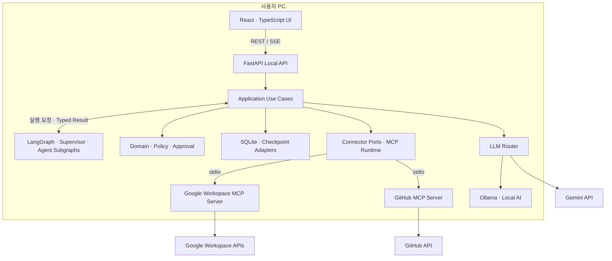

# MCP Work Agent

> **흩어진 업무 자료를 찾고, 실행할 작업을 제안하고, 사용자 승인 후 결과까지 확인하는 로컬 업무 에이전트**

Google Workspace와 GitHub를 **MCP(Model Context Protocol)** 로 연결하고, **LangGraph 기반 멀티에이전트**로 자연어 요청을 처리합니다.

**Windows 로컬 실행 · 6개 역할의 Agent · 사용자 승인 기반 Write · 실행 결과 재조회 검증**

[주요 기능](#주요-기능) · [아키텍처](#시스템-아키텍처) · [핵심 설계](#핵심-설계) · [성능 개선](#성능-개선) · [시작하기](#시작하기) · [테스트와 평가](#테스트와-평가) · [문서](#문서)

> 현재 개발·검증 중인 MVP입니다. 기능 범위와 설계 원칙은 아래에 정리하며, 실제 업무 성공률과 검증 범위는 [실행별 평가 보고서](evaluation/results/README.md)에서 별도로 관리합니다.

## 프로젝트 소개

업무를 처리하려면 메일에서 요청을 찾고, 할 일과 일정을 대조하고, 이슈를 확인한 뒤 각 서비스에 변경 사항을 반영해야 합니다. MCP Work Agent는 이 과정을 하나의 작업 흐름으로 연결합니다.

단순히 답변을 생성하는 데서 끝나지 않고, **실제 자료를 근거로 실행안을 만들고 외부 서비스에 반영된 결과를 확인하는 것**을 목표로 합니다. 자연어 해석과 작성은 LLM이 담당하지만, 접근 범위·승인·실행 허용·상태 전이·결과 검증은 결정적 코드로 통제합니다.

제품의 UI와 Agent Runtime은 사용자 PC에서 실행합니다. 별도의 원격 제품 Backend는 두지 않으며, 업무 데이터 접근은 각 서비스 API를, 외부 추론을 선택한 경우에는 Gemini API를 사용합니다.

## 주요 기능

| 영역 | 기능 |
| --- | --- |
| **Gmail** | 메일 검색·요약, 업무 정보 추출, Draft 생성·수정, 새 메일 발송과 기존 Thread 답장 |
| **Google Tasks** | 할 일 조회·생성·수정·완료 처리, 생성 전 기존 작업과의 중복 확인 |
| **Google Calendar** | 일정 조회, 가용 시간·일정 충돌 확인, 일정 생성·변경 |
| **GitHub Issues** | 허용된 Repository의 Issue 조회·생성·수정·닫기·다시 열기 |
| **자료 선택과 검색** | 사용자가 선택한 자료로 요청하거나, 자연어 요청에서 필요한 자료를 검색 |
| **확인·승인·복구** | 추가 정보 확인, 실행안 미리보기·수정·승인·거절, 진행 내역과 실행 결과 확인 |

Google Workspace와 GitHub는 독립된 Connector입니다. Google 계정 연결을 앱 전체의 필수 로그인으로 요구하지 않으며, 각 업무에 필요한 Connector만 연결해 사용합니다.

### 요청 예시

아래는 사용 형태를 설명하는 예시입니다. 실제 결과는 연결 권한, 조회 가능한 자료, 모델과 요청 조건에 따라 달라집니다.

```text
최근 일주일간 Atlas 프로젝트 메일에서 확정된 일정과 내가 해야 할 일을 정리해줘.
```

```text
임시보관함의 “납품 일정 회신” 초안 끝에
“확인 후 다시 연락드리겠습니다.”만 추가해줘. 보내지는 마.
```

```text
선택한 일정의 제목과 시작·종료 시간을 알려줘.
```

```text
solar-ai-dev/mcp-work-agent 저장소의 열린 이슈를 확인하고,
아직 해결되지 않은 작업을 요약해줘.
```

### 사용자 흐름

| 시작 방식 | 동작 |
| --- | --- |
| **Agent 검색형** | 자연어 요청에서 사람·기간·프로젝트·업무 조건을 해석하고 필요한 자료를 검색합니다. |
| **Resource 선택형** | 사이드바에서 선택한 메일·할 일·일정·이슈의 최신 상세를 확인한 뒤 요청을 처리합니다. |

조회와 요약은 요청 범위 안에서 진행하며, 외부 데이터를 바꾸는 작업은 다음 흐름을 사용합니다.

```text
자연어 요청 / 자료 선택
→ 필요한 자료 조회와 분석
→ 실행안 작성·검토
→ 사용자 미리보기·수정·승인
→ 외부 서비스에 반영
→ 결과 재조회·검증
→ 실제 완료·미실행·실패 범위 안내
```

**채팅에 보여주는 초안과 Gmail에 저장하는 Draft는 다릅니다.** Gmail Draft 생성·수정도 외부 데이터 변경이므로 승인 대상이며, Draft 저장 승인이 메일 발송 승인까지 포함하지는 않습니다.

## 시스템 아키텍처

**React Frontend + Python Layered Modular Monolith** 구조를 사용합니다. 운영 UI와 Local API는 같은 `127.0.0.1` Origin에서 제공하고, 외부 업무 시스템 접근은 Connector MCP 경계로 모읍니다.



위 그림은 컴포넌트 관계를 나타냅니다. 실제 외부 호출과 영속화는 Application의 Port를 거쳐 Adapter에서 수행하며, Domain은 Provider API나 SQLite 구현에 의존하지 않습니다.

### 기술 스택

| 구분 | 기술 |
| --- | --- |
| Frontend | React, TypeScript, Vite |
| Local API | FastAPI, Pydantic, REST, SSE |
| Agent Workflow | LangGraph, Typed State, Subgraph, Interrupt / Resume |
| 외부 업무 연동 | MCP `stdio`, Google Workspace APIs, GitHub API |
| LLM Runtime | Gemini, Ollama |
| 저장·인증 | SQLite, LangGraph SQLite Checkpointer, OS Keyring |
| 테스트·품질 | pytest, Ruff, mypy, Vitest, Playwright, ESLint |
| 관측·배포 | 구조화 Trace·Audit, 선택적 LangSmith 연동, Windows Launcher·Installer |

구체적인 의존성 버전은 [pyproject.toml](pyproject.toml), [config](config/), [frontend/package.json](frontend/package.json)을 기준으로 합니다.

## 핵심 설계

### 1. 6개 Agent 역할과 결정적 Supervisor

Agent가 서로 자유롭게 호출하는 방식이 아니라, **Supervisor가 검증된 Typed Result와 현재 상태를 받아 다음 단계를 선택**합니다.

| Agent | 책임 | 주요 결과 |
| --- | --- | --- |
| **Request Understanding** | 사용자 목표·완료 조건·제약과 모호성 구조화 | 요청 의도 |
| **Tool Route** | 조회할 Resource·READ Tool과 변경할 Resource·Effect·WRITE Tool 확정 | Input / Output Route |
| **Retrieval** | 확정된 조회 범위에서 검색·상세 조회·근거 선택·충분성 평가 | Evidence와 조회 범위 |
| **Work Analysis** | 업무 사실·관계·누락 정보·중복·충돌 후보 분석 | 업무 분석 결과 |
| **Planning** | 답변 초안 또는 확정된 Tool에 맞는 작업 인자와 실행안 작성 | Answer Draft / Action Plan |
| **Review** | 목표 충족, 근거 적합성, 과도한 작업과 사용자 제약 위반 검토 | 검토 결과와 수정 요구 |

모든 요청이 6개 Agent를 일렬로 통과하지는 않습니다. 자료가 불필요하면 Retrieval을 생략하고, 추가 근거가 필요하면 Retrieval로, Tool 선택을 다시 판단해야 하면 Tool Route로 돌아갑니다. 반복 검색과 수정에는 상한을 둡니다.

하나의 Agent 안에서도 의미 판단을 담당하는 LLM Node와 형식 검증·조회·조립을 담당하는 결정적 Node를 구분합니다. **Agent 수와 LLM 호출 수는 같지 않습니다.**

### 2. 판단·승인·실행 권한 분리

LLM이 만든 작업 내용은 실행 후보일 뿐, 그 자체로 실행 권한이 되지 않습니다.

```text
Planning / Review
→ Domain Validation
→ Preview / 사용자 Approval
→ 승인 Snapshot·현재 버전 재검사
→ Claim / BeginExecutionAttempt Commit
→ Connector MCP Write
→ Effect별 결과 재조회
→ Verification / Recovery
```

승인에는 대상과 작업 인자의 Snapshot·Hash를 연결합니다. 승인 후 내용이나 대상이 달라지면 기존 승인을 재사용하지 않습니다. 실제 WRITE는 Agent가 직접 호출하지 않고 Application·Domain의 허용 판정을 거친 실행 경계가 담당합니다.

Provider가 성공 응답을 반환했다는 이유만으로 업무 완료를 확정하지 않습니다. 생성·수정은 재조회한 값과 기대값을 비교하고, 발송은 전송 결과를 확인하는 등 Effect에 맞는 검증을 적용합니다.

### 3. 필요한 Context만 전달

외부 원문 전체를 모든 Agent에 전달하거나 장기 기억으로 쌓지 않습니다. 각 Node는 자기 책임에 필요한 입력만 받습니다.

| 데이터 | 소유·보관 경계 |
| --- | --- |
| 조회 원문·중간 후보·Provider continuation | Run 범위 메모리 캐시 |
| 실제 판단에 사용한 근거 | 최소 Evidence excerpt와 Resource 참조 |
| Agent 사이의 확정 결과 | 버전이 있는 Typed State |
| 중단 위치와 재개 정보 | LangGraph Checkpoint |
| 승인·실행·검증의 영속 사실 | SQLite Domain Store |
| 사이드바 탐색 결과 | Frontend Session Cache |

하위 Agent는 상위 Agent의 결과를 임의로 덮어쓰지 않습니다. 의미 변경이 필요하면 결과를 소유한 Agent로 되돌리고, 변경된 근거·버전에 의존하는 후속 결과를 다시 생성합니다.

같은 Conversation의 과거 메시지는 화면 이력으로 남지만 새 Run의 숨은 LLM Memory로 자동 주입하지 않습니다. 이전 자료를 다시 사용하려면 이번 요청에서 명시적으로 선택해야 합니다.

### 4. 중단·재전송을 고려한 복구

| 상황 | 처리 원칙 |
| --- | --- |
| 동일 Command 재전송·중복 클릭 | `command_id`와 요청 Hash로 기존 처리 결과를 재사용하거나 충돌을 반환 |
| 승인 후 인자·대상 변경 | 기존 승인 무효화 후 재검토·새 승인 |
| Write 응답 유실 | `UNKNOWN_RESULT`로 구분하고, 재전송보다 기존 외부 결과 조회를 우선 |
| 명확한 Write 실패 | 실패 사실을 보존하고 수정·검토·새 승인 후 재시도 |
| SSE 단절·브라우저 새로고침 | Domain Snapshot으로 화면 복원; 화면 복구가 Write 재실행을 유발하지 않음 |
| 실행 중 인증 만료·앱 재시작 | Domain 실행 사실과 등록된 Checkpoint를 검증한 뒤 안전한 위치에서 재개 |

이 구조에서 **Domain Store는 실행 사실**, **Checkpoint는 재개 위치**, **UI·SSE·Trace는 표시와 관측**을 담당합니다. 외부 호출 중에는 SQLite Write Transaction을 유지하지 않습니다.

## 성능 개선

### Gmail 목록 메타데이터 조회의 HTTP N+1 최적화

Gmail Thread 목록을 가져온 뒤 각 Thread의 표시용 메타데이터를 개별 조회하던 경로를 Batch 요청으로 변경했습니다. UI 목록과 LangGraph READ가 같은 Connector 구현을 사용하도록 적용했습니다.

아래는 [2026-09-14 실험 보고서](evaluation/results/gmail-metadata-hydration-20260914-7afac9f5/README.md)에 기록된 결과입니다.

| 지표 | 개선 전 | 개선 후 |
| --- | ---: | ---: |
| 물리 HTTP 요청 수 | 21회 | **2회** |
| 논리 Gmail API 연산 수 | 21회 | 21회 |
| Production READ Node p95 | 5,400.75 ms | **1,987.24 ms** |

**해당 Node의 p95 지연 시간은 63.20% 감소했습니다.** 선택한 구성은 Batch Size 20, Worker 1(`B20/W1`)입니다.

측정 대상은 고정된 과거 구간의 Gmail Thread 20개에 대한 목록·메타데이터 조회입니다. 반환 개수·순서·메타데이터와 continuation을 대조했으며, 실험 중 WRITE/SEND는 수행하지 않았습니다. 이 수치는 전체 Agent 요청의 E2E 지연이나 전체 업무 성공률을 의미하지 않고, 논리 API 연산·Quota가 같은 비율로 줄었다는 의미도 아닙니다.

## 시작하기

### 개발 환경

아래 명령은 **Windows 개발 실행** 기준입니다. 설치 제품의 일반 사용자 절차와 구분합니다.

| 항목 | 기준 |
| --- | --- |
| OS | Windows 11 x64 |
| Python | CPython 3.12 |
| Node.js | 저장소 [.nvmrc](.nvmrc) 기준 |
| 패키지 관리 | pip, npm |
| Browser | Chrome 또는 Microsoft Edge |

### 1. 저장소와 의존성 준비

```powershell
git clone https://github.com/solar-ai-dev/mcp-work-agent.git
cd mcp-work-agent

py -3.12 -m venv .venv
.\.venv\Scripts\python.exe -m pip install -r config\requirements-cpu.txt
.\.venv\Scripts\python.exe -m pip install -e .

npm --prefix frontend ci
npm --prefix frontend run build
```

위 예시는 API/CPU 개발 환경입니다. GPU·Local Runtime 검증용 의존성은 [config/requirements-gpu.txt](config/requirements-gpu.txt)로 분리합니다. 필요한 경우 다음 명령으로 설치합니다.

```powershell
.\.venv\Scripts\python.exe -m pip install -r config\requirements-gpu.txt
```

Local AI 사용 가능 여부는 의존성 설치만이 아니라 Runtime Profile과 실제 Ollama·지원 모델 검사 결과에 따라 결정됩니다.

### 2. 필요한 개발용 연결 설정

Google 연동을 개발 환경에서 시험하려면 [.env.example](.env.example)을 참고해 개발용 OAuth 설정을 `.env.local`에 준비합니다. 기존 파일이 있으면 덮어쓰지 않습니다.

```powershell
if (!(Test-Path .env.local)) {
    Copy-Item .env.example .env.local
}
```

GitHub는 앱 설정에서 Device Flow로 연결하고, 접근할 Repository를 선택합니다. 각 서비스의 실제 권한과 앱에서 선택한 접근 허용 목록을 모두 만족하는 범위만 사용합니다.

API Key, OAuth Token, Secret, `.env.local`은 저장소에 커밋하지 않습니다.

### 3. 개발용 Launcher 실행

```powershell
.\.venv\Scripts\python.exe -m launcher.development_entrypoint `
  --runtime-root .\runtime\development `
  --host 127.0.0.1 `
  --port 0
```

`--port 0`은 동적 Loopback Port를 사용합니다. 준비가 완료되면 브라우저가 열리고, FastAPI가 제공하는 React 정적 UI에 접속합니다. 제품 실행에는 별도의 Vite 개발 서버를 띄우지 않습니다.

### 4. 앱에서 AI와 업무 연결 선택

| 실행 방식 | 준비 사항 |
| --- | --- |
| **Gemini** | API Key 연결, 외부 LLM 전송 동의 |
| **Local AI** | Local-capable 환경, 별도로 준비한 Ollama와 지원 모델 |

지원 Local 모델은 `qwen3.5:9b`, `qwen3.5:4b`입니다. 앱은 설치된 모델을 검사하며 Ollama 설치나 모델 다운로드를 대신 수행하지 않습니다. Local AI와 Gemini 사이의 자동 전환도 하지 않습니다.

Google·GitHub·AI 연결이 없어도 Core가 정상이면 메인 화면·설정·저장 이력을 열 수 있습니다. 업무 요청에는 선택한 AI와 해당 요청에 필요한 Connector 준비가 필요합니다.

개발용 Launcher의 LLM Credential은 세션 메모리에 보관되므로 종료 후 다시 입력해야 할 수 있습니다. 설치 제품의 Credential 저장 경계와 구분합니다.

## 테스트와 평가

### 코드 회귀 검증

```powershell
# Backend 및 아키텍처 회귀
.\.venv\Scripts\python.exe -m pytest -q
.\.venv\Scripts\python.exe -m pytest tests\architecture -q

# 정적 검사
.\.venv\Scripts\ruff.exe check src tests launcher release scripts
.\.venv\Scripts\mypy.exe --explicit-package-bases src tests launcher release scripts

# Frontend
npm --prefix frontend test -- --run
npm --prefix frontend run typecheck
npm --prefix frontend run lint
npm --prefix frontend run build
```

검증 계층은 Unit·Contract·Integration·Component·Browser E2E·Failure Injection·Installer/Release로 구분합니다. Fake Provider/MCP를 사용하는 계약 검증과 실제 LLM·Google·GitHub를 사용하는 제품형 검증은 서로 다른 근거로 관리합니다.

### Agent 품질 평가

[평가 설계](docs/canonical/13-evaluation-experiment.md)는 아래 Dataset을 구분합니다.

| Dataset | 규모 | 목적 |
| --- | ---: | --- |
| Core | 60개 | 대표 업무 시나리오의 의미 정확도와 완료 여부 |
| Holdout | 12개 | 튜닝에 사용하지 않은 요청에 대한 일반화 확인 |
| Stress | 20개 | 장애·안전·예외 경계 확인 |

업무 결과와 안전 계약을 분리해 평가하고, Schema 유효성·근거 적합성·반복 성공 여부·p50/p95 Latency·LLM/MCP/HTTP 호출 수를 함께 기록합니다. Core·Holdout·Stress는 분리 집계하며, 한 번 성공한 Smoke 결과를 전체 제품 품질로 해석하지 않습니다.

현재 결과와 실패 분석, 측정 조건은 [Evaluation Results](evaluation/results/README.md)를 참고합니다. 서로 다른 SHA·모델·Fixture·실행 범위의 수치를 하나의 성공률로 합치지 않습니다.

## 프로젝트 구조

```text
mcp-work-agent/
├─ src/google_work_agent/
│  ├─ domain/          # 상태 전이·불변조건·실행 사실
│  ├─ application/     # Use Case·Agent 의미 처리·승인 및 실행 조정
│  ├─ ports/           # 저장소·Connector·LLM 등 경계 계약
│  ├─ adapters/        # LangGraph·MCP·LLM·SQLite·시스템 구현
│  └─ api/             # FastAPI Route·Schema·Composition
├─ frontend/           # React UI·기능별 상호작용
├─ launcher/           # 로컬 서비스·브라우저 시작과 종료
├─ installer/          # Windows 설치 구성
├─ release/            # 배포·Manifest·서명 관련 구성
├─ config/             # 환경별 의존성·설정
├─ evaluation/         # Dataset·Runner·Grader·실험 결과
├─ tests/              # 기능·계약·아키텍처 회귀 테스트
└─ docs/               # 제품·설계 Canonical 문서
```

제품과 저장소 이름은 `mcp-work-agent`입니다. 내부 Python 패키지 `google_work_agent`와 기존 설치·데이터·Credential namespace는 호환성을 위해 유지합니다.

## 문서

설계의 시작점은 [Project Source Guide](docs/canonical/00-project-source-guide.md)입니다.

| 문서 | 내용 |
| --- | --- |
| [Requirements PRD](docs/canonical/01-requirements-prd.md) | 제품 목표·지원 범위·상위 요구 |
| [System Architecture](docs/canonical/03-system-architecture.md) | 컴포넌트·프로세스·계층 경계 |
| [Context & Retrieval](docs/canonical/05-context-retrieval.md) | 검색·Evidence·충분성·Context 관리 |
| [Agent Workflow](docs/canonical/06-agent-workflow.md) | Agent 책임·상태 전달·분기·중단과 재개 |
| [Tool & MCP Interface](docs/canonical/07-tool-mcp-internal-interface.md) | Local API·Port·MCP Tool 계약 |
| [Security & Auth](docs/canonical/09-security-auth.md) | 인증·Credential·외부 전송 경계 |
| [Test Design](docs/canonical/12-test-design.md) | 제품 회귀와 검증 계층 |
| [Evaluation & Experiment](docs/canonical/13-evaluation-experiment.md) | 모델·Prompt·Retrieval·Agent 품질 평가 |
| [Evaluation Results](evaluation/results/README.md) | 실제 실행 결과·실패 분석·성능 실험 |

## 현재 범위와 제한

Windows 로컬 단일 사용자 환경을 대상으로 하며, 다중 사용자 SaaS나 임의의 원격 MCP Server 연결 UI를 제공하는 제품은 아닙니다. 제품 시간대는 `Asia/Seoul`을 사용합니다.

업무 데이터는 필요한 범위에서 조회하며 원문 전체를 상시 복제하지 않습니다. 실제 사용한 최소 근거와 승인·실행 사실은 보존하되, Secret과 불필요한 원문을 일반 Log·Trace·Audit에 남기지 않는 것을 원칙으로 합니다.

LLM의 의미 판단과 외부 API 호출은 실패할 수 있습니다. 결과가 불명확하거나 필요한 근거·승인 조건이 충족되지 않으면 성공으로 간주하지 않고, 추가 확인·차단·복구 상태로 구분합니다.
