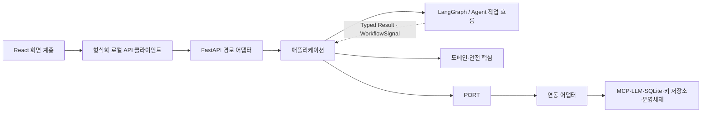
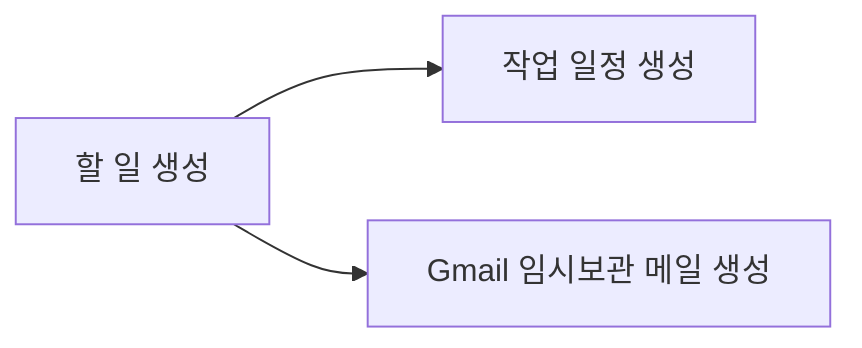
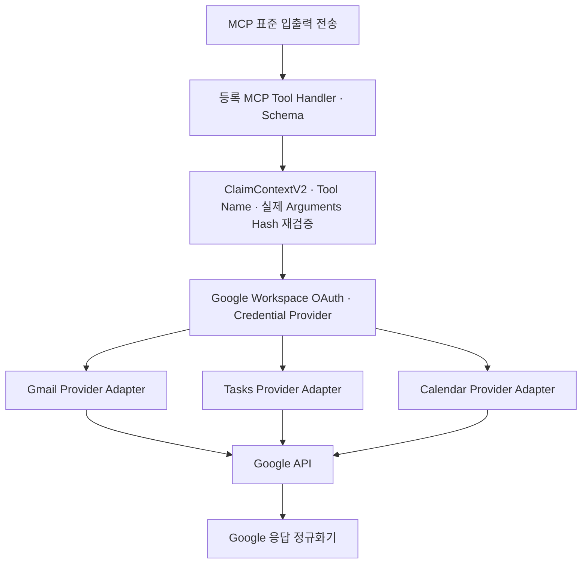

# 03. 시스템 아키텍처 설계서

> **Authority:** 시스템·레이어·프로세스 경계와 의존성 방향. Policy·Domain·Workflow·Interface의 전문 의미는 해당 owner를 직접 따른다.

## 0. 문서 정보

| 항목 | 내용 |
| --- | --- |
| 문서명 | 03. mcp-work-agent 시스템 아키텍처 설계서 |
| 상태 | Draft v3.16 |
| 기준일 | 2026-09-07 |
| 대상 릴리스 | P0 MVP |
| 공식 환경 | Windows 11 x64 · 최신 Chrome·Microsoft Edge |
| 제품 형태 | 단일 사용자용 로컬 Web UI + Python Agent 애플리케이션 |
| 핵심 Runtime | React · TypeScript · Vite · FastAPI · LangGraph · Connector MCP Runtime `stdio` · SQLite · OS Keyring |

## 0-A. 한눈에 보는 구조

```text
React UI
→ FastAPI Route Adapter
→ Application
   ├─ 결정적 Supervisor ↔ Agent Subgraph의 Typed Result / WorkflowSignal
   ├─ Domain / Policy / Approval
   └─ Port → Adapter
      ├─ Connector MCP Server → Provider API
      ├─ LLM Runtime
      └─ SQLite / Checkpointer / OS Keyring
```

**판단은 Agent**, **허용·실행 사실은 Domain**, **외부 효과는 Connector MCP 경계**, **재개 위치는 Checkpoint**가 소유한다. Write 이후에는 Application의 결정적 Verification이 같은 Connector 경계로 결과를 재조회한다.

Google Workspace와 GitHub는 독립 Connector이며 같은 Core 경계와 safety lifecycle을 사용한다. 제품 Runtime은 사용자 PC에서 실행되고 원격 제품 Backend는 두지 않는다.

## 1. 문서 목적

제품의 실행 구조와 프로세스·레이어 경계, 컴포넌트 책임, 상태 소유권을 정의한다. 승인·실행·복구에서 각 구성요소가 지켜야 하는 경계를 설명하되, 개별 API Schema나 Graph Node 설계를 다시 정의하지 않는다.

### 1.1 이 문서의 범위

| 구분 | 다루는 내용 |
| --- | --- |
| 실행 구조 | 로컬 UI·Service·Connector MCP·LLM Runtime과 프로세스 수명 |
| 책임과 의존성 | Frontend·API·Application·Agent·Domain·Adapter의 경계 |
| 데이터 소유권 | Domain Store·Checkpoint·Run 메모리·UI Cache·Credential |
| 실행 안전 | 승인·실행권·외부 Write·검증·복구의 연결 경계 |
| 배포와 검증 | 배포 프로필의 공통 Core, 교체 가능한 테스트 경계 |

### 1.2 이 문서에서 정하지 않는 것

DB·상태 전이의 상세, Retrieval 알고리즘, Graph Node·Edge, API Schema, 보안·운영 절차, 평가 방법, Repository 네이밍은 각 담당 문서가 소유한다. 해당 내용은 필요한 절에서만 참조하고 여기서 다시 정의하지 않는다.

다른 문서의 상세 계약이 바뀌어도 시스템 경계가 그대로라면 03을 함께 수정하지 않는다.

## 2. 아키텍처 요약

mcp-work-agent는 **로컬 Frontend와 Python Layered Modular Monolith로 구성된 단일 사용자 애플리케이션**이다.

| 실행 단위 | 역할 |
| --- | --- |
| Launcher | Service 시작·동적 포트·Health Check·브라우저 열기·종료 조정 |
| React Frontend | 사용자 화면. 운영에서는 FastAPI가 정적 산출물을 제공 |
| FastAPI Local Agent Service | REST·SSE, Application·LangGraph·Domain·LLM Router·Persistence |
| Connector MCP Runtime | Connector별 자식 프로세스·Transport·signed descriptor binding 관리 |
| Ollama | 검증된 GPU 환경에서 선택적으로 사용하는 별도 로컬 추론 Runtime |

설치 Artifact에는 Google Workspace MCP Server와 GitHub MCP Server가 포함된다. 전자는 Gmail·Tasks·Calendar를, 후자는 Issue를 제공한다.

각 서버가 자신의 Tool·Credential·Provider Adapter를 소유하며, MCP Runtime은 별도 Tool semantic Registry를 만들지 않는다.

### 2.1 선택한 아키텍처 스타일

| 항목 | 구성 |
| --- | --- |
| 제품 외형 | Launcher가 여는 `localhost` React Web UI |
| Frontend | React·TypeScript·Vite |
| 운영 UI·API | FastAPI가 React Static Build와 `/api/v1`을 same-origin으로 제공 |
| 내부 구조 | Python Layered Modular Monolith |
| Agent 제어 | 결정적 Supervisor·Versioned Typed State·책임별 Agent Subgraph |
| 진행 전달 | REST Command·Query + SSE Event Stream |
| 외부 Tool | MCP `stdio` |
| 상태·Secret | SQLite Domain Store·LangGraph Checkpointer·OS Keyring |
| 외부 실행 | Action 단위 상태 전이를 사용하는 Saga형 실행 |

계층 의존성 방향은 다음과 같다.

```text
React → Local API → Application → Domain + Ports ← Outbound Adapters
```

Application은 concrete Adapter·Provider SDK·SQLite 구현에 의존하지 않고 Port 계약만 소비한다.

## 3. 아키텍처 목표와 우선순위

| 우선순위 | 품질 속성 | 아키텍처 의미 |
| --- | --- | --- |
| 1 | 안전성 | 승인 없는 쓰기, 금지 Tool, 승인 인자 변경을 결정적으로 차단한다. |
| 2 | 복구성 | 브라우저 새로고침·REST Retry·SSE 재연결·앱 종료·OAuth 만료·Tool 응답 유실 후 중복 실행 없이 재개한다. |
| 3 | 개인정보 보호 | Secret과 불필요한 Gmail 원문을 저장·로그·전송하지 않는다. |
| 4 | 예측 가능성 | LLM의 자유 실행이 아니라 정의된 Workflow와 상태 전이를 사용한다. |
| 5 | 단순성 | 단일 사용자 로컬 제품에 불필요한 원격 서버·Queue·Kubernetes를 도입하지 않는다. |
| 6 | 테스트 가능성 | 명시된 Port·Repository 경계에서 외부 의존성을 교체해 검증한다. |
| 7 | 성능 | 단계별 진행 상태를 제공하고 불필요한 Source·LLM 호출을 줄인다. |
| 8 | 확장성 | 수평 확장보다 기능 모듈과 Adapter 교체 가능성을 우선한다. |

## 4. 핵심 아키텍처 결정

| ID | 결정 | 이유 |
| --- | --- | --- |
| ARC-001 | 로컬 단일 사용자 앱 | 제품 목표와 개인정보·운영 범위에 맞춘다. |
| ARC-002 | React + TypeScript + Vite Frontend | 복잡한 3열 UI, Inline Action Card, 편집·반응형·Client State를 명시적으로 구현한다. |
| ARC-003 | FastAPI Local Agent Boundary | React와 Python Core 사이를 Versioned REST·SSE 계약으로 분리하되 외부 공개 서버는 두지 않는다. |
| ARC-011 | Production same-origin | FastAPI가 React 정적 산출물과 `/api/v1`을 같은 `127.0.0.1` Origin에서 제공한다. |
| ARC-012 | REST Command + SSE Event | 상태 변경은 REST Command, 진행 전달은 재연결 가능한 SSE를 사용한다. |
| ARC-013 | Launcher Process Supervision | Launcher가 Port·Service·Browser·MCP 수명주기를 조정한다. |
| ARC-014 | Versioned Prompt Registry | Supervisor는 Node만 Routing하고 선택된 Agent·Application Node가 Node·상태·목적별 PromptRef를 확정한다. 각 LLM Node에는 deterministic Typed Input Projection을 거쳐 Prompt Runtime Input Contract가 허용한 필드만 전달한다. |
| ARC-004 | 결정적 LangGraph Supervisor 기반 평가 가능 Workflow | Main Graph는 Typed Result와 State로 흐름을 조정한다. Agent의 Local State·책임별 결과 소유권을 분리하고, 승인·실행·검증·복구는 Graph 구성과 독립된 Application·Domain이 통제한다. |
| ARC-005 | Agent / deterministic Policy / Domain 분리 | LLM은 semantic candidate를 제안하고 deterministic Policy는 허용·확인 requirement를, Domain은 lifecycle guard·transition을 결정한다. |
| ARC-006 | 외부 Connector 연동은 MCP `stdio` 공통 경계 | 제품 Core는 Connector ID·Resource Type·MCP Tool/Port 계약에만 의존하고 Provider API·SDK·Credential Adapter는 Connector MCP Server 내부에 격리한다. 현재 Google Workspace와 GitHub가 이 경계를 사용하며 Local API는 Provider API의 대체 경로가 아니다. |
| ARC-007 | Checkpoint와 Domain Store 분리 | Graph 재개 상태와 제품의 승인·실행 사실을 별도로 보존한다. |
| ARC-008 | 모든 쓰기 후 Effect별 결정적 검증 | Tool 응답만 신뢰하지 않는다. CREATE·UPDATE는 GET 비교, DELETE는 대상 부재/삭제 상태, SEND는 Sent 결과 조회를 사용한다. |
| ARC-009 | Local Runtime은 Ollama로 고정 | 별도 Loopback process의 상태와 설치된 지원 모델만 검사하며 제품이 설치·pull·provisioning하지 않는다. |
| ARC-010 | Core와 optional capability 분리 | Connector/LLM 미준비가 Core UI·Settings·기존 이력 접근을 막지 않는다. |

### 4.1 Application-owned Run execution boundary

**HTTP 요청 수명과 Run 실행 수명은 분리한다.** Application은 background handoff와 reconciliation을 소유하고 `WorkflowExecutionPort`에만 의존한다. concrete worker·scheduler·LangGraph invocation은 LangGraph outbound Adapter가 담당한다.

| 경계 | 규칙 |
| --- | --- |
| 새 Run | `StartRun`의 DB commit 전에는 `WorkflowExecutionPort`를 호출하지 않음 |
| 같은 Run 재개 | Confirmation·Reauth·Recovery의 owning lifecycle command가 `applied=true`인 뒤 같은 실행 경계로 전달 |
| HTTP·Browser | HTTP handler가 Graph 전체 실행을 붙잡지 않으며 Browser가 worker/thread identity를 생성하지 않음 |
| 실행 경로 | `WorkflowExecutionPort`가 유일한 production execution seam |
| 금지 | Route·lifecycle handler·cancel path·reconciliation loop가 `asyncio.create_task`, framework `BackgroundTasks`, concrete executor를 직접 선택 |
| 구현 선택 | queue·async primitive·worker pool 크기는 선택 가능하나 production ownership·path·Port·Adapter는 하나 |

#### 외부 제어의 durable handoff

`workflow_handoffs`는 **Application/Workflow control outbox**이며 Domain lifecycle의 새 권위가 아니다. 상태 변경과 continuation 의무를 함께 보존한다.

```text
FastAPI Route → Application command/controller
→ Domain mutation + required Receipt/Audit + handoff intent를 같은 SQLite UoW에 저장
→ COMMIT
→ run.schedule_run_execution(handoff_id, submission_kind)
→ current Domain / target / checkpoint guard + Run authority version 확인
→ WorkflowHandoffRepository.claim_execution_admission(...) CAS
→ WorkflowExecutionPort.submit(WorkflowExecutionSubmissionV2)
→ BackgroundRunExecutorAdapter
→ persisted admission으로 checkpoint commit + admission settlement
→ typed one-shot control 적용 또는 기존 continuation 재개
```

| 항목 | 보존해야 하는 조건 |
| --- | --- |
| Admission CAS | NORMAL은 `PENDING → DISPATCHED`, RECOVERY는 `CONSUMED` 유지. effective checkpoint/target과 expected Run version을 durable admission에 고정 |
| 사용자 Control | raw HTTP body·`interrupt_id`를 Prompt에 넣지 않음. `WorkflowControlEnvelopeV1`만 같은 Run의 Checkpoint에 one-shot 적용 |
| Commit 후 장애 | Application reconciler가 `PENDING`·`DISPATCHED` handoff를 redrive하며 Domain command는 다시 적용하지 않음 |
| Service 실행 중 조정 | 같은 reconciler가 `BLOCKED_BINDING`과 후행 dispatch head를 처리. process-local loop는 handler를 깨울 뿐 독립 실행 권위가 아님 |
| Checkpoint 해석 | Application은 opaque `checkpoint_blob`을 deserialize/patch하지 않음. LangGraph adapter가 metadata·binding 검증 후 control 적용 |
| Continuation 복구 | CONSUMED 이후 descendant checkpoint의 `active_handoff_id/run_sequence`로 lineage 보존 |
| 최신 Domain 우선 | Reauth·Recovery·Cancel·terminal 권위가 앞선 경우 해당 coordinator가 오래된 lineage보다 우선 |

### 4.2 MCP Trust Boundary

| 구분 | 권위와 제한 |
| --- | --- |
| MCP | Tool·Process·Transport 경계이며 보안 정책의 원본이 아님 |
| 공급망 | MCP Server Binary와 Tool Manifest는 제품 공급망 Artifact |
| Policy | 허용·금지·승인의 원본은 `01-B Policy`. Tool Annotation으로 Policy·Effect·Retry를 판정하지 않음 |
| Tool metadata | `07 Interface`의 `SignedToolRegistryEntryV1`이 Connector·Resource·Tool·Effect·Scope·Retryability·Verification·Recovery·Schema 등록 계약을 소유 |
| Server descriptor | signed projection을 소비·검증할 뿐 별도 Policy·Tool Registry를 만들지 않음 |
| 실행 방어 | MCP Server도 Claim·Tool·Arguments·TTL·Nonce를 재검증 |

### 4.3 SQLite·Checkpointer 운영 계약

| 항목 | 규칙 |
| --- | --- |
| 일반 Transaction | Domain transaction과 LangGraph checkpoint-state transaction을 하나의 원자 Transaction으로 묶지 않음 |
| Run 생성 | initial `WorkflowBindingV1` metadata와 `START WorkflowHandoff(PENDING)`은 checkpoint-state write가 아님. Run·USER Message·선택 ResourceRef와 같은 `SqliteUnitOfWork`에 참여 |
| 이후 Checkpoint | Run 생성 이후의 LangGraph checkpoint write는 별도 transaction |
| Migration | Domain Migration이 LangGraph 관리 Table을 생성·변경하지 않음 |
| 호환성 | Checkpointer Package Version과 Schema Compatibility를 Release Manifest에 Pin |
| Backup | SQLite Online Backup API 또는 정상 종료 상태의 일관된 복사 사용 |
| 충돌 | Domain Store를 실행 사실의 기준으로 사용하고 `RECOVERY_REQUIRED`로 전환 |
| 운영 값 | WAL 크기와 Checkpoint 주기는 운영 설정에서 관리 |

## 5. 시스템 구성 관계

### 5.1 외부 Actor와 시스템

| 대상 | 관계 | 신뢰 수준 |
| --- | --- | --- |
| 사용자 | 자연어 요청, 확인 질문 응답, 쓰기 승인·수정·거절 | 인증된 로컬 사용자이나 입력은 Schema 검증 필요 |
| Google APIs | Gmail·Tasks·Calendar 조회·허용된 쓰기·결과 재조회 | 외부 시스템 응답으로 정상화·검증 필요 |
| GitHub API | Repository 접근 확인, Issue 조회·허용된 쓰기·결과 재조회 | 외부 시스템 응답으로 정상화·검증 필요 |
| API LLM Provider | API_LLM 추론 | 외부 처리자, 최소 Context만 전송 |
| Ollama | LOCAL_GPU 추론 | 로컬 프로세스이나 출력은 비신뢰 LLM 결과 |
| OS Keyring | Google/GitHub credential은 각 MCP Credential Provider, LLM API Key는 LLM Adapter가 분리된 Entry로 사용 | Secret 저장의 기준점 |

## 6. 전체 실행 환경·프로세스 구조

```text
사용자 Windows PC
├─ Launcher
│  └─ FastAPI Local Agent Service
│     ├─ Service 내부: REST·SSE / Application·LangGraph·Domain / LLM Router
│     │                Persistence·Checkpointer / Run Retrieval Cache
│     ├─ Google Workspace MCP Server (stdio 자식 프로세스)
│     └─ GitHub MCP Server (stdio 자식 프로세스)
├─ Chrome·Edge: React Frontend / UI Session Cache / API·SSE Client
└─ Ollama (선택적 외부 로컬 프로세스)

로컬 저장: SQLite / OS Keyring
외부 연결: Google Workspace APIs / GitHub API / API LLM Provider
```

Launcher는 Service와 Browser 시작을 조정한다. Browser는 Service의 same-origin UI·API를 사용하며, Provider API는 해당 Connector MCP Server를 통해 접근한다.

### 6.1 프로세스 경계

| 실행 단위 | 형태 | 주요 장애 영향 |
| --- | --- | --- |
| Launcher | 제품 시작·종료 Supervisor | Local Agent Service 시작 실패, Version 불일치와 종료 상태를 사용자에게 표시한다. |
| Chrome·Edge + React Frontend | 로컬 UI Client | 탭이 닫히거나 새로고침되어도 영구 Run 상태는 SQLite에 남는다. |
| FastAPI Local Agent Service | 제품의 중심 Python 프로세스 | REST·SSE·Application·Agent가 중단되며 Checkpoint와 Domain 상태로 복구한다. |
| Google Workspace MCP Server | Local Agent Service가 관리하는 단일 자식 프로세스 | Google 읽기·쓰기 Tool이 중단된다. 쓰기 중 장애는 결과 재조회 후 상태를 확정한다. |
| GitHub MCP Server | Local Agent Service가 관리하는 단일 자식 프로세스 | GitHub 읽기·쓰기 Tool이 중단된다. 쓰기 중 장애는 결과 재조회 후 상태를 확정한다. |
| Ollama | 선택적 로컬 외부 프로세스 | Local AI 요청만 중단하고 Gemini로 자동 전환하지 않는다. |
| Google Workspace APIs | 외부 시스템 | 일시 오류·인증 만료·Quota 오류를 공통 오류로 변환한다. |
| GitHub API | 외부 시스템 | 일시 오류·인증 만료·권한·Rate Limit 오류를 공통 오류로 변환한다. |
| API LLM Provider | 선택적 외부 추론 시스템 | Gemini 요청만 실패 처리하고 Local로 자동 전환하지 않는다. |

## 7. 프런트엔드와 로컬 에이전트 서비스 논리 구조



## 8. 제어형 Agent 실행 모델

자유 대화형 Agent 군집이나 Peer-to-Peer A2A를 사용하지 않는다. **결정적 LangGraph Supervisor가 Agent의 Typed Result와 상태를 받아 다음 흐름을 조정**한다.

Semantic responsibility와 physical compiled Subgraph 구성은 구분한다. 이 문서는 책임·상태 소유권·실행 경계를 설명하며, 물리 Subgraph 개수·Graph Profile·세부 Node와 Edge는 반복해서 고정하지 않는다. 해당 구성은 `06 Agent·Workflow`에서 다룬다.

| 구성 | 책임과 제약 |
| --- | --- |
| Main Graph | Versioned Typed State의 공식 결과와 Edge 소유. 모든 공식 disposition을 결정적 경로로 연결 |
| Agent Subgraph | invocation 범위의 Typed Local State 사용. Node에는 필요한 최소 Projection만 전달 |
| Main State Artifact | 단일 Owner만 새 revision 생성. Subgraph는 owner field와 허용된 WorkflowSignal만 patch merge |
| Tool Route | IN/OUT Route를 확정. `InputRoutePlanV1`과 `OutputPlanV1`은 독립 revision이며 Output-only 변경은 기존 Retrieval을 무효화하지 않음 |
| Retrieval | 확정된 IN Route 안의 READ를 소유. 검증된 결정적 Read Node가 Connector Read 수행 |
| Planning | 확정된 OUT Tool을 소비. Release OUT Action은 `CREATE·UPDATE·SEND·DELETE`만 허용 |
| Confirmation | 발생한 Subgraph의 Checkpoint로 재개 |
| 승인·실행·검증·복구 | Graph Profile과 독립된 결정적 Application·Domain 책임 |

Source 본문에서 의미와 근거를 찾는 일은 Agent가 담당하지만, 사용자 승인 생략·금지 Tool 허용·승인 Arguments 변경·검증 성공 임의 확정은 허용하지 않는다.

### 8.1 LLM 담당 영역

- 자연어 의미와 목표 이해
- 검색 Query·Source 후보 제안
- Gmail Thread에서 업무 의미 추출
- Context 관련도와 추가 검색 후보 제안
- 사용자에게 보여줄 요약
- Gmail Draft 본문 생성
- Action Plan 초안 생성

### 8.2 결정적 코드 담당 영역

- Tool Allowlist와 금지 기능
- 날짜·시간·Timezone 계산
- Task 중복과 Calendar 충돌 최종 판정
- Action Schema와 허용 필드
- Approval Hash와 만료
- Idempotency
- MCP Write 실행 허용
- Connector 재조회 결과 정상화·비교
- Secret 접근과 로그 마스킹

### 8.3 요청 진입 방식과 Source 조회

| 진입 방식 | 시작점과 처리 |
| --- | --- |
| `RESOURCE_SELECTED` | Browser의 authenticated opaque `selection_handle`을 Application이 현재 account·session·connector·resource identity로 resolve한 결과에서 시작. 다른 Source는 요청 수행에 필요할 때만 확장 |
| `AGENT_SEARCH` | Query·기간·사람·이메일·프로젝트·Repository·Keyword를 구조화하고, frozen Route가 허용한 Connector의 Source-native 검색 수행 |

두 진입 방식은 Context 구성 이후 같은 분석·계획·승인·실행·검증 책임을 사용한다. 구체적인 검색·후보 축소·상세 조회 방식은 Retrieval concern에서 다룬다.

## 9. 컴포넌트 책임

### 9.1 UI·API·Application

| 컴포넌트 | 핵심 책임 | 제한 |
| --- | --- | --- |
| React Frontend | 시작 검사·메인 화면·설정·진단 렌더링. 사용자 요청·확인·승인·수정·거절·취소 입력 수집. REST·Snapshot·SSE를 View State에 반영하고 Event Cursor·Aggregate Version으로 중복·오래된 화면 Event 제거 | Provider API·MCP·SQLite·Keyring 직접 호출, 승인 Button의 직접 Write, Client State를 승인·실행 사실로 사용하거나 API Error·SSE 단절만으로 Domain 실패를 추정하는 것 금지 |
| Typed API Client | Versioned REST·SSE 통신, Request ID·Cursor 관리 | Domain 상태 결정 금지 |
| Frontend Session Cache | Sidebar 조회 결과의 UI 세션 재사용 | 영구 승인·실행 상태나 최신 검증 근거가 아님 |
| FastAPI Route·Event Adapter | Host·Origin·Session·Content-Type·Versioned Pydantic Request/Response/Error 검증. Query·Command 전달, SSE 구독·Cursor 재개·직렬화, Request ID·Command ID·Trace Context 생성·전달 | Domain 직접 UPDATE, Policy 복제, Checkpoint Table 직접 조작, 전체 Gmail 원문·Secret의 Event 전달 금지 |
| Application use cases | startup/shutdown lifecycle 조정. Run start/resume/cancel·background handoff, Conversation/Message 조회·durable command, Approval·Claim·Execution, Verification·Recovery, Action DAG·부분 성공 조정 | owning Domain operation의 결과를 소비하며 LLM 의미 판단·Provider SDK 세부사항을 소유하지 않음 |

Domain fact를 사용자 표시 Event로 투영하는 책임은 Application에 있다. Route는 Application use-case boundary로 명령을 전달하고 결과를 직렬화한다.

### 9.2 Workflow·Policy·Domain

| 컴포넌트 | 핵심 책임 | 제한 |
| --- | --- | --- |
| Agent | 자연어 목표 구조화, Retrieval Plan·충분성 판단·질문, Evidence 기반 Plan 초안 | 의미 후보가 승인·실행 권한을 만들지 않음 |
| LangGraph Runtime | Workflow·Interrupt·Checkpoint 재개 | 승인·실행 사실의 유일한 저장소가 아님 |
| deterministic Policy | allow/deny/confirmation requirement, Tool/effect allowlist | UI·DB mutation·Provider SDK를 소유하지 않음 |
| Domain | aggregate guard·lifecycle transition·version/freshness invariant | Product Policy를 새로 정의하거나 React·FastAPI·LangGraph Runtime·Provider SDK에 직접 의존하지 않음 |

Domain·Safety Core는 Schema·Policy·Evidence, 중복·충돌, Approval Hash·Idempotency·Verification 판정을 담당한다. Agent의 의미 후보와 결정적 안전 판정을 구분한다.

### 9.3 연동·저장·관측

| 컴포넌트 | 핵심 책임 | 제한 |
| --- | --- | --- |
| LLM Runtime Router | 요청 모드와 실제 Runtime 선택·관측 | 정책 우회·Tool 허용을 결정하지 않음 |
| MCP Client | Tool 계약 호출·Transport 관리 | Connector Credential 원문을 관리하지 않음 |
| Connector Runtime Registry | `connector_id → active MCP child process/handshake handle`의 process-local binding | Port가 아니며 Tool semantic metadata·Policy·Provider Credential을 소유하지 않음 |
| Google Workspace MCP Server | Google OAuth·API Adapter, 등록 Tool Handler·Schema, signed projection·실행 경계 검증 | Agent 계획·사용자 UX·별도 Core Tool Registry를 소유하지 않음 |
| GitHub MCP Server | Device Flow·API Adapter, 등록 Tool Handler·Schema, signed projection·실행 경계 검증 | Agent 계획·사용자 UX·GitHub 전용 Graph·Port·State·Core Tool Registry를 만들지 않음 |
| Domain Repositories | Conversation·Run·Action·Approval·Execution·Verification 영속 | Graph 중간 Channel 상태를 소유하지 않음 |
| LangGraph Checkpointer | Graph State·Interrupt 재개 정보 저장 | 감사 사실의 기준점이 아님 |
| Audit Writer | 승인·수정·차단·실행·검증의 append-only 기록 | 전체 Gmail 원문 저장 금지 |

Integration Layer에는 MCP·API LLM·Ollama·SQLite Repository·LangGraph Checkpointer Adapter와 Credential·Hardware/Process Diagnostics·Clock·UUID Adapter가 있다.

Connector Credential Provider는 각 MCP Server 안에, LLM Credential Adapter는 Local Agent Service 안에 둔다.

## 10. 상태와 데이터 소유권

| 데이터 | 기준 저장소 | 설명 |
| --- | --- | --- |
| 패널 열림·너비, 현재 탭, 임시 선택 | React Client State 또는 비밀이 아닌 로컬 설정 | UX 상태이며 실행 사실이 아님 |
| Sidebar page/batch·opaque Local API continuation·Calendar Month cache·GitHub Issue 목록 | React Client Session Cache | UI 세션 종료·Connector 계정/container/scope 변경·수동 새로고침 시 폐기 |
| Agent 검색 중간 후보와 상세 원문 | 현재 Run 메모리 | 사용되지 않은 후보와 전체 원문은 영구 저장하지 않음 |
| Conversation·Message | SQLite Domain Store | 대화 내역 복원 |
| Run·Action·Approval | SQLite Domain Store | 제품의 제안·승인 사실 기준점 |
| Execution·Verification | SQLite Domain Store | 중복 방지와 실제 결과 기준점 |
| Audit | SQLite append-only 저장 | 안전·책임 추적 |
| Graph State·Interrupt | LangGraph Checkpointer | Workflow 재개 지점 |
| Gmail·Tasks·Calendar 원본 | Google Workspace APIs | 원본 Resource의 기준점 |
| GitHub Repository·Issue 원본 | GitHub API | 원본 Resource와 실제 접근 상태의 기준점 |
| 실제 사용 Resource ID·Evidence excerpt | SQLite Domain Store | Run 보존 기간 동안 최소 근거 보존 |
| Google Refresh Token | OS Keyring | MCP Credential Provider만 읽음. SQLite·Checkpoint·일반 로그 저장 금지 |
| Google Access Token | Connector MCP Credential Provider Process Memory | persistent storage 금지 |
| LLM API Key | `KEYRING`이면 OS Keyring, `SESSION_ONLY`이면 Local Agent Process Memory | SQLite·Checkpoint·일반 로그 저장 금지 |
| Local Model | Ollama Model Store | 제품이 임의 경로를 직접 관리하지 않음 |

Attachment bytes는 Agent·Domain truth와 분리된 bounded I/O 경계에서 다룬다.

### 10.1 Checkpoint와 Domain Store 분리 원칙

```
LangGraph Checkpoint = 어디서 Workflow를 재개할 것인가
Domain Store          = 무엇이 제안·승인·실행·검증되었는가
```

Graph Node 구성이 변경되거나 Checkpoint가 정리돼도 승인·실행·Audit 사실은 Domain Store에 남아야 한다. 반대로 Domain Row만으로 LLM 호출 중간 상태를 복원하려 하지 않는다.

### 10.2 Connector Sidebar Cache 소유권

03은 Cache의 위치·수명·비권위성만 정의한다. exact UI identity/invalidation은 `02 UI·UX`, Local API와 Provider continuation의 구분은 `07 Interface`가 소유한다.

Cache를 승인·중복·충돌·검증 판단의 기준점으로 사용하거나 SQLite·Checkpoint에 승격하지 않는다. 선택형 요청 시작, 계획 확정, 승인 후 실행 직전, 실행 직후에는 Connector를 통한 최신 Provider Read를 우선한다.

## 10-A. Local API와 Event 계약

| 경계 | 아키텍처 규칙 |
| --- | --- |
| REST | `/api/v1`에서 Query와 Command를 분리. 상태 변경은 Application으로 전달하고 현재 상태·Version·적용 여부·오류를 반환 |
| Timeout | UI가 성공·실패를 추정하지 않고 Run Snapshot을 재조회 |
| SSE | Run 단위의 UI Projection. Domain Event Log의 영구 원본이 아님 |
| 재연결 | `Last-Event-ID` 또는 Cursor로 재개. 복원할 수 없으면 Snapshot 조회 후 최신 Stream에 연결 |
| Local Session | Launcher의 일회성 Bootstrap으로 수립. Host·Origin·Content-Type·Session 검증 |
| Network | `127.0.0.1` 동적 포트·same-origin만 사용. Wildcard CORS·외부 Network Bind 금지 |

Command·Event의 정확한 field와 Versioned Schema는 `07 Interface`에서 정의한다.

## 11. 주요 Run·Action 상태

Run·Action의 상태 목록과 command·guard·허용 전이는 **Domain State Transition Contract**가 소유한다. 영속 필드와 DB 불변조건은 `04 Domain·DB`가 소유한다. 이 문서에서 별도의 상태 목록을 만들지 않는다.

Workflow는 등록된 Command Result를 routing·checkpoint 입력으로 소비한다. 허용되지 않은 전이는 Application use-case boundary와 Repository에서 차단하며, UI는 상태를 직접 변경하지 않고 명령을 제출한다.

## 12. 승인·실행·검증 안전 경계

### 12.1 승인 정보

승인 정보는 Run·Plan·Action·Tool, 승인한 Arguments Hash, Policy·Tool Schema Version, Source Snapshot과 승인 시각·만료를 결속한다. 정확한 영속·wire Schema는 이 문서에서 복제하지 않는다.

### 12.2 실행 전 검증

| 확인 대상 | 검증 내용 |
| --- | --- |
| 승인 | 승인 상태이며 만료되지 않았는가 |
| 계약 | Policy·Tool Schema Version이 일치하는가 |
| 근거 | 최신 Provider Read에서 원본 변경이 없는가 |
| 인자 | 승인 Arguments Hash가 일치하는가 |
| 실행 조건 | 중복·충돌·Idempotency 검증을 통과했는가 |
| 실행권 | Claim 후 동일 binding의 `BeginExecutionAttempt(applied=true)`를 통과했는가 |

Application·Domain의 검증을 통과한 실행만 MCP Write 경계로 전달한다. **Claim·ClaimContext 생성만으로 Write를 시작하지 않는다.**

### 12.3 MCP의 이중 방어

FastAPI Local Agent Service의 Application·Domain에서 승인과 Policy를 검증해도 MCP Server는 다음을 다시 확인한다.

- 등록된 Tool인지
- Input Schema를 통과하는지
- 허용된 필드만 포함하는지
- `ClaimContextV2`의 Action·Approval·Attempt·Tool binding과 Signature·TTL·Nonce가 유효한지
- Canonical Arguments Hash가 일치하는지
- 현재 Connector 계정과 대상 Resource가 일치하는지

금지 Tool은 MCP Server에 등록하지 않는다.

### 12.4 실행 후 검증

```
Write Tool 실행
→ Resource ID와 실행 Metadata 저장
→ 대상 Connector의 독립 Read로 재조회
→ 공통 Resource Schema로 정상화
→ expected와 actual 필드 비교
→ VERIFIED 또는 MISMATCH 저장
```

Mismatch는 자동 수정하지 않고 Recovery 선택지를 사용자에게 제공한다.

## 13. Action DAG와 부분 실행

Plan은 Action과 Dependency로 구성한다.



- 독립 Action은 다른 Action 실패와 무관하게 실행할 수 있다.
- 종속 Action은 선행 Action의 검증 성공 조건을 확인한다.
- 성공 Action은 자동 롤백하지 않는다.
- 일부 승인 시 승인된 Action과 독립 Action만 실행한다.
- Action 수정으로 종속 Arguments가 바뀌면 관련 Action을 재계획·재검증한다.

SQLite와 외부 Provider API를 하나의 ACID Transaction으로 묶을 수 없으므로 Plan 전체가 아닌 Action 단위 상태 전이를 사용하는 Saga형 실행으로 처리한다.

## 14. Idempotency와 결과 불명확 처리

### 14.1 중복 실행 원인

REST Retry·승인 중복 클릭·브라우저 새로고침/탭 복제·SSE 중복 수신·앱 재시작·MCP 응답 유실·Provider Timeout 이후의 Retry를 구분해 처리한다.

### 14.2 기본 원칙

Application은 Approval·Command를 DB에 저장하고, 영구 Action 상태와 Idempotency 정보를 확인한 뒤 허용된 실행만 한 번 시작한다. UI 재요청이나 재연결은 새로운 Write 권한이 아니다.

### 14.3 결과 불명확 상태

Provider 요청 전달 후 MCP 연결이 끊기면 실패로 단정하지 않는다.

```text
전달 여부 불명 / 응답 유실
→ UNKNOWN_RESULT
→ Effect별 Recovery Policy에 따라 기존 결과 조회
→ 기존 실행이 단일하게 확인되면 기존 Attempt와 연결해 Verification
→ 미확인 또는 후보 복수이면 RECOVERY_REQUIRED 유지
```

`UNKNOWN_RESULT`에서는 새 Attempt·blind resend·단순 FAILED 확정을 금지한다. Effect별 조회·상태 해소의 상세는 Domain·Sequence·Operations의 해당 계약을 따른다.

### 14.4 Non-Domain operational replay boundary

Domain Aggregate lifecycle mutation의 `command_receipts`와 non-Domain operational side-effect replay를 같은 persistence authority로 합치지 않는다.

```text
FastAPI operational command
→ Application handler
→ OperationalCommandReplayPort
→ operation Port (OAuth/Credential/Settings/RuntimeMode/Backup/Restore/Diagnostics/Shutdown/Staging)
```

Replay store는 Domain SQLite와 독립되어 Safe Mode Restore가 복원 대상 DB에 의존하지 않게 한다. request-id·hash·reservation·result replay만 소유하며 product lifecycle semantics를 소유하지 않는다.

operation별 reconciliation callable은 `07 Interface`, storage realization은 `10 Infrastructure`가 소유한다.

## 15. MCP Server 아키텍처

외부 업무 I/O는 Application의 Tool binding과 Connector Port를 거친다.

```text
Application / SignedToolRegistry
→ ValidatedConnectorToolBindingV1
→ Connector Application Port
→ Core-side Connector Adapter
→ Connector Runtime Registry + MCPClientPort
→ Connector MCP Server
→ Provider-specific Adapter → Provider API
```

Provider API·SDK 호출, Credential 적용, raw 응답 해석은 해당 Connector MCP Server 내부 Adapter가 소유한다. Local API는 Provider API의 우회 경로가 아니다.

아래 그림은 Google Workspace MCP Server의 concrete 내부 구조다. GitHub MCP Server도 별도 child process에서 같은 등록 Tool·Claim·Credential·Provider Adapter 경계를 사용하며 Core에 GitHub 전용 Graph·Port·State authority를 만들지 않는다.



### 15.1 MCP Server 책임

| 책임 | 내용 |
| --- | --- |
| Protocol·Tool | MCP Protocol 처리. 빌드에 등록된 Tool Handler·Schema만 노출 |
| Registry 소비 | current signed registry subset을 검증·dispatch. Tool 이름에서 Connector·Resource·Effect를 추론하거나 별도 Verification/Recovery table을 만들지 않음 |
| 입출력 검증 | Pydantic Input·Output Schema 검증 |
| Write 방어 | 실행 경계에서 Signature·TTL·Nonce·Tool Name·실제 Execution Arguments Hash 재검증. Approval 발급·변경·승인은 하지 않음 |
| Credential | Google 예시에서는 OS Keyring의 Credential 사용과 Access Token 갱신 |
| Provider 접근 | Gmail·Tasks·Calendar API 호출과 Google 오류의 공통 Connector 오류 변환 |
| 결과 조회 | CREATE·UPDATE의 GET/compare, SEND의 Sent/Message lookup, DELETE의 target absence/state lookup 지원 |

각 Connector MCP Server의 handler·descriptor는 등록 계약을 소비하며, Core의 Policy·Tool metadata authority를 대체하지 않는다.

### 15.2 프로세스 수명주기

- Launcher와 Local Agent Service 시작 검사에서 MCP 실행 가능 여부를 확인한다.
- Connector Runtime은 **registered `connector_id`당 하나의 active `stdio` MCP 자식 프로세스**를 소유한다. 현재 process tree에는 `google_workspace`와 `github` child가 각각 하나씩 존재하며 Connector별 health/restart/handshake는 해당 `connector_id`에 target된다.
- REST 요청·SSE 재연결·브라우저 새로고침마다 새 MCP 프로세스를 만들지 않는다.
- `stdout`은 MCP Protocol 전용으로 사용하고 기술 로그는 `stderr` 또는 로컬 로그 Sink로 보낸다.
- 비정상 종료 시 제한된 횟수로 재시작한다.
- Write Tool 중 종료되면 대상 Connector의 기존 결과를 재조회해 확정하기 전 새 쓰기를 실행하지 않는다.
- 앱 정상 종료 시 자식 프로세스를 정리한다.

재시작 횟수·Backoff 값은 10·14 문서에서 결정한다.

## 16. LLM Runtime Router

### 16.1 입력과 출력

Application·Agent는 concrete API/Ollama Adapter를 선택하지 않고 **`StructuredInferencePort`만 호출**한다. 단일 production binding은 `StructuredInferenceRuntimeRouter`이며 Provider·Ollama leaf adapter는 Router 내부 dependency다.

| 관측 항목 | 구분 |
| --- | --- |
| 요청과 실제 실행 | requested mode와 actual runtime |
| 실행 주체 | provider·model·fallback reason |
| 비용과 성능 | latency·token usage·estimated cost |
| 출력 검증 | structured output attempts |

정확한 반환 Schema와 관측 field는 각각 Interface·Observability 계약에서 관리한다.

### 16.1-A Local model selection과 inference tier

Product LLM caller는 concrete model/provider가 아니라 책임 metadata를 전달한다. Runtime Router가 새 Run의 선택 방식과 Local model binding을 확정한다.

| 항목 | 규칙 |
| --- | --- |
| 지원 Local 모델 | `qwen3.5:9b`·`qwen3.5:4b` |
| 모델 검사 | 앱 시작·Settings 재검사에서 Adapter를 통해 Ollama와 설치된 지원 모델 관측 |
| 하나만 설치됨 | 해당 모델 선택 |
| 두 모델 설치됨 | 유효한 persisted preference 유지 또는 사용자 선택 |
| Run binding | 진행 중 Run의 immutable binding을 바꾸지 않으며 WORKER/REASONING 역할별 switching 금지 |
| 제품 관리 범위 | install·model pull·download/provisioning을 수행하지 않음 |

### 16.2 모드 규칙

| 환경·선택 | 동작 |
| --- | --- |
| Local AI 선택 | 선택한 지원 Ollama model만 사용; Gemini 자동 전환 금지 |
| Gemini 선택 | API Provider만 사용; Local 자동 전환 금지 |
| 사용 가능한 Runtime 없음 | Agent 실행 차단과 설정 Action 제공 |

모드 설정의 수명과 권위는 구분한다.

| 값 | 소유권·수명 |
| --- | --- |
| current-Service requested mode | `POST /api/v1/runtime/mode`로 변경하며 process-local `RuntimeModePort`가 단일 mutable authority |
| `preferred_llm_mode` | persisted Settings의 선호값. current-Service mode와 별도 |
| Run의 `requested_mode` | 시작 시 고정되며 위 설정 변경으로 바뀌지 않음 |

`RuntimeModePort` concrete binding은 16이 정한 system adapter다. `StructuredInferenceRuntimeRouter` 내부 mutable field나 Application module global을 두 번째 authority로 사용하지 않는다.

기술 오류, 모델 부재, OOM, Timeout, Structured Output 실패는 선택한 runtime의 실패다. 다른 runtime이나 다른 Local model을 묵시적으로 시도하지 않는다.

### 16.3 Structured Output

모든 Agent 판단 출력은 Pydantic Schema를 통과한 뒤 사용한다. Parsing 실패는 제한적으로 재시도하고, 반복 실패는 현재 모드 정책에 따라 오류로 처리한다. Structured Output 실패를 이유로 다른 Runtime·Local model로 자동 전환하지 않는다.

## 17. OAuth와 Credential 아키텍처

```text
React → FastAPI Route → Application OAuth 조정 → OAuthCredentialPort
→ 해당 Connector MCP Credential Provider → Provider 인증 / OS Keyring
```

Google의 Authorization Code·state·PKCE·Token 교환은 MCP Credential Provider 내부에서 처리한다. Core-facing Port에는 raw code·state를 전달하지 않는다.

| 항목 | 경계 |
| --- | --- |
| 연결 완료 관측 | 기존 `GET /api/v1/connections/google/status`의 bounded polling/refresh로 계정·Scope·연결 metadata만 조회 |
| Callback 복귀 | UI가 시작 URL에 보낸 query/fragment 없는 exact `http://127.0.0.1:{app_port}/`로만 복귀 가능. navigation이며 연결 상태 권위가 아님 |
| 알림 방향 | 별도 MCP→Application reverse notification authority를 만들지 않음 |
| Token 노출 | Browser·React·FastAPI Response에 Access·Refresh Token 원문 반환 금지 |
| Google Credential | MCP Credential Provider만 OS Keyring의 Refresh Token을 읽고 갱신 |
| LLM Credential | Service의 LLM credential adapter가 별도 Entry 관리. `KEYRING`은 OS Keyring, `SESSION_ONLY`는 Local Agent process memory에 두고 process/session 종료 시 폐기 |
| Google 활성 계정 | 앱 Instance당 하나. 계정 변경 시 기존 Credential 해제·새 연결·Sidebar Cache 폐기 |

Google과 GitHub Credential은 각자의 MCP Credential Provider가 소유한다. 인증 방식과 Scope·Credential의 상세는 `09 Security·Auth`에서 다룬다.

## 18. SQLite 아키텍처

### 18.1 저장 범주

| 영역 | 저장 내용 |
| --- | --- |
| Domain Table | Conversation·Message, Run·Plan·Action·Dependency, 사용 Resource Ref·Evidence, Approval·Execution Attempt·Verification, Trace Summary·Audit |
| Checkpointer Table | LangGraph State·Interrupt Payload·Node Resume Metadata |
| 저장 제외 | Gmail 전체 원문·미사용 검색 후보·Sidebar cache/continuation·OAuth Token·API Key·Prompt/Completion 원문 |

### 18.2 동시성 원칙

단일 사용자 앱에 외부 Redis·분산 Lock을 두지 않는다.

| 목적 | 적용 수단 |
| --- | --- |
| DB 일관성 | SQLite WAL·Foreign Key·짧은 Write Transaction |
| Command 중복 방지 | `command_id` 기반 Command Receipt |
| 동시 변경 제어 | Aggregate `version`을 이용한 낙관적 동시성과 조건부 UPDATE |
| 실행 무결성 | Approval Hash·Idempotency Key·Action당 활성 실행 시도 하나 |

정확한 PRAGMA 값과 Connection 전략은 `04 Domain·DB`에서 정의한다.

## 19. Observability 아키텍처

Run을 중심으로 요청·Command·Graph 실행·Action·Approval·Attempt·Tool/Provider 호출·SSE를 연결해 추적한다. 개별 correlation field와 Event Schema는 `11 Observability`에서 정의한다.

| 구분 | 관측 범위 |
| --- | --- |
| 실행 사실 | 상태 전이·오류 코드·Verification 결과 |
| 처리 경로 | Node·Tool·API 이름과 Sanitized Metadata |
| Runtime·성능 | Runtime·Provider·Model·fallback, Latency·Token·Cost |
| 기록 금지 | OAuth Token·API Key·Authorization Header·`claim_token`/`ClaimContextV2` 원문·전체 Gmail 본문·불필요한 Prompt/Completion 원문 |

## 20. 오류·Recovery 아키텍처

오류는 concern별 계약을 소비하며 03에서 별도 Enum을 만들지 않는다.

| 오류 family | 처리 계약 |
| --- | --- |
| Connector·MCP | `07 Interface`의 Error Enum |
| Domain conflict·Recovery | `04 Domain·DB`와 State Contract |
| Auth·Local Session | `09 Security·Auth` |
| LLM output·Repair | `06 Workflow`와 `15 Prompt·Failure` |
| Verification outcome | Domain 판정과 `08 Sequence`의 호출 절차 |

`UNKNOWN_RESULT`와 `RECOVERY_REQUIRED`는 Connector Error Enum이 아니라 Domain 실행·복구 상태다.

### 20.1 오류 처리 원칙

- React는 오류를 상태 전이하지 않고 Command 또는 사용자 Action으로 제출한다.
- 일시 Read 오류만 제한적으로 재시도한다.
- Write 결과가 불명확하면 자동 재시도하지 않는다.
- OAuth 만료는 Checkpoint 저장 후 재인증으로 전환한다.
- Verification Mismatch는 자동 수정하지 않는다.
- DB Integrity 실패는 Write를 차단하고 진단·복구 모드로 전환한다.

### 20.2 Retrieval cache-loss recovery authority

Architecture 수준의 결정은 하나다: **memory-only Run Retrieval Cache의 유실은 raw Provider continuation 복원이 아니라 current Run의 deterministic Retrieval restart path로 해결**한다.

Cache/handle validity와 `RETRIEVAL_CACHE_RESTART` 의미는 `05 Retrieval`, callable/Port shape는 `07 Interface`, production path/symbol은 `16 Repository Architecture`가 소유한다. 03은 특정 handler·repository symbol을 별도 authority로 반복하지 않는다.

## 21. 시작 순서

03이 고정하는 시작 경계는 다음뿐이다.

```text
Launcher owns process start
→ Local Service performs Core readiness
→ READY 이후 same-origin UI open
→ Local Session bootstrap
→ authenticated runtime availability projection
```

SQLite/Migration, Connector MCP, LLM runtime, startup reconciliation, live reconciliation의 **정확한 ordering과 readiness gate는 `10 Infrastructure`가 소유**하고 `08 Sequence`가 interaction sequence로 소비한다. 03은 그 체크리스트를 복제하지 않는다.

## 22. 종료 순서

Launcher가 Service lifecycle을 소유하고, 종료 시 새로운 작업 admission을 닫은 뒤 현재 external-effect certainty와 durable workflow state를 안전한 경계에 남기고 child runtime을 정리한다.

정확한 drain/timeout/process 종료 순서는 `10 Infrastructure`, 상태·복구 의미는 Domain State Transition Contract와 `08 Sequence`가 소유한다. Browser 탭 종료는 Service 종료와 동일하지 않다.

## 23. 배포 프로필

| 항목 | API_ONLY | LOCAL_CAPABLE |
| --- | --- | --- |
| 공통 Core | React·FastAPI·Agent Core·MCP·SQLite·Keyring Adapter | 동일 Core |
| 추론 | API LLM Provider만 활성화 | Local AI·Gemini 선택 |
| Local 의존성 | Ollama Adapter·Local Model 의존성 없음 | Ollama Adapter·Runtime 진단·설치된 지원 모델 검사 |
| 사용 경로 | CPU-only 사용자·GPU 없는 팀원의 기본 개발·배포 경로 | Local Runtime을 사용할 수 있는 환경 |

두 프로필은 동일한 Tool Schema·Policy·Agent Graph·Domain State Machine·테스트 Suite를 사용한다. Evaluation Runner와 non-release candidate artifact는 사용자 배포에 포함하지 않는다.

## 24. 테스트 아키텍처

### 24.1 원칙

외부 시스템과 Runtime을 명시된 Port·Repository 경계에서 교체해 실제 Credential 없이 안전 로직을 검증한다.

| 대체 경계 | 대상 |
| --- | --- |
| Connector 업무 I/O | `ConnectorReadPort`·`ConnectorWritePort` |
| Connector 인증·Transport | `OAuthCredentialPort`·`MCPClientPort` |
| LLM | `StructuredInferencePort`·`LlmCredentialPort`·`LlmRuntimeStatusPort` |
| Workflow | `CheckpointPort`·`RunRetrievalCachePort`·`WorkflowExecutionPort` |
| Domain 영속 | owner별 `<Owner>Repository` |
| Secret | `SecretStorePort` |
| 실행 환경 | `ClockPort`·`UUIDPort`·`HardwareProbePort`·`BrowserLauncherPort` |
| 설정·운영 | `SettingsPort`·`RuntimeModePort`·`BackupPort`·`DiagnosticsPort`·`ShutdownPort`·`AttachmentStagingPort` |

테스트에서도 다음 경계를 유지한다.

- `MCPClientPort`는 Connector Runtime 내부 transport/client seam이다. Route·Agent·Domain의 직접 의존 대상이 아니며, Provider Client의 테스트 대체는 Connector MCP Server 내부 Adapter에서만 한다.
- `CheckpointPort`는 Domain Repository와 별도다. 모든 Domain persistence를 한 인터페이스로 합치는 generic Repository Port를 두지 않는다.
- `RunRetrievalCachePort`의 production binding은 `InMemoryRunRetrievalCache` 하나다. raw continuation은 memory-only이며 restart 후 durable 복원하지 않는다.
- `WorkflowExecutionPort`는 committed Run·same-Run resume를 concrete LangGraph worker로 전달하는 실행 경계다.
- Browser·Route에는 raw Secret 접근을 노출하지 않는다.

Repository placement/symbol은 `16 Repository Architecture`의 `ports/<boundary>/<capability>_port.py` grammar를 따른다. Google Workspace·GitHub는 Connector Adapter binding이며 Provider별 Core Port authority를 만들지 않는다.

### 24.2 테스트 계층

| 계층 | 검증 대상 |
| --- | --- |
| Unit | Domain·deterministic Policy·Normalizer·Hash·Comparator |
| Contract | FastAPI Pydantic·SSE Event·MCP Tool·LLM Structured Output |
| Integration | SQLite·Checkpointer·Application·MCP Fake |
| Product Graph regression | production Graph·Node·Router·Application 경로와 선택 Runtime의 script measurement |
| Browser E2E | React→FastAPI→production Graph의 사용자 상호작용·Projection |
| Live Integration | Test User·실제 Google/GitHub·Gemini 또는 Ollama |
| Installer | Clean Windows VM·업데이트·복구·삭제 |

## 25. 명시적으로 도입하지 않는 구성

| 구성 | P0에서 제외하는 이유 |
| --- | --- |
| 원격 Backend·SaaS API | 로컬 단일 사용자 제품 목표와 불일치 |
| Tauri Desktop Shell | P0 Browser Shell로도 요구사항을 충족하며 P1에서 필요 시 도입 |
| Redux | React Query·Context·Reducer로 충분한지 먼저 검증 |
| WebSocket | P0 진행 전달은 단방향 SSE로 충분 |
| Redis | 단일 사용자 로컬 SQLite에 과도함 |
| Kafka·RabbitMQ | 로컬 단일 프로세스 업무 흐름에 과도함 |
| PostgreSQL | 사용자별 로컬 설치 복잡도 증가 |
| Kubernetes·Docker Desktop | 사용자 PC 설치 요구사항과 불일치 |
| 원격 MCP | 자격증명·개인정보 경계 확대 |
| Agent별 독립 DB·Credential·장기 Memory | Peer-to-Peer 분산 시스템을 만들 이유가 없음. Agent Subgraph는 invocation-local state만 사용 |
| Frontend의 Google SDK 직접 호출 | 승인·Policy·Audit 우회 경로 발생 |

## 26. 구현 순서

Repository/build dependency와 파일 구현 순서는 `16 Repository Architecture`가 소유한다. 아래는 아키텍처 관점의 vertical 검증 순서이며 별도 repository 구현 규칙이 아니다.

| 순서 | 검증할 연결 |
| --- | --- |
| A | Domain·Interface contract compile + Fake Adapter |
| B | Launcher·Local Session·React Shell |
| C | Answer-only·Connector READ |
| D | WRITE Approval → Claim → Execution → Verification |
| E | UNKNOWN_RESULT·Recovery·Reauth |
| F | 실제 Connector MCP 연동 |
| G | SSE·Checkpoint·재시작 복구 |
| H | Local LLM·Gemini Runtime |
| I | Evaluation·Installer·Upgrade |

API와 Local 모델을 동시에 디버깅하지 않는다. API_LLM vertical flow와 deterministic contract gate를 먼저 완성한 뒤 Ollama Adapter를 연결한다.

## 27. P0 아키텍처 완료 조건

다음은 구현·테스트로 확인할 조건이다. 문서에 기재된 것만으로 완료를 뜻하지 않는다.

- React Frontend와 FastAPI Local Agent Service가 Versioned API로 분리된다.
- 운영 UI와 API가 `127.0.0.1` same-origin으로 제공된다.
- FastAPI Route와 React가 Domain 상태를 직접 수정하지 않는다.
- 결정적 Supervisor가 검증된 Typed Result·State로 흐름을 조정하고 Agent가 Connector Write·승인·상태 전이를 직접 결정하지 않는다.
- 각 Connector MCP Server가 등록 Tool 실행과 자신의 Provider Credential 경계를 소유한다.
- SQLite Domain Store와 LangGraph Checkpoint 책임이 분리된다.
- 모든 Write가 승인 → 실행권 확보 → MCP → Effect별 검증 순서를 따른다.
- REST Retry, 브라우저 새로고침, SSE 재연결, 앱 재시작이 중복 Write를 만들지 않는다.
- `UNKNOWN_RESULT`에서 자동 재전송하지 않는다.
- Sidebar Cache와 검색 중간 후보가 SQLite에 불필요하게 저장되지 않는다.
- OAuth Token·API Key가 React·SQLite·Checkpoint·일반 로그에 노출되지 않는다.
- API_ONLY와 LOCAL_CAPABLE이 동일 Core Code와 Safety Policy를 사용한다.
- Clean Windows VM에서 Launcher가 서비스 시작·브라우저 열기·종료·복구를 조정한다.

---
