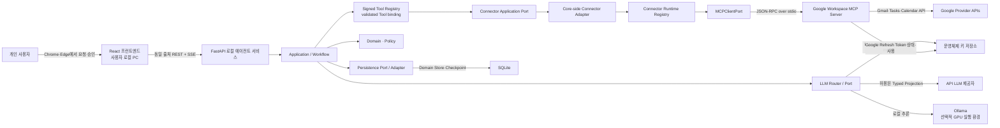
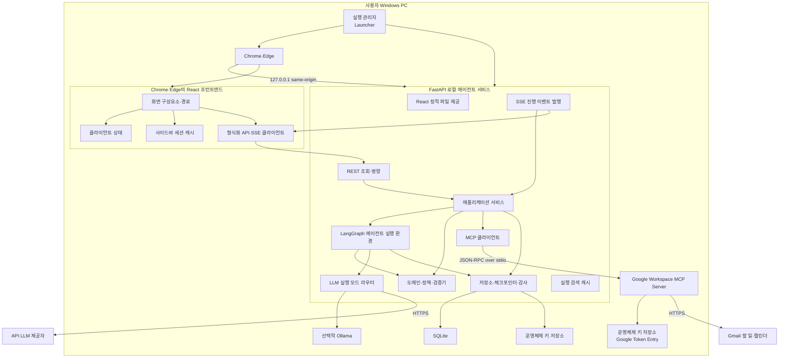
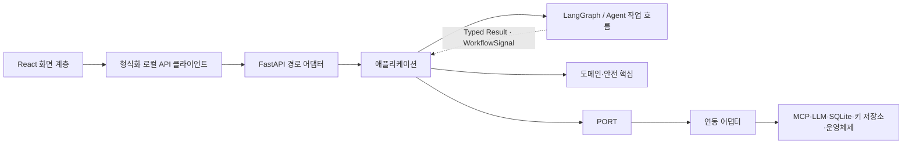
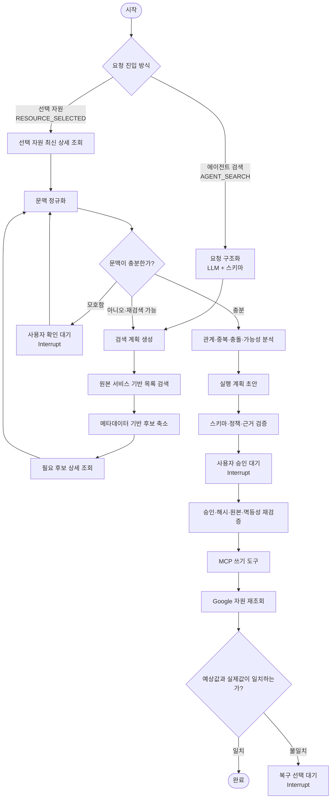
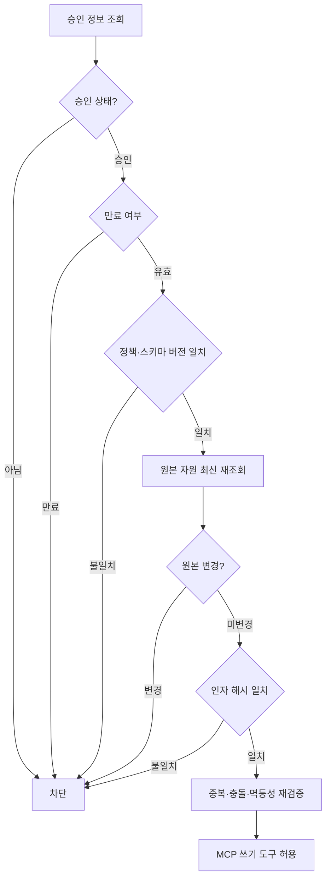
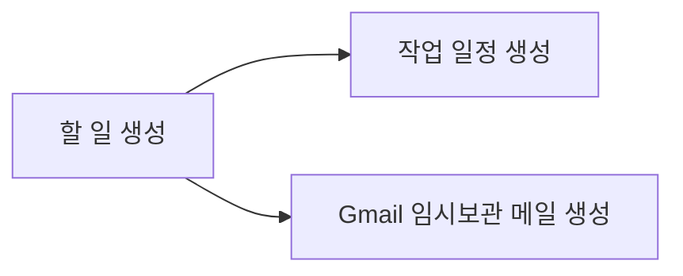
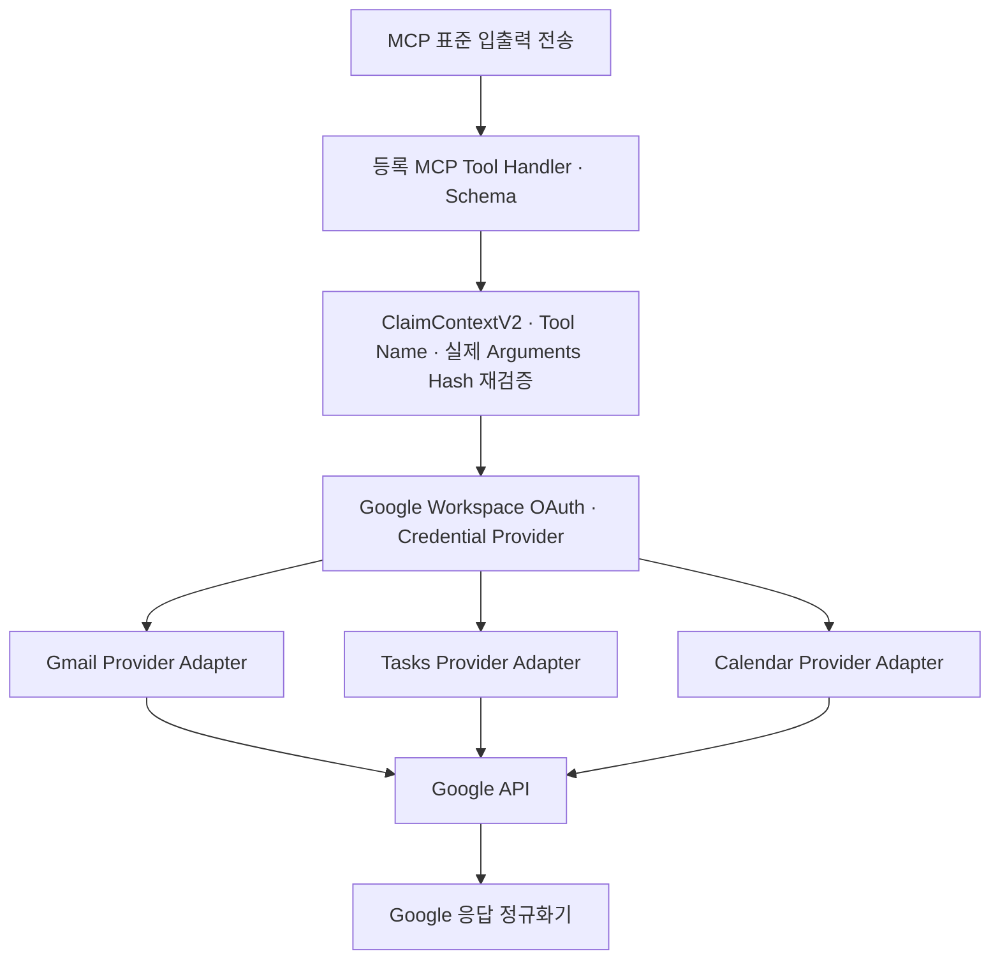
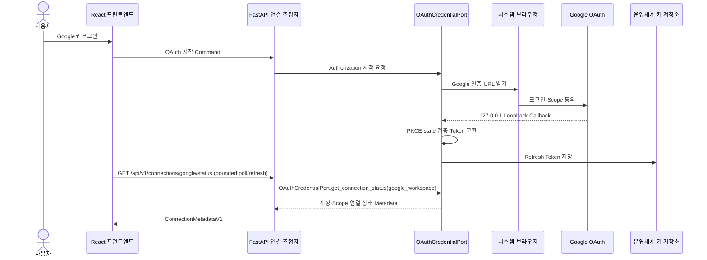

# 03. 시스템 아키텍처 설계서

> **Authority:** 시스템·레이어·프로세스 경계와 의존성 방향. Policy·Domain·Workflow·Interface의 전문 의미는 해당 owner를 직접 따른다.

## 0. 문서 정보

| 항목 | 내용 |
| --- | --- |
| 문서명 | 03. Google Work Agent 시스템 아키텍처 설계서 |
| 상태 | Draft v3.13 |
| 기준일 | 2026-08-26 |
| 대상 릴리스 | P0 MVP |
| 공식 환경 | Windows 11 x64 · 최신 Chrome·Microsoft Edge |
| 제품 형태 | 단일 사용자용 로컬 Web UI + Python Agent 애플리케이션 |
| 핵심 Runtime | React · TypeScript · Vite · FastAPI · LangGraph · Connector MCP Runtime `stdio` · SQLite · OS Keyring |

## 0-A. 한눈에 보는 구조

```
React UI
→ FastAPI Route Adapter
→ Application
   ├─ Deterministic Supervisor → Agent Subgraph → Typed Result / WorkflowSignal → Application
   ├─ Domain / Policy / Approval
   └─ Signed Tool Registry → `ValidatedConnectorToolBindingV1`
      → Connector Application Port
      → Core-side Connector Adapter
      → Connector Runtime Registry + MCPClientPort
      → Connector MCP Server
         ├─ Google Workspace MCP (P0)
         └─ future Connector MCP
      → Provider-specific Adapter → Provider API

Write 실행 후에는 Application의 결정적 verification use case가
같은 Connector Port를 통한 Verification Read 결과와 Domain 상태를 대조한다.
```

- **판단은 Agent**, **허용·실행 사실은 Domain**, **외부 효과는 Connector MCP 경계**, **재개 위치는 Checkpoint**가 소유한다.
- Google Workspace는 P0의 첫 번째 Connector이며 Core의 유일한 개념 경계가 아니다.
- 원격 제품 Backend 없이 사용자 PC에서 동작한다.

## 1. 문서 목적

이 문서는 Google Work Agent의 전체 실행 구조, 프로세스 경계, 논리 컴포넌트, 책임 분리, 통신 방식, 상태 소유권, 안전 경계와 배포 프로필을 정의한다.

이 문서가 답해야 하는 핵심 질문은 다음과 같다.

- 제품은 어떤 프로세스로 실행되는가?
- React Frontend, FastAPI Local Agent Service, LangGraph, Domain, deterministic Policy, MCP Server의 책임은 무엇인가?
- LLM이 판단하는 영역과 일반 코드가 결정하는 영역은 어디서 나뉘는가?
- 승인·실행·검증 상태의 기준점은 어디인가?
- 브라우저 새로고침, REST Retry, SSE 재연결, 앱 재실행, MCP 종료, OAuth 만료 후 어떻게 안전하게 복구하는가?
- `API_ONLY`와 `LOCAL_CAPABLE`은 어떤 공통 Core와 다른 Runtime을 가지는가?

### 1.1 이 문서의 범위

- System Context와 신뢰 경계
- Runtime·Container 구조
- React Frontend와 FastAPI Local Agent Service의 논리 구조
- LangGraph 기반 Agent 실행 모델
- Connector MCP Runtime과 Connector별 MCP Server 연동 경계
- SQLite·Checkpointer·OS Keyring의 상태 소유권
- 승인·Idempotency·실행·검증·복구 구조
- API LLM·Ollama Runtime Router
- 시작·종료·장애 복구 개요
- 배포 프로필과 테스트 경계

### 1.2 이 문서의 비범위

다음 세부사항은 후속 문서에서 정의한다.

- Table, Column, Index, Migration 상세 → `04. 도메인·데이터베이스 설계서`
- 검색 Query, Context Budget, Chunking, Reranking 상세 → `05. Context·Retrieval 설계서`
- LangGraph State, Node, Edge, Interrupt 상세 → `06. Agent·Workflow 설계서`
- MCP Tool별 Pydantic Schema와 오류 코드 상세 → `07. Tool·MCP·내부 인터페이스 명세서`
- 정상·실패·Recovery 단계별 호출 순서 → `08. 시퀀스 설계서`
- OAuth, Scope, Token, Keyring 상세 → `09. 보안·Auth 설계서`
- 설치·패키징·Ollama·환경 변수 상세 → `10. 인프라·환경 설정 설계서`
- Trace·Log·Audit Event Schema 상세 → `11. 관측성·로그·감사 설계서`

## 2. 아키텍처 요약

Google Work Agent는 **로컬 Frontend와 Python Modular Monolith를 분리한 단일 사용자 애플리케이션**으로 구성한다.

> **React Frontend가 사용자 화면을 담당하고, FastAPI Local Agent Service가 Application·LangGraph·Domain·Persistence의 단일 진입 경계를 제공한다. 외부 업무 시스템 접근은 Connector Runtime/MCP boundary를 공통 경계로 사용하고, 각 Provider API/SDK·Credential 적용·raw 응답 해석은 해당 Connector MCP Server 내부 Adapter가 소유한다. P0에서는 Google Workspace Connector가 Gmail·Tasks·Calendar를 제공한다. 모든 제품 프로세스는 사용자 PC에서 실행된다.**
주요 실행 단위는 다음 네 가지다.

1. **Launcher** — Local Service 시작, 동적 포트 선택, Health Check, 브라우저 열기와 종료 조정
2. **React Frontend** — React + TypeScript + Vite 기반 UI; 운영에서는 FastAPI가 정적 산출물을 제공
3. **FastAPI Local Agent Service** — REST Command·Query, SSE Event, Application, LangGraph, Policy, LLM Router, Persistence
4. **Connector MCP Runtime** — Connector별 MCP Server 수명주기·`SignedToolRegistry` signed projection/descriptor binding·Transport를 관리한다. MCP Runtime은 독립 Tool semantic Registry를 소유하지 않는다. P0에는 **Google Workspace MCP Server**가 포함되어 Gmail·Tasks·Calendar Tool과 Google OAuth·Provider Adapter를 제공한다.

검증된 GPU 환경에서는 **Ollama Runtime**이 선택적으로 추가된다. 별도 원격 Backend, SaaS API, Queue, 원격 MCP Server는 두지 않는다.

### 2.1 선택한 아키텍처 스타일

- 제품 외형: Launcher가 여는 `localhost` React Web UI
- Frontend: React + TypeScript + Vite
- Backend 경계: FastAPI Local Agent Service
- 운영 UI 제공: FastAPI가 React Static Build와 `/api/v1`을 같은 Origin에서 제공
- 내부 구조: Python Layered Modular Monolith
- 계층 의존성 방향: React → Local API → Application → Domain + Ports ← Outbound Adapters. Application은 concrete Adapter/Provider SDK/SQLite 구현에 의존하지 않고 Port 계약만 소비한다.
- Agent 구조: 결정적 Supervisor + Versioned Typed Main State + 평가 가능한 1/3/6 Agent Subgraph Profile + 결정적 실행·검증 책임
- 진행 전달: REST Command·Query + SSE Event Stream
- 외부 Tool 연동: MCP `stdio`
- 상태 관리: SQLite Domain Store + LangGraph Checkpointer
- Secret 관리: OS Keyring
- 분산 트랜잭션 방식: Action 단위 상태 전이를 사용하는 Saga형 실행


### 2.2 External control → durable background handoff boundary

HTTP 사용자 개입 뒤 suspend된 same-Run workflow를 다시 깨우는 production 경로는 다음 하나다.

```text
FastAPI Route
→ Application command/controller
→ Domain/lifecycle mutation + required Audit/Receipt
→ 같은 SQLite UoW에 durable workflow_handoffs intent stage
→ COMMIT
→ run.schedule_run_execution(handoff_id, submission_kind)
→ current Domain/target/checkpoint guard + Run authority version 확인
→ WorkflowHandoffRepository.claim_execution_admission(...) CAS
   # NORMAL: PENDING→DISPATCHED; RECOVERY: CONSUMED 유지
   # effective checkpoint/target + expected Run version을 durable admission으로 고정
→ WorkflowExecutionPort.submit(WorkflowExecutionSubmissionV2)
→ BackgroundRunExecutorAdapter
→ exact persisted execution admission만 사용
→ admission checkpoint commit + admission settlement
→ typed one-shot WorkflowControlEnvelopeV1 apply / existing continuation resume
→ Graph continues
```

- `workflow_handoffs`는 Domain lifecycle 의미를 새로 소유하지 않는 **Application/Workflow control outbox**다. 04가 durability/atomicity를, 06이 resume target/runtime semantics를, 07이 typed contract/Port를, 16이 repository placement를 소유한다.
- Confirmation/Context Adjustment처럼 사용자 payload가 필요한 resume은 raw HTTP body나 `interrupt_id`를 Prompt에 넣지 않는다. Durable handoff의 `WorkflowControlEnvelopeV1`만 Background executor가 same-run checkpoint에 one-shot으로 적용한다.
- Domain mutation과 handoff intent insert는 같은 SQLite transaction이다. commit 후 process가 죽어도 Application reconciler가 `PENDING|DISPATCHED` handoff를 redrive하며 Domain command를 다시 적용하지 않는다. 같은 reconciler는 service가 살아 있는 동안에도 process-local driving loop에 의해 반복 실행되어 runtime `BLOCKED_BINDING`과 later dispatch head를 restart 없이 처리한다.
- Application은 opaque `checkpoint_blob`을 deserialize/patch하지 않는다. Handoff apply는 LangGraph adapter가 checkpoint metadata와 handoff binding을 검증한 뒤 수행한다. CONSUMED 이후 descendant checkpoint는 typed metadata `active_handoff_id/run_sequence`를 유지해 continuation crash recovery authority를 보존하고, Domain이 Reauth/Recovery/Cancel/terminal authority로 앞서가면 그 state-specific coordinator가 오래된 lineage보다 우선한다.
- `WorkflowExecutionPort`는 계속 유일한 production execution seam이다. FastAPI Route, lifecycle handler, cancel path, reconciliation loop가 `asyncio.create_task`, framework BackgroundTasks, concrete LangGraph executor를 직접 선택하지 않는다.

## 3. 아키텍처 목표와 우선순위

| 우선순위 | 품질 속성 | 아키텍처 의미 |
| --- | --- | --- |
| 1 | 안전성 | 승인 없는 쓰기, 금지 Tool, 승인 인자 변경을 결정적으로 차단한다. |
| 2 | 복구성 | 브라우저 새로고침·REST Retry·SSE 재연결·앱 종료·OAuth 만료·Tool 응답 유실 후 중복 실행 없이 재개한다. |
| 3 | 개인정보 보호 | Secret과 불필요한 Gmail 원문을 저장·로그·전송하지 않는다. |
| 4 | 예측 가능성 | LLM의 자유 실행이 아니라 정의된 Workflow와 상태 전이를 사용한다. |
| 5 | 단순성 | 단일 사용자 로컬 제품에 불필요한 원격 서버·Queue·Kubernetes를 도입하지 않는다. |
| 6 | 테스트 가능성 | `Connector Runtime Registry`는 registered `connector_id → active MCP runtime binding`의 단일 lookup authority이고 **Port가 아니다**. 교체 가능한 boundary는 `MCPClientPort`, `StructuredInferencePort`, `ClockPort`, `SecretStorePort` 등 07의 current Port set으로만 둔다. Provider Client는 각 Connector MCP Server 내부 Adapter의 테스트 경계로만 둔다. |
| 7 | 성능 | 단계별 진행 상태를 제공하고 불필요한 Source·LLM 호출을 줄인다. |
| 8 | 확장성 | 수평 확장보다 기능 모듈과 Adapter 교체 가능성을 우선한다. |

## 4. 핵심 아키텍처 결정

| ID | 결정 | 이유 |
| --- | --- | --- |
| ARC-001 | 로컬 단일 사용자 앱 | 제품 목표와 개인정보·운영 범위에 맞춘다. |
| ARC-002 | React + TypeScript + Vite Frontend | 복잡한 3열 UI, Inline Action Card, 편집·반응형·Client State를 명시적으로 구현한다. |
| ARC-003 | FastAPI Local Agent Boundary | React와 Python Core 사이를 Versioned REST·SSE 계약으로 분리하되 외부 공개 서버는 두지 않는다. |
| ARC-011 | Production same-origin | FastAPI가 React 정적 산출물과 `/api/v1`을 같은 `127.0.0.1` Origin에서 제공한다. |
| ARC-012 | REST Command + SSE Event | 상태 변경은 REST Command, 진행 전달은 재연결 가능한 SSE를 사용한다. |
| ARC-013 | Launcher Process Supervision | Launcher가 Port·Service·Browser·MCP 수명주기를 조정한다. |
| ARC-014 | Versioned Prompt Registry | Supervisor는 Node만 Routing하고 선택된 Agent·Application Node가 Node·상태·목적별 PromptRef를 확정한다. 각 LLM Node에는 deterministic Typed Input Projection을 거쳐 Prompt Runtime Input Contract가 허용한 필드만 전달한다. |
| ARC-004 | 결정적 LangGraph Supervisor 기반 평가 가능 Workflow | `SINGLE_BASELINE`, `THREE_STAGE`, `SIX_ROLE_BASELINE`을 같은 안전·Tool·Policy 계약으로 비교한다. Main Graph는 Versioned Typed State의 공식 결과와 Edge를 소유하고 Agent는 Subgraph별 Typed Local State와 Node별 최소 Projection을 사용한다. Tool Route가 IN/OUT Route를 한 번 확정하되 `InputRoutePlanV1`과 `OutputPlanV1`을 독립 revision Artifact로 유지하고, Output-only 변경은 기존 Retrieval을 무효화하지 않는다. Release Graph에서 READ는 IN Route·Retrieval이 단독 소유하고 OUT Action은 CREATE·UPDATE·SEND·DELETE만 허용한다. 각 Main State Artifact는 단일 Owner만 새 revision을 만들며 Subgraph는 owner field와 허용 workflow signal만 patch merge한다. 또한 Confirmation은 발생 Subgraph의 checkpoint로 resume하고 모든 공식 disposition은 결정적 Supervisor Edge로 닫힌다. 이후 Retrieval의 결정적 Read Node만 고정 IN Route에서 Connector Read를 수행한다. Planning은 고정 OUT Tool을 소비한다. 승인·실행·검증·복구는 Graph 후보와 독립된 결정적 Application/Domain responsibility이 통제한다. |
| ARC-005 | Agent / deterministic Policy / Domain 분리 | LLM은 semantic candidate를 제안하고 deterministic Policy는 허용·확인 requirement를, Domain은 lifecycle guard·transition을 결정한다. |
| ARC-006 | 외부 Connector 연동은 MCP `stdio` 공통 경계 | 제품 Core는 Connector ID·Resource Type·MCP Tool/Port 계약에만 의존하고 Provider API·SDK·Credential Adapter는 Connector MCP Server 내부에 격리한다. P0 Google Workspace는 이 일반 경계의 첫 구현이며 Local API는 Provider API의 대체 경로가 아니다. |
| ARC-007 | Checkpoint와 Domain Store 분리 | Graph 재개 상태와 제품의 승인·실행 사실을 별도로 보존한다. |
| ARC-008 | 모든 쓰기 후 Effect별 결정적 검증 | Tool 응답만 신뢰하지 않는다. CREATE·UPDATE는 GET 비교, DELETE는 대상 부재/삭제 상태, SEND는 Sent 결과 조회를 사용한다. |
| ARC-009 | Local Runtime은 Ollama로 고정 | 제품 Local Runtime 지원 범위를 하나의 production boundary로 고정한다. |
| ARC-010 | `API_ONLY`·`LOCAL_CAPABLE` 분리 | GPU가 없는 환경에 Ollama·모델 의존성을 강제하지 않는다. |

### 4.1 Application-owned Run execution boundary

FastAPI HTTP 요청 수명과 LangGraph Run 실행 수명은 분리한다. **Application이 background Run execution handoff와 reconciliation semantics를 소유하고 `WorkflowExecutionPort`에만 의존**한다. concrete worker/scheduler/LangGraph invocation은 16이 정한 LangGraph outbound Adapter가 소유하며 FastAPI Route가 `BackgroundTasks`, `asyncio.create_task`, worker implementation을 직접 선택하지 않는다. 별도 process-local reconciliation loop는 Application handler를 깨우는 driving adapter일 뿐 Graph execution authority가 아니다.

```
FastAPI Route
→ Application StartRun/Command Receipt commit
→ run.schedule_run_execution
→ WorkflowExecutionPort
→ background executor worker slot
→ LangGraph invoke 또는 registered same-Run resume
→ Domain·Checkpoint 저장
→ Projection Event 발행
```

`StartRun`의 DB commit 전에는 `WorkflowExecutionPort` 호출이 0이다. same-Run Confirmation/Reauth/Recovery resume도 owning lifecycle command가 `applied=true`가 된 뒤 동일 execution boundary로 전달한다. HTTP handler가 LangGraph 전체 실행을 붙잡거나, Browser가 worker/thread identity를 생성하지 않는다. 구체 scheduling queue/async primitive와 worker pool 크기는 구현 선택이지만 **production ownership/path/Port/Adapter는 하나**다.

### 4.2 MCP Trust Boundary

- MCP는 보안 정책의 원본이 아니라 Tool·Process·Transport 계약 경계다.
- MCP Server Binary와 Tool Manifest는 제품 공급망 Artifact다.
- Tool Annotation을 Policy·Effect·Retry 판단의 기준으로 사용하지 않는다.
- `connector_id + resource_type + tool_id + Effect + Scope + Retryability + Verification + Recovery + schema refs`는 07의 `SignedToolRegistryEntryV1`이 단일 authority로 소유한다. MCP Server descriptor는 그 signed projection이며 독립 Registry authority가 아니다.
- MCP Server는 Claim Token·Tool Name·Arguments Hash·TTL·Nonce를 재검증한다.

### 4.3 SQLite·Checkpointer 운영 계약

- Domain Migration은 LangGraph 관리 Table을 생성·변경하지 않는다.
- LangGraph Checkpointer Package Version과 Schema Compatibility를 Release Manifest에 Pin한다.
- Backup은 SQLite Online Backup API 또는 정상 종료 상태의 일관된 복사를 사용한다.
- 일반 Domain transaction과 LangGraph checkpoint-state transaction은 하나의 원자 Transaction으로 묶지 않는다. 단 `StartRun`의 initial `WorkflowBindingV1` metadata와 `START WorkflowHandoff(PENDING)`은 LangGraph checkpoint-state write가 아니며, 04/07의 crash-safe Run creation contract에 따라 Run·USER Message·선택 ResourceRef와 같은 `SqliteUnitOfWork`에 참여한다. 이후 LangGraph checkpoint write는 다시 별도 transaction이다.
- Domain과 Checkpoint가 충돌하면 Domain Store를 실행 사실의 기준점으로 사용하고 `RECOVERY_REQUIRED`로 전환한다.
- WAL 크기와 Checkpoint 주기를 운영 설정으로 관리한다.

## 5. 시스템 구성 관계



### 5.1 외부 Actor와 시스템

| 대상 | 관계 | 신뢰 수준 |
| --- | --- | --- |
| 사용자 | 자연어 요청, 확인 질문 응답, 쓰기 승인·수정·거절 | 인증된 로컬 사용자이나 입력은 Schema 검증 필요 |
| Google APIs | Gmail·Tasks·Calendar 조회·허용된 쓰기·결과 재조회 | 외부 시스템 응답으로 정상화·검증 필요 |
| API LLM Provider | API_LLM 추론 | 외부 처리자, 최소 Context만 전송 |
| Ollama | LOCAL_GPU 추론 | 로컬 프로세스이나 출력은 비신뢰 LLM 결과 |
| OS Keyring | Google Refresh Token은 MCP Credential Provider, LLM API Key는 LLM Adapter가 분리된 Entry로 사용 | Secret 저장의 기준점 |

## 6. 전체 실행 환경·프로세스 구조



### 6.1 프로세스 경계

| 실행 단위 | 형태 | 주요 장애 영향 |
| --- | --- | --- |
| Launcher | 제품 시작·종료 Supervisor | Local Agent Service 시작 실패, Version 불일치와 종료 상태를 사용자에게 표시한다. |
| Chrome·Edge + React Frontend | 로컬 UI Client | 탭이 닫히거나 새로고침되어도 영구 Run 상태는 SQLite에 남는다. |
| FastAPI Local Agent Service | 제품의 중심 Python 프로세스 | REST·SSE·Application·Agent가 중단되며 Checkpoint와 Domain 상태로 복구한다. |
| Google Workspace MCP Server | Local Agent Service가 관리하는 단일 자식 프로세스 | Google 읽기·쓰기 Tool이 중단된다. 쓰기 중 장애는 결과 재조회 후 상태를 확정한다. |
| Ollama | 선택적 로컬 외부 프로세스 | LOCAL_GPU가 실패하며 명시 모드 또는 AUTO fallback 정책으로 분기한다. |
| Google Workspace APIs | 외부 시스템 | 일시 오류·인증 만료·Quota 오류를 공통 오류로 변환한다. |
| API LLM Provider | 선택적 외부 추론 시스템 | API_LLM 실패 또는 AUTO fallback 실패로 처리한다. |

## 7. 프런트엔드와 로컬 에이전트 서비스 논리 구조



### 7.1 React Presentation Layer

책임:

- 시작 검사, 온보딩, 메인 3열 레이아웃, 설정·진단 렌더링
- Gmail·Tasks의 materialized page/batch와 opaque Local API continuation, Calendar Month cache를 UI Session Cache에서 관리
- 사용자 메시지, 확인 질문, 승인, 수정, 거절, 취소 Command 수집
- REST Response, Run Snapshot과 SSE Event를 View State로 반영
- Event Cursor·Aggregate Version으로 중복·오래된 화면 Event 제거

제한:

- Google API·MCP·SQLite·OS Keyring 직접 호출 금지
- 승인 Button에서 Write Tool 직접 실행 금지
- Browser Storage와 Client State를 승인·실행 사실의 기준점으로 사용 금지
- API Error·SSE Disconnect만으로 Domain 실패를 추정 금지

React 

```

```

### 7.2 FastAPI Route·Event Adapter

책임:

- Host·Origin·Local Session·Content-Type 검증
- Versioned Pydantic Request·Response·Error Schema
- REST Query와 Command를 Application use-case boundary에 전달
- SSE 구독, Cursor 재개, 사용자 표시 Event 직렬화
- Request ID·Command ID·Trace Context 생성과 전달

제한:

- Domain 상태 직접 UPDATE 금지
- Policy 결정 복제 금지
- LangGraph Checkpoint Table 직접 조작 금지
- 전체 Gmail 원문과 Secret을 Event로 전달 금지

### 7.3 Application Layer

대표 Application use-case 책임:

- startup/shutdown lifecycle 조정
- Run start/resume/cancel 및 background execution handoff
- Conversation/Message query와 durable command 처리
- Approval·Claim·Execution command 처리
- Verification·Recovery orchestration
- Domain fact → user-visible event projection

책임:

- API Command를 owning Domain lifecycle operation에 전달하고 결과를 조정
- LangGraph invoke·resume와 사용자 Interrupt 조정
- 승인 후 실행 전 검증 절차 조정
- Action DAG 실행 순서와 부분 성공 조정
- Domain Event를 사용자 표시 Event로 투영

### 7.4 Agent Workflow Layer

- 자연어 목표 구조화, Retrieval Plan, 충분성 평가, 질문, Evidence 기반 Plan 초안을 담당한다.
- 사용자 승인 생략, 금지 Tool 허용, 승인 Arguments 변경, 검증 성공 임의 확정은 금지한다.

### 7.5 Domain·Safety Core

- Tool Allowlist, 상태 전이, Schema·Policy, Evidence, 중복·충돌, Approval Hash, Idempotency, Verification 판정을 소유한다.
- React, FastAPI, LangGraph Runtime, Google SDK에 직접 의존하지 않는다.

### 7.6 Integration Layer

- MCP Client Adapter
- API LLM Adapter
- Ollama Adapter
- SQLite Repository Adapter
- LangGraph Checkpointer Adapter
- LLM API Key용 Credential Adapter — `KEYRING`은 OS Keyring, `SESSION_ONLY`은 Local Agent Process Memory
- MCP 내부 Google Credential Provider
- Hardware·Process Diagnostics Adapter
- Clock·UUID Adapter

## 8. 제어형 Agent 실행 모델

Google Work Agent는 자유 대화형 Agent 군집이나 Peer-to-Peer A2A를 사용하지 않는다. 하나의 결정적 LangGraph Supervisor가 **6개 `SemanticAgentOwnerIdV1` 책임**과 일반 코드 검증, 사용자 Interrupt, 결정적 실행·검증 책임을 조정한다. 이 6개 semantic responsibility는 selected Graph Profile에 따라 **1개 / 3개 / 6개의 physical compiled Agent Subgraph**로 배치되며, semantic owner 수와 physical Subgraph 수를 같은 개념으로 취급하지 않는다.



### 8.1 LLM 담당 영역

- 자연어 의미와 목표 이해
- 검색 Query·Source 후보 제안
- Gmail Thread에서 업무 의미 추출
- Context 관련도와 추가 검색 후보 제안
- 사용자에게 보여줄 요약
- Gmail Draft 본문 생성
- Action Plan 초안 생성

### 8.2 결정적 코드 담당 영역

- Tool Allowlist와 금지 기능
- 날짜·시간·Timezone 계산
- Task 중복과 Calendar 충돌 최종 판정
- Action Schema와 허용 필드
- Approval Hash와 만료
- Idempotency
- MCP Write 실행 허용
- Google 재조회 결과 정상화·비교
- Secret 접근과 로그 마스킹

### 8.3 요청 진입 방식과 Source 조회

- `RESOURCE_SELECTED`: Browser의 authenticated opaque `selection_handle`을 Application이 current account/session/connector/resource identity로 resolve한 결과를 시작점으로 사용하고, 요청 수행에 필요할 때만 다른 Source를 확장한다.
- `AGENT_SEARCH`: Query·기간·사람·이메일·Keyword를 구조화해 Google Source-native 목록 검색을 수행하고, Metadata로 후보를 축소한 뒤 필요한 후보만 상세 조회한다.
- Gmail·Tasks Sidebar의 materialized page/batch와 opaque Local API continuation, Calendar Month cache는 React Client Session Cache에만 유지하며 SQLite에 영구 저장하지 않는다.
- 두 진입 방식은 Context 구성 이후 동일한 분석·계획·승인·실행·검증 Workflow를 사용한다.

## 9. 컴포넌트 책임

| 컴포넌트 | 핵심 책임 | 소유하지 않는 책임 |
| --- | --- | --- |
| React Frontend | 사용자 입력, View State, REST·SSE 렌더링 | Connector Write 실행, 정책 결정, Secret 접근 |
| Typed API Client | Versioned REST·SSE 통신, Cursor·Request ID | Domain 상태 결정 |
| Frontend Session Cache | Gmail·Tasks page/batch·opaque Local API continuation과 Calendar Month cache의 UI 세션 재사용 | 영구 승인·실행 상태 |
| FastAPI Adapter | Local Session·Schema·Command·Event 경계 | Policy·Domain 규칙 복제 |
| Application use cases | Run 명령, 상태 전이, 승인·실행·복구 조정 | LLM 의미 판단, Google SDK 세부사항 |
| LangGraph Runtime | Workflow, Interrupt, Checkpoint 재개 | 승인·실행 사실의 유일한 저장 |
| deterministic Policy | allow/deny/confirmation requirement, Tool/effect allowlist | UI, DB mutation, Provider SDK |
| Domain | aggregate guard, lifecycle transition, version/freshness invariant | UI, Product Policy definition, Provider SDK |
| LLM Runtime Router | 요청 모드와 실제 Runtime 선택, fallback 기록 | 정책 우회, Tool 허용 |
| MCP Client | Tool 계약 호출과 Transport 관리 | Google Credential 원문 관리 |
| Connector Runtime Registry | `connector_id → active MCP child process/handshake handle`의 process-local binding | Tool semantic metadata, Policy, Provider Credential |
| Google Workspace MCP Server | Google OAuth·API Adapter, 등록 Tool Handler·Schema exposure, `SignedToolRegistry` signed projection 검증, 실행 경계 검증 | Agent 계획과 사용자 UX, Core Tool semantic Registry |
| Domain Repositories | Conversation·Run·Action·Approval·Execution·Verification 저장 | Graph 중간 Channel 상태 |
| LangGraph Checkpointer | Graph State와 Interrupt 재개 정보 | 감사 사실의 기준점 |
| Audit Writer | 승인·수정·차단·실행·검증 append-only 기록 | 전체 Gmail 원문 저장 |

## 10. 상태와 데이터 소유권

| 데이터 | 기준 저장소 | 설명 |
| --- | --- | --- |
| 패널 열림·너비, 현재 탭, 임시 선택 | React Client State 또는 비밀이 아닌 로컬 설정 | UX 상태이며 실행 사실이 아님 |
| Sidebar page/batch·opaque Local API continuation·Calendar Month cache | React Client Session Cache | UI 세션 종료·계정/container/scope 변경·수동 새로고침 시 폐기 |
| Agent 검색 중간 후보와 상세 원문 | 현재 Run 메모리 | 사용되지 않은 후보와 전체 원문은 영구 저장하지 않음 |
| Conversation·Message | SQLite Domain Store | 대화 내역 복원 |
| Run·Action·Approval | SQLite Domain Store | 제품의 제안·승인 사실 기준점 |
| Execution·Verification | SQLite Domain Store | 중복 방지와 실제 결과 기준점 |
| Audit | SQLite append-only 저장 | 안전·책임 추적 |
| Graph State·Interrupt | LangGraph Checkpointer | Workflow 재개 지점 |
| Gmail·Tasks·Calendar 원본 | Google Workspace APIs | 원본 Resource의 기준점 |
| 실제 사용 Resource ID·Evidence excerpt | SQLite Domain Store | Run 보존 기간 동안 최소 근거 보존 |
| Google Refresh Token | OS Keyring | MCP Credential Provider만 읽음. SQLite·Checkpoint·일반 로그 저장 금지 |
| Google Access Token | Connector MCP Credential Provider Process Memory | persistent storage 금지 |
| LLM API Key | `KEYRING`이면 OS Keyring, `SESSION_ONLY`이면 Local Agent Process Memory | SQLite·Checkpoint·일반 로그 저장 금지 |
| Local Model | Ollama Model Store | 제품이 임의 경로를 직접 관리하지 않음 |

### 10.1 Checkpoint와 Domain Store 분리 원칙

```
LangGraph Checkpoint = 어디서 Workflow를 재개할 것인가
Domain Store          = 무엇이 제안·승인·실행·검증되었는가
```

Graph Node 구성이 변경되거나 Checkpoint가 정리돼도 승인·실행·Audit 사실은 Domain Store에 남아야 한다. 반대로 Domain Row만으로 LLM 호출 중간 상태를 복원하려 하지 않는다.

### 10.2 Google Source Cache 소유권

03은 Cache의 **위치·수명·비권위성**만 소유한다. exact UI cache identity/invalidation은 02가, opaque Local API continuation과 Provider raw continuation 경계는 07이 소유한다.

- Gmail·Tasks의 materialized page/batch와 opaque Local API continuation, Calendar Month cache는 UI 세션 데이터다.
- Cache는 승인·중복·충돌·검증 판단의 기준점이 아니며 SQLite·Checkpoint에 승격하지 않는다.
- 선택형 요청 시작, 계획 확정, 승인 후 실행 직전, 실행 직후에는 Connector를 통한 최신 Provider Read를 우선한다.

## 10-A. Local API와 Event 계약

### REST

- Prefix: `/api/v1`
- Query와 Command Endpoint를 분리한다.
- 상태 변경 Command는 `command_id`, 대상 ID, `expected_version`을 포함한다.
- 응답은 현재 상태, Version, 적용 여부와 공통 Error를 반환한다.
- Timeout 후 UI가 성공·실패를 추정하지 않고 Snapshot을 재조회한다.

### SSE

- Run 단위 Event Stream을 사용한다.
- Event는 증가 Cursor, Run ID, 선택적 Action ID, Type, Projection Version을 포함한다.
- 재연결 시 `Last-Event-ID` 또는 명시 Cursor를 사용한다.
- Cursor를 복원할 수 없으면 Run Snapshot 조회 후 최신 Stream에 연결한다.
- SSE Event는 Domain Event Log의 영구 원본이 아니라 UI Projection이다.

### Local 요청 보호

- `127.0.0.1` 동적 포트만 사용한다.
- 운영 UI와 API는 same-origin이다.
- Launcher 일회성 Bootstrap으로 Local Session을 수립한다.
- Host·Origin·Content-Type·Session을 검증한다.
- Wildcard CORS와 외부 Network Bind를 금지한다.

## 11. 주요 Run·Action 상태

상세 lifecycle command·허용 source state·guard·transition semantics는 **Domain State Transition Contract**가 소유하고, 상태의 영속 필드·DB invariant는 `04 Domain·DB`와 04 Domain·DB required DB invariant contract가 소유한다. `06 Workflow`는 이 Domain 상태를 직접 정의하지 않고 등록된 Command Result를 routing/checkpoint 입력으로 소비한다. 아키텍처는 다음 상태군을 지원해야 한다.

### 11.1 Run 상태군

```
CREATED
ANALYZING
RETRIEVING
WAITING_CONFIRMATION
PLANNING
WAITING_APPROVAL
EXECUTING
VERIFYING
COMPLETED
CANCEL_REQUESTED
CANCELLED
REAUTH_REQUIRED
RECOVERY_REQUIRED
FAILED
BLOCKED
```

### 11.2 Action 상태군

```
PROPOSED
MODIFIED
APPROVED
REJECTED
EXPIRED
EXECUTING
UNKNOWN_RESULT
EXECUTED
VERIFIED
FAILED
BLOCKED
DEPENDENCY_BLOCKED
MISMATCH
```

허용되지 않은 상태 전이는 Application use-case boundary와 Repository에서 차단한다. UI는 상태를 변경하지 않고 명령만 제출한다.

## 12. 승인·실행·검증 안전 경계

### 12.1 승인 정보

Approval Record는 최소한 다음 논리 정보를 가진다.

```
approval_id
run_id
plan_id
action_id
tool_name
approval_arguments_hash
policy_version
tool_schema_version
source_snapshot_reference
approved_at
expires_at
```

구체 Schema는 04·07·09 문서에서 확정한다.

### 12.2 실행 전 검증 순서



### 12.3 MCP의 이중 방어

FastAPI Local Agent Service의 Application·Domain에서 승인과 Policy를 검증해도 MCP Server는 다음을 다시 확인한다.

- 등록된 Tool인지
- Input Schema를 통과하는지
- 허용된 필드만 포함하는지
- `ClaimContextV2`의 Action·Approval·Attempt·Tool binding과 Signature·TTL·Nonce가 유효한지
- Canonical Arguments Hash가 일치하는지
- 현재 Google 계정과 대상 Resource가 일치하는지

금지 Tool은 MCP Server에 등록하지 않는다.

### 12.4 실행 후 검증

```
Write Tool 실행
→ Resource ID와 실행 Metadata 저장
→ Google GET 재조회
→ 공통 Resource Schema로 정상화
→ expected와 actual 필드 비교
→ VERIFIED 또는 MISMATCH 저장
```

Mismatch는 자동 수정하지 않고 Recovery 선택지를 사용자에게 제공한다.

## 13. Action DAG와 부분 실행

Plan은 Action과 Dependency로 구성한다.



- 독립 Action은 다른 Action 실패와 무관하게 실행할 수 있다.
- 종속 Action은 선행 Action의 검증 성공 조건을 확인한다.
- 성공 Action은 자동 롤백하지 않는다.
- 일부 승인 시 승인된 Action과 독립 Action만 실행한다.
- Action 수정으로 종속 Arguments가 바뀌면 관련 Action을 재계획·재검증한다.

SQLite와 Google API를 하나의 ACID Transaction으로 묶을 수 없으므로 Plan 전체가 아닌 Action 단위 상태 전이를 사용하는 Saga형 실행으로 처리한다.

## 14. Idempotency와 결과 불명확 처리

### 14.1 중복 실행 원인

- REST Command Retry
- 승인 버튼 중복 클릭
- 브라우저 새로고침·탭 복제
- SSE Event 중복 수신
- 앱 재시작 후 Run 재개
- MCP 응답 유실
- Google API Timeout 후 Retry

### 14.2 기본 원칙

```
React UI는 Google 쓰기를 직접 호출하지 않는다.
REST Command는 Application use-case boundary를 통해 Approval·Command를 DB에 저장한다.
Application execution use case는 영구 Action 상태와 Idempotency 정보를 확인한 뒤 허용된 실행만 한 번 시작한다.
```

### 14.3 결과 불명확 상태

Google API 요청을 전달한 뒤 MCP 연결이 끊기면 실패로 단정하지 않는다.

```
EXECUTING
→ 응답 유실 / 전달 여부 불명
→ UNKNOWN_RESULT
→ Effect별 Recovery Policy로 기존 결과만 조회
   CREATE → RESOURCE_SEARCH
   UPDATE → GET_TARGET
   SEND   → MESSAGE_SEARCH
   DELETE → GET_TARGET
→ 기존 실행이 단일하게 확인되면 기존 Attempt를 EXECUTED로 연결 → Verification
→ 미확인 또는 후보 복수이면 RECOVERY_REQUIRED 유지
```

`UNKNOWN_RESULT`에서는 새 Attempt·blind resend·단순 FAILED 확정을 금지한다. 상세 조회·해소 절차는 04 Domain 계약과 08·14 문서를 따른다.

### 14.4 Non-Domain operational replay boundary

Domain Aggregate lifecycle mutation의 `command_receipts`와 non-Domain operational side-effect replay를 같은 persistence authority로 합치지 않는다.

```text
FastAPI operational command
→ Application handler
→ OperationalCommandReplayPort
→ operation Port (OAuth/Credential/Settings/RuntimeMode/Backup/Restore/Diagnostics/Shutdown/Staging)
```

Replay store는 Domain SQLite와 독립되어 Safe Mode Restore가 복원 대상 DB에 의존하지 않게 한다. 이 boundary는 request-id/hash/reservation/result replay만 소유하고 product lifecycle semantics를 소유하지 않는다. exact operation-specific reconciliation callable과 storage realization은 07 Interface와 10 Infrastructure가 소유한다.

## 15. MCP Server 아키텍처



### 15.1 MCP Server 책임

- MCP Protocol 처리
- Connector MCP Server가 제공하도록 빌드된 등록 Tool Handler·Schema만 노출하고 금지 Tool은 제공하지 않음. **허용·금지·승인 정책의 원본은 `01-B Policy`다. `07 Interface`의 Signed Tool Registry는 Effect·Scope·Retryability·Verification·Recovery·Schema 등록 메타데이터의 실행 계약 권위이며, MCP Server가 별도 Policy/Tool Registry authority를 만들지 않는다.**
- MCP Server의 handler registry/descriptor loader는 current signed registry subset을 **소비·검증·dispatch**할 뿐 metadata를 재정의하지 않는다. Tool 이름에서 connector/resource/effect를 추론하거나 서버 내부 별도 verification/recovery table을 만들지 않는다.
- Pydantic Input·Output Schema 검증
- Domain Claim Commit 후 생성된 `ClaimContextV2`는 `BeginExecutionAttempt(applied=true)`의 current binding으로 검증된 뒤에만 MCP에 전달되며, MCP 실행 경계에서 Signature·TTL·Nonce·Tool Name·실제 Execution Arguments Hash를 다시 검증한다. Claim/ClaimContext만으로 MCP/Provider Write를 시작하는 경로는 없다. **MCP Server가 Approval을 발급·변경·승인하지 않는다.**
- OS Keyring에서 Google Credential 사용
- Access Token 갱신
- Gmail·Tasks·Calendar API 호출
- Google 오류를 공통 Connector 오류 형태로 변환
- Effect별 Verification/Recovery Read 지원: CREATE·UPDATE GET/compare, SEND Sent/Message lookup, DELETE target absence/state lookup

### 15.2 프로세스 수명주기

- Launcher와 Local Agent Service 시작 검사에서 MCP 실행 가능 여부를 확인한다.
- Connector Runtime은 **registered `connector_id`당 하나의 active `stdio` MCP 자식 프로세스**를 소유한다. P0 registered Connector가 `google_workspace` 하나이므로 P0 process tree에는 MCP child가 하나만 존재한다. Connector별 health/restart/handshake는 해당 connector_id에 target된다.
- REST 요청·SSE 재연결·브라우저 새로고침마다 새 MCP 프로세스를 만들지 않는다.
- `stdout`은 MCP Protocol 전용으로 사용하고 기술 로그는 `stderr` 또는 로컬 로그 Sink로 보낸다.
- 비정상 종료 시 제한된 횟수로 재시작한다.
- Write Tool 중 종료되면 Google 재조회로 결과를 확정하기 전 새 쓰기를 실행하지 않는다.
- 앱 정상 종료 시 자식 프로세스를 정리한다.

재시작 횟수·Backoff 값은 10·14 문서에서 결정한다.

## 16. LLM Runtime Router

### 16.1 입력과 출력

Router는 다음 값을 분리해 기록한다. Repository realization은 16이 소유하며, Application/Agent는 concrete API/Ollama Adapter를 선택하지 않고 **`StructuredInferencePort`만 호출한다**. P0에서 이 Port의 단일 concrete production binding은 `StructuredInferenceRuntimeRouter`이고 leaf Provider/Ollama adapters는 Router 내부 dependency다.

```
requested_mode
actual_runtime
provider
model
fallback_reason
latency
token_usage
estimated_cost
structured_output_attempts
```

### 16.2 모드 규칙

| 환경·선택 | 동작 |
| --- | --- |
| CPU-only 또는 GPU 기준 미달 | `API_LLM` 고정 |
| `API_ONLY` 배포 | `API_LLM`만 사용 |
| `LOCAL_CAPABLE`  • `LOCAL_GPU` | Ollama만 사용하며 동의 없는 API 전환 금지 |
| `LOCAL_CAPABLE`  • `API_LLM` | API Provider만 사용 |
| `LOCAL_CAPABLE`  • `AUTO` | Ollama 우선, 허용된 기술 실패에서 API로 최대 1회 fallback |
| 사용 가능한 Runtime 없음 | Agent 실행 차단과 설정 Action 제공 |

`POST /api/v1/runtime/mode`의 current-Service requested mode는 process-local `RuntimeModePort`가 단일 mutable authority다. 이것은 persisted Settings `preferred_llm_mode`와 분리되고, 이미 시작된 Run의 immutable `requested_mode`를 바꾸지 않는다. `RuntimeModePort` concrete binding은 16의 system adapter이며 `StructuredInferenceRuntimeRouter` 내부 mutable field나 Application module global을 두 번째 authority로 사용하지 않는다.

AUTO fallback 허용 원인:

- Local Runtime 연결 실패
- 제품 모델 없음 또는 로드 실패
- GPU OOM
- Timeout
- 반복된 Structured Output 실패

답변 품질 불만이나 낮은 자신감만으로 자동 fallback하지 않는다.

### 16.3 Structured Output

모든 Agent 판단 출력은 Pydantic Schema를 통과한 뒤 사용한다. Parsing 실패는 제한적으로 재시도하고, 반복 실패 시 현재 모드 정책에 따라 fallback 또는 오류로 처리한다.

## 17. OAuth와 Credential 아키텍처



- Loopback callback의 Authorization Code/state/PKCE/token 처리는 MCP Credential Provider 내부 operation이며 Core-facing `OAuthCredentialPort`에 raw code/state를 전달하지 않는다. OAuth 완료 관측의 canonical Core/UI 경로는 기존 `GET /api/v1/connections/google/status`의 bounded polling/refresh 하나다. 성공 callback은 UI가 시작 URL에 함께 보낸 query/fragment 없는 exact `http://127.0.0.1:{app_port}/`로만 Browser를 복귀시킬 수 있으며, 이는 navigation일 뿐 연결 상태 authority가 아니다. 별도 MCP→Application reverse notification authority를 만들지 않는다.
- Browser, React, FastAPI Response에 Access·Refresh Token 원문을 반환하지 않는다.
- Google Refresh Token은 MCP Credential Provider만 OS Keyring에서 읽고 갱신한다.
- LLM API Key는 `storage_mode=KEYRING`이면 FastAPI Local Agent Service의 LLM credential adapter가 별도 Keyring Entry로 관리하고, `SESSION_ONLY`이면 같은 Local Agent process memory에만 보관해 process/session 종료 시 폐기한다.
- Google 계정은 앱 Instance당 하나만 활성화한다.
- Google 계정 변경은 기존 Credential 해제·새 연결·Frontend Sidebar Cache 폐기를 포함한다.

## 18. SQLite 아키텍처

### 18.1 저장 범주

#### Domain Table

- Conversation·Message
- Run·Plan·Action·Dependency
- 실제 사용 Resource Ref·Evidence excerpt
- Approval·Execution Attempt·Verification
- Trace Summary·Audit

#### Checkpointer Table

- LangGraph State
- Interrupt Payload
- Node Resume Metadata

#### 저장하지 않는 것

- Gmail 전체 원문
- 사용하지 않은 검색 후보
- Sidebar page/batch·opaque Local API continuation·Calendar Month cache
- OAuth Token·API Key
- Prompt 원문·LLM Completion 원문

### 18.2 동시성 원칙

단일 사용자 앱이므로 외부 Redis·분산 Lock을 두지 않는다. 대신 다음을 사용한다.

- SQLite WAL
- Foreign Key
- 짧은 Write Transaction
- `command_id` 기반 Command Receipt
- Aggregate `version`을 이용한 낙관적 동시성
- Approval Hash와 Idempotency Key
- 조건부 UPDATE
- 한 Action에 활성 실행 시도 하나

정확한 PRAGMA 값과 Connection 전략은 04 문서에서 확정한다.

## 19. Observability 아키텍처

### 19.1 Trace

Run별로 다음을 연결한다.

```
conversation_id
run_id
request_id
command_id
langgraph_thread_id
node_id
action_id
approval_id
execution_attempt_id
tool_call_id
provider_request_id
sse_event_id
```

### 19.2 Log와 Trace에 포함하는 것

- 상태 전이
- Node·Tool·API 이름
- Sanitized Metadata
- Runtime·Provider·Model·fallback
- Latency·Token·Cost
- 오류 코드
- Verification 결과

### 19.3 포함하지 않는 것

- OAuth Token
- API Key
- Authorization Header
- `claim_token`·`ClaimContextV2` 원문
- 전체 Gmail 본문
- 불필요한 Prompt·Completion 원문

## 20. 오류·Recovery 아키텍처

오류 이름의 단일 권위는 Concern별 owner에 둔다. `07 Interface`가 Connector/MCP Error Enum을, `04 Domain`이 실행 상태·Recovery disposition을, `09 Security`가 Local Session/Auth 실패를, `06/15`가 LLM/Prompt failure를 소유한다. 03은 이를 다시 별도 Enum으로 정의하지 않는다.

아키텍처 수준에서는 다음처럼 **오류 family → owner → 처리 경계**만 정규화한다.

```
Connector/MCP error        → 07 Error Enum
Domain conflict/recovery   → 04 Domain + State Contract
Auth / Local Session       → 09 Security
LLM output / repair        → 06 Workflow + 15 Prompt·Failure
Verification outcome       → 04 Domain + 08 Sequence
```

`UNKNOWN_RESULT`와 `RECOVERY_REQUIRED`는 Connector Error Enum 항목이 아니라 Domain 실행/복구 상태다. Provider별 오류 이름을 03에서 새로 만들지 않는다.

### 20.1 오류 처리 원칙

- React는 오류를 상태 전이하지 않고 Command 또는 사용자 Action으로 제출한다.
- 일시 Read 오류만 제한적으로 재시도한다.
- Write 결과가 불명확하면 자동 재시도하지 않는다.
- OAuth 만료는 Checkpoint 저장 후 재인증으로 전환한다.
- Verification Mismatch는 자동 수정하지 않는다.
- DB Integrity 실패는 Write를 차단하고 진단·복구 모드로 전환한다.

### 20.2 Retrieval cache-loss recovery authority

Architecture 수준의 결정은 하나다: **memory-only Run Retrieval Cache의 유실은 raw Provider continuation 복원이 아니라 current Run의 deterministic Retrieval restart path로 해결**한다.

Cache/handle validity와 `RETRIEVAL_CACHE_RESTART` 의미는 `05 Retrieval`, callable/Port shape는 `07 Interface`, production path/symbol은 `16 Repository Architecture`가 소유한다. 03은 특정 handler·repository symbol을 별도 authority로 반복하지 않는다.

## 21. 시작 순서

03이 고정하는 시작 경계는 다음뿐이다.

```text
Launcher owns process start
→ Local Service performs Core readiness
→ READY 이후 same-origin UI open
→ Local Session bootstrap
→ authenticated runtime availability projection
```

SQLite/Migration, Connector MCP, LLM runtime, startup reconciliation, live reconciliation의 **정확한 ordering과 readiness gate는 `10 Infrastructure`가 소유**하고 `08 Sequence`가 interaction sequence로 소비한다. 03은 그 체크리스트를 복제하지 않는다.

## 22. 종료 순서

Launcher가 Service lifecycle을 소유하고, 종료 시 새로운 작업 admission을 닫은 뒤 현재 external-effect certainty와 durable workflow state를 안전한 경계에 남기고 child runtime을 정리한다.

정확한 drain/timeout/process 종료 순서는 `10 Infrastructure`, 상태·복구 의미는 Domain State Transition Contract와 `08 Sequence`가 소유한다. Browser 탭 종료는 Service 종료와 동일하지 않다.

## 23. 배포 프로필

### 23.1 API_ONLY

- React + FastAPI + Agent Core + MCP + SQLite + Keyring Adapter 포함
- API LLM Provider만 활성화
- Ollama Adapter·Local Model 의존성 없음
- CPU-only 사용자와 GPU 없는 팀원의 기본 개발·배포 경로

### 23.2 LOCAL_CAPABLE

- API_ONLY의 모든 Core 포함
- Ollama Adapter와 Runtime 진단 추가
- 검증된 GPU에서 AUTO·LOCAL_GPU·API_LLM 제공
- Evaluation Runner·non-release candidate artifact는 사용자 배포에 포함하지 않음

두 프로필은 동일한 Tool Schema, Policy, Agent Graph, Domain State Machine과 테스트 Suite를 사용한다.

## 24. 테스트 아키텍처

### 24.1 원칙

외부 시스템과 Runtime을 교체 가능한 Port로 두고 안전 로직을 실제 Credential 없이 테스트한다.

필수 대체 대상:

- `ConnectorReadPort` / `ConnectorWritePort` — Connector-neutral 업무 Read/Write 경계
- `OAuthCredentialPort` — Connector OAuth/Credential 경계
- `MCPClientPort` — Connector Runtime 내부 transport/client test seam; FastAPI Route·Agent·Domain의 직접 의존 대상이 아님
- `StructuredInferencePort` — Product structured inference 경계
- `LlmCredentialPort` / `LlmRuntimeStatusPort` — LLM credential·runtime 상태 경계
- `CheckpointPort` — LangGraph checkpoint 저장/조회 경계; Domain Repository와 별도
- `RunRetrievalCachePort` — same-Run Retrieval의 memory-only raw continuation/read-result handle 경계. P0 production binding은 `InMemoryRunRetrievalCache` 하나이며 restart 후 durable raw continuation 복원은 0
- `WorkflowExecutionPort` — committed Run/background same-Run resume를 concrete LangGraph worker에 handoff하는 process-local execution boundary
- owner별 `<Owner>Repository` — Domain persistence 경계. 모든 Domain persistence를 한 인터페이스에 합치는 generic Repository Port는 두지 않음
- `SecretStorePort` — OS Keyring abstraction. Browser/Route에 raw secret access를 노출하지 않음
- `ClockPort`
- `UUIDPort`
- `HardwareProbePort`
- `BrowserLauncherPort`
- `SettingsPort`
- `RuntimeModePort`
- `BackupPort`
- `DiagnosticsPort`
- `ShutdownPort`
- `AttachmentStagingPort`

Repository placement/symbol 이름은 16 Repository Architecture의 `ports/<boundary>/<capability>_port.py` grammar와 canonical capability Port mapping을 따른다. P0 Google Workspace는 Connector Adapter binding이며 Provider 이름을 붙인 별도 Core Port authority를 만들지 않는다.

### 24.2 테스트 계층

1. Unit — Domain과 deterministic Policy·Normalizer·Hash·Comparator
2. Contract — FastAPI Pydantic, SSE Event, MCP Tool, LLM Structured Output
3. Integration — SQLite·Checkpointer·Application·MCP Fake
4. E2E — React→FastAPI→Agent→Fake Google 전체 경로
5. Live Integration — Test User·실제 Google·API LLM·Ollama
6. Installer — Clean Windows VM·업데이트·복구·삭제

## 25. 명시적으로 도입하지 않는 구성

| 구성 | P0에서 제외하는 이유 |
| --- | --- |
| 원격 Backend·SaaS API | 로컬 단일 사용자 제품 목표와 불일치 |
| Tauri Desktop Shell | P0 Browser Shell로도 요구사항을 충족하며 P1에서 필요 시 도입 |
| Redux | React Query·Context·Reducer로 충분한지 먼저 검증 |
| WebSocket | P0 진행 전달은 단방향 SSE로 충분 |
| Redis | 단일 사용자 로컬 SQLite에 과도함 |
| Kafka·RabbitMQ | 로컬 단일 프로세스 업무 흐름에 과도함 |
| PostgreSQL | 사용자별 로컬 설치 복잡도 증가 |
| Kubernetes·Docker Desktop | 사용자 PC 설치 요구사항과 불일치 |
| 원격 MCP | 자격증명·개인정보 경계 확대 |
| Agent별 독립 DB·Credential·장기 Memory | Peer-to-Peer 분산 시스템을 만들 이유가 없음. Agent Subgraph는 invocation-local state만 사용 |
| Frontend의 Google SDK 직접 호출 | 승인·Policy·Audit 우회 경로 발생 |


## 26. 전문 Concern 계약 소비 경계

03은 시스템/레이어 경계만 소유한다. 다음 세부 계약은 해당 owner를 직접 소비하며 이 문서에서 다시 정의하지 않는다.

| Concern | 단일 Owner | 03이 보존하는 경계 |
| --- | --- | --- |
| Command Receipt·Domain lifecycle | `04` + `Domain State Transition Contract` | 상태 변경은 Application→Domain 경계를 통과하고 durable fact가 기준점 |
| OAuth·Credential | `09` + `07` | Core가 Provider credential/token을 직접 소유하지 않음 |
| Claim·Write delivery·Verification/Recovery | State Contract + `07` | 외부 Write는 승인·Claim·deterministic verification 경계를 우회하지 않음 |
| Insufficient-data routing·Agent profile | `06` | Supervisor는 typed result/state만으로 route하며 LLM 자유문장을 실행 authority로 사용하지 않음 |
| Attachment | `07` + `09` + `10` | bytes는 Agent/Domain truth와 분리된 bounded I/O 경계 |
| Evaluation candidate/scoring | `13` | 평가 artifact가 production runtime authority가 되지 않음 |

이 owner들의 enum, schema, transaction sequence, retry/recovery algorithm, exact request field를 03에 복제하지 않는다. 해당 의미가 바뀌어도 시스템 경계가 그대로라면 03은 수정 대상이 아니다.


## 27. 구현 순서

Repository/build dependency의 단일 구현 순서는 `16 Repository Architecture → Implementation determinism contract`가 소유한다. 03은 그 순서를 재정의하거나 축약 문자열로 복제하지 않는다. Architecture 관점의 vertical milestone은 아래 순서로 검증하되, 각 milestone 내부 파일 구현 순서는 항상 16의 **current dependency-safe implementation order**를 직접 참조한다.

```text
A. Domain/Interface contract compile + Fake Adapter
B. Launcher·Local Session·React Shell
C. Answer-only / Connector READ vertical slice
D. WRITE Approval→Claim→Execution→Verification vertical slice
E. UNKNOWN_RESULT / Recovery / Reauth
F. real Connector MCP integration
G. SSE/checkpoint restart recovery
H. Local LLM/AUTO runtime
I. Evaluation / Installer / Upgrade
```

API와 Local 모델을 동시에 디버깅하지 않는다. API_LLM vertical flow와 deterministic contract gate를 먼저 완성한 뒤 Ollama Adapter를 연결한다.


## 28. P0 아키텍처 완료 조건

다음이 모두 구현·테스트되어야 한다.

- React Frontend와 FastAPI Local Agent Service가 Versioned API로 분리된다.
- 운영 UI와 API가 `127.0.0.1` same-origin으로 제공된다.
- FastAPI Route와 React가 Domain 상태를 직접 수정하지 않는다.
- 결정적 Supervisor가 평가 가능한 Agent Subgraph Profile을 Routing하고 Agent가 Connector Write·승인·상태 전이를 직접 결정하지 않는다.
- MCP가 허용 Tool과 Google Credential 경계를 소유한다.
- SQLite Domain Store와 LangGraph Checkpoint 책임이 분리된다.
- 모든 Write가 승인 → 실행권 확보 → MCP → Effect별 검증 순서를 따른다.
- REST Retry, 브라우저 새로고침, SSE 재연결, 앱 재시작이 중복 Write를 만들지 않는다.
- `UNKNOWN_RESULT`에서 자동 재전송하지 않는다.
- Sidebar Cache와 검색 중간 후보가 SQLite에 불필요하게 저장되지 않는다.
- OAuth Token·API Key가 React·SQLite·Checkpoint·일반 로그에 노출되지 않는다.
- API_ONLY와 LOCAL_CAPABLE이 동일 Core Code와 Safety Policy를 사용한다.
- Clean Windows VM에서 Launcher가 서비스 시작·브라우저 열기·종료·복구를 조정한다.

---
