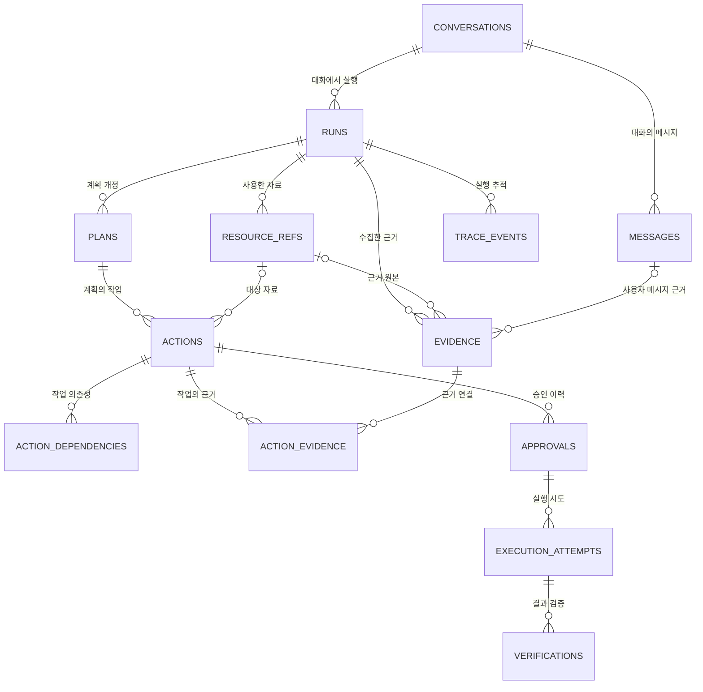

# 04. 도메인 · 데이터베이스 설계서

> **Authority:** Domain aggregate·persistent fact·transaction/invariant semantics. Lifecycle command/guard는 `Domain State Transition Contract`, repository placement는 `16`이 소유한다.

## 0. 문서 정보

| 항목 | 내용 |
| --- | --- |
| 문서명 | 04. mcp-work-agent 도메인 · 데이터베이스 설계서 |
| 상태 | Draft v1.29 |
| 기준일 | 2026-09-07 |
| 대상 | P0 MVP |
| Database | SQLite |
| 저장 형태 | 하나의 제품 DB 파일 · Domain과 LangGraph Checkpoint 논리 분리 |

## 1. 목적과 범위

Domain의 영속 모델·관계·DB 불변조건과 Transaction 경계를 정의한다. lifecycle command·허용 source state·guard·transition은 `Domain State Transition Contract`, repository placement·naming은 `16 Repository Architecture`를 따른다.

| 이 문서가 정하는 것 | 이 문서에서 정하지 않는 것 |
| --- | --- |
| Conversation·Run·Plan·Action과 ResourceRef·Evidence의 영속 관계 | LangGraph Library Checkpoint Table 내부 Schema |
| Approval·Execution·Verification·Receipt·Trace·Audit의 저장 | Tool별 Arguments JSON과 Provider Request·Response 상세 Schema |
| SQLite DDL·Connection 설정·Index·조건부 갱신 | Vector DB·Embedding Index |
| 동시성·멱등성·Pagination·N+1 방지·Batch 조회 경계 | Experiment Result 저장소 |
| Migration·Backup·Restore·보존 정책의 persistence realization | lifecycle 전이와 Graph Node·Edge 설계 |

## 2. 최종 설계 결정

| ID | 결정 | 이유 |
| --- | --- | --- |
| DB-001 | P0는 SQLite 파일 하나를 사용 | Domain과 Checkpoint를 한 번에 Backup·Restore하며 단일 사용자 부하에 충분하다. |
| DB-002 | Domain과 Checkpoint는 논리적으로 분리 | Checkpoint는 Workflow 재개, Domain은 승인·실행 사실의 기준점이다. |
| DB-003 | Connector Sidebar 목록·Local API continuation·Provider browse batch는 React Client Session Cache | 외부 Provider 원본 전체를 로컬에 복제하지 않으며, 탐색 cache는 Domain 사실이 아니다. |
| DB-004 | 실제 사용 Resource와 최소 Evidence만 저장 | 대화 복구·승인 근거를 유지하면서 원문 보존을 최소화한다. |
| DB-005 | 핵심 관계·상태는 정규화 | Join·Constraint·상태 전이를 DB에서 검증한다. |
| DB-006 | 가변 Arguments와 불변 Snapshot은 JSON | Tool별 구조 변화와 승인 당시 값을 보존한다. |
| DB-007 | 외부 호출과 DB Transaction 분리 | MCP·LLM 외부 호출 중 SQLite Write Lock을 유지하지 않는다. |
| DB-008 | Optimistic Lock + 짧은 BEGIN IMMEDIATE | 분산 Lock 없이 REST Command Retry·브라우저 새로고침·중복 클릭·복합 작업 경쟁을 차단한다. |
| DB-009 | Local Keyset Cursor와 Connector Provider continuation 분리 | 각 저장소와 Connector Provider의 Pagination 계약을 혼용하지 않는다. P0 Google Page Token은 이 일반 계약의 첫 구현이다. |
| DB-010 | Aggregate 단위 Batch 조회 | N+1을 막되 거대한 Join의 Row 곱집합은 피한다. |

## 3. 저장 위치와 소유권

### 3.0 Local API와 상태 기준점

| 항목 | 경계 |
| --- | --- |
| 상태 기준 | 승인·실행·검증·복구의 durable fact는 Domain Store가 기준이다. React Client State와 SSE Event는 화면 Projection이다. |
| API 접근 | FastAPI Route는 Repository SQL을 직접 실행하지 않고 Application use-case boundary를 호출한다. |
| 재전송과 동시 갱신 | 같은 Command 재전송은 Command Receipt의 `command_id + canonical request hash`, mutable Aggregate 갱신 경쟁은 `expected_version`으로 판정한다. 외부 Write 중복 방지는 별도의 Approval Snapshot·Action Version·Idempotency Key 계약을 따른다. |
| SSE 연결 유실 | Domain 상태를 변경하지 않으며 재연결 후 REST Query로 현재 상태를 복원한다. |
| Domain과 Checkpoint | 같은 SQLite 파일을 공유해도 logical ownership은 분리한다. Domain Repository가 Checkpoint row를 aggregate persistence로 노출하지 않는다. |
| Agent 간 공유 | 같은 Run의 Agent는 하나의 Run·Conversation·`langgraph_thread_id`를 공유한다. Agent별 DB·Approval·Attempt를 만들지 않는다. |

### 3.1 저장 위치

```
%LOCALAPPDATA%/GoogleWorkAgent/
├─ data/
│  └─ google_work_agent.db
├─ backups/
│  ├─ pre-migration-<timestamp>.db
│  └─ manifest.json
├─ settings/
│  └─ app-settings.json
└─ logs/
   └─ sanitized-*.log
```

### 3.2 데이터별 저장소

| 데이터 | 기준 저장소 |
| --- | --- |
| Conversation·Run·Plan·Action | SQLite Domain Table |
| Approval·Execution·Verification | SQLite Domain Table |
| Command Receipt | SQLite Domain Table (`command_receipts` durable idempotency/replay authority) |
| Workflow Handoff | SQLite Application-control Table (`workflow_handoffs`; Domain lifecycle authority가 아닌 crash-safe outbox) |
| LangGraph State·Interrupt | 같은 SQLite 파일의 Library 관리 Table |
| Connector Sidebar 목록·Local API continuation·Gmail/Tasks/Calendar/GitHub Issue materialized browse cache | React Client Session Cache |
| Agent 검색 중간 후보·전체 원문 | 현재 Run 메모리 |
| Gmail 첨부파일 bytes | SQLite 비저장. 사용자 다운로드는 Stream, 발신은 짧은 TTL의 Local Attachment Staging |
| 실제 사용 Resource·Evidence excerpt | SQLite Domain Table |
| Google Refresh Token | Domain/SQLite 비저장. 09/10의 OS Keyring lifecycle 소비 |
| Google Access Token | Domain/SQLite 비저장. Connector MCP Credential Provider process memory only |
| LLM API Key | Domain/SQLite 비저장. 09/10의 `KEYRING \| SESSION_ONLY` lifecycle 소비 |
| UI 비밀 아닌 설정 | app-settings.json |
| Experiment Raw Result | 제품 DB와 분리된 Artifact |

Domain DB에 저장하지 않는 검색 중간 자료는 다음과 같다.

- Query candidate·Page Token·RAG candidate·대용량 원문은 05/06의 owner-local cache/state에 둔다. Domain DB의 두 번째 workflow truth로 만들지 않는다.
- Raw Provider continuation/token·Provider query·MCP arguments·Prompt scratch·whole Sidebar cache는 Domain DB에 저장하지 않는다. Secret도 Domain/SQLite에 저장하지 않는다.

## 4. 도메인 경계와 Aggregate

### 4.1 Conversation Aggregate

**Aggregate Root:** `Conversation` — `Conversation`, `Message`, `Run`으로 구성한다.

| 항목 | 불변조건 |
| --- | --- |
| Actor attribution | Conversation의 `account_id`는 로컬 세션으로 인증된 사용자 attribution이다. 기존 Google account ID를 보존하고, Google 미연결 시 `local-workspace`를 사용한다. Provider 계정이나 Credential을 생성·위조하지 않는다. |
| Google Account와의 관계 | `conversations.account_id`와 `approvals.approved_by_account_id`는 non-null local actor attribution이며 `google_accounts` Foreign Key가 아니다. |
| Connector 접근 | 선택 Resource의 Provider account는 해당 Connector의 signed handle·current credential/resource identity 검증을 따른다. Conversation actor를 Provider account와 비교하거나, Google actor와 GitHub account가 같아야 한다는 전역 조건으로 사용하지 않는다. |
| 대화 목록 | 현재 계정의 기존 대화와 로컬 대화를 함께 조회한다. 계정 연결 후에도 로컬 대화를 유지하고 다른 Google 계정의 목록은 자동으로 합치지 않는다. 선택 Resource는 API의 session-bound handle/current Connector account 검증을 통과해야 한다. |
| Open Run | Conversation당 `finished_at_ms IS NULL`인 Run은 최대 1개다. |
| Message | Conversation에 속하고 선택적으로 Run을 참조한다. |

`0022_local_conversation_actor` forward Migration의 변경 범위는 Conversation·Approval의 Google Account 필수 FK 제거뿐이다. Approval의 non-null actor, Action FK, snapshot/hash, version, Claim·Attempt 경계는 유지한다.

### 4.2 Planning Aggregate

**Aggregate Root:** `Plan` — `Plan`, `Action`, `ActionDependency`, `ActionEvidence`로 구성한다.

| 항목 | 불변조건 |
| --- | --- |
| Revision | 같은 Run 안에서 1부터 증가한다. |
| Plan 교체 시 Commit | current published Plan을 `SUPERSEDED`로 바꾸는 UoW는 해당 Plan Action의 모든 `ACTIVE` Approval을 먼저 `REVOKED`로 만든다. Approval revoke와 Plan supersession은 같은 Transaction에서 commit한다. |
| 교체된 Plan | `SUPERSEDED` Plan 아래에 `ACTIVE` Approval이 남을 수 없다. 해당 Action/Approval은 조회 가능한 history일 뿐 새 Approval·Attempt·Write authority가 아니다. |
| Child mutation·Claim | owning Plan이 current published Plan이고 `Plan.status=WAITING_APPROVAL`인지 함께 검증한다. |
| Action Position | Plan 안에서 유일하다. |
| Evidence | 모든 실행 가능한 Action은 최소 1개 Evidence를 가진다. |
| Dependency | 자기 참조를 금지하고 DAG를 유지한다. Cycle 생성·검사는 deterministic Planning Application operation `planning.build_dependencies`와 `planning.validate_plan`이 수행한다. Domain은 published Plan의 aggregate invariant만 guard한다. |

### 4.3 Execution Aggregate

**Aggregate Root:** `Action` — `Approval`, `ExecutionAttempt`, `Verification`을 포함한다.

| 항목 | 불변조건 |
| --- | --- |
| Action 수정 | `version`을 증가시킨다. |
| Approval | Action당 ACTIVE Approval은 최대 1개다. |
| Attempt | Approval당 CLAIMED·EXECUTING·UNKNOWN_RESULT Attempt는 최대 1개다. |
| Claim 전제 | Approval Snapshot과 Domain `arguments_hash`가 현재 Action과 일치해야 한다. owning Plan은 current published Plan(`WAITING_APPROVAL`)이고 Run은 Claim을 허용하는 `WAITING_APPROVAL \| VERIFYING`이어야 한다. |
| Claim의 불충분 조건 | `Action=APPROVED + Approval=ACTIVE`만으로는 Claim할 수 없다. |
| Verification | 모든 성공 Write Attempt는 Effect별 결정적 Verification으로 종료한다. CREATE·UPDATE는 GET 비교, DELETE는 대상 부재/삭제 상태 확인, SEND는 Sent 결과 조회를 사용한다. |

Domain `arguments_hash`는 `07`의 `approval_arguments_hash`에 해당한다.

### 4.4 Evidence Aggregate

`ResourceRef`는 Run에서 실제로 사용한 Connector Resource의 최소 참조다. `Evidence`는 Action 판단과 승인 설명에 필요한 최소 excerpt다. 둘 다 Connector 원본의 복제본이 아니다.

| 항목 | 저장 의미 |
| --- | --- |
| Connector 식별 | `actions.connector_id`와 `resource_refs.connector_id`를 영속한다. |
| Resource identity | `connector_id + resource_type + resource_id`로 식별한다. Run별 저장 유일성은 §8.3을 따른다. |
| `resource_id` | Connector Provider가 부여한 external resource identifier를 저장하는 canonical persistence field다. |
| `ResourceRef.resource_type` | 해당 Resource를 만든/선택한 current `SignedToolRegistryEntryV1.resource_type`을 exact-copy한다. Google Workspace와 GitHub를 포함한 현재 등록 Connector 범위에 닫혀 있다. |
| Row 생성 범위 | 모든 Registry resource가 반드시 ResourceRef row를 요구하지는 않는다. |

저장되는 ResourceRef를 별도 family enum으로 변환하지 않는다. `THREAD|MESSAGE|EVENT` 또는 `EMAIL|TASK|CALENDAR`를 별도의 persistence vocabulary로 두지 않는다. 신규 Connector/Resource Type의 영속 constraint 확장은 concern-owned Tool/Registry 계약과 새 forward migration으로 보강하며 적용 Migration을 소급 수정하지 않는다.

### 4.5 Observability

| 데이터 | 목적 |
| --- | --- |
| `TraceEvent` | 개발·성능·장애 진단 |
| `AuditEvent` | 정책 확인·승인·수정·거절·차단·실행·검증의 안전 기록 |

Trace는 owning Run과 같은 보존 기간을 사용하며 독립된 fixed 30-day authority를 두지 않는다. 보존·삭제 기준은 §20에 둔다. Audit는 더 긴 보존을 위해 Domain Foreign Key 없이 최소 식별자만 저장한다.

## 5. Entity와 Value Object

| 분류 | 구성 |
| --- | --- |
| Entity | Conversation, Message, Run, Plan, Action, ResourceRef, Evidence, Approval, ExecutionAttempt, Verification, CommandReceipt, GoogleAccount |
| Join Entity | ActionDependency, ActionEvidence |
| Append Event | TraceEvent, AuditEvent |
| Value Object | CanonicalArguments, ArgumentsHash, SourceSnapshot, PolicyConfirmationReceiptV1, IdempotencyKey, RecoveryContextV1, RecoveryFingerprint, Cursor, RunBudget, VerificationDiff |

`GoogleAccount`는 Google Connector connection record이며 Conversation actor의 필수 parent나 다른 Connector account authority가 아니다.

### 5.1 ID와 시간

- Domain ID는 Application이 생성한 UUID 문자열을 사용한다.
- `trace_events`, `audit_events`만 순차 읽기 효율을 위해 INTEGER PRIMARY KEY를 사용한다.
- 모든 시간은 UTC Epoch Millisecond INTEGER로 저장한다.
- Timezone 변환은 Application·UI에서 수행한다.

## 6. ERD



## 7. P0 Table 목록

| 영역 | Table | 역할 |
| --- | --- | --- |
| Migration | schema_migrations | Version·Checksum·적용 시각 |
| Account | google_accounts | Google 계정 식별, Credential 비저장 |
| Conversation | conversations | 대화 Timeline의 영속 Root |
| Conversation | messages | 사용자·Agent Text |
| Run | runs | Agent 실행과 Runtime·Budget |
| Planning | plans | Plan Revision |
| Planning | actions | Tool Action 현재 상태 |
| Planning | action_dependencies | Action DAG Edge |
| Context | resource_refs | 사용된 Connector Resource 최소 참조 |
| Context | evidence | 최소 근거 excerpt |
| Context | action_evidence | Action·Evidence 다대다 관계 |
| Approval | approvals | 승인 Revision·Snapshot·Hash |
| Execution | execution_attempts | Retry·UNKNOWN_RESULT |
| Verification | verifications | GET expected·actual·diff |
| Observability | trace_events | Run Trace |
| Command | command_receipts | 상태 변경 Command의 durable request identity·적용 결과·replay adjudication |
| Workflow Control | workflow_handoffs | committed Domain/user control → background continuation durable outbox; typed one-shot control payload와 target binding |
| Audit | audit_events | Append-only 안전 기록 |

## 8. 핵심 Table 설계

### 8.1 runs

| 필드·조건 | 의미 |
| --- | --- |
| `entry_mode` | AGENT_SEARCH 또는 RESOURCE_SELECTED |
| `requested_mode` | 새 Run은 `LOCAL_GPU \| API_LLM`. StartRun UoW에서 저장하는 immutable snapshot이며 same-Run restart/resume의 durable authority다. |
| `status` | Workflow의 현재 단계 |
| `langgraph_thread_id` | Checkpoint 재개 Key |
| `budget_json` | 호출 수·Token·Retry·시간 상한 Snapshot |
| `default_github_repository_json` | Migration 0021로 추가된 legacy immutable snapshot. 기존 Run history/resume 해석에만 사용하며, 새 Run의 접근 allowlist나 WRITE target authority로 사용하지 않는다. 기존 row는 다시 쓰지 않는다. |
| `version` | 낙관적 상태 전이 |
| `finished_at_ms IS NULL` | Open Run |

기존 `AUTO` row는 과거 실행 해석과 안전한 resume compatibility를 위해 보존한다. history rewrite, process-local runtime mode 또는 user preference로 기존 `runs.requested_mode`를 덮어쓰지 않는다.

Partial UNIQUE Index로 Conversation당 Open Run 하나를 보장한다.

### 8.2 plans와 actions

| 저장 대상 | 방식 |
| --- | --- |
| Plan 수정 | 기존 Revision을 덮어쓰지 않고 새 `revision_no`를 추가한다. |
| Action 현재 Arguments | `arguments_json` |
| 승인 대상 Hash | `arguments_hash` |
| 실행 후 기대값 | `expected_json` |
| Action 변경 이력 | P0에서 별도의 전체 Revision Table을 만들지 않는다. 승인 당시 불변값은 Approval Snapshot, 변경 사실은 Audit로 보존한다. |

#### Review freshness와 결과 저장

Action의 arguments/source/policy/tool-schema binding이 바뀌는 modify/retry/expired-refresh는 기존 Approval을 재활성화하지 않고 Review freshness를 `REQUIRED`로 reset한다. 이전 Review PASS를 current Plan/Action revision에 자동 승계하지 않는다.

fresh Review 결과의 유일한 writer는 Application persistence operation **`plan.record_review_result`**다. 06 Review가 결정적으로 검증한 `PlanReviewResultV2`를 현재 Plan/Action revision에 조건부 기록하며, 새 Domain lifecycle command가 아니다.

`RecordReviewResultCommandV1`의 최소 입력:

```text
command_id, plan_id, expected_plan_version
review_artifact_id, review_version, disposition, based_on_action_versions
```

| 판정 | 저장·Gate 동작 |
| --- | --- |
| Version 일치 | 현재 Plan version과 각 bound Action version이 모두 일치할 때만 Repository UoW가 결과를 기록한다. disposition은 입력과 동일한 값으로 durable 저장한다. |
| Current `PASS` | `disposition=PASS`인 current result만 review gate를 `PASSED`로 연다. |
| 그 외 disposition | `REVISE`, `RETRIEVE_MORE`, `ROUTE_RECONSIDERATION`, `CONFIRM`, `BLOCK`은 current disposition으로 저장하지만 Approval 가능 gate는 열지 않는다. |
| Review 중 수정 | Modify/retry/expired-refresh로 Plan/Action revision이 바뀌면 조건부 write는 conflict로 실패한다. stale PASS는 durable authority가 아니다. |

이 operation은 Approval 생성·Action status 전이·lifecycle guard를 직접 수행하지 않는다. `ApproveAction`이 durable current PASS fact를 읽어 기존 Domain guard를 집행한다. Workflow/FastAPI의 직접 DB 수정과 SQL trigger의 Review 의미 생성은 금지한다. Review disposition 생성·routing은 `06`이 소유한다.

### 8.3 resource_refs와 evidence

| 항목 | 저장 규칙 |
| --- | --- |
| 일반 Retrieval | Action Row를 만들지 않는다. Run-scoped ResourceRef/Evidence와 bounded cache/reference separation만 persistence 대상으로 다룬다. |
| 원문·Sidebar Cache | Connector Provider 전체 원문과 Sidebar Cache는 Domain DB에 저장하지 않는다. |
| `selection_handle` | Local API/Application의 ephemeral authenticated wire identity이며 DB row가 아니다. `RESOURCE_SELECTED` StartRun에서 handle 검증이 끝난 identity만 같은 StartRun UoW 안에 최소 `ResourceRef`로 materialize한다. |
| 저장 유일성 | 동일 `(run_id, connector_id, resource_type, resource_id)`는 한 번만 저장한다. `source` 같은 pre-connector 분류를 uniqueness key로 다시 사용하지 않는다. |
| 비Resource 조회 | FreeBusy 같은 전체 응답을 ResourceRef로 저장하지 않는다. Derived Evidence에 필요한 결과만 보존한다. |
| `version_token` | Provider version/etag/history/update 의미를 해당 Connector MCP Server Adapter가 정규화한다. Google Workspace 예시는 Gmail history/internal date, Google ETag·updated다. |

`ToolRoutePlanV2.input_plan.input_routes`/Query/Read/RAG의 의미는 05/06을 따른다.

### 8.4 approvals

Approval은 Action 현재값과 분리된 승인 이력이다.

| 필드 | 의미 |
| --- | --- |
| `approval_no` | Action 내 승인 순번 |
| `action_version` | 승인된 Action Version |
| `status` | ACTIVE·EXPIRED·CONSUMED·REVOKED |
| `arguments_snapshot_json` | 승인 당시 Arguments |
| `source_snapshot_json` | 관련 Resource ID·Version Token 목록 |
| `idempotency_key` | 한 Approval 실행 문맥 |
| `recovery_fingerprint` | Connector Write 응답 유실·결과 불명 시 동일 외부 Effect의 기존 결과 후보 탐색 |

같은 Action Version도 Approval 만료 후 다시 승인할 수 있으므로 `(action_id, action_version)` UNIQUE는 사용하지 않는다. 대신 Action당 ACTIVE Approval 하나만 허용한다.

#### 정책 확인 Receipt

`SCOPE_EXPANSION_REQUIRED`, `DUPLICATE_OVERRIDE_REQUIRED`, `CONFLICT_OVERRIDE_REQUIRED`처럼 별도 사용자 확인이 필요한 결정은 `PolicyConfirmationReceiptV1`로 고정한다.

| 항목 | 규칙 |
| --- | --- |
| Receipt 보존 | Receipt 원문용 새 Table을 만들지 않는다. LangGraph Checkpoint의 Typed State와 append-only `audit_events`로 보존한다. |
| Approval 결합 | Write Action에 필요한 승인형 Receipt의 ID·결정 Context Hash를 Approval Snapshot JSON에 포함한다. |
| 누락·불일치 | 필요한 Receipt가 없거나 현재 Action/Evidence/Route와 Context Hash가 맞지 않으면 Approval/Claim을 허용하지 않는다. |
| 저장 구조 | 기존 JSON Snapshot/Audit Event를 사용하므로 이 기능 자체는 별도 Migration을 요구하지 않는다. |

실제 MCP Dispatch Payload의 `execution_arguments_hash`는 Claim 발급 시점의 전송 무결성 값이다. Domain DB에 별도 영속 Column을 추가하지 않으며, 첨부파일 bytes도 Domain DB에 저장하지 않는다.

### 8.5 execution_attempts와 verifications

#### 재시도와 결과 보존

| 항목 | 규칙 |
| --- | --- |
| Write `FAILED` 재시도 | `PrepareWriteRetry: FAILED → MODIFIED` 후 Review/Domain Validation을 다시 통과하고 새 Approval을 만든다. 기존 Approval·Idempotency Key·Attempt를 재사용하지 않는다. |
| 새 Attempt identity | 새 Approval의 고유 `approval_id`로 새 `idempotency_key`를 만든다. 첫 `ExecutionAttempt.attempt_no`는 1이다. |
| 동시 Attempt | 한 Approval에 실행 중·결과 불명 Attempt는 동시에 하나만 존재한다. |
| `UNKNOWN_RESULT` | 해결 전 새 Approval·새 Write Attempt·새 Write를 만들지 않는다. |
| 성공 Write | Effect별 하나 이상의 Verification을 가진다. |

#### 전달 확실성

`delivery_certainty`는 **`execution_attempts.response_metadata_json.delivery_certainty`**에 영속한다.

```text
NOT_SENT | MAY_HAVE_BEEN_SENT | SENT_RESPONSE_LOST
```

`error_detail_json`은 오류 상세용이며 전달 확실성의 기준점으로 사용하지 않는다. 별도 Column은 추가하지 않는다.

**`BeginExecutionAttempt(applied=true)` commit은 dispatch-intent uncertainty cut이다.** 이 commit 뒤 결과 저장 전에 process loss가 발생하면 실제 Connector callable 진입 여부를 추측하지 않고 `MAY_HAVE_BEEN_SENT`로 보수적으로 reconcile한다.

`NOT_SENT`를 기록할 수 있는 경우는 Begin 전 실패 또는 live Connector/MCP boundary가 provider dispatch 0을 명시적으로 증명한 경우뿐이다. 추가 `DISPATCH_STARTED` column/marker는 만들지 않는다.

#### Process-loss reconciliation용 영속 사실

새 table/status 대신 existing durable facts를 phase marker로 사용한다. Repository projection `ExecutionReconciliationCandidateV1`의 closed kinds는 다음과 같다.

| Kind | 후보 조건 |
| --- | --- |
| `POST_BEGIN_ORPHAN` | Attempt=`EXECUTING` + APPLIED Begin receipt + terminal dispatch result 없음 |
| `UNKNOWN_RESULT_UNRESOLVED` | Action/Attempt=`UNKNOWN_RESULT` + matching active RecoveryContext 없음 |
| `EXECUTED_AWAITING_VERIFICATION` | Action=`EXECUTED` + Verification 미완료 |
| `FAILED_AWAITING_CONTINUATION` | reconciliation의 deterministic `ResolveAsFailed` Receipt가 있고, current cancel intent 또는 다른 approved/executable Action 때문에 automatic continuation이 필요함 |

stable FAILED user-decision/retry wait는 후보에서 제외한다. 이 projection은 **startup-only Application reconciliation**에서만 소비하며 current live worker ownership을 판단하는 lease가 아니다.

각 state-changing sub-command는 다음 deterministic identity를 사용한다.

```text
base = system:execution-attempt-reconcile:<execution_attempt_id>
```

| Identity | 기존 Command·용도 |
| --- | --- |
| base | `MarkUnknownResult` replay identity |
| base + `:recover-existing` | `RecoverExistingResult` replay identity |
| base + `:resolve-failed` | `ResolveAsFailed` replay identity |
| base + `:require-recovery` | `RequireRecovery` replay identity |
| base + `:begin-verification` | `BeginVerification` replay identity |
| base + `:resolve-recovery-recheck` | `ResolveRecovery(RECHECK)` replay identity |
| `system:execution-attempt-reconcile:<execution_attempt_id>:verification` | Verification continuation의 WorkflowHandoff trigger |
| `...:post-failed` | resolved-failed automatic continuation의 WorkflowHandoff trigger |

Handoff trigger로 continuation을 dedupe한다. `MarkUnknownResult`/`RecoverExistingResult`/`BeginVerification` 중 어느 commit 뒤에 crash가 나도 durable state 또는 staged handoff로 다음 startup phase를 결정한다.

#### Legacy READ 호환 저장

expired/retry/legacy READ 관련 command가 current State Contract에서 유효할 때 Repository UoW는 `expected_version`, immutable prior Approval/Receipt, review freshness reset, append-only Audit를 보존한다.

legacy/compatibility READ Plan/Action은 Approval·ExecutionAttempt·Verification Row를 생성하지 않는다. 새 Release Retrieval은 이 compatibility path를 사용하지 않는다. 허용 command와 전이는 State Contract를 따르며 이 절에서 추가하지 않는다.

### 8.6 Command Receipt durable persistence

`CommandReceipt`는 HTTP 캐시나 Audit 대체물이 아니라 **Domain DB의 durable idempotency record**다.

최소 논리 필드:

```
command_id            # unique command identity
command_type
request_hash           # server-computed canonical request hash
aggregate_id
received_at
status                 # RECEIVED | APPLIED | REJECTED
response_summary       # replay 가능한 결정적 Command 결과 요약
```

| 상황 | 필수 DB 동작 |
| --- | --- |
| 같은 ID·같은 Hash | `command_id`가 가리키는 저장된 `APPLIED \| REJECTED` 결과를 replay한다. |
| 같은 ID·다른 Hash | 기존 Receipt의 status/result를 덮어쓰지 않고 conflict로 거부한다. Domain mutation은 0건이다. 11 Observability가 요구하는 hash-mismatch 보안 Audit은 별도 append-only event로 기록할 수 있다. |
| 신규 Command | `RECEIVED` 예약, Guard 판정, 허용된 Domain mutation, 필수 Audit, 최종 `APPLIED \| REJECTED` 결과를 §10.0의 같은 짧은 Transaction에 저장한다. |
| 신규 Command 거절 | Guard/Version/State 때문에 적용되지 않은 **신규 command_id**도 결정적 `REJECTED` 결과를 남긴다. 같은 ID·같은 Hash를 미래의 다른 상태에서 재평가하지 않는다. |
| Commit 상태 | `RECEIVED`는 Transaction 안의 중간 상태다. 정상 commit 결과는 `APPLIED \| REJECTED`여야 한다. |
| 비정상 저장 | committed `RECEIVED`만 남거나 Domain mutation에 최종 Receipt가 없으면 정상 성공이 아니다. Startup/Recovery는 추측 적용하지 않고 fail-closed reconcile한다. |

Audit Event 또는 in-memory dedupe만으로 Command Receipt를 대체하지 않는다.

`command_receipts.aggregate_id`는 여러 Aggregate Command를 포괄하는 논리 상관관계 값이지 범용 FK가 아니다. StartRun처럼 대상 Row 생성과 같은 Transaction에서 identity가 확정될 수 있으므로 polymorphic hard FK를 임의 추가하지 않는다.

현재 적용 Schema에 이 durable relation이 없으면 **forward migration이 필요한 Domain DB schema blocker**다. 적용된 과거 Migration을 소급 수정하지 않는다.

### 8.7 `workflow_handoffs` — Domain commit → background execution durable outbox

`workflow_handoffs`는 Domain Aggregate가 아니라 **same-Run Application/Workflow control persistence**다. 이 절은 durable fact와 DB invariant를 정의한다. Workflow target/precedence는 `06`, typed Port·wire operation은 `07`, startup/live driving order는 `10`을 따른다.

최소 logical fields:

```text
handoff_id                 TEXT PRIMARY KEY
trigger_command_id          TEXT NOT NULL
run_id                      TEXT NOT NULL
langgraph_thread_id         TEXT NOT NULL
graph_profile               TEXT NOT NULL
graph_version               TEXT NOT NULL
requested_mode              TEXT NOT NULL
execution_kind              START | RESUME
resume_target_json          JSON nullable for START only
checkpoint_id               TEXT nullable for START
checkpoint_generation       INTEGER NOT NULL >= 0
run_sequence                INTEGER NOT NULL >= 1
control_kind                NONE | CONFIRMATION_RESPONSE | CONTEXT_ADJUSTMENT | RETRIEVAL_CACHE_RESTART
control_payload_json        bounded canonical JSON or null
control_payload_hash        nullable SHA-256
status                      PENDING | DISPATCHED | CONSUMED | BLOCKED_BINDING | SUPERSEDED
last_submit_reason          nullable non-ACCEPTED submit reason
execution_admission_json    nullable canonical WorkflowExecutionAdmissionV1
applied_checkpoint_id       TEXT nullable
applied_checkpoint_generation INTEGER nullable
created_at_ms
dispatched_at_ms?
consumed_at_ms?
superseded_at_ms?
version                     optimistic integer
```

| 항목 | Persistence invariant |
| --- | --- |
| 원자 Commit | continuation이 필요한 owning mutation은 CommandReceipt/Audit와 `PENDING` handoff stage를 같은 UoW에서 commit한다. Handoff stage 실패 시 lifecycle mutation도 commit하지 않는다. |
| Trigger 재사용 | `trigger_command_id` replay는 같은 durable handoff identity를 재사용한다. 같은 command identity에 두 control payload authority를 만들지 않는다. |
| Commit 순서 | `run_sequence`는 server-owned same-Run commit order다. `UNIQUE(run_id, run_sequence)`로 방어하며 `CONSUMED\|SUPERSEDED`만 settled다. |
| Control payload | non-NONE payload는 unconsumed row에서 hash와 함께 durable해야 한다. settled row의 body를 지워도 historical `control_kind/hash`는 보존한다. |
| Execution admission | worker visibility 전에 admission과 `expected_run_version`이 durable해야 한다. claim/release/settlement는 handoff optimistic version과 owning Run authority epoch를 조건부로 검사한다. stale admitted NORMAL row가 lower-sequence head로 부활하면 안 된다. |
| Checkpoint 근거 | command-time observed checkpoint/binding과 applied checkpoint evidence는 restart 후 exact replay/reconciliation을 판정할 만큼 durable해야 한다. `active_handoff_id/run_sequence` lineage의 release semantics는 06/07을 따른다. |
| Cancel·terminal supersession | durable execution admission이 없는 obsolete unconsumed row만 same-UoW에서 retire한다. 이미 admission이 있는 row의 stale authority는 admission settlement fence로 처리한다. |
| `BLOCKED_BINDING` | 데이터 손실이나 임의 latest-checkpoint 선택으로 해소하지 않는다. Recovery orchestration은 06/07/10을 따른다. |

### 8.8 Retrieval revision readable authority

`RetrievalResultV1.meta.revision`의 Application-readable authority는 Domain row나 Plan revision이 아니다. LangGraph adapter가 successful Retrieval owner checkpoint와 함께 기록하는 **`RetrievalHeadV1` metadata**가 단일 readable authority다.

```text
RetrievalHeadV1(
  run_id, langgraph_thread_id, retrieval_revision,
  retrieval_artifact_id, checkpoint_id, checkpoint_generation
)
```

| 항목 | 규칙 |
| --- | --- |
| Application 조회 | Query/CAS는 `CheckpointPort.load_retrieval_head(run_id)`만 사용한다. Application이 `checkpoint_blob`을 deserialize하지 않는다. |
| Revision 비교 | `ContextPreviewResponseV1.retrieval_revision`과 `ContextAdjustmentRequestV1.expected_retrieval_revision`은 같은 `RetrievalHeadV1.retrieval_revision`을 사용한다. Plan revision/Run version으로 대체하지 않는다. |
| 원자 갱신 | successful new Retrieval revision의 checkpoint commit과 RetrievalHead 갱신은 같은 checkpointer transaction이다. restart 후 head를 복원해 stale CAS를 거부한다. |
| 의미 경계 | workflow projection metadata이며 Domain semantic fact가 아니다. 새 Domain lifecycle command를 만들지 않는다. |

## 9. 상태 영속화

아래 상태 값과 취소·복구 설명은 **persistence projection**이다. Command·허용 source state·guard·target state·next command는 `Domain State Transition Contract`를 따른다. 이 문서와 다르면 State Contract가 우선한다.

### 9.1 Run status persistence vocabulary

Run row는 다음 상태 값을 column/constraint/projection에서 보존한다.

```text
CREATED | ANALYZING | RETRIEVING | WAITING_CONFIRMATION | PLANNING | WAITING_APPROVAL |
EXECUTING | VERIFYING | CANCEL_REQUESTED | CANCELLED | REAUTH_REQUIRED | RECOVERY_REQUIRED |
COMPLETED | BLOCKED | FAILED
```

현재 Release 승인형 Write에서 Run `EXECUTING`을 사용하는지 등 lifecycle 의미는 State Contract가 결정한다.

### 9.2 Action status persistence vocabulary

Action row는 상태 식별자와 optimistic version, immutable execution/verification evidence를 보존한다.

```text
PROPOSED | MODIFIED | APPROVED | EXPIRED | EXECUTING | EXECUTED | UNKNOWN_RESULT | FAILED |
VERIFIED | MISMATCH | REJECTED | BLOCKED | CANCELLED | DEPENDENCY_BLOCKED
```

Repository는 Application/Domain command의 validated result만 조건부 UPDATE로 반영한다. 임의 SQL state setter를 제공하지 않는다. exact transition graph·terminal classification·Effect별 FAILED semantics는 State Contract를 따른다.

### 9.3 취소 상태 계약

| 항목 | Persistence 규칙 |
| --- | --- |
| Cancel intent | APPLIED `RequestCancel` Command Receipt가 restart 후 `cancel_intent_active`를 재구성하는 durable source다. checkpoint-only flag를 별도 authority로 두지 않는다. |
| 취소 정리 | pending Action terminalization, ACTIVE Approval revoke, Plan/Run terminal snapshot을 각각의 owning command transaction에서 원자적으로 보존한다. |
| 기존 실행 사실 | 확정된 execution/verification 사실을 취소 때문에 재작성하지 않는다. 성공한 external effect를 DB 변경으로 rollback한 것처럼 표현하지 않는다. |

`RequestCancel`·`CancelPendingAction`·`FinalizeCancel`·Recovery CANCEL의 guard와 in-flight 처리 순서는 State Contract를 따른다.

### 9.4 Verification MISMATCH Recovery 계약

| 항목 | Persistence 규칙 |
| --- | --- |
| Verification | append-only evidence로 남는다. 확정된 `MISMATCH` Action/Verification fact는 immutable하다. |
| Run 상태 | Action status로 암묵 재계산하지 않고 owning lifecycle command의 결과만 영속한다. |
| Recovery 결과 | 새 Plan revision 또는 terminal snapshot이 필요하면 기존 MISMATCH/Approval/Attempt/Verification fact를 덮어쓰지 않고 새 durable fact를 추가한다. |

`StoreVerification`, `RequireRecovery`, `ResolveRecovery`의 legality와 cancel intent 결합 시 허용 disposition은 State Contract를 따른다.

### 9.4-A RecoveryContext durable persistence

`RequireRecovery`가 적용되면 `RecoveryContextV1`을 restart-safe하게 저장한다.

| 최소 durable 의미 | 내용 |
| --- | --- |
| Recovery 구분 | `reason`, `scope` |
| 관련 실행 참조 | optional `action_id/execution_attempt_id/verification_id` |
| 이전 상태·재개 | `pre_recovery_status`, optional registered resume target |
| 대상 근거 | reason-specific target/reference fingerprint |
| 관측 근거 | observed external/verification/contract/checkpoint fingerprint |
| 재확인 입력 | `last_recheck_input_hash` |

물리 저장은 Run column 집합, owner-local recovery record, JSON snapshot 중 선택할 수 있다. **Checkpoint-only 또는 process-memory-only 저장은 금지**한다. `ResolveRecovery` handler는 이 durable context version과 current state로 reason/disposition legality와 `NO_PROGRESS`를 판정한다. 재개 위치는 Workflow/Checkpoint의 registered target을 사용하며 여기서 Node/Edge를 정의하지 않는다.

Terminal Recovery는 lifecycle owner가 요구하는 다음 coupled mutation을 원자화한다.

| Resolution | pending Action | ACTIVE Approval | current Plan | Run | Durable result·조건 |
| --- | --- | --- | --- | --- | --- |
| `ACCEPT_PARTIAL` | `CANCELLED` | `REVOKED` | `COMPLETED` | `COMPLETED` | `PARTIAL` |
| `CANCEL` | `CANCELLED` | `REVOKED` | `CANCELLED` | `CANCELLED` | 외부 mutation이 이미 관측됐으면 `PARTIAL`, 없으면 `CANCELLED` |
| `FAIL` | `BLOCKED` | `REVOKED` | `CANCELLED` | `FAILED` | unresolved external-delivery uncertainty가 없어야 함. result=`FAILED` |

기존 `VERIFIED | MISMATCH | FAILED | REJECTED | BLOCKED | CANCELLED | DEPENDENCY_BLOCKED` facts는 terminal cleanup에서 다른 결과로 재작성하지 않는다.

## 10. Transaction 경계

Connector/LLM 외부 호출 동안 SQLite Write Transaction을 유지하지 않는다. 호출 전 필요한 authority fact를 짧은 Transaction으로 commit하고, 호출 후 `expected_version`과 current lifecycle fact를 다시 검사해 결과를 조건부 저장한다. 두 Transaction 사이 authority가 바뀌면 성공을 추정하지 않는다.

### 10.0 Domain 상태 변경 Command의 공통 Receipt 원자성

아래 §10.1~§10.6의 Transaction은 모두 이 공통 prefix/suffix를 상속한다. 특정 절의 축약 그림에 Receipt가 생략되어 있어도 구현에서 생략할 수 없다.

```
BEGIN IMMEDIATE
→ 서버가 Canonical Request Hash 계산
→ command_id Receipt 조회·판정
   - 같은 command_id + 같은 hash: 저장된 기존 APPLIED/REJECTED Command Result 반환, Domain mutation 추가 0
   - 같은 command_id + 다른 hash: 기존 Receipt 불변 + CONFLICT, Domain mutation 0; 필요한 hash-mismatch Audit만 append
   - 신규 command_id: RECEIVED 예약
→ 기존 mutable Aggregate를 갱신하는 Command면 expected_version·허용 source state Guard 판정
   - Guard 통과: Domain mutation / child mutation → 필요한 Audit Event INSERT → Receipt APPLIED + Command Result 저장
   - Guard/State/Version 거절: Domain mutation 0 → 필요한 rejection Audit → Receipt REJECTED + deterministic rejection Result 저장
→ 최종 Receipt가 APPLIED | REJECTED인지 확인
→ COMMIT
```

- Receipt 판정은 Approval revoke, Plan cancel, Action mutation 같은 child mutation보다 먼저 수행한다.
- Receipt·Domain mutation·Audit는 하나의 Transaction으로 commit 또는 rollback한다.
- Transaction abstraction은 `UnitOfWork`, SQLite 구현은 `SqliteUnitOfWork`다. `ports/persistence/unit_of_work.py → UnitOfWork`와 `adapters/persistence/sqlite/unit_of_work.py → SqliteUnitOfWork`의 naming·placement는 16을 따르며, 이 문서는 atomicity invariant만 정한다.
- Browser가 제공한 `request_hash`, `approval_id`, `idempotency_key`, `source_snapshot`, actor metadata는 영속 권위로 신뢰하지 않는다. Canonical Request Hash와 권위 값은 서버가 현재 Domain 사실에서 계산·resolve한다.
- `applied=false` 또는 State/Version/Receipt conflict이면 외부 MCP Write를 호출하지 않는다.


### 10.0-A Domain lifecycle + handoff atomicity

Continuation-required external control handler는 owning lifecycle mutation을 적용하는 같은 `SqliteUnitOfWork` 안에서 `WorkflowHandoffRepository.stage_pending(...)`까지 완료한 뒤 commit한다. `run.schedule_run_execution`은 이 transaction **밖에서, commit 성공 후** `handoff_id`만 받아 submit한다. 따라서 외부 Connector/LLM I/O를 SQLite transaction 안에 넣지 않으면서도 `commit succeeded / schedule lost` 상태는 durable outbox로 복구한다.

`WorkflowExecutionPort.submit`의 post-commit 결과는 다음처럼 처리한다.

| Post-commit submit 결과 | Persistence 처리 |
| --- | --- |
| `ALREADY_RUNNING`, `SHUTTING_DOWN` | Domain transaction을 되돌리지 않고 handoff를 redrive 가능한 상태로 유지한다. |
| `BINDING_MISMATCH` | handoff를 `BLOCKED_BINDING`으로 만들고 Recovery reconciliation을 요구한다. |
| `NOT_COMMITTED` | architecture invariant violation이다. handoff는 `PENDING`으로 보존해 startup reconciliation이 재판정한다. |

### 10.1 Run 시작

```
BEGIN IMMEDIATE
→ §10.0 Receipt adjudication
→ Open Run 존재 확인
→ Run INSERT
→ User Message INSERT
→ WorkflowBinding INSERT
→ START WorkflowHandoff(PENDING) INSERT
→ Conversation updated_at 갱신
→ Audit INSERT
→ APPLIED Command Receipt + Command Result 저장
→ COMMIT
```

### 10.2 Plan Aggregate 저장

```
BEGIN IMMEDIATE
→ §10.0 Receipt + Run expected_version adjudication
→ Plan INSERT
→ Action Batch INSERT
→ Dependency Batch INSERT
→ ResourceRef·Evidence Batch INSERT
→ ActionEvidence Batch INSERT
→ Plan WAITING_APPROVAL + Run WAITING_APPROVAL
→ Audit INSERT
→ APPLIED Command Receipt + Command Result 저장
→ COMMIT
```

한 Row마다 Commit하지 않는다.

### 10.3 승인

```
BEGIN IMMEDIATE
→ §10.0 Receipt adjudication
→ Action status·version·arguments_hash 확인
→ Plan review gate PASSED + Source/Policy/Tool Schema 최신 Snapshot 확인
→ 기존 ACTIVE Approval 만료·취소
→ Approval INSERT
→ Action APPROVED + version 증가
→ Audit INSERT
→ APPLIED Command Receipt + Command Result 저장
→ COMMIT
```

### 10.4 실행권 Claim

```
BEGIN IMMEDIATE
→ §10.0 Receipt adjudication
→ durable cancel intent 없음 + Action APPROVED·version 조건부 UPDATE
→ ACTIVE Approval을 CONSUMED로 UPDATE
→ ExecutionAttempt CLAIMED INSERT
→ Audit INSERT
→ APPLIED Command Receipt + Command Result 저장
→ COMMIT
```

`ClaimExecution` COMMIT은 실행권을 획득한 사실만 확정하며 외부 Write dispatch authority가 아니다. Claim commit 이전 Provider/Connector Write는 0건이어야 한다.

Claim commit 뒤 Application은 승인 Snapshot과 final server dispatch arguments로 `ClaimContextV2`를 구성·검증한 다음 **별도 `BeginExecutionAttempt` Command/UoW**를 적용한다.

```text
ClaimExecution COMMIT
→ build ClaimContextV2 (DB Transaction 없음)
→ BEGIN IMMEDIATE
→ §10.0 BeginExecutionAttempt Receipt adjudication
→ current ExecutionAttempt CLAIMED + committed Approval/Claim binding + cancel intent 없음 확인
→ ExecutionAttempt CLAIMED → EXECUTING
→ EXECUTION_DISPATCH_STARTED Audit INSERT
→ APPLIED Command Receipt + Command Result 저장
→ COMMIT
```

**`BeginExecutionAttempt` COMMIT이 `applied=true`인 뒤에만** Connector MCP Write를 호출할 수 있다. 실패/충돌/취소 intent 감지 시 외부 Write는 0건이며 `current_status + next_allowed_commands`로 재조정한다.

**Pre-dispatch Claim 중단**

`AbortClaimedExecution`은 다음 owner guard 결과를 받아 Attempt/Action/Audit/Receipt를 한 Transaction으로 commit한다.

- current Attempt=`CLAIMED`, Action=`EXECUTING`
- matching consumed Approval/Claim
- APPLIED BeginExecutionAttempt receipt 없음

Provider/MCP I/O는 0이다. 정확한 transition semantics는 State Contract를 따른다.

### 10.5 외부 Write와 결과

```
BeginExecutionAttempt COMMIT(applied=true)
→ Connector MCP Write Tool 호출 → Connector MCP Server 내부 Provider Write
→ DB Transaction 없음
BEGIN IMMEDIATE
→ §10.0 Receipt adjudication
→ Result ResourceRef INSERT (성공/복구 결과가 Resource identity를 제공할 때)
→ Attempt SUCCEEDED | UNKNOWN_RESULT | FAILED
→ Action EXECUTED | UNKNOWN_RESULT | FAILED
→ delivery_certainty와 결과 근거 저장
→ Audit INSERT
→ APPLIED Command Receipt + Command Result 저장
→ COMMIT
```

현재 Google Workspace와 GitHub Connector는 같은 connector-neutral Domain/Application 경계를 사용하며, Domain/Application이 Provider API를 직접 호출한다는 의미가 아니다.

### 10.6 GET Verification

```
Connector MCP Verification Read → Connector MCP Server 내부 Provider Adapter
→ DB Transaction 없음
BEGIN IMMEDIATE
→ §10.0 Receipt adjudication
→ Verification append-only INSERT
→ Action VERIFIED 또는 MISMATCH
→ Audit INSERT
→ APPLIED Command Receipt + Command Result 저장
→ COMMIT
```

Action Verification 결과만으로 Run `status`를 암묵 재계산해 덮어쓰지 않는다. 첫 Write verification 진입은 `BeginVerification`, MISMATCH/불명 결과는 `RequireRecovery`, 정상 완료는 `CompleteWriteRun`, 취소 완료는 `FinalizeCancel`/`ResolveRecovery(CANCEL)` 같은 명시적 Run Domain Command가 전이시킨다.

`action_dependencies`에는 별도 dependency result/status를 저장하지 않는다. Verification COMMIT 뒤 다음 Action의 readiness는 **predecessor Action의 durable `VERIFIED` 상태를 read-only로 평가**한다. `StoreVerification`이 dependency row를 갱신하거나 새 dependency lifecycle/status authority를 만들지 않는다.

### 10.7 종료 결과와 최종 ASSISTANT Message

다음 Application handler는 terminal Domain transition과 함께 **정확히 하나의 final ASSISTANT Message**를 같은 UoW에 stage한다.

```text
CompleteAnswerOnlyRun
CompleteReadOnlyRun (legacy)
CompleteWriteRun
BlockRun
FinalizeCancel
ResolveRecovery(ACCEPT_PARTIAL|CANCEL|FAIL) (terminal)
```

Message는 새 lifecycle semantics가 아니라 terminal command의 required durable effect다.

| 항목 | 원자성·저장 조건 |
| --- | --- |
| Message 유일성 | applied terminal lifecycle receipt + run identity에 final ASSISTANT Message는 하나만 존재해야 한다. Command replay로 중복 생성하지 않는다. |
| 물리 구현 | 별도 `final`/`terminal_run_version` column 또는 receipt-linked uniqueness는 implementation choice다. 다른 문서가 별도 column 이름을 authority로 만들지 않는다. |
| 종료 결과 | `terminal_result_kind = SUCCESS \| PARTIAL \| BLOCKED \| FAILED \| CANCELLED`를 restart 후 Run Snapshot에서 복원할 수 있어야 한다. Run column 또는 terminal-result record로 저장할 수 있지만 Trace/SSE-only 값은 금지한다. |
| UoW 시작 전 | `TerminalAssistantMessageInputV1`의 content/result kind를 완성·검증한다. UoW 중 LLM/Connector 호출은 금지한다. |
| 실패 | required Audit 또는 Message stage가 실패하면 Receipt/Domain mutation까지 rollback한다. |
| Commit 이후 | Diagnostic Trace와 SSE Projection은 별도로 처리한다. Trace는 별도 short UoW에 기록할 수 있으며 Trace/SSE 실패가 committed Domain truth를 rollback하지 않는다. |

**경로별 저장 차이**

| 완료 경로 | 함께 저장할 사실·제약 |
| --- | --- |
| Answer-only | State Contract가 완료를 허용할 때 Plan/Action 없이 CommandReceipt + Run terminal mutation + required Audit + ASSISTANT Message를 하나의 Application UoW로 원자화한다. Open Write/UNKNOWN_RESULT가 있으면 completion writer는 fail closed한다. |
| Legacy READ | `CompleteReadOnlyRun` 적용 시 current Plan terminal mutation + Run terminal mutation + CommandReceipt + required Audit + final ASSISTANT Message + durable `terminal_result_kind`를 같은 short UoW로 commit한다. |

## 11. 동시성·Lock

### 11.1 적용

| 대상 | 전략 |
| --- | --- |
| Run | version 낙관적 Lock + Open Run Partial UNIQUE |
| Action | version 낙관적 Lock + changed_rows = 1 |
| ExecutionAttempt | version 낙관적 Lock + Active Attempt Partial UNIQUE |
| CommandReceipt | `command_id` UNIQUE + server canonical `request_hash` comparison + APPLIED/REJECTED stored-result replay |
| Plan | Revision Append |
| Approval | 승인 이력 Insert + ACTIVE 하나 Partial UNIQUE |
| Verification·Audit | Append-only |
| Migration·Restore·Purge | 짧은 전용 BEGIN IMMEDIATE |

`expected_version` 기반 조건부 UPDATE는 영향 Row 1개를 확인하고 mutable row version을 증가시킨다. stale write는 conflict로 거부한다.

### 11.2 사용하지 않음

- Redis·분산 Lock
- 장시간 비관적 Row Lock
- Connector MCP/Provider 외부 호출 중 SQLite Write Lock
- Python Lock만으로 정합성 보장

Process-local write serialization은 같은 Process의 쓰기 순서를 보조할 수 있지만 최종 정합성은 DB `UNIQUE`·`CHECK`·Foreign Key·Partial UNIQUE·executable Trigger/DB guard·version 조건부 UPDATE가 보장한다. Application semantic validator나 Process-local lock 하나만으로 cross-aggregate integrity를 대체하지 않는다.

## 12. 멱등성

### 12.1 Idempotency Key

Approval 생성 시 다음 Canonical 값으로 SHA-256을 생성한다.

```
account_id
approval_id
action_id
action_version
tool_name
canonical_arguments_hash
policy_version
tool_schema_version
```

`idempotency_key`는 **한 Approval 실행 문맥**에 고정된다. `FAILED → MODIFIED → 새 Approval` 재시도에서는 기존 Approval과 기존 Key를 재사용하지 않으며 새 Approval로 새 Key를 생성한다. 같은 Approval 안에서 `UNKNOWN_RESULT`를 해소하기 위한 조회/Verification은 새 Write가 아니므로 새 Idempotency Key를 만들지 않는다.

### 12.2 Recovery Fingerprint

Connector Provider가 공통 Idempotency Header를 제공한다고 가정하지 않는다. 응답 유실·`UNKNOWN_RESULT`에서는 Approval에 저장된 `recovery_fingerprint`로 **같은 Connector Effect 범위**의 기존 결과 후보만 찾는다. 서로 다른 Connector의 Resource/Effect가 같은 fingerprint 검색 공간에 섞이면 안 된다.

```
connector_id
Conversation actor identity  # 기존 Google account_id 또는 local-workspace; 접근 권한이 아님
Tool 유형 / Effect
대상 Resource identity(resource_type + resource_id), 존재하는 경우
정규화된 제목·핵심 시간/기한·수신자 집합 등 Effect별 business fingerprint
canonical_arguments_hash
```

CREATE처럼 사전 `resource_id`가 없는 Effect는 해당 항목을 생략하고 Effect별 business fingerprint로 후보를 좁힌다. Google 외 Connector에 별도 connector-account persistence가 필요해지면 기존 Google-specific account binding을 일반화하는 **새 forward migration**을 추가하며 적용 Migration을 소급 수정하지 않는다.

### 12.3 보장 범위

- REST Retry·브라우저 새로고침·중복 클릭·앱 재시작의 동일 Action 중복 실행 차단
- UNKNOWN_RESULT 확인 전 재실행 차단
- 서로 다른 Action으로 생성된 의미상 중복은 별도의 중복·충돌 Validator가 처리

## 13. DB Fetch Size·Batch·Disk I/O

04가 소유하는 것은 SQLite/Domain persistence I/O 단위다. Connector/API page size와 Agent detail-fetch budget은 05 Retrieval·07 Interface가 소유하며 이 문서에서 별도 숫자 authority를 만들지 않는다.

| 항목 | 제어 대상 |
| --- | --- |
| Cursor Fetch Size | SELECT 결과를 Python으로 전달하는 Row 묶음 |
| Write Batch Size | 한 Transaction에서 저장하는 Row 수 |
| SQLite Page Write | WAL·Transaction·Commit·DB Page와 Cache의 영향 |

Disk I/O는 Row별 Commit을 금지하고 Application UoW 단위 Batch Write로 줄인다.

P0 persistence defaults:

| 경로 | 초기값 |
| --- | --- |
| Conversation·Message Page | configured bounded page size |
| 내부 ID Batch Query | 최대 50개 |
| Plan·Action·Evidence Batch Write | 최대 50 Row |
| Trace·Audit Export Fetch | 200 Row |

## 14. Local DB Pagination

Conversation·Message·Run·Audit은 `(timestamp_ms, id)` Keyset Cursor를 사용한다.

```sql
SELECT id, title, updated_at_ms
FROM conversations
WHERE account_id IN (:account_id, 'local-workspace')
  AND (
       updated_at_ms < :cursor_time
       OR (updated_at_ms = :cursor_time AND id < :cursor_id)
  )
ORDER BY updated_at_ms DESC, id DESC
LIMIT :limit;
```

Cursor 외부 표현은 Version·Time·ID JSON을 URL-safe Base64로 인코딩하며 DB에 저장하지 않는다. Connector continuation/Provider page token과 이 Local DB cursor는 서로 다른 authority다. Connector pagination과 Retrieval query progression은 05/07을 참조한다.

## 15. N+1 방지

### 15.1 DB

SQL JOIN, CTE, `WHERE id IN (...)`, 고정 개수 Batch Query를 사용하며 ORM-specific fetch 전략을 canonical contract로 만들지 않는다.

| Plan 화면 조회 | 최대 SQL 수 |
| --- | --- |
| Plan + Actions | 1 |
| Dependencies | 1 |
| Evidence + ActionEvidence | 1 |
| Approval + 최신 Attempt | 1 |
| Verification | 1 |
| 전체 Plan Bundle | 최대 5 |

Action×Evidence×Attempt×Verification을 하나의 거대한 Join으로 합쳐 Row 곱집합을 만들지 않는다.

### 15.2 Connector Provider read N+1 boundary

```text
Sidebar 목록 batch
→ Metadata 표시
→ 항목별 상세 자동 조회 금지
→ 클릭·선택한 Resource만 상세 조회
```

복수 선택 상세 조회는 **Application-level bounded batch responsibility**로 처리한다. Provider가 개별 상세 Endpoint만 제공해 concrete Adapter 내부 HTTP 호출이 여러 번 필요하더라도 중복 제거, 제한된 동시성, 메모리 재사용, 후보 수 상한을 적용한다. 구체 Port method와 MCP Tool ID는 `07 Interface`, repository 배치 문법은 `16 Repository Architecture`가 소유한다.

## 16. Persistence repository capability boundary

04가 요구하는 Repository 책임은 method 이름이 아니라 다음 persistence capability다. 구현은 16의 owner-local naming·placement·single-authority 문법을 따른다.

- Conversation/Message keyset page read
- Run snapshot read
- Plan aggregate bundle read/write
- Recovery candidate bounded read
- command receipt + expected-version conditional mutation
- Approval/Claim/ExecutionAttempt/Verification atomic persistence
- Evidence/ResourceRef bounded persistence
- retention purge UoW

Connector read/write Port는 07 Interface concern이며 이 문서가 별도 `MCP * Port` 또는 method name을 정의하지 않는다.

## 17. Index 원칙

- 실제 WHERE·JOIN·ORDER BY와 Query Plan을 기준으로 생성한다.
- Conversation·Message·Run·Audit는 Keyset 정렬 복합 Index를 가진다.
- Open Run, ACTIVE Approval, Active Attempt는 Partial UNIQUE Index를 가진다.
- Recovery 상태는 Partial Index로 빠르게 조회한다.
- Dependency 역방향, Evidence Origin, Join Table 역방향 조회 Index를 둔다.
- 사용하지 않는 Column과 Index를 미리 대량 생성하지 않는다.

## 18. SQLite Runtime Config

```
foreign_keys = ON
journal_mode = WAL
synchronous = FULL
busy_timeout = 5000ms
```

- 모든 Connection은 하나의 초기화 함수를 사용한다.
- `SQLITE_BUSY`는 5초 대기 후 상위 Use Case에서 최대 1회만 재시도한다.
- 승인·실행권 Claim Commit 유실은 중복 Connector Write 위험이 있으므로 P0 기본은 FULL이다.
- 실제 성능 측정 없이 NORMAL로 낮추지 않는다.

## 19. Migration·Backup·Restore

### 19.1 Migration

1. 앱 Schema Version과 DB Version 비교
2. Migration 필요 시 SQLite Backup API로 사전 Backup
3. Migration별 Transaction 실행
4. `schema_migrations`에 Version·Checksum 기록
5. `PRAGMA quick_check`
6. `PRAGMA foreign_key_check`
7. 실패 시 Safe Mode

SQLAlchemy·Alembic은 P0 고정 기술로 강제하지 않는다. 명시적 SQL Migration과 Checksum을 기준으로 하며 Adapter 선택은 구현 단계에서 결정한다.

**Migration과 설계 계약의 구분**

- Migration version/checksum은 이 문서 버전과 별개의 실행 계약이다. SQL Migration은 persistent invariant를 구현하는 artifact이며 독립 설계 authority가 아니다.
- required `CHECK/UNIQUE/FK/partial UNIQUE/trigger/conditional-update` 의미와 실패 조건은 이 문서의 invariant contract를 따른다. SQL syntax와 migration ordering은 implementation realization이다.
- 적용 Migration이 required invariant를 충족하지 않으면 `FORWARD_NUMERIC_MIGRATION_REQUIRED`로 처리한다. 다음 numeric forward migration으로 보강하고 과거 migration bytes는 변경하지 않는다.

Migration 실행·startup ordering·operational DB configuration은 10, Repository/Adapter의 ownership·naming·placement·dependency는 16, 구현 준수 검증은 12와 State Transition Test Matrix를 따른다.

**Command Receipt migration realization requirement:** 모든 **Domain Aggregate 상태 변경 lifecycle Command**는 durable `command_receipts`를 요구한다. non-Domain operational command는 07의 별도 replay authority를 사용한다. 구현 시 discovered migration set에서 relation과 필수 uniqueness/request-hash/result persistence가 존재하는지 확인하고, 없으면 다음 사용 가능한 numeric 순번의 **새 forward migration**을 추가한다. 이미 적용된 migration은 번호와 무관하게 소급 수정하지 않는다. 의미 권위는 이 문서와 State Transition Contract이며 migration 번호는 implementation history다.

### 19.2 Backup

- Migration 전 자동 Backup
- 사용자 수동 Backup
- Backup SHA-256·App Version·Schema Version을 DB 외부 Manifest에 기록
- CI Restore Test
- P0에는 백그라운드 정기 Scheduler를 추가하지 않는다.

### 19.3 Restore

1. Domain·Connector Write 차단
2. 현재 DB를 별도 이름으로 보존
3. 사용자가 Backup 선택
4. 새 파일로 복원
5. Schema Version·quick_check·foreign_key_check
6. 통과 시 정상 모드

## 20. 보존과 삭제

01-B의 P0 retention matrix를 persistence에 다음처럼 exact realization한다. `retention_days` 기본은 30, P0 유효 범위는 **1..30**이며 이 절이 별도 정책 상한을 만들지 않는다.

| 대상 | cutoff 기준 | `retention_days` | 보호/삭제 규칙 |
| --- | --- | --- | --- |
| Terminal Run + Plan·Action·Approval·ExecutionAttempt·Verification·ResourceRef·Evidence·Trace | owning Run `finished_at_ms` | 적용 | Run이 terminal이고 active Recovery/Reauth/Verification가 없을 때만 child-first purge |
| LangGraph Checkpoint | owning terminal Run cutoff | owning Run과 동일 | resume/recovery 가능성이 남아 있으면 Run보다 먼저 삭제 금지 |
| Command Receipt | owning Aggregate retention/replay window | 직접 적용하지 않음 | owning Aggregate와 replay 판정이 남아 있는 동안 선행 purge 금지; eligible aggregate purge UoW 안에서 receipt ordering 보장 |
| Message | `created_at_ms` | 적용 | 연결된 retained/open Run의 재구성에 필요한 Message는 보호 |
| Conversation | `updated_at_ms` | 적용 | open Run=0이고 retained Message/Run child=0일 때만 parent 삭제 |
| Audit | Audit timestamp | **고정 90일** | `retention_days` 영향 없음; 업무 원문 없이 최소 식별·상태만 보존 |
| Connector Sidebar Cache | UI session | 미적용 | 세션 종료 시 폐기 |
| Secret | 09/10 credential lifecycle | 미적용 | Domain/SQLite에 저장하지 않음 |

`RetentionRepository.purge_batch(cutoffs, batch_limit)`의 `cutoffs`는 Application `PurgeRetentionHandler`가 persisted `retention_days`와 위 category rules로 계산한 typed cutoff set만 받는다. 구현자가 임의 target list를 만들지 않는다.

```text
Run child/Checkpoint/Receipt eligibility 확정
→ Run
→ eligible Message
→ child가 0인 Conversation
```

Foreign Key/replay invariant를 깨지 않는다. nonterminal Run과 그 owning Conversation, unresolved Recovery/Reauth, current replay에 필요한 Receipt는 항상 보호한다.

모든 Table에 `deleted_at`을 일괄 추가하지 않는다. 사용자 명시 Conversation 삭제는 같은 child-first 규칙으로 실제 삭제하고 Audit에는 업무 원문 없이 최소 ID만 남긴다.

## 21. P0 보류

- SQLCipher·Column Encryption
- Domain DB·Checkpoint DB 물리 분리
- Vector Index·Embedding Cache
- Local Full-text Search
- Remote Sync·Multi-user Tenant
- Distributed Lock
- Read Replica
- 대규모 Archive·자동 Vacuum 고도화

## 22. Required persistent enforcement contract

아래는 구현자가 반드시 SQLite final defense로 실현해야 하는 **설계 invariant**다. SQL 문법 자체는 구현 세부지만 enforcement class와 실패 의미는 선택사항이 아니다.

| Invariant ID | Required invariant | Required DB final defense | Failure meaning |
| --- | --- | --- | --- |
| `DBI-001` | Conversation당 Open Run 최대 1개 | partial `UNIQUE` | concurrent StartRun 중 하나만 commit |
| `DBI-002` | Action당 `ACTIVE` Approval 최대 1개 | partial `UNIQUE` | stale/duplicate approval insert reject |
| `DBI-003` | Approval당 active ExecutionAttempt 최대 1개 | partial `UNIQUE` | duplicate Claim/Attempt reject |
| `DBI-004` | `command_id`는 durable unique이며 request hash/result를 immutable replay | `UNIQUE` + same-transaction receipt adjudication | same id/different hash conflict; mutation 0 |
| `DBI-005` | Plan/Action/Approval/Attempt/Verification/Evidence/ResourceRef는 owning aggregate FK를 벗어나지 않음 | `FK` + required ownership trigger where a single FK cannot express cross-aggregate equality | cross-run/cross-plan child write reject |
| `DBI-006` | Action dependency self-edge 금지, `(plan_id, position)` unique | `CHECK` + `UNIQUE` | invalid DAG edge/position reject; full cycle detection remains deterministic Application validator |
| `DBI-007` | current Plan/Action revision과 bind되지 않은 Review PASS는 approval gate를 열 수 없음 | versioned conditional write + durable review-gate fields; DB constraint/trigger prevents impossible gate values | stale Review result conflict |
| `DBI-008` | ResourceRef canonical identity = `(run_id, connector_id, resource_type, resource_id)` | connector-aware `UNIQUE` | duplicate/cross-connector identity ambiguity reject |
| `DBI-009` | P0 persisted Action/ResourceRef connector identity는 registered `connector_id`를 가짐 | `NOT NULL/CHECK/FK` as schema allows | ownerless connector row reject |
| `DBI-010` | Claim commit은 Approval consume + Attempt CLAIMED + Action EXECUTING을 한 Transaction으로 완료 | conditional UPDATE + FK/UNIQUE + transaction | partial claim state rollback |
| `DBI-011` | `UNKNOWN_RESULT` unresolved 동안 새 Attempt/Write authority 생성 금지 | Domain guard + conditional DB write/trigger final defense | blind resend/new attempt reject |
| `DBI-012` | required Audit/Receipt와 Domain mutation은 하나의 short transaction | transaction/UoW; external I/O excluded | half-commit rollback |
| `DBI-013` | `SUPERSEDED` Plan은 child execution authority를 가질 수 없음: ACTIVE Approval 0, new child lifecycle mutation/Claim 0 | supersession UoW의 Approval revoke-before-Plan-update + parent-Plan conditional write/trigger final defense | stale old-Plan approval/claim reject; Attempt/Write 0 |

Migration implementation은 위 ID를 test trace로 연결한다. 이미 적용된 migration이 부족하면 다음 numeric forward migration으로 보강하고, 과거 migration bytes는 변경하지 않는다. 10은 discovery/order/checksum, 16은 placement/naming, 12는 실제 enforcement regression을 소유한다.

## 23. 테스트 완료 조건

| 검증 항목 | 완료 조건 |
| --- | --- |
| Schema 무결성 | 새 SQLite 파일에 Schema를 적용할 수 있고 `quick_check = ok`, Foreign Key 위반 0건이다. |
| 동시 생성 방어 | Conversation당 Open Run 2개, Action당 ACTIVE Approval 2개, Approval당 Active Attempt 2개 생성을 차단한다. |
| Receipt 영속·Replay | 앱 재시작 후 `command_receipts`를 보존한다. 같은 `command_id + request_hash`는 기존 결과를 replay하고 Domain/Audit 추가 변경은 0건이다. |
| Hash conflict | 같은 `command_id`에 다른 `request_hash`가 오면 기존 Receipt를 덮어쓰지 않고 conflict로 차단한다. |
| 원자성 | Receipt 예약·Domain mutation·필수 Audit·APPLIED 결과 확정 중 하나라도 실패하면 같은 Transaction을 rollback해 반쪽 적용을 남기지 않는다. |
| Claim 경쟁 | 동일 Action 실행권 Claim 경쟁에서 1개만 성공한다. |
| `UNKNOWN_RESULT` | 해결 전 새 Approval·새 Attempt·새 Write를 차단한다. |
| Write FAILED retry | 새 Approval·새 Idempotency Key·새 `attempt_id`를 사용하고 새 Approval의 첫 `attempt_no = 1`이다. |
| 미해결 FAILED | Write FAILED가 남아 있으면 `CompleteWriteRun`과 dependent Action terminalization을 차단한다. |
| 전달 확실성 | `delivery_certainty`를 `execution_attempts.response_metadata_json.delivery_certainty`에 보존하고 오류 상세와 혼용하지 않는다. |
| 조회 비용 | Plan Bundle 조회가 정해진 Query Budget을 넘지 않는다. Google 목록의 visible page 조회 뒤 같은 page 모든 항목의 상세 자동 호출이 발생하지 않는다. |
| Migration 실패 | 원본 DB와 Backup을 보존하고 Safe Mode로 전환한다. |
