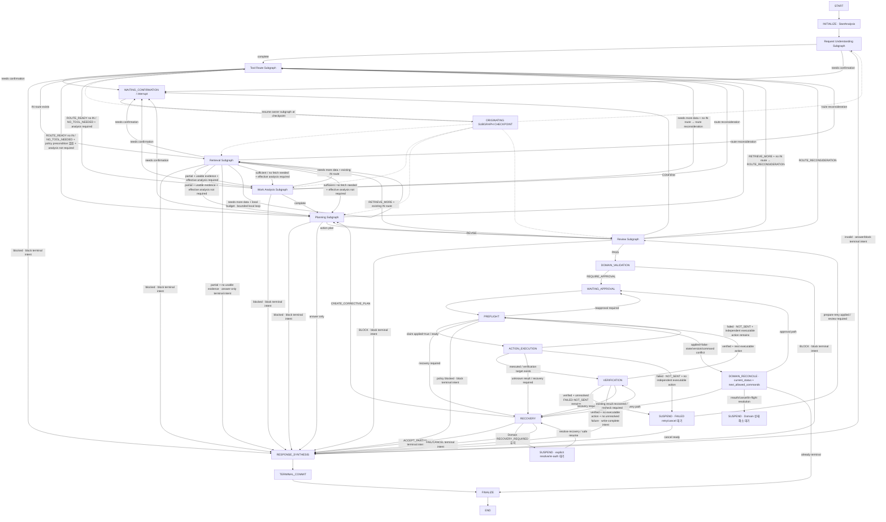

# 06. Agent · Workflow 설계서

> **Authority:** Agent·Workflow runtime topology, State projection, Node/Edge/Interrupt와 registered continuation semantics. Domain lifecycle은 State Contract, Retrieval은 `05`, typed interface는 `07`을 따른다.  
> **상태:** Draft v7.28 · **기준일:** 2026-08-24 · **DB Schema:** v1.9 · **대상:** P0 MVP

## 0. 먼저 이해할 것

- **Main Graph:** 전체 Run의 순서·분기·Interrupt·Back-edge를 결정하는 결정적 LangGraph Supervisor다.
- **Main State:** 다음 단계가 재사용해야 하는 확정된 Versioned Typed Result만 누적한다.
- **Agent Subgraph:** 하나의 전문 책임을 수행하는 LangGraph다. 내부에 여러 LLM·Deterministic Node와 Local State를 가질 수 있다.
- **Subgraph Local State:** 해당 invocation의 작업 메모리다. Parent에 자동 승계되지 않는다.
- **Node Input Projection:** Node가 실제로 필요한 State 필드만 전달한다. 모든 Node가 전체 State를 보지 않는다.
- **Schema:** Node·Subgraph가 만들 수 있는 구조와 닫힌 값을 통제한다.
- **Prompt:** 선택된 Node가 지금 해야 할 한 가지 판단·작성 작업만 지시한다.
- **Edge:** Node Result와 공식 State를 기준으로 코드가 결정한다. LLM 자유 텍스트가 다음 Node를 선택하지 않는다.
- **Tool Route:** IN에서 어떤 Connector·Resource·Read Tool을 사용할지, OUT으로 어떤 Connector·Resource·Effect·Tool을 사용할지 한 번 결정해 Main State에 저장한다. Downstream Agent는 재선택하지 않는다. P0 첫 Connector는 Google Workspace다.
- **Write:** 어떤 Agent Subgraph도 직접 실행하지 않는다.

## 1. Main LangGraph

### 1.1 Current baseline flow



### 1.1-A 전역 Domain 상태 오버레이

Main Graph의 업무 Edge와 별개로 다음 Domain 상태는 현재 안전 checkpoint 위에 전역적으로 적용한다. 모든 Node에서 같은 선을 반복해서 그리지 않는다.

- `REAUTH_REQUIRED`: Retrieval·Approval/Preflight·Verification·Recovery 등 Connector 접근 중 Credential 갱신이 실패하면 현재 checkpoint와 in-flight 사실을 보존하고 suspend한다. suspend 시 동일 Run의 `RegisteredResumeTargetRefV2 + langgraph_thread_id + checkpoint identity`를 저장한다. `ResumeAfterReauth`는 active Resume Target Registry의 `graph_version`과 owner/target을 검증한 뒤 **등록된 같은 안전 target**으로만 복귀하며, stale/unknown target은 추측 resume하지 않고 Recovery로 fail closed한다. 이미 dispatch된 Write를 재전송하지 않는다.


Main-control resume target closed mapping:

```text
Retrieval / Agent semantic node credential failure
→ AGENT_NODE target (same semantic owner + profile-resolved compiled subgraph + exact node)

Run=WAITING_APPROVAL
+ current WRITE Attempt가 EXECUTING/UNKNOWN_RESULT/EXECUTED-awaiting-verification이 아님
+ BeginExecutionAttempt 전 PREFLIGHT credential failure
→ MAIN_CONTROL:PREFLIGHT

Run=WAITING_APPROVAL
+ current WRITE Attempt가 EXECUTING이거나 delivery certainty가 불명확
→ PREFLIGHT resume 금지
→ delivery certainty / existing-result reconciliation
→ durable EXECUTED이면 MAIN_CONTROL:VERIFICATION
→ UNKNOWN_RESULT 또는 여전히 불명확하면 MAIN_CONTROL:RECOVERY

Run=EXECUTING
+ Legacy READ Action=EXECUTING
+ ExecutionAttempt row 없음
+ AUTH_EXPIRED
→ MAIN_CONTROL:READ_EXECUTION
→ OAuth 완료 후 같은 READ Action을 non-mutating read boundary에서 재개

Run=VERIFYING / Verification read credential failure
→ MAIN_CONTROL:VERIFICATION

Run=RECOVERY_REQUIRED / Recovery lookup credential failure
→ MAIN_CONTROL:RECOVERY

Run=CANCEL_REQUESTED
→ resume target is the safe stage already required to settle the in-flight fact (VERIFICATION or RECOVERY), never generic execution replay
```

Current `MainResumeStageIdV1` is exactly `RETRIEVAL_ENTRY | PLANNING_ENTRY | REVIEW_ENTRY | PREFLIGHT | READ_EXECUTION | VERIFICATION | RECOVERY | CANCEL_RESOLUTION`. `INITIALIZE`, `DOMAIN_VALIDATION`, `ACTION_EXECUTION`, `RESPONSE_SYNTHESIS`, `TERMINAL_COMMIT`, `FINALIZE` are not resume targets. `RETRIEVAL_ENTRY/PLANNING_ENTRY/REVIEW_ENTRY/CANCEL_RESOLUTION` are deterministic external-control re-entry stages, not new Agents. `PREFLIGHT` is the canonical approved-action execution entry and may also be a Reauth return target when its child-fact guard is valid; it is not Reauth-only. `READ_EXECUTION` remains legacy/compatibility READ-only control only.

- `CANCEL_REQUESTED`: Claim 전이면 미실행 Action·Approval을 정리하고 `FinalizeCancel`로 닫을 수 있다. Claim 이후 in-flight Action이 있으면 신규 Claim·Write만 차단하고 `EXECUTED | UNKNOWN_RESULT | FAILED` 결과를 먼저 확정한다. `EXECUTED`는 Verification, `UNKNOWN_RESULT`는 Recovery를 거친다. Recovery 중 cancel intent가 활성인 경우 `CREATE_CORRECTIVE_PLAN`·일반 `ACCEPT_PARTIAL → COMPLETED`는 금지하고, terminal snapshot이 되면 `ResolveRecovery(CANCEL)` 또는 Verification 복귀 후 `FinalizeCancel`로 닫는다.
- `RECOVERY`: Workflow phase는 `Action.UNKNOWN_RESULT`의 bounded existing-result lookup을 먼저 수행할 수 있다. 이 자동 lookup 동안 Run이 아직 `WAITING_APPROVAL | CANCEL_REQUESTED`이면 새 Write 없이 결과만 판별하고, 결과가 끝내 불명확하거나 명시적 recovery reason이 발생한 경우에만 `RequireRecovery(reason)`으로 Domain Run을 `RECOVERY_REQUIRED`에 둔다. 이미 `RECOVERY_REQUIRED`인 경우 Recovery Node는 **처리·routing·suspend/resume orchestration**만 담당하며 등록된 `ResolveRecovery` 결과를 소비한다. Domain lifecycle semantics는 State Transition Contract가 소유한다.
- `BLOCKED`: Claim 전 `BlockRun`이 실제 적용된 경우만 Terminal이다. in-flight Write가 존재하는 동안 정책·보안 문제가 새로 발견되어도 기존 실행 사실을 `BLOCKED`로 덮어쓰지 않는다.

### 1.1-B FINALIZE 계약

`FINALIZE`는 임의의 Run 상태 변경 Node가 아니다. **Terminal lifecycle handler의 UoW가 Run terminal mutation + final ASSISTANT Message + required Audit를 이미 commit한 뒤**, FINALIZE는 diagnostic Trace emit과 SSE Projection publish만 orchestration하는 마지막 Main Graph 단계다. FINALIZE가 Message를 다시 INSERT하거나 Domain status를 변경하지 않는다.

```
Answer-only·처리 불가 안내 → RESPONSE_SYNTHESIS → TERMINAL_COMMIT(CompleteAnswerOnlyRun) → COMPLETED → FINALIZE
Policy block              → deterministic blocked response → TERMINAL_COMMIT(BlockRun) → BLOCKED → FINALIZE
Write 정상 완료           → RESPONSE_SYNTHESIS → TERMINAL_COMMIT(CompleteWriteRun) → COMPLETED → FINALIZE
Cancel 완료               → deterministic cancel response → TERMINAL_COMMIT(FinalizeCancel) → CANCELLED → FINALIZE
Recovery 실패             → deterministic failure response → TERMINAL_COMMIT(ResolveRecovery(FAIL)) → FAILED → FINALIZE
Recovery 부분 수용        → RESPONSE_SYNTHESIS → TERMINAL_COMMIT(ResolveRecovery(ACCEPT_PARTIAL)) → COMPLETED → FINALIZE
```

`RESPONSE_SYNTHESIS`의 단일 책임은 terminal command 전에 `TerminalAssistantMessageInputV1`을 만드는 것이다. Answer-only는 Planning의 검증된 `AnswerDraftV2`, Write는 persisted Plan/Action/Verification Result, Recovery/Cancel/Block은 typed reason/result만 입력으로 사용한다. P0에서 이 단계는 **deterministic Application formatting**이며 새 LLM call을 하지 않는다. Run status·Policy·Approval·Execution·Verification 결과를 결정하거나 변경하지 않는다. `BLOCKED | CANCELLED | FAILED`의 result kind와 reason code는 deterministic input으로 고정되며 Prompt가 바꿀 수 없다.

`TERMINAL_COMMIT`은 `TerminalCommitIntentV1.kind`를 closed dispatch하여 정확히 하나의 기존 lifecycle handler(`CompleteAnswerOnlyRun | CompleteReadOnlyRun(legacy) | CompleteWriteRun | BlockRun | FinalizeCancel | terminal ResolveRecovery`)만 호출한다. 각 handler가 Receipt + Domain terminal mutation + final ASSISTANT Message + required Audit를 같은 UoW로 commit한다. `TERMINAL_COMMIT` 자체는 새 Domain semantics를 만들지 않고, unknown kind/status/version은 fail closed한다. API에서 terminal `ResolveRecovery`가 이미 같은 atomic contract로 commit된 뒤 Graph가 resume된 경우에는 terminal snapshot + final Message 존재를 확인하고 중복 command를 호출하지 않는다.

`FINALIZE` runtime adapter는 `adapters/langgraph/main/nodes/finalize_node.py` 하나이며 terminal snapshot을 확인한 뒤 `trace_event.emit_trace_event`와 `sse_event.project_run_event`를 호출하고 END로 간다. 둘의 실패는 Domain rollback이나 Connector 재실행을 만들지 않는다.

Run이 `WAITING_APPROVAL | VERIFYING | REAUTH_REQUIRED | RECOVERY_REQUIRED | CANCEL_REQUESTED` 같은 비Terminal 상태인데 대응 Domain Command가 적용되지 않았다면 `FINALIZE → END`로 진행하지 않고 suspend한다. `Request.INVALID`처럼 사용자에게 실행 불가를 설명하고 끝내는 비정책 경로는 `CompleteAnswerOnlyRun`으로 닫으며, Policy 위반은 `BlockRun`을 사용한다.


### 1.1-C External-control handoff target matrix

External HTTP control과 deterministic stale-preflight refresh처럼 background continuation이 필요한 Application lifecycle path는 Domain commit 뒤 LangGraph를 직접 호출하지 않는다. 07의 durable `WorkflowHandoffV1`을 통해 아래 **closed target matrix**를 사용한다.

| Applied control | Continuation classification | Exact registered target / behavior | Typed control |
| --- | --- | --- | --- |
| Confirmation | RESUME_BACKGROUND | saved originating `AGENT_NODE` target | `ConfirmationResumeControlV1` |
| Context Adjustment `EXCLUDE_EVIDENCE` | RESUME_BACKGROUND | `MAIN_CONTROL:RETRIEVAL_ENTRY` → fresh/frozen-route Retrieval → exclusion applied at `retrieval.select_evidence` | `ContextAdjustmentControlV1` |
| Context Adjustment `RETRIEVE_MORE` | RESUME_BACKGROUND | `MAIN_CONTROL:RETRIEVAL_ENTRY` → `retrieval.plan_query` with bounded user need | `ContextAdjustmentControlV1` |
| ApproveAction | RESUME_BACKGROUND | `MAIN_CONTROL:PREFLIGHT` | none |
| ModifyAction | RESUME_BACKGROUND | `MAIN_CONTROL:REVIEW_ENTRY` → Review begins at `review.inspect_goal_and_evidence` over current persisted Plan/Action | none |
| PrepareWriteRetry | RESUME_BACKGROUND | `MAIN_CONTROL:REVIEW_ENTRY` → full current-plan Review before new approval | none |
| RefreshExpiredAction | RESUME_BACKGROUND | `MAIN_CONTROL:REVIEW_ENTRY` → stale approval refresh commit 뒤 current persisted Plan/Action의 fresh Review; new Approval 전 PASS 필요 | none |
| RejectAction | RESUME_BACKGROUND | `MAIN_CONTROL:PREFLIGHT`; stage deterministically chooses next independent executable Action or all-final terminal synthesis/commit | none |
| Reauth completed | RESUME_BACKGROUND | exact target stored by `RequireReauth`, after `ResumeAfterReauth(applied=true)` | none |
| Recovery `RECHECK` | conditional | reason-specific matrix below; `NO_PROGRESS` = STAY_SUSPENDED | none |
| Recovery `CREATE_CORRECTIVE_PLAN` | RESUME_BACKGROUND | `MAIN_CONTROL:PLANNING_ENTRY` | none |
| Recovery `ACCEPT_PARTIAL | CANCEL | FAIL` | TERMINAL_NO_RESUME | Domain terminal commit result is projected; no background business continuation | none |
| `SAFE_CHECKPOINT_RESUME` | RESUME_BACKGROUND | exact validated target from current checkpoint/binding; matrix-forbidden state rejects with invocation 0 | none |
| RequestCancel | RESUME_BACKGROUND or Application bootstrap settlement | checkpoint가 있으면 `MAIN_CONTROL:CANCEL_RESOLUTION`; `CREATED + first checkpoint 없음`이면 새 RESUME row 0; START admission 전(PENDING|BLOCKED_BINDING)은 Graphless SUPERSEDED settlement, admission 후(DISPATCHED+admission)는 admission checkpoint 뒤 cancel-intent gate가 CANCEL_RESOLUTION로 전환 | none |

Deterministic stage semantics:

- `RETRIEVAL_ENTRY`: verifies current Run can enter/re-enter Retrieval, applies existing `BeginRetrieval` when source status requires it, then starts Retrieval from frozen current input routes. For user adjustment, control kind determines exclusion-vs-bounded-need behavior; it never invents a new route.
- `PLANNING_ENTRY`: enters current Planning subgraph through the existing deterministic `planning.choose_answer_or_action_from_route` entry operation; no synthetic resume node is created.
- `REVIEW_ENTRY`: `ModifyAction | PrepareWriteRetry | RefreshExpiredAction`의 current persisted Plan/Action을 대상으로 current Review subgraph의 runtime node `review.inspect_goal_and_evidence`에 진입한 뒤 registered Review node chain을 따라 aggregate/validate한다. `RefreshExpiredAction`이 stale preflight에서 발생해도 direct Review call이 아니라 같은 durable handoff target을 사용한다.
- `CANCEL_RESOLUTION`: deterministic main-control node that calls `run.continue_cancel_resolution`; it coordinates only existing `CancelPendingAction/FailReadAction/CompleteReadAction/FinalizeReadAction/BeginVerification/Recovery/FinalizeCancel` contracts and creates no new lifecycle transition.

Recovery RECHECK exact continuation:

```text
UNKNOWN_RESULT          → MAIN_CONTROL:RECOVERY; recovered EXECUTED routes to VERIFICATION, resolved FAILED reconciles to PREFLIGHT or decision suspend
VERIFICATION_MISMATCH   → MAIN_CONTROL:VERIFICATION
CHECKPOINT_MISMATCH     → validated RecoveryContext.registered_resume_target; invalid remains RECOVERY_REQUIRED
CONTRACT_VIOLATION      → validated RecoveryContext.registered_resume_target/pre_recovery target; invalid remains RECOVERY_REQUIRED
NO_PROGRESS             → no handoff / remain suspended
CREATE_CORRECTIVE_PLAN  → MAIN_CONTROL:PLANNING_ENTRY
```

### 1.1-D One-shot control application

`WorkflowControlEnvelopeV1`은 Main State history가 아니라 **한 번 적용되는 external-control input**이다. Workflow가 소유하는 불변조건은 다음이다.

- Background continuation은 durable handoff/admission을 통해서만 시작하고 API/Application이 LangGraph를 직접 invoke하지 않는다. Persistence CAS와 repository method shape는 `04/07`이 소유한다.
- Control patch는 resumed owner I/O보다 먼저 checkpoint에 materialize된다. `EXCLUDE_EVIDENCE`는 `RetrievalState.exclusion_obligation_segment_ids`, `RETRIEVE_MORE`는 `RetrievalState.pending_user_retrieval_need`에 typed fact를 남긴다. Payload가 이후 clear되어도 이 checkpoint fact는 restart-safe하다.
- 동일 handoff가 이미 적용된 checkpoint를 재개할 때 control payload를 다시 주입하지 않는다. Crash 후 owner Node/read/LLM은 idempotent하게 replay될 수 있지만 external control injection과 Write authority는 중복되지 않는다.
- descendant checkpoint는 active handoff lineage를 release boundary까지 이어서 same continuation의 restart 위치를 식별한다. Exact persisted fields와 admission settlement fence는 `04/07`을 따른다.
- raw HTTP request, `interrupt_id`, checkpoint metadata, registered resume-target metadata는 Product Prompt input이 아니다.

Same-Run ordering, admission/release result codes, supersession race, startup/live reconciliation algorithm은 이 절에서 복제하지 않는다. `04`의 durable invariant, `07`의 interface contract, `10`의 process lifecycle을 소비한다.

### 1.2 Main Supervisor 불변조건

- Supervisor는 **Workflow Controller**이며 업무 의미·Tool Argument·계획 내용을 생성하지 않는다.
- Agent는 다른 Agent/Subgraph를 직접 호출하지 않는다. 필요한 다음 단계는 Typed Disposition으로 Parent에 반환한다.
- 모든 Subgraph Result/Disposition은 Supervisor Router에서 정확히 하나의 다음 Edge 또는 Terminal/Interrupt 경로를 가진다. 정의되지 않은 Enum·Version·Disposition은 fail-closed로 처리하며 추측 Routing을 금지한다. bounded Schema Repair로 정상화되지 않는 unknown contract 결과는 다음 Agent로 보내거나 FINALIZE하지 않고 `RequireRecovery(CONTRACT_VIOLATION)`로 Run을 `RECOVERY_REQUIRED`에 두며, 복구 불가가 확정된 경우에만 `ResolveRecovery(FAIL) → FAILED`로 닫는다.
- `WAITING_CONFIRMATION`은 공통 Router가 아니라 LangGraph interrupt 경계다. 공식 `NEEDS_CONFIRMATION`을 받으면 Application이 먼저 Domain `RequestConfirmation`을 적용한다. pre-publish owner는 `ANALYZING | RETRIEVING | PLANNING`, published-Plan Review `CONFIRM`은 State Transition Contract의 guarded `WAITING_APPROVAL | VERIFYING` source를 사용한다. Domain command가 `pre_confirmation_status`와 registered resume binding을 durable하게 고정한 뒤 `semantic_owner_id + AgentNodeResumeTargetV2 + interrupt_id`를 checkpoint에 저장하고 interrupt한다. 사용자 응답 검증 후에는 `ResumeConfirmation`으로 발생 전 안전 Domain 상태를 복원한 뒤 같은 owner Subgraph checkpoint에서 재개한다. 사용자 응답이 upstream 의미를 바꾸는 경우에만 Supervisor가 Request Understanding 등 State Owner로 Back-edge한다.
- 앞 단계의 공식 State를 downstream Subgraph가 직접 덮어쓰지 않는다.
- Main State 공식 Artifact는 **단일 Owner + 다수 Consumer** 규칙을 따른다. Request Understanding만 `request_intent`, Tool Route만 `tool_route_plan.input_plan/output_plan`, Retrieval만 `retrieval_result`, Work Analysis만 `work_analysis_result`, Planning만 `planning_result`, Review만 `plan_review`의 새 revision을 생성할 수 있다. `policy_confirmation_receipts`는 Agent Artifact가 아니라 실제 interrupt 응답을 검증한 Application/Confirmation Controller만 append할 수 있으며 Agent가 임의 생성·수정할 수 없다.
- Subgraph 반환은 전체 Main State 교체가 아니라 **owner field + 허용된 workflow signal만 갱신하는 patch merge**다. Local State의 누락 필드나 `None`을 이유로 다른 Main State field를 초기화·삭제하지 않는다.
- Retrieval 자신의 `NEEDS_MORE_DATA`는 local budget이 남아 있는 동안 **Subgraph 반환이 아니다.** 같은 Retrieval invocation 안에서 `SufficiencyIssueV2 + QueryAttemptV1 + read_result_handles`의 bounded Local Projection을 사용해 다음 Query/Page/Detail을 계획·실행한다. Raw continuation은 `05 Retrieval` semantics를 구현하는 `07 RunRetrievalCachePort`의 P0 `InMemoryRunRetrievalCache`만 보관하며 Supervisor·Main State·`WorkflowSignalV1`·`RetrievalRequiredV1`은 이 self-loop에 관여하지 않는다. Follow-up `SEARCH`는 `RetrievalQueryPlanV2`의 typed semantic `ChangedSearchSpecV1`을 거쳐 결정적 `SourceFetchPlanBuilder`가 materialize하며, LLM이 Provider-native Query·RFC3339·MCP Arguments를 생성하지 않는다. Work Analysis/Review가 만드는 외부 추가 Retrieval 요청만 `RetrievalRequiredV1`을 사용한다.
- Downstream Node는 upstream Artifact를 read-only Projection으로 소비하며 동일 의미를 다시 조사해 대체 Artifact를 만들지 않는다. 재판단이 필요하면 직접 수정하지 않고 해당 Owner로 Back-edge한다.
- Planning Action의 Tool identity는 `OutputToolRouteV1.selected_tool_id`를 결정적 Assembler가 복사해 materialize한다. Argument Writer나 Planning LLM이 Tool을 다시 선택·교체하지 않는다.
- 이전 결정이 잘못되었다고 판단되면 `*_RECONSIDERATION_REQUIRED`를 반환하고 Supervisor가 해당 State Owner Subgraph로 Back-edge한다.
- Back-edge로 upstream 공식 State가 새 revision으로 교체되면 그 State에 의존하는 downstream 공식 State는 stale 처리 후 재생성한다.
- Supervisor의 다음 단계 판정은 `artifact is not None`이 아니라 **현재 active dependency revision에 대한 freshness 검증**을 통과한 Artifact만 사용한다. `meta.based_on`이 현재 revision과 맞지 않는 stale Artifact는 존재하더라도 완료 상태로 간주하지 않는다.
- 정상 경로의 Tool Route는 한 번만 확정한다. Route 변경은 명시적 Back-edge에서만 허용한다.
- Tool Route는 LLM의 의미 Route 후보를 받은 뒤 `01-B`의 **Policy Precondition Read**를 결정적 코드로 보강한다. P0에서 `TASK + CREATE`는 기존 미완료 Task 중복 검사용 Tasks READ를, `CALENDAR + CREATE`는 대상 Calendar의 충돌 검사용 Event/FreeBusy READ를 필수 IN Route로 추가한다. 이는 새로운 의미 판단이나 두 번째 Tool 선택이 아니며 OUT Route를 변경하지 않는다. 단, 사용자가 Source·기간·Resource 범위를 명시적으로 제한했고 필수 Read가 그 범위를 벗어나면 `ToolRoute.NEEDS_CONFIRMATION`으로 `SCOPE_EXPANSION_REQUIRED`를 반환해 추가 범위와 이유를 먼저 확인한다. 확인 전에는 범위를 확장하지 않으며, 사용자가 거절하면 Policy Precondition을 우회한 Write Plan을 만들지 않고 BLOCK/안내로 종료한다. 사용자가 이미 같은 Resource의 더 좁은 IN Route를 지정했다면 그 범위 안에서 필수 검사를 충족하고, 검사가 불가능하면 동일하게 확인/차단으로 전환한다.
- Tool Route의 Registry binding은 signed registry의 Resource·Effect·Schema 적합성을 검증하는 **결정적 eligibility filtering**만 허용한다. 모델 부담을 줄이기 위한 임의 heuristic shortlist로 등록 Tool을 선제 제거하지 않는다. 후보가 하나면 코드가 확정하고, 여러 eligible 후보의 의미 선택이 필요한 경우에만 Route Subgraph의 작은 선택 Node가 판단한다.
- Release Graph에서 모든 외부 Connector READ 의미는 `InputRoutePlanV1 → Retrieval`이 소유하며 실제 외부 조회는 Retrieval의 결정적 Application Node가 **`ConnectorReadPort`를 통해 registered Connector Read Tool만 호출**해 수행한다. React·FastAPI Route·Application·LangGraph·Agent·Domain은 Provider API/SDK를 직접 호출하지 않는다. Provider API 호출은 해당 Connector MCP Server 내부 Adapter 구현에만 존재한다. P0 Google Workspace Connector는 Gmail·Tasks·Calendar Provider API를 이 경계 안에서만 호출한다. FreeBusy interval 교집합·차집합과 가능한 시간 구간 계산처럼 결정적으로 계산 가능한 Calendar 연산도 Retrieval의 deterministic Application Node가 소유하고 LLM Work Analysis에 산술 계산을 맡기지 않는다. `OutputPlanV1`의 Action Route는 `CREATE | UPDATE | SEND | DELETE`만 허용하며 READ Action을 새 Planning 결과로 만들지 않는다. Domain의 기존 READ Action 계약은 호환 경계로 유지하되 `SIX_ROLE_BASELINE` profile의 Planning 출력에는 사용하지 않는다. 따라서 Release Main Graph의 `DOMAIN_VALIDATION`은 Action Plan에 대해 `REQUIRE_APPROVAL | BLOCK`만 정상 진입으로 사용하며 `ALLOW_READ`는 Legacy/호환 실행 경계 테스트에서만 유지한다.
- `INITIALIZE`는 Run 생성 직후 Domain `StartAnalysis`를 정확히 한 번 적용해 `CREATED → ANALYZING`을 만든 뒤 Request Understanding으로 간다. `StartAnalysis.applied=false`이면 Request Agent를 호출하지 않고 현재 Domain 상태를 재조정한다.
- Main Graph가 새 Retrieval invocation에 진입할 때 Run이 `ANALYZING | PLANNING`이면 `BeginRetrieval`로 `RETRIEVING`을 만든다. 같은 Retrieval Subgraph 내부의 Additional Retrieval/local loop처럼 이미 `RETRIEVING`이면 반복 호출하지 않는다.
- Main Graph가 Planning에 새로 진입할 때 Run이 `ANALYZING | RETRIEVING`이면 `BeginPlanning`으로 `PLANNING`을 만든다. no-fetch 경로는 `ANALYZING → PLANNING`, Retrieval 완료 경로는 `RETRIEVING → PLANNING`이다. published Plan의 durable Review가 `REVISE | RETRIEVE_MORE | ROUTE_RECONSIDERATION`을 요구하면 `WAITING_APPROVAL | VERIFYING`에서 State Transition Contract의 guarded `BeginPlanning`과 그 Plan-supersession child-authority fence를 적용해 current Plan을 `SUPERSEDED`로 만들고 Run을 `PLANNING`으로 되돌린다. 이미 성공·검증된 외부 효과와 immutable final Action facts는 보존하며 unresolved in-flight/UNKNOWN_RESULT/MISMATCH가 있으면 이 back-edge를 허용하지 않는다. Review `REVISE`처럼 Run이 이미 `PLANNING`인 bounded pre-publish revision에서는 반복 호출하지 않는다.
- `PREFLIGHT`는 실행으로 자동 fall-through하지 않는다. Domain Claim/Preflight 결과가 `applied=true`이고 현재 Approval·Policy Confirmation Receipt·Arguments/Execution Hash·State Version이 모두 유효할 때만 `ACTION_EXECUTION`으로 간다. 재승인이 필요하면 `WAITING_APPROVAL`, 복구가 필요하면 `RECOVERY`로 라우팅한다. Policy 위반은 Claim 전 `BlockRun`이 실제 적용되어 Run이 `BLOCKED`가 된 경우에만 `FINALIZE`한다. 일반 `applied=false`·State/Version/Command conflict는 Terminal로 간주하지 않고 `current_status + next_allowed_commands`를 재조회해 재승인·Recovery·Reauth·Cancel/in-flight resolution·기존 Terminal 중 하나로 결정적으로 조정한다. 같은 Claim을 무조건 자동 재시도하지 않는다.
- `ACTION_EXECUTION` 결과도 자동으로 `VERIFICATION`에 fall-through하지 않는다. Action이 `EXECUTED`이고 검증 대상이 있을 때만 Verification으로 간다. `UNKNOWN_RESULT`는 Recovery로 간다. `NOT_SENT`로 확정된 `FAILED`는 그 Action의 retry/cancel decision fact를 보존하되 **dependency가 없는 다른 approved/executable Action이 있으면 scheduler가 다음 Action의 `PREFLIGHT`로 계속 진행**한다. FAILED predecessor에 의존하는 Action은 Claim하지 않는다. 더 실행할 독립 Action이 없을 때만 `FAILWAIT`에 suspend한다. 다른 독립 Action을 모두 실행·검증한 뒤에도 unresolved `FAILED + NOT_SENT`가 하나라도 남으면 `CompleteWriteRun`하지 않고 `FAILWAIT`로 간다. `prepare-retry`가 `FAILED → MODIFIED`와 Plan Review Gate를 적용한 뒤에는 Review Subgraph부터 재검토하고, PASS + Domain Validation 이후에만 새 Approval로 진행한다. 취소·차단은 Terminal 경로를 따른다.
- 승인형 Write의 첫 Verification 진입에서는 Domain `BeginVerification`으로 Run을 `WAITING_APPROVAL → VERIFYING`으로 전이한다. 취소 요청 뒤 이미 `EXECUTED`된 결과를 확인하는 경우에는 `CANCEL_REQUESTED → VERIFYING`을 허용하되 APPLIED `RequestCancel` Receipt에서 `cancel_intent_active`를 계속 재구성한다. Run이 이미 `VERIFYING`인 다중 Action DAG에서는 다음 VERIFIED predecessor 뒤 다음 Action의 Preflight/Execution을 계속하되 `BeginVerification`을 반복 호출하지 않는다. 모든 승인 대상 Action이 Terminal이고 미해결 결과가 없을 때 cancel intent가 없으면 `CompleteWriteRun`, cancel intent가 있으면 `FinalizeCancel`을 적용한 뒤 최종 응답으로 간다.
- `ACTION_EXECUTION` 중 Cancel 요청은 즉시 Terminal Edge를 만들지 않는다. Domain `RequestCancel`의 APPLIED Receipt가 durable cancel intent가 되어 신규 Claim·Write를 차단한다. 현재 in-flight Action을 `EXECUTED | UNKNOWN_RESULT | FAILED` 중 하나로 먼저 확정하고, `EXECUTED`는 Verification, `UNKNOWN_RESULT`는 Recovery, Credential 문제는 Reauth를 완료한다. 이 과정에서 Run.status가 `VERIFYING | RECOVERY_REQUIRED | REAUTH_REQUIRED`로 바뀌어도 cancel intent는 Receipt로 유지한다. 결과 확정 후 Run이 `RECOVERY_REQUIRED`이면 `ResolveRecovery(CANCEL)`, `VERIFYING | REAUTH_REQUIRED | CANCEL_REQUESTED`이고 더 확인할 결과가 없으면 `FinalizeCancel`을 사용하며 `CompleteWriteRun`보다 취소 종료를 우선한다.
- `RECOVERY`도 `VERIFICATION`으로 자동 loop하지 않는다. 기존 결과 회수나 재검증이 필요한 경우에만 Verification으로 돌아간다. `CREATE_CORRECTIVE_PLAN`은 Domain `RECOVERY_REQUIRED → PLANNING` 전이에 맞춰 Planning으로 Back-edge하고 새 Plan Revision을 만든다. `ACCEPT_PARTIAL`·실패 확정은 terminal result를 합성한다. Domain이 `RECOVERY_REQUIRED`인 동안은 Graph를 suspend해 명시적 `resolve-recovery`/재인증을 기다리며, 차단·취소는 Terminal로 간다.
- `workflow_phase`는 LangGraph의 routing/checkpoint 위치이며 Domain `Run.status`의 권위 복제본이 아니다. `REAUTH_REQUIRED`, `CANCEL_REQUESTED/CANCELLED`, `RECOVERY_REQUIRED` 같은 제품 상태와 Approval·Execution·Verification 사실은 Domain Store가 소유한다. 이런 Domain 상태가 발생하면 Graph는 안전 checkpoint에서 suspend/resume하며, 충돌 시 Domain 상태를 우선한다.

### 1.3 Supervisor Disposition → Edge 완전성

모든 공식 Result는 정확히 하나의 다음 Edge·Interrupt·Terminal 경로를 가져야 한다.

```
Request.COMPLETE → Tool Route
Request.NEEDS_CONFIRMATION → interrupt(Request owner)
Request.INVALID → 비정책 처리불가이면 `CompleteAnswerOnlyRun`, 정책 차단이면 `BlockRun` → FINALIZE

ToolRoute.ROUTE_READY + IN 있음(사용자 의미 Route 또는 Policy Precondition Route) → Retrieval
ToolRoute.ROUTE_READY + IN 없음 → Work Analysis/Planning
ToolRoute.NO_TOOL_NEEDED + `analysis_requirement=NONE` → Planning(Answer)
ToolRoute.NO_TOOL_NEEDED + `analysis_requirement=REQUIRED` → Work Analysis → Planning(Answer)
ToolRoute.NEEDS_CONFIRMATION → interrupt(Tool Route owner)
  - `SCOPE_EXPANSION_REQUIRED`: 사용자 지정 범위 밖의 Policy Precondition Read가 필요한 경우 추가 Source·기간·Resource와 이유를 확인
ToolRoute.BLOCKED → `BlockRun` applied → FINALIZE

Retrieval.SUFFICIENT → Work Analysis 또는 Planning
Retrieval.NO_FETCH_NEEDED → Work Analysis 또는 Planning
Retrieval.NEEDS_MORE_DATA → local budget이 남으면 Retrieval bounded local loop; budget exhausted면 Retrieval 내부 결정적 Guard가 `NEEDS_CONFIRMATION | PARTIAL | BLOCKED` 중 하나로 정규화한 뒤 Main Supervisor에 반환
Retrieval.NEEDS_CONFIRMATION → interrupt(Retrieval owner)
Retrieval.ROUTE_RECONSIDERATION_REQUIRED → Tool Route
Retrieval.PARTIAL + usable Evidence → Work Analysis 또는 Planning (coverage=PARTIAL 유지)
Retrieval.PARTIAL + usable Evidence 없음 → `CompleteAnswerOnlyRun` → FINALIZE
Retrieval.BLOCKED → `BlockRun` applied → FINALIZE

WorkAnalysis.COMPLETE → Planning
WorkAnalysis.NEEDS_MORE_DATA + current InputRoutePlan has route → Retrieval (`RetrievalRequiredV1` 전달)
WorkAnalysis가 부족 정보를 현재 InputRoutePlan으로 해결할 수 없거나 새 Route가 필요하다고 판단 → owner-local finalizer가 `ROUTE_RECONSIDERATION_REQUIRED + RouteReconsiderationRequiredV1`로 정규화 → Tool Route. no-route 상태를 `NEEDS_MORE_DATA + RetrievalRequiredV1`로 Tool Route에 보내지 않는다.
WorkAnalysis.NEEDS_CONFIRMATION → interrupt(Work Analysis owner)
  - `DUPLICATE_OVERRIDE_REQUIRED`: 정확 중복을 인지하고도 동일 Resource 추가 생성을 원하는 경우 2차 확인
  - `CONFLICT_OVERRIDE_REQUIRED`: 검증된 일정 충돌을 Override하려는 경우 2차 확인
WorkAnalysis.ROUTE_RECONSIDERATION_REQUIRED → Tool Route
WorkAnalysis.BLOCKED → `BlockRun` applied → FINALIZE

Planning.ANSWER_ONLY → RESPONSE_SYNTHESIS
Planning.PLAN_READY → Review
Planning.NEEDS_CONFIRMATION → interrupt(Planning owner)
Planning.ROUTE_RECONSIDERATION_REQUIRED → Tool Route
Planning.BLOCKED → `BlockRun` applied → FINALIZE

Review.PASS → DOMAIN_VALIDATION
Review.REVISE → pre-publish이면 Planning local revision; published Plan이면 State Contract post-review matrix에 따라 guarded `BeginPlanning` → Planning
Review.RETRIEVE_MORE + current InputRoutePlan has route → pre-publish이면 Retrieval; published Plan이면 guarded `BeginPlanning`으로 새 Plan revision context를 만든 뒤 Retrieval (`RetrievalRequiredV1` 전달)
Review evidence gap을 현재 InputRoutePlan으로 해결할 수 없거나 새 Route가 필요함 → owner-local finalizer가 `ROUTE_RECONSIDERATION + RouteReconsiderationRequiredV1`로 정규화. published Plan이면 guarded `BeginPlanning`으로 current Plan을 supersede한 뒤 Tool Route로 back-edge한다. no-route 상태를 `RETRIEVE_MORE + RetrievalRequiredV1`로 Tool Route에 보내지 않는다.
Review.ROUTE_RECONSIDERATION → pre-publish이면 Tool Route; published Plan이면 guarded `BeginPlanning` 후 Tool Route
Review.CONFIRM → pre-publish 또는 State Contract가 허용한 published-Plan `WAITING_APPROVAL | VERIFYING`에서 `RequestConfirmation` applied 후 interrupt(Review owner)
Review.BLOCK → State Contract `BlockRun` guard가 허용할 때만 applied → FINALIZE; in-flight/UNKNOWN_RESULT/MISMATCH가 있으면 Recovery/reauth/cancel resolution을 우선한다.
```

정의되지 않은 `schema_version`, Enum, disposition은 fail-closed이며 임의 기본 Edge로 보내지 않는다.

### 1.4 Graph Profile

Workflow semantic closed set은 다음 세 값이다. typed shared contract의 repository placement는 16의 `ports/system/contracts/workflow_binding.py`, Interface projection은 07 `WorkflowBindingV1`을 따른다.

```python
GraphProfileIdV1 = Literal["SINGLE_BASELINE", "THREE_STAGE", "SIX_ROLE_BASELINE"]
```

세 Profile은 **모두 구현·테스트 대상**이다. `13 Evaluation`의 Product Decision Record가 Release profile을 선택하기 전에도 구현자는 임의로 하나를 삭제하거나 통합하지 않는다. Service composition은 startup `GraphProfileIdV1`을 받아 해당 compiled graph를 선택하고, StartRun 시 그 profile과 `graph_version`을 Run 전용 workflow binding에 snapshot한다. 동일 Run resume은 저장된 binding과 같은 profile/version만 허용한다.

| Profile | 구조 | 목적 |
| --- | --- | --- |
| `SINGLE_BASELINE` | 통합 Agent Subgraph 1개. 요청 이해·Tool Route·Retrieval·업무 분석·계획·self-review 책임을 한 Subgraph 안에 배치한다. | 단일 Agent Baseline |
| `THREE_STAGE` | Agent Subgraph 3개. ① 요청 이해+Tool Route+Retrieval ② 업무 분석+Planning ③ 독립 Review | 계층형 3-Agent 후보 |
| `SIX_ROLE_BASELINE` | Agent Subgraph 6개. Request Understanding / Tool Route / Retrieval / Work Analysis / Planning / Review | 최대 전문화 Multi-Agent Baseline |

Semantic owner와 physical compiled Subgraph identity는 아래 **exact profile binding**으로만 연결한다.

```text
SemanticAgentOwnerIdV1 = REQUEST_UNDERSTANDING | TOOL_ROUTE | RETRIEVAL | WORK_ANALYSIS | PLANNING | REVIEW

CompiledAgentSubgraphIdV1 =
  UNIFIED_AGENT
  | STAGE_REQUEST_ROUTE_RETRIEVAL
  | STAGE_ANALYSIS_PLANNING
  | STAGE_REVIEW
  | SIX_REQUEST_UNDERSTANDING
  | SIX_TOOL_ROUTE
  | SIX_RETRIEVAL
  | SIX_WORK_ANALYSIS
  | SIX_PLANNING
  | SIX_REVIEW
```

| semantic owner | SINGLE_BASELINE | THREE_STAGE | SIX_ROLE_BASELINE |
| --- | --- | --- | --- |
| REQUEST_UNDERSTANDING | UNIFIED_AGENT | STAGE_REQUEST_ROUTE_RETRIEVAL | SIX_REQUEST_UNDERSTANDING |
| TOOL_ROUTE | UNIFIED_AGENT | STAGE_REQUEST_ROUTE_RETRIEVAL | SIX_TOOL_ROUTE |
| RETRIEVAL | UNIFIED_AGENT | STAGE_REQUEST_ROUTE_RETRIEVAL | SIX_RETRIEVAL |
| WORK_ANALYSIS | UNIFIED_AGENT | STAGE_ANALYSIS_PLANNING | SIX_WORK_ANALYSIS |
| PLANNING | UNIFIED_AGENT | STAGE_ANALYSIS_PLANNING | SIX_PLANNING |
| REVIEW | UNIFIED_AGENT | STAGE_REVIEW | SIX_REVIEW |

`semantic owner`는 capability/checkpoint ownership 의미이고 `compiled_subgraph_id`는 선택된 Graph Profile의 physical checkpoint namespace다. Profile builder가 이 table을 materialize하며 다른 alias/mapping table을 만들지 않는다.

공통 불변조건:

- Domain과 deterministic Policy·승인·Claim·실행·검증·복구 코드는 모든 Profile에서 동일하다.
- Profile 간 독립변수는 책임의 Subgraph 분해 수준이다. Tool·Policy·Domain 안전 계약은 바꾸지 않는다.
- Profile 품질·비용·지연 비교와 controlled decomposition 평가는 `13 Evaluation`이 소유한다. 06은 평가 Lane/Gold/score를 runtime topology authority로 사용하지 않는다.
- Evaluation-only Oracle/controlled snapshot은 제품 Runtime state나 resume/checkpoint authority가 아니다.

## 2. Main Graph State

### 2.1 Main State 계약

```python
class RunInputV1:
    entry_mode: Literal["AGENT_SEARCH", "RESOURCE_SELECTED"]
    user_request: str
    selected_resource_refs: list[SelectedResourceRefV1]
    requested_mode: Literal["AUTO", "LOCAL_GPU", "API_LLM"]

WorkflowPhaseV2 = Literal[
    "INITIALIZE", "REQUEST_UNDERSTANDING", "TOOL_ROUTING", "RETRIEVAL",
    "WORK_ANALYSIS", "PLANNING", "REVIEW", "DOMAIN_VALIDATION",
    "WAITING_CONFIRMATION", "WAITING_APPROVAL", "PREFLIGHT", "ACTION_EXECUTION",
    "READ_EXECUTION", "VERIFICATION", "RECOVERY", "RESPONSE_SYNTHESIS", "TERMINAL_COMMIT", "FINALIZE"
]

`WorkflowPhaseV2`는 Main State에 저장하는 **routing/checkpoint phase enum**이다. `READ_EXECUTION`은 `PublishReadOnlyPlan`이 만든 Legacy/compatibility READ-only Run에서만 사용되는 non-mutating compatibility phase이며 Release approval-gated Write topology의 새 Agent Node가 아니다. Main Graph 도식의 `DOMAIN_RECONCILE`, `SUSPEND · Domain 상태 해소 대기`, `SUSPEND · FAILED retry/cancel 대기`, `ORIGINATING SUBGRAPH CHECKPOINT`는 결정적 control/checkpoint node이며 별도 `WorkflowPhaseV2` 값이 아니다. 구현은 도식에 등장한다는 이유로 이 control node 이름을 Phase enum에 임의 추가하지 않는다. 반대로 `REAUTH_REQUIRED`, `CANCEL_REQUESTED`, `CANCELLED`는 Domain `Run.status`이며 `workflow_phase`에 복제하지 않는다.

class ExecutionSummaryV1:
    schema_version: Literal[1]
    action_id: str
    execution_attempt_id: str
    routing_outcome: Literal["EXECUTED", "FAILED", "UNKNOWN_RESULT"]
    delivery_certainty: Literal["NOT_SENT", "MAY_HAVE_BEEN_SENT", "SENT_RESPONSE_LOST"] | None
    source_action_version: int

class VerificationSummaryV1:
    schema_version: Literal[1]
    action_id: str
    verification_id: str
    routing_outcome: Literal["VERIFIED", "MISMATCH"]
    source_action_version: int

class RunBudgetV2:
    schema_version: Literal[2]
    profile: Literal["NORMAL", "RETRIEVAL_HEAVY", "REVISION_HEAVY"]
    started_at_ms: int
    max_execution_ms: int
    llm_calls_used: int
    llm_call_limit: int
    connector_calls_used: int
    max_connector_calls: int
    source_page_calls_used: int
    max_source_page_calls: int
    detail_fetches_used: int
    max_detail_fetches: int
    context_tokens_used: int
    max_context_tokens: int
    retry_attempts_used: int
    max_retry_attempts: int
    absolute_llm_call_limit: Literal[24]
    schema_repairs_used_by_node: dict[str, int]
    semantic_revisions_used_by_failure: dict[str, int]
    planning_revisions_used: int
    review_rechecks_used: int
    additional_retrieval_rounds_used: int

`ComponentCircuitStateV1`은 10 Infrastructure의 process-local operational contract가 소유한다. Workflow Main State에는 Circuit truth를 복제하지 않고 outbound Application operation이 현재 circuit을 조회한다.

class PromptContextV1:
    schema_version: Literal[1]
    run_id: str
    prompt_bundle_version: str
    active_prompt_slot_id: str | None
    active_prompt_content_hash: str | None
    failure_reason_code: str | None

class TraceContextV1:
    schema_version: Literal[1]
    request_id: str
    trace_id: str
    conversation_id: str
    run_id: str
    parent_span_id: str | None

TerminalCommitKindV1 = Literal[
    "COMPLETE_ANSWER_ONLY", "COMPLETE_READ_ONLY", "COMPLETE_WRITE", "BLOCK_RUN", "FINALIZE_CANCEL",
    "RECOVERY_ACCEPT_PARTIAL", "RECOVERY_CANCEL", "RECOVERY_FAIL"
]

class TerminalCommitIntentV1:
    schema_version: Literal[1]
    kind: TerminalCommitKindV1
    expected_run_version: int
    terminal_message: TerminalAssistantMessageInputV1
    reason_codes: list[str]

class GraphState:
    schema_version: Literal[2]
    run_id: str
    conversation_id: str
    langgraph_thread_id: str
    workflow_phase: WorkflowPhaseV2
    graph_profile: GraphProfileIdV1
    run_input: RunInputV1

    request_intent: RequestIntentV2 | None
    tool_route_plan: ToolRoutePlanV2 | None
    retrieval_result: RetrievalResultV1 | None
    work_analysis_result: WorkAnalysisResultV2 | None
    planning_result: AnswerDraftV2 | ActionPlanDraftV2 | None
    plan_review: PlanReviewResultV2 | None

    approved_plan_id: str | None
    execution_summary: ExecutionSummaryV1 | None
    verification_summary: VerificationSummaryV1 | None
    terminal_commit_intent: TerminalCommitIntentV1 | None

    workflow_signal: WorkflowSignalV1 | None
    policy_confirmation_receipts: list[PolicyConfirmationReceiptV1]
    retry_budget: RunBudgetV2
    prompt_context: PromptContextV1
    trace_context: TraceContextV1
```

Main State control/projection type 불변조건:

- `graph_profile`은 Run 시작 시 `WorkflowBindingV1`에 snapshot된 값의 projection이며 Run 중 변경하지 않는다. checkpoint resume에서 active compiled graph profile/version이 binding과 다르면 추측 변환하지 않고 Recovery로 fail closed한다.

- `TerminalCommitIntentV1`은 **deterministic terminal control projection**이다. `kind`는 이미 결정된 Domain/Recovery outcome에서만 생성하고 Product LLM이 선택할 수 없다. `TERMINAL_COMMIT`이 성공하면 즉시 clear한다. command idempotency key는 `run_id + expected_run_version + kind`의 canonical hash로 결정적으로 생성하여 checkpoint replay가 중복 terminal mutation/Message를 만들지 않는다.

- `ExecutionSummaryV1`과 `VerificationSummaryV1`은 **Domain-backed routing projection**이다. `routing_outcome`은 이미 Domain/Application 결과로 확정된 사실을 투영할 뿐 새 Domain lifecycle state/guard를 정의하지 않는다. Summary를 써서 Domain Store의 Action/Attempt/Verification 사실을 생성하거나 덮어쓰지 않는다.
- `RunBudgetV2`는 결정적 Workflow budget controller만 갱신한다. 현재 15 Prompt·Failure의 active profile `NORMAL=14 / RETRIEVAL_HEAVY=20 / REVISION_HEAVY=18 / ABSOLUTE=24`, Schema Repair 1, Planning Revision 2, Additional Retrieval 2 계약과 01/01-B의 per-Run connector-call/context-token/retry/maximum-execution-time 상한을 함께 집행한다. 모든 counter는 음수가 아니고 단조 증가하며 Profile 승격은 이미 사용한 call을 초기화하지 않는다. Run 시작 시 10 Settings의 validated budget snapshot을 고정하고 elapsed time은 `ClockPort`로 검사한다. Retrieval page/detail upper bound는 05 current budget(`MAX_TOTAL_SOURCE_PAGES=8`, `MAX_TOTAL_DETAIL_RESOURCES=12` 및 source-local detail 제한)의 Release Default를 넘을 수 없으며 Settings가 더 작은 값을 선택할 수 있다. 어떤 hard limit도 초과되기 전에 다음 outbound/LLM operation을 차단하고 bounded failure/recovery result를 반환한다.
- `PromptContextV1`은 Prompt Registry 선택/추적 metadata만 담는다. Prompt 원문, raw `user_request`, Conversation History, previous-run Artifact, Tool Result 원문을 숨은 context로 저장하지 않는다. 실제 Product Prompt 입력은 각 Node의 typed projection이 소유한다.
- `TraceContextV1`은 request/run correlation propagation 전용이며 Domain/Workflow business truth가 아니다. `trace_id/request_id/run_id`를 바꿔 lifecycle 또는 idempotency authority를 만들지 않는다.

#### WorkflowSignalV1

`workflow_signal`은 공식 업무 Artifact가 아니라 interrupt/back-edge를 위한 일시적 제어 신호다. 가능한 형태를 discriminated union으로 닫는다.

```python
SemanticAgentOwnerIdV1 = Literal[
    "REQUEST_UNDERSTANDING", "TOOL_ROUTE", "RETRIEVAL",
    "WORK_ANALYSIS", "PLANNING", "REVIEW"
]

CompiledAgentSubgraphIdV1 = Literal[
    "UNIFIED_AGENT",
    "STAGE_REQUEST_ROUTE_RETRIEVAL", "STAGE_ANALYSIS_PLANNING", "STAGE_REVIEW",
    "SIX_REQUEST_UNDERSTANDING", "SIX_TOOL_ROUTE", "SIX_RETRIEVAL",
    "SIX_WORK_ANALYSIS", "SIX_PLANNING", "SIX_REVIEW"
]

MainResumeStageIdV1 = Literal[
    "RETRIEVAL_ENTRY", "PLANNING_ENTRY", "REVIEW_ENTRY",
    "PREFLIGHT", "READ_EXECUTION", "VERIFICATION", "RECOVERY", "CANCEL_RESOLUTION"
]

class AgentNodeResumeTargetV2:
    kind: Literal["AGENT_NODE"]
    semantic_owner_id: SemanticAgentOwnerIdV1
    compiled_subgraph_id: CompiledAgentSubgraphIdV1
    node_id: str
    graph_profile: GraphProfileIdV1
    graph_version: str

class MainControlResumeTargetV2:
    kind: Literal["MAIN_CONTROL"]
    stage_id: MainResumeStageIdV1
    graph_profile: GraphProfileIdV1
    graph_version: str

RegisteredResumeTargetRefV2 = AgentNodeResumeTargetV2 | MainControlResumeTargetV2

class ConfirmationRequiredV1:
    kind: Literal["CONFIRMATION_REQUIRED"]
    interrupt_id: str
    semantic_owner_id: SemanticAgentOwnerIdV1
    resume_target: AgentNodeResumeTargetV2
    question: str
    options: list[str]

# ConfirmationResponseProjectionV1의 exact closed shape는 07 Interface current contract가 소유한다.
# Workflow는 그 타입을 그대로 import/reference하며 독립 재정의하지 않는다.
# 허용 response_kind = OPTION | FREE_TEXT | DECLINE.

class RouteReconsiderationRequiredV1:
    kind: Literal["ROUTE_RECONSIDERATION_REQUIRED"]
    reason_codes: list[str]

class RetrievalNeedV1:
    required_information: str
    reason_codes: list[str]  # minItems=1

class RetrievalRequiredV1:
    kind: Literal["RETRIEVAL_REQUIRED"]
    reason_codes: list[str]
    needs: list[RetrievalNeedV1]  # minItems=1

class ContextAdjustmentV1:
    kind: Literal["EXCLUDE_EVIDENCE", "RETRIEVE_MORE"]
    based_on_retrieval_revision: int
    excluded_segment_ids: list[str]  # EXCLUDE_EVIDENCE only, minItems=1
    retrieval_need: RetrievalNeedV1 | None  # RETRIEVE_MORE only

class BlockedSignalV1:
    kind: Literal["BLOCKED"]
    reason_codes: list[str]

WorkflowSignalV1 = ConfirmationRequiredV1 | RouteReconsiderationRequiredV1 | RetrievalRequiredV1 | BlockedSignalV1
```

불변조건:

- `RetrievalNeedV1.required_information`은 비어 있지 않은 단일 정보 요구를 표현하고 `reason_codes`는 최소 1개를 가진다. 동일 Signal 안의 Need는 정규화한 `required_information + reason_codes` 기준으로 stable dedup한다.
- `ContextAdjustmentV1`은 Agent가 생성하는 `WorkflowSignalV1`이 아니라 `run.adjust_context`가 검증해 같은 Run 실행에 한 번만 전달하는 external control projection이다. `EXCLUDE_EVIDENCE`는 05가 소유하는 deterministic stable `segment_id` 중 current Preview membership이 검증된 값만 허용하고 `retrieval_need=null`; Retrieval owner는 handoff payload를 clear하기 전에 이 IDs를 `RetrievalState.exclusion_obligation_segment_ids`에 materialize/checkpoint한다. `RETRIEVE_MORE`는 `excluded_segment_ids=[]`이고 `retrieval_need.reason_codes`에 `USER_CONTEXT_ADJUSTMENT`를 포함한다. Retrieval control patch는 이 need를 `RetrievalState.pending_user_retrieval_need`에 checkpoint-commit하고 새 RetrievalResult revision finalize 시에만 clear한다.
- Supervisor는 Context Adjustment를 Retrieval owner로만 전달한다. 조정된 Retrieval revision이 생기면 `meta.based_on` freshness가 downstream 재실행 범위를 결정하며 Browser/Agent가 stale artifact를 직접 삭제하거나 수정하지 않는다.
- `RetrievalNeedV1`에는 Connector·Resource 종류·Tool ID·Raw Query·Page Token·MCP Arguments를 넣지 않는다. Retrieval은 현재 active `InputRoutePlanV1.input_routes` 안에서만 Need를 소비하며, 해당 Route로 해결할 수 없거나 새 Route가 필요하면 `RouteReconsiderationRequiredV1`을 사용한다.
- Work Analysis의 `assess_information_gaps`는 현재 IN Route로 해결 가능한 부족 정보만 `retrieval_needs`로 만들고 `NEEDS_MORE_DATA` 시 `RetrievalRequiredV1`으로 투영한다. Review `RETRIEVE_MORE`는 `EvidenceGapV1.required_information`의 각 항목을 `RetrievalNeedV1` 하나로 투영하고 해당 gap `code`를 `reason_codes`에 보존한다.
- Retrieval 자신의 `NEEDS_MORE_DATA`는 같은 frozen IN Route의 bounded local loop이므로 `RetrievalRequiredV1`을 만들지 않는다. `RetrievalRequiredV1`은 Work Analysis·Review처럼 다른 Owner가 Retrieval 재진입을 요청할 때만 사용한다.
- `RegisteredResumeTargetRefV2`는 active compiled Main Graph의 `ResumeTargetRegistry`가 발급·검증한다. `AGENT_NODE` target은 `SemanticAgentOwnerIdV1 + selected GraphProfileIdV1 → CompiledAgentSubgraphIdV1` exact binding과 NodeRegistry entry를 모두 검증한다. `MAIN_CONTROL` target은 closed `MainResumeStageIdV1`만 허용한다. LLM·Agent 자유 문자열·사용자 입력은 target kind/owner/subgraph/stage/node/graph_version의 authority가 아니다.
- `graph_version`은 compiled Main Graph의 resume-contract version이다. Prompt·Dataset·DB Schema·Tool Registry version과 분리하며, 등록 가능한 semantic-owner/compiled-subgraph/node/main-stage target 또는 interrupt/resume topology가 바뀌면 version을 올린다. Checkpoint의 `graph_version`이 active Registry와 다르면 추측 resume하지 않고 unknown-contract fail-closed 경로를 따른다.
- `ConfirmationRequiredV1`의 `question/options`는 검증된 Subgraph 결과에서 올 수 있지만 `interrupt_id`, `semantic_owner_id`, `resume_target`은 deterministic Workflow/Application boundary가 확정한다. 같은 `interrupt_id + semantic_owner_id + resume_target`을 `RequestConfirmation`에 바인딩하고 `applied=true` 이후에만 checkpoint 저장과 LangGraph interrupt를 생성한다.
- `options=[]`는 자유 텍스트 응답, `options`가 하나 이상이면 닫힌 선택 응답을 뜻한다. 닫힌 선택 응답은 등록된 값 중 하나만 허용하며 임의 텍스트를 승인/정책 결정으로 해석하지 않는다.
- `workflow_signal`은 현재 제어 요청 하나만 담는 transient Main State field다. 해당 Edge/Interrupt owner가 소비한 뒤 clear하며 history list나 두 번째 workflow truth를 만들지 않는다.
- UI/API pending interrupt는 07의 current `PendingInterruptResponseV1`로만 one-way projection한다. 정의되지 않은 legacy interrupt DTO alias compatibility alias를 current contract로 사용하지 않는다.

```

class PolicyConfirmationReceiptV1:
    schema_version: Literal[1]
    meta: StateArtifactMetaV1
    interrupt_id: str
    confirmation_kind: Literal["SCOPE_EXPANSION", "DUPLICATE_OVERRIDE", "CONFLICT_OVERRIDE"]
    decision: Literal["APPROVED", "DECLINED"]
    semantic_owner_id: Literal["TOOL_ROUTE", "WORK_ANALYSIS"]
    decision_context_hash: str
    affected_route_ids: list[str]
    affected_resource_refs: list[str]
```

- `PolicyConfirmationReceiptV1`은 LLM/Agent가 생성하지 않는다. 실제 사용자 interrupt 응답을 받은 Application/Confirmation Controller만 생성하며 Main State의 `policy_confirmation_receipts`에 append한다. `meta.based_on`은 확인 질문을 발생시킨 현재 RequestIntent/InputRoute/OutputRoute/Retrieval 등 공식 Artifact revision만 참조하며, `meta.artifact_id`가 Audit의 `confirmation_receipt_id`다. 일반 의미 Clarification은 owner Artifact의 새 revision으로 흡수할 수 있으므로 Receipt 영속 대상이 아니고, 정책상 별도 증명이 필요한 Scope 확장·중복 Override·충돌 Override만 이 Receipt를 요구한다.
- `decision=APPROVED`이고 `decision_context_hash`와 `meta.based_on`이 현재 active Request/Route/Retrieval revision에 맞는 Receipt만 해당 Policy Precondition을 충족한다. Scope 확장으로 생성되는 `InputRoutePlanV1.meta.based_on`과 Override 후 생성되는 `WorkAnalysisResultV2.meta.based_on`은 사용한 Receipt revision을 포함한다. Upstream revision 변경으로 Context가 달라지면 기존 Receipt는 stale이며 재사용하지 않는다. `DECLINED` Receipt는 Audit/설명 근거일 뿐 허용 근거가 아니다.
- Write Plan이 정책 Override에 의존하면 Domain Validation은 필요한 APPROVED Receipt를 확인하고 Approval Snapshot에 Receipt ID와 Context Hash를 포함한다. Receipt가 없거나 stale이면 Approval로 진행하지 않는다.
- Confirmation resume는 `semantic_owner_id + AgentNodeResumeTargetV2 + interrupt_id`로 결정한다. `resume_target`은 LLM이 작성하는 자유 문자열이 아니라 현재 `graph_version`의 `NodeRegistry` entry를 근거로 `ResumeTargetRegistry`가 발급·검증하는 `AgentNodeResumeTargetV2`이다. 모든 확인 응답을 Request Understanding으로 되돌리지 않는다.
- Workflow Signal은 확정 Artifact를 직접 수정하지 않는다. Upstream 재판단이 필요하면 Supervisor가 해당 State Owner로 Back-edge한다.

### 2.2 Main State에 저장하는 것

Main State에는 다음 단계가 재사용해야 하는 **Run 입력과 공식 결과**만 둔다. `run_input`은 사용자가 이번 Run에 실제로 제출한 요청과 Entry Context의 기준점이며 downstream이 임의로 변경하지 않는다.

**Conversation과 Run State 격리:** `conversation_id`는 Message·Run Timeline을 묶는 상관관계 ID일 뿐 Main State 상속 Key가 아니다. Terminal Run 뒤 같은 Conversation에서 시작하는 새 Run은 새 `langgraph_thread_id`와 새 `RunInputV1`로 초기화하며 `request_intent`, `tool_route_plan`, `retrieval_result`, `work_analysis_result`, `planning_result`, `plan_review`, `policy_confirmation_receipts`, `workflow_signal`, `prompt_context`를 이전 Run에서 복사하지 않는다. 이전 Run Checkpoint를 새 Run의 시작점으로 사용하지도 않는다.

새 Run의 Request Understanding Projection은 현재 `run_input.user_request + run_input.selected_resource_refs`만 소비한다. 과거 Conversation Message를 숨은 Prompt Context로 append하지 않는다. `관련 메일 찾아줘`처럼 이전 Run 없이는 대상을 결정할 수 있고 이번 Run에 명시적 Resource가 없는 표현은 현재 Run에서 `NEEDS_CONFIRMATION`으로 해결한다. 반대로 동일 Run의 Confirmation/재인증/Recovery는 기존 owner/thread/checkpoint를 resume하므로 새 Run 격리 규칙의 예외가 아니라 **동일 Run 연속성**이다.

```
run_input
→ request_intent
→ tool_route_plan
→ retrieval_result
→ work_analysis_result
→ planning_result
→ plan_review
→ approval / execution / verification reference
```

저장하지 않는 것:

- LLM raw completion
- Prompt 원문
- Repair 중간 candidate
- Query 후보 전체
- Page Token
- 전체 Gmail·Calendar·Tasks 원문
- RAG 후보 전체와 내부 score 전체
- Subgraph 내부 임시 validation state
- 아직 확정되지 않은 confirmation/reconsideration용 candidate (이 값은 `workflow_signal`로만 전달)

대용량 원문과 세부 Retrieval 후보는 Run Retrieval Cache Handle로 참조한다. Retrieval-dependent checkpoint는 current handle dependency만 `GraphCheckpointEnvelopeV1.retrieval_cache_requirements`로 bounded projection하며 raw result/token은 metadata에 넣지 않는다. Cache의 concrete authority는 `RunRetrievalCachePort → InMemoryRunRetrievalCache`이며, resume 시 handle loss를 durable workflow restart로 바꾸는 유일한 Application owner는 `run.reconcile_retrieval_cache_restart`다. Background/LangGraph adapter는 이 Handler를 driving boundary로 호출할 수 있지만 cache lookup 결과를 근거로 Repository row를 직접 stage하지 않는다.


### 2.2-A Retrieval head projection

Application-readable current Retrieval revision is 07/04의 `RetrievalHeadV1` typed checkpoint metadata. Main State `retrieval_result.meta.revision`과 successful Retrieval checkpoint를 저장할 때 adapter가 동일 revision/head를 함께 commit한다. `run.project_context_preview`와 `run.adjust_context`는 `CheckpointPort.load_retrieval_head(run_id)`를 사용하며 opaque Main State/checkpoint blob을 열지 않는다.

### 2.3 State Owner

| Main State | 유일한 Owner | Downstream 사용 규칙 |
| --- | --- | --- |
| `run_input` | Run 생성 경계 | 읽기 전용. 사용자 새 입력/Interrupt Resume에서만 새 값 또는 명시적 continuation을 만든다 |
| `request_intent` | Request Understanding | 읽기만 가능. 변경 필요 시 Request Subgraph 재진입 |
| `tool_route_plan.input_plan` | Tool Route | Retrieval이 소비하는 독립 revision Artifact. 직접 변경 금지 |
| `tool_route_plan.output_plan` | Tool Route | Planning이 소비하는 독립 revision Artifact. 직접 변경 금지 |
| `retrieval_result` | Retrieval | Analysis·Planning·Review가 Evidence Reference로 소비 |
| `work_analysis_result` | Work Analysis | Planning이 업무 사실·관계로 소비 |
| `planning_result` | Planning | Review·Domain Validation이 소비 |
| `plan_review` | Review | Supervisor·Domain Validation이 소비 |

### 2.3-A Agent Artifact가 아닌 Main State control/reference field

`GraphState`의 모든 필드가 Agent-owned business Artifact는 아니다. 다음 필드는 Agent가 임의 작성하는 의미 권위가 아니라 결정적 Runtime/Application의 control 또는 Domain 사실에 대한 reference/projection이다.

| Main State field | Graph writer / 갱신 경계 | 권위 규칙 |
| --- | --- | --- |
| `approved_plan_id` | Domain Validation/Approval 결과를 반영하는 결정적 Application·Supervisor 경계 | 승인 사실 자체의 권위는 Domain Store. Graph 값만으로 Approval을 성립시키지 않는다. |
| `execution_summary` | Action Execution 결과를 반영하는 결정적 Application·Supervisor 경계 | ExecutionAttempt·Action 상태의 권위는 Domain Store. Summary는 routing용 projection/reference다. |
| `verification_summary` | Verification 결과를 반영하는 결정적 Application·Supervisor 경계 | Verification 사실의 권위는 Domain Store. Summary는 routing/response용 projection/reference다. |
| `workflow_signal` | 현재 Subgraph Return → Supervisor | 일시적 control signal. 해당 Back-edge/Interrupt가 소비하면 clear하며 장기 business fact가 아니다. |
| `policy_confirmation_receipts` | Application/Confirmation Controller만 append | 검증된 실제 사용자 interrupt 응답의 receipt. Agent/LLM은 생성·수정하지 않는다. |
| `retry_budget` | 결정적 Workflow budget controller | Repair/Revision/Retrieval/LLM call 상한을 집행하는 runtime control state. Agent semantic output이 아니다. |
| `prompt_context` | Prompt Runtime/Registry를 호출하는 결정적 runtime 경계 | PromptRef 선택·runtime 입력 계약을 위한 control context. business Artifact나 숨은 Conversation memory가 아니다. |
| `trace_context` | Application/Workflow observability propagation | Correlation/Trace context이며 Domain 또는 Agent business truth가 아니다. |

이 필드들도 patch allowlist를 가진다. Agent Subgraph의 일반 owner-field patch가 `approved_plan_id`, execution/verification summary, receipt/budget/prompt/trace context를 임의 변경하면 계약 위반이다. 특히 Domain-backed 세 reference/summary는 Domain Result `applied=true` 또는 이미 확정된 Domain 사실을 결정적으로 projection한 경우에만 갱신하며, Graph State가 Domain Store보다 우선하지 않는다.

### 2.4 Revision·Invalidation

공식 State는 `artifact_id`, `revision`, `based_on`을 가진다.

```python
class StateArtifactRefV1:
    artifact_id: str
    revision: int

class StateArtifactMetaV1:
    artifact_id: str
    revision: int
    based_on: list[StateArtifactRefV1]
```

규칙:

- 공식 Artifact의 stale 판정은 하드코딩된 단계 목록이 아니라 `meta.based_on`에 기록된 upstream `artifact_id + revision`과 현재 활성 revision의 불일치로 계산한다.
- `InputRoutePlanV1`이 바뀌면 이를 `based_on`으로 참조한 Retrieval 및 그 downstream Artifact만 stale 된다.
- `OutputPlanV1`이 바뀌면 이를 참조한 Planning·Review 등 downstream Artifact만 stale 되며, Input Route와 Retrieval이 그대로라면 Retrieval을 다시 수행하지 않는다.
- `request_intent`, `retrieval_result`, `work_analysis_result`도 동일한 dependency 원칙으로 필요한 downstream만 재생성한다.
- Domain Store의 승인·실행·검증 사실은 Graph State invalidation으로 소급 변경하지 않는다.
- `Review.REVISE → Planning revision`에서는 새 `planning_result` revision이 생성되는 즉시 기존 `plan_review`는 **현재 Review PASS/route authority로는 stale**이다. 다만 그 stale `ReviewReviseV2.issues`의 `affected_dimensions`와 optional `affected_action_ids` / `affected_route_ids`는 **동일 Planning Revision에 바로 이어지는 Review RECHECK의 bounded selector/context로만** 읽을 수 있다. 이 제한적 전달은 이전 `plan_review`를 current Review 결과로 복권시키지 않으며, 별도 장기 `WorkflowSignal`이나 새 Main State owner field를 만들지 않는다. RECHECK가 새 `PlanReviewResultV2` revision을 생성하면 직전 REVISE selector context는 소비 완료로 폐기한다.
- dimension-only REVISE(`affected_dimensions` non-empty, action/route IDs empty)는 위 bounded context 경로로 그대로 전달해야 하며, stale Review를 current로 간주하거나 action/route identity를 임의 생성해서는 안 된다.

## 3. Typed Schema 계약

### 3.1 RequestIntentV2

Request Understanding은 사용자 요청의 의미만 구조화한다. 실제 Tool을 선택하지 않는다.

```python
class ConstraintV1:
    kind: Literal["PERSON", "EMAIL", "DATE", "TIME", "RESOURCE", "SCOPE", "USER_REQUIREMENT"]
    field: str
    value: str | list[str]

class AmbiguityV1:
    requires_confirmation: bool
    reason_codes: list[str]
    missing_fields: list[str]

class RequestIntentV2:
    schema_version: Literal[2]
    meta: StateArtifactMetaV1
    goal: str
    completion_conditions: list[str]
    constraints: list[ConstraintV1]
    requested_effect_hints: list[Literal["READ", "CREATE", "UPDATE", "SEND", "DELETE"]]
    requested_resource_hints: list[str]
    analysis_requirement: Literal["NONE", "REQUIRED"]
    ambiguity: AmbiguityV1
```

- `requested_*_hints`는 사용자 요청에 나타난 의미적 힌트다. Registry Tool 이름이 아니다.
- 사용자 목표·완료조건·제약을 벗어나 Tool Route나 Action Argument를 생성하지 않는다.
- `analysis_requirement`은 사용자 의미상 Evidence 또는 사용자 입력을 별도 업무 사실/관계로 해석해야 하는지를 나타낸다. 단순 조회·요약뿐 아니라 사용자가 Action Arguments를 직접 충분히 제공한 단순 ACTION도 `NONE`일 수 있다. 다만 Supervisor의 실제 Analysis 호출 여부는 이 값만 보지 않고 현재 Output Route에 적용되는 Policy Precondition도 결정적으로 평가한다. `TASK + CREATE`의 중복 검사와 `CALENDAR + CREATE`의 충돌 검사는 P0 필수이므로 사용자 의미상 `analysis_requirement=NONE`이어도 Retrieval 후 Work Analysis를 건너뛰지 않는다. `output_mode=ACTION` 자체만으로 Analysis를 강제하지는 않는다.

### 3.2 ToolRoutePlanV2

Tool Route는 IN과 OUT을 한 번 결정해 Main State에 저장한다.

```python
class ToolRoutePlanV2:
    schema_version: Literal[2]
    input_plan: InputRoutePlanV1
    output_plan: OutputPlanV1
    tool_registry_version: str

class InputRoutePlanV1:
    meta: StateArtifactMetaV1
    input_routes: list[InputToolRouteV1]

class AnswerOutputPlanV1:
    meta: StateArtifactMetaV1
    output_mode: Literal["ANSWER"]

class ActionOutputPlanV1:
    meta: StateArtifactMetaV1
    output_mode: Literal["ACTION"]
    output_routes: list[OutputToolRouteV1]  # minItems=1

OutputPlanV1 = AnswerOutputPlanV1 | ActionOutputPlanV1
```

- `AnswerOutputPlanV1`에는 `output_routes` 필드 자체가 존재하지 않는다.
- `ActionOutputPlanV1.output_routes`는 최소 1개이며 Registry에 없는 Tool ID를 표현할 수 없다.
- ANSWER + Write Tool 같은 불가능 조합은 사후 의미 Validator에만 의존하지 않고 Schema/union 경계에서 먼저 차단한다.

```python

class InputToolRouteV1:
    route_id: str
    resource_type: str
    connector_id: str
    allowed_read_tool_ids: list[str]
    required: bool
    reason_codes: list[str]

class OutputToolRouteV1:
    route_id: str
    resource_type: str
    connector_id: str
    effect: Literal["CREATE", "UPDATE", "SEND", "DELETE"]
    selected_tool_id: str
    reason_codes: list[str]
```

규칙:

- Tool 이름·Effect는 Signed Tool Registry의 실제 Entry에서만 선택한다.
- `input_routes`는 Retrieval이 사용할 허용 Read Tool 범위를 보존한다. Retrieval LLM이 다시 Tool 종류를 고르지 않는다.
- `output_routes`의 실제 Action Tool은 여기서 확정한다. Planning은 Tool을 다시 선택하지 않고 Arguments·내용만 작성한다.
- 후보 수를 임의 shortlisting하여 필요한 Tool을 제거하지 않는다. Main State에는 확정된 Route와 Registry binding을 온전히 보존한다.
- 특정 Node Prompt에는 전체 ToolRoute를 복제하지 않고 필요한 Route Projection만 전달한다.
- `output_mode=ANSWER`이면 JSON/object shape에 `output_routes` 필드가 **존재하지 않아야 한다**. `output_mode=ACTION`이면 `output_routes`가 존재하고 1개 이상이어야 한다. Serializer/validator가 ANSWER variant에 빈 `output_routes=[]`를 합성하면 contract violation이다.
- `input_routes[].allowed_read_tool_ids`는 Registry에서 READ capability로 등록된 Tool만 포함한다.
- `InputToolRouteV1.resource_type`과 `OutputToolRouteV1.resource_type`은 별도 `EMAIL/TASK/CALENDAR` family가 아니라 `SignedToolRegistryEntryV1.resource_type`의 canonical Connector resource identifier를 그대로 보존한다. 한 Input Route의 모든 `allowed_read_tool_ids`는 동일한 Registry `resource_type`과 exact match해야 하며, 서로 다른 resource type은 별도 Route다.
- `output_routes[].selected_tool_id`의 Registry resource/effect는 해당 Route의 `resource_type/effect`와 정확히 일치해야 한다.
- Tool 이름 parsing 또는 ad-hoc `ResourceTypeMapper`로 resource identity를 재해석하는 경로를 금지한다.

### 3.3 RetrievalResultV1 — 05 Retrieval owner reference

`RetrievalResultV1`의 **정확한 field/schema 권위는 05 Context·Retrieval**이다. 06은 같은 이름의 class를 다시 정의하지 않는다. Workflow는 해당 versioned artifact를 read-only로 Main State에 보존하고 `coverage`, `evidence_refs`, `source_statuses`, `availability_results` 등 필요한 필드만 Node Projection으로 좁혀 소비한다. Raw Query Plan·Page Token·후보 전체·RAG 내부 score는 05가 정의한 Retrieval Local State 또는 Run Cache에만 둔다.

### 3.4 WorkAnalysisResultV2

```python
class WorkFactV1:
    fact_id: str
    kind: Literal["TASK", "EVENT", "PERSON", "DATE", "TIME", "DEADLINE", "STATUS", "RESOURCE", "TEXT_CLAIM", "OTHER"]
    subject: str
    value: str
    derivation: Literal["EXPLICIT", "DERIVED"]
    evidence_refs: list[str]

class WorkRelationV1:
    relation_id: str
    kind: Literal["DEPENDS_ON", "ASSIGNED_TO", "DUE_AT", "DUPLICATES", "CONFLICTS_WITH", "RELATED_TO"]
    source_fact_id: str
    target_fact_id: str
    evidence_refs: list[str]

class WorkAmbiguityV1:
    code: str
    description: str
    requires_confirmation: bool
    evidence_refs: list[str]

class WorkRiskV1:
    kind: Literal["SCHEDULE_CONFLICT", "DEADLINE_RISK", "DUPLICATE_RISK", "MISSING_INFORMATION", "OTHER"]
    severity: Literal["LOW", "MEDIUM", "HIGH"]
    description: str
    evidence_refs: list[str]

class WorkAnalysisResultV2:
    schema_version: Literal[2]
    meta: StateArtifactMetaV1
    work_facts: list[WorkFactV1]
    relations: list[WorkRelationV1]
    ambiguities: list[WorkAmbiguityV1]
    risks: list[WorkRiskV1]
    action_necessity: Literal["REQUIRED", "NOT_REQUIRED", "UNDETERMINED"]
    action_necessity_reason: str | None
    policy_confirmation_receipt_refs: list[StateArtifactRefV1]
    evidence_refs: list[str]
```

업무 분석은 Evidence의 의미를 해석하지만 Tool 선택·Tool Arguments·정책 최종 판정을 하지 않는다. `DUPLICATE_OVERRIDE` 또는 `CONFLICT_OVERRIDE`로 `action_necessity=REQUIRED`가 된 경우 `policy_confirmation_receipt_refs`에는 현재 Context에서 유효한 APPROVED Receipt가 반드시 포함되고 `meta.based_on`도 해당 Receipt revision을 참조한다. `action_necessity=NOT_REQUIRED`는 예를 들어 정확한 중복 Resource가 이미 존재해 사용자가 요구한 효과가 현재 상태에서 이미 충족된 경우처럼 **새 Action을 만들 필요가 없다는 업무 사실**을 뜻한다. 이는 Output Route를 다시 선택하는 것이 아니며 Tool Route는 요청된 capability의 기록으로 유지한다.

### 3.5 Planning Result

```python
class AnswerDraftV2:
    schema_version: Literal[2]
    meta: StateArtifactMetaV1
    answer: str
    evidence_refs: list[str]

class ActionPlanDraftV2:
    schema_version: Literal[2]
    meta: StateArtifactMetaV1
    actions: list[PlannedActionV2]

class PlannedActionV2:
    action_id: str
    route_id: str
    tool_id: str
    effect: Literal["CREATE", "UPDATE", "SEND", "DELETE"]
    arguments: CanonicalArguments
    evidence_refs: list[str]
    depends_on_action_ids: list[str]
```

불변조건:

- `tool_id`와 `effect`는 `tool_route_plan.output_plan`이 `ActionOutputPlanV1`일 때 그 `output_routes`의 선택값에서 복사한다.
- Planning LLM은 새로운 Tool 이름을 만들거나 Route를 변경하지 않는다.
- Tool별 Arguments는 선택된 Tool의 Versioned Schema로 검증한다.
- 여러 Action의 최종 Typed Plan 조립은 결정적 Assembler가 수행한다.

### 3.6 PlanReviewResultV2

Review는 판정 종류에 따라 필요한 필드가 다르므로 하나의 넓은 Object에 nullable field를 섞지 않고 **discriminated union**으로 제한한다.

```python
class ReviewBaseV2:
    schema_version: Literal[2]
    meta: StateArtifactMetaV1

ReviewDimensionIdV1 = Literal[
    "review.inspect_goal_and_evidence",
    "review.inspect_action_scope_and_route",
    "review.inspect_constraints_and_policy_summary",
]

class ReviewIssueV1:
    code: str
    description: str
    affected_dimensions: list[ReviewDimensionIdV1]  # minItems=1; canonical inspector responsibility ID closed set
    affected_action_ids: list[str]   # dimension-only issue에서는 빈 list 허용
    affected_route_ids: list[str]    # dimension-only issue에서는 빈 list 허용
    evidence_refs: list[str]

class EvidenceGapV1:
    code: str
    description: str
    required_information: list[str]

class RouteIssueV1:
    code: str
    description: str
    affected_route_ids: list[str]

class ReviewConfirmationV1:
    question: str
    options: list[str]

class ReviewBlockerV1:
    code: str
    description: str
    affected_action_ids: list[str]

class ReviewPassV2(ReviewBaseV2):
    status: Literal["PASS"]
    summary: str

class ReviewReviseV2(ReviewBaseV2):
    status: Literal["REVISE"]
    issues: list[ReviewIssueV1]

class ReviewRetrieveMoreV2(ReviewBaseV2):
    status: Literal["RETRIEVE_MORE"]
    evidence_gaps: list[EvidenceGapV1]

class ReviewRouteReconsiderationV2(ReviewBaseV2):
    status: Literal["ROUTE_RECONSIDERATION"]
    route_issues: list[RouteIssueV1]

class ReviewConfirmV2(ReviewBaseV2):
    status: Literal["CONFIRM"]
    confirmation: ReviewConfirmationV1

class ReviewBlockV2(ReviewBaseV2):
    status: Literal["BLOCK"]
    blockers: list[ReviewBlockerV1]

PlanReviewResultV2 = (
    ReviewPassV2 | ReviewReviseV2 | ReviewRetrieveMoreV2
    | ReviewRouteReconsiderationV2 | ReviewConfirmV2 | ReviewBlockV2
)
```

- `PASS + confirmation`처럼 계약상 불가능한 조합을 Schema 단계에서 표현할 수 없게 한다.
- Review는 Plan 품질을 검토하지만 실행 허용의 최종 권위가 아니다.

### 3.7 WorkflowSignalV1 사용 계약

`WorkflowSignalV1`의 **유일한 타입 정의는 §2 Main State 계약의 canonical definition**이다. 이 절은 그 타입의 producer/consumer/clear 동작만 정의하며 union을 재정의하지 않는다. 확정 업무 Artifact와 흐름 제어 요청을 분리한다. Subgraph가 성공 Artifact를 만들지 못하고 다른 단계가 필요하면 `typed_result=None`과 함께 Main Supervisor가 소비할 Typed Signal을 반환한다.

- `RetrievalRequiredV1`은 `RetrievalNeedV1[]`로 부족한 정보·Evidence 종류와 추가 조회 목적을 기록한다.
- `RouteReconsiderationRequiredV1`은 `reason_codes`로 현재 Route 재검토 사유를 기록하고 Tool Route를 직접 덮어쓰지 않는다. 영향 Route 상세는 해당 Subgraph의 typed issue/result가 함께 보존한다.
- Review의 계획 수정 요청은 별도 WorkflowSignal 타입을 만들지 않고 `ReviewReviseV2.issues`를 Planning revision Input Projection으로 전달한다.
- Signal은 해당 Back-edge/Interrupt가 소비되면 clear하며 장기 업무 사실로 취급하지 않는다.

#### WorkflowSignal producer → consumer → clear 계약

| Signal | 생성 조건 | 소비 경계 | clear 시점 |
| --- | --- | --- | --- |
| `ConfirmationRequiredV1` | 6개 owner Subgraph의 공식 `NEEDS_CONFIRMATION` finalization | Supervisor → Application `RequestConfirmation` → LangGraph interrupt | 등록된 interrupt/checkpoint가 성립하고 해당 confirmation control path가 signal을 인수한 뒤. Resume 이후 business fact로 유지하지 않는다. |
| `RouteReconsiderationRequiredV1` | Retrieval / Work Analysis / Planning의 `ROUTE_RECONSIDERATION_REQUIRED`, Review의 `ROUTE_RECONSIDERATION` | Supervisor → Tool Route Back-edge | Tool Route owner가 reconsideration input projection으로 인수할 때 |
| `RetrievalRequiredV1` | Work Analysis `NEEDS_MORE_DATA` 또는 Review `RETRIEVE_MORE`가 **현재 InputRoutePlan으로 해결 가능할 때만** | Supervisor → Retrieval Back-edge | Retrieval owner가 additional-retrieval input projection으로 인수할 때. Retrieval 자체 local `NEEDS_MORE_DATA` self-loop에는 생성하지 않는다. |
| `BlockedSignalV1` | role-local blocked/block finalization이 reason code를 control signal로 전달해야 하는 경우 | Supervisor terminal handler → 필요한 Domain `BlockRun`/terminal reconciliation | terminal/reconcile control path가 reason을 인수한 뒤. Domain terminal 사실의 대체 authority로 남기지 않는다. |

Signal consumer가 해당 signal을 처리한 뒤 동일 signal을 다음 unrelated Agent invocation에 자동 전달하면 실패다. Signal은 upstream Artifact를 직접 수정할 권한도, Domain 상태를 변경할 권한도 갖지 않는다.

### 3.8 Subgraph 반환 Envelope

```python
class SubgraphReturnV2[T]:
    disposition: str
    typed_result: T | None
    workflow_signal: WorkflowSignalV1 | None
```

규칙:

- Schema·Contract가 완결된 공식 `typed_result`만 Main State의 해당 Owner field에 병합한다. 성공 disposition이 아니어도 독립적으로 유효한 `PARTIAL` Retrieval Result나 Review Result는 저장할 수 있다.
- confirmation·route 재검토·block처럼 아직 완결되지 않은 candidate는 업무 Artifact로 저장하지 않고 Typed `workflow_signal`로만 전달한다.
- `workflow_signal`은 다음 Subgraph의 Node Input Projection에 필요한 경우에만 전달한다.

## 4. Agent Subgraph 공통 계약

### 4.1 Agent와 LLM Call

- **Agent:** Main Supervisor가 호출하는 LangGraph Subgraph다.
- **Role:** 해당 Subgraph가 Main State에 추가하는 공식 결과와 책임 경계다.
- **Node:** Subgraph 내부의 한 단계다. LLM Node 또는 Deterministic Node일 수 있다.
- **LLM Call:** 모델 추론 1회다. Agent 수·Node 수와 동일하지 않다.
- **Local State:** 해당 Subgraph invocation 안에서 단계적으로 채워지는 작업 메모리다.
- **Node Projection:** Local/Main State 중 현재 Node에 필요한 Typed 필드만 전달하는 입력 계약이다.

### 4.2 공통 Runtime Envelope

```python
class AgentRuntimeEnvelopeV2:
    schema_version: Literal[2]
    agent_role: str
    invocation_id: str
    node_state: str
    attempt_no: int
    schema_repair_count: int
    semantic_revision_count: int
    failure_record: AgentFailureRecord | None
    disposition: SubgraphDispositionV2 | None
```

`SubgraphDispositionV2`는 다음 role-specific disposition union의 공통 타입이다.

```python
SubgraphDispositionV2 = Literal[
    "COMPLETE", "INVALID",
    "ROUTE_READY", "NO_TOOL_NEEDED",
    "SUFFICIENT", "NO_FETCH_NEEDED", "NEEDS_MORE_DATA", "PARTIAL",
    "ANSWER_ONLY", "PLAN_READY",
    "PASS", "REVISE", "RETRIEVE_MORE", "ROUTE_RECONSIDERATION", "CONFIRM",
    "NEEDS_CONFIRMATION", "ROUTE_RECONSIDERATION_REQUIRED", "BLOCKED", "BLOCK"
]
```

공통 Envelope는 관측·resume metadata를 위해 union을 사용하지만 실제 Subgraph Return Schema는 자기 Role에서 허용한 disposition subset으로 다시 좁힌다. 이 Envelope는 모든 Agent의 공통 실행 metadata만 가진다. 업무 데이터는 범용 `input_projection: dict` 하나에 몰지 않고 **Subgraph별 Typed Local State**에 둔다.

### 4.3 Node Input Projection 원칙

예를 들어 Main State가 `A=request_intent`, `B=tool_route`, `C=retrieval_result`, `D=work_analysis`를 갖더라도 모든 Node가 `A+B+C+D`를 받지 않는다.

```
Tool Route determine resources ← request_intent
Retrieval plan_query          ← request_intent + input_routes + retrieval_budget (follow-up은 bounded prior QueryAttemptV1·SufficiencyIssue·read-result summary 추가)
Retrieval availability        ← user time constraints + normalized busy intervals (deterministic)
Retrieval RAG select          ← request_intent + ranked/fetched segment handles
Retrieval sufficiency         ← request_intent + selected evidence + retrieval_budget
Work Analysis fact extraction ← user_request + request_intent + optional evidence
Planning compose_answer       ← user_request + request_intent + optional work_analysis + evidence refs
Planning objective writer     ← user_request + one OutputToolRouteV1 + optional work_analysis + evidence refs
Planning argument writer      ← one OutputToolRouteV1 + validated ActionObjectiveCandidateV1 + Tool Schema
Review inspect                ← request_intent + action_plan + evidence/policy summary
```

Node는 자신의 Output Schema에 필요한 최소 State만 본다. Request Subgraph는 `run_input`을 projection하고, Back-edge로 재진입한 Subgraph는 필요한 `workflow_signal`만 추가 projection한다.

### 4.4 Local Loop

- Schema Repair는 해당 Node의 Output Shape만 고친다.
- Semantic Revision은 같은 Subgraph 책임 안에서만 수행한다.
- 다른 전문 책임이 필요한 경우 Subgraph 내부에서 다른 Agent를 호출하지 않고 Parent disposition을 반환한다.
- Repair Budget은 호출당 최대 1회를 기본으로 한다.

## 5. 전문 Agent Subgraph

### 5.1 책임 표

| Agent Subgraph | 유일한 책임 | 금지 | Parent 반환 |
| --- | --- | --- | --- |
| Request Understanding | 사용자 목표·완료조건·제약·모호성 구조화 | Tool 선택·Google 조회·Action 작성 | `RequestIntentV2` |
| Tool Route | IN Resource/Read Tool 범위와 OUT Resource/Effect/Tool 결정 | Query 작성·Evidence 판단·Arguments 작성 | `ToolRoutePlanV2` |
| Retrieval | 고정된 IN Route에서 Query→Read→RAG→Evidence→Sufficiency | OUT Tool 변경·업무 의미 최종 해석·Write | `RetrievalResultV1` |
| Work Analysis | Evidence를 업무 사실·관계·모호성·위험으로 해석 | Tool 선택·Arguments 작성·정책 최종 판정 | `WorkAnalysisResultV2` |
| Planning | 고정된 OUT Route를 실제 Answer 또는 Tool Arguments/Action Plan으로 표현 | Tool 재선택·승인·실행 | `AnswerDraftV2` 또는 `ActionPlanDraftV2` |
| Review | 목표·근거·과잉·모순·실행 가능성 검토 | Tool 실행·Domain 허용 최종 판정 | `PlanReviewResultV2` |

### 5.2 Request Understanding Subgraph

```
START
→ identify_goal
→ detect_ambiguity
→ finalize_intent
→ validate
→ END
```

권장 Local State:

```python
class RequestGoalCandidateV1:
    goal: str
    completion_conditions: list[str]
    constraints: list[ConstraintV1]
    requested_effect_hints: list[Literal["READ", "CREATE", "UPDATE", "SEND", "DELETE"]]
    requested_resource_hints: list[str]
    analysis_requirement: Literal["NONE", "REQUIRED"]

class RequestUnderstandingStateV2:
    request_text: str
    entry_mode: Literal["AGENT_SEARCH", "RESOURCE_SELECTED"]
    selected_resource_refs: list[SelectedResourceRefV1]
    goal_candidate: RequestGoalCandidateV1 | None
    ambiguity_candidate: AmbiguityV1 | None
    final_intent: RequestIntentV2 | None
```

각 LLM Node는 목표 파악 또는 모호성 판단 중 자기 책임만 수행한다. 구현에서 한 호출로 합치는 Profile이 존재해도 Output Contract의 의미 책임은 분리해 평가한다.

### 5.3 Tool Route Subgraph

```
START
→ determine_io_resources
→ bind_registry_candidates
→ select_tool_if_needed
→ finalize_route
→ validate_route
→ END
```

권장 Local State:

```python
class OutputRouteIntentV1:
    resource_type: str
    effect: Literal["CREATE", "UPDATE", "SEND", "DELETE"]

class IORouteIntentV1:
    output_mode: Literal["ANSWER", "ACTION"]
    input_resource_types: list[str]
    output_intents: list[OutputRouteIntentV1]

class RegistryCandidateSetV1:
    route_id: str
    resource_type: str
    effect: Literal["CREATE", "UPDATE", "SEND", "DELETE"]
    candidate_tool_ids: list[str]

class ToolRouteStateV1:
    request_intent: RequestIntentV2
    registry_snapshot_ref: str
    io_resource_candidate: IORouteIntentV1 | None
    registry_candidates: list[RegistryCandidateSetV1]
    bound_input_routes: list[InputToolRouteV1]
    bound_output_routes: list[OutputToolRouteV1]
    final_route: ToolRoutePlanV2 | None
```

- `determine_io_resources`: 사용자 의미에서 IN Resource와 OUT Resource·Effect만 판단하며 실제 Tool 이름을 생성하지 않는다.
- `bind_registry_candidates`: Signed Tool Registry에서 해당 Resource·Effect를 수행할 수 있는 실제 Tool 후보를 결정적으로 결합한다.
- Registry 후보가 하나면 추가 LLM 호출 없이 자동 선택한다.
- 후보가 여러 개일 때만 `select_tool_if_needed`가 **그 Route의 Registry 후보 안에서** 하나를 고른다. 전체 Registry를 임의로 축소하거나 새 Tool 이름을 만들지 않는다.
- 확정 Route를 Main State에 병합한 뒤 downstream은 Tool을 다시 선택하지 않는다.

### 5.4 Retrieval Subgraph

Retrieval은 **Run-scoped RAG**를 포함한다. 영구 Vector Index는 필수가 아니지만, Google에서 가져온 후보를 그대로 LLM에 전달하지 않고 관련 Segment를 Retrieval/Reranking하여 Evidence를 구성한다.

```
START
→ plan_query
→ build_query
→ execute_read
→ normalize_segments
→ rag_retrieve_rerank
→ select_evidence
→ assess_sufficiency
→ finalize_retrieval
→ END
```

Local State 권위:

- `RetrievalState`의 정확한 schema는 **05 Context·Retrieval**이 소유한다. 06은 이를 다시 class로 정의하지 않는다.
- 반드시 05의 `query_attempts`, `source_statuses`, `availability_results`, read/segment handles, RAG candidates, evidence selection, sufficiency, final result를 그대로 사용한다.
- raw `user_request`를 Retrieval Local State/Prompt의 별도 semantic authority field로 추가하지 않는다. Retrieval Prompt는 current `RequestIntentV2`를 소비한다.

Node 입력 Projection:

- `plan_query` initial: `request_intent + input_routes + retrieval_budget`
- `plan_query` follow-up: initial projection + `current_round_no + prior QueryAttemptV1 + unresolved SufficiencyIssueV2 + bounded read-result summary`
- `plan_query` user context adjustment: initial projection + checkpointed `RetrievalState.pending_user_retrieval_need` for `RETRIEVE_MORE`; raw UI request나 already-cleared handoff payload를 다시 읽지 않는다. `EXCLUDE_EVIDENCE`는 Query Planner 입력이 아니라 `select_evidence`의 deterministic exclusion input이다.
- `build_query`: `query_plan + input_routes` — deterministic
- `execute_read`: 검증된 Query + `allowed_read_tool_ids` — deterministic
- `normalize_segments`: Read Result Handle — deterministic
- `rag_retrieve_rerank`: `request_intent + segment_handles`
- `select_evidence`: `request_intent + top rag candidates`
- `assess_sufficiency`: `request_intent + selected evidence`

같은 IN Route 안에서 Query·Page·상세 조회를 추가하는 것은 Retrieval Subgraph Local Loop다. 새로운 Provider/Resource Route가 필요하면 `ROUTE_RECONSIDERATION_REQUIRED`를 Parent에 반환한다.

### 5.5 Work Analysis Subgraph

```
START
→ extract_work_facts                         # LLM
→ resolve_entity_relations                   # LLM / conditional
→ resolve_temporal_dependencies              # LLM / conditional
→ detect_duplicate_conflict_candidates       # LLM / conditional
→ validate_relations                         # deterministic
→ assess_information_gaps                    # LLM
→ assess_operational_risks                   # LLM / conditional
→ assemble_work_analysis                     # deterministic
→ validate_work_analysis                     # deterministic
→ END
```

원칙:

- `extract_work_facts`는 Evidence에서 업무 사실만 구조화한다.
- `resolve_entity_relations`는 사람·업무·Resource 사이의 의미 관계 후보만 만든다.
- `resolve_temporal_dependencies`는 날짜·시간·선후행·업무 dependency 후보만 만든다. Calendar interval 산술이나 deterministic DAG 검증을 소유하지 않는다.
- `detect_duplicate_conflict_candidates`는 Task 중복·Calendar 충돌 후보만 제안하며 최종 `DUPLICATES`·`CONFLICTS_WITH` authority가 아니다.
- `validate_relations`가 정규화된 Source 데이터와 현재 상태로 relation을 확정한다. LLM relation 후보는 그대로 final authority가 될 수 없다.
- `assess_information_gaps`는 현재 목표를 판단하는 데 아직 부족한 정보와 해결 가능한 retrieval need만 만들고 `ambiguity_candidates + retrieval_needs`만 갱신한다.
- `assess_operational_risks`는 실행 필요성·과잉 실행 가능성·일정/업무 위험을 `operational_risk_candidates`에만 기록하되 Policy allow/deny, Approval, duplicate/conflict 최종 판정을 하지 않는다.
- 하나의 LLM 호출이 facts + entity relations + temporal dependencies + duplicate/conflict candidates + gaps + risks를 동시에 생성하지 않는다.

권장 Local State:

```python
class TemporalDependencyCandidateV1:
    source_fact_ref: str
    target_fact_ref: str
    relation: Literal["BEFORE", "AFTER", "DEPENDS_ON", "SAME_WINDOW", "OTHER"]
    evidence_refs: list[str]

class DuplicateConflictCandidateV1:
    relation_kind: Literal["DUPLICATE", "CONFLICT"]
    subject_ref: str
    candidate_resource_ref: str
    evidence_refs: list[str]

class OperationalRiskCandidateV1:
    code: str
    description: str
    affected_resource_refs: list[str]
    evidence_refs: list[str]

class WorkAnalysisStateV2:
    user_request: str
    request_intent: RequestIntentV2
    evidence_refs: list[str]
    fact_candidates: list[WorkFactV1]
    entity_relation_candidates: list[WorkRelationV1]
    temporal_dependency_candidates: list[TemporalDependencyCandidateV1]
    duplicate_conflict_candidates: list[DuplicateConflictCandidateV1]
    validated_relations: list[WorkRelationV1]
    relation_validation_ambiguities: list[WorkAmbiguityV1]
    ambiguity_candidates: list[WorkAmbiguityV1]
    retrieval_needs: list[RetrievalNeedV1]
    operational_risk_candidates: list[OperationalRiskCandidateV1]
    final_analysis: WorkAnalysisResultV2 | None
```

- `extract_work_facts`: Evidence에 명시되거나 근거로 추론 가능한 업무 사실만 구조화한다.
- `resolve_entity_relations`: 사람·업무·Resource identity·ownership/reference 관계 후보만 분석하고 `entity_relation_candidates`만 갱신한다.
- `resolve_temporal_dependencies`: 날짜·기간·선후·dependency 관계 후보만 분석하고 `temporal_dependency_candidates`만 갱신한다.
- `detect_duplicate_conflict_candidates`: duplicate/conflict candidate만 `duplicate_conflict_candidates`에 제안하며 확정 판정은 하지 않는다.
- `validate_relations`: 결정적 Node다. `entity_relation_candidates + temporal_dependency_candidates + duplicate_conflict_candidates`의 검증 대상 후보를 정규화된 Source 데이터와 Calendar availability/Task 현재 상태로 검증해 `validated_relations`와 `relation_validation_ambiguities`를 기록한다. 검증 전 candidate collection은 `WorkAnalysisResultV2.relations`에 직접 들어갈 수 없다. 정확 중복이 `validated_relations`로 확정된 경우 기본값은 `action_necessity=NOT_REQUIRED`이며 기존 Resource를 보여주고 새 Action을 만들지 않는다. 사용자가 중복 사실을 인지한 상태에서 동일 Resource 추가 생성을 명시적으로 요구한 경우에도 즉시 Planning하지 않고 `WorkAnalysis.NEEDS_CONFIRMATION` + `DUPLICATE_OVERRIDE_REQUIRED` Confirmation으로 2차 확인한 뒤에만 새 생성 후보를 허용한다. 검증된 Calendar 충돌은 `CONFLICT_OVERRIDE_REQUIRED` Confirmation 없이 충돌 Action Plan으로 진행할 수 없다. 유사 후보·검증 불가 관계는 ambiguity/risk 또는 추가 확인으로 남긴다. 다른 관계 유형도 가능한 경우 Source ID·Evidence ref 무결성을 결정적으로 검증한 뒤 assemble한다.
- Tool·Action Arguments는 생성하지 않는다.

### 5.6 Planning Subgraph

Planning 진입 시 Tool Route는 이미 확정되어 있다.

```
START
→ choose_answer_or_action (deterministic Application operation `planning.choose_answer_or_action_from_route`; 별도 checkpoint/resume Runtime Node 아님)
→ [ANSWER route] outline_answer
→ [ANSWER route] compose_answer
→ [ACTION route + analysis.action_necessity=NOT_REQUIRED] outline_answer → compose_answer(no-action reason)
→ [ACTION route otherwise] draft_action_objective_per_output_route
→ [ACTION route otherwise] compose_arguments_per_output_route
→ [ACTION] build_dependencies
→ assemble_plan
→ validate_plan
→ END
```

권장 Local State:

```python
class ActionObjectiveCandidateV1:
    route_id: str
    objective: str
    target_semantics: str
    scope_constraints: list[str]

class ToolArgumentCandidateV1:
    route_id: str
    tool_id: str
    arguments: CanonicalArguments

class ActionDependencyCandidateV1:
    action_id: str
    depends_on_action_id: str
    reason: str

class PlanningStateV2:
    user_request: str
    request_intent: RequestIntentV2
    output_plan: OutputPlanV1
    work_analysis: WorkAnalysisResultV2 | None
    evidence_refs: list[str]
    action_objective_candidates: list[ActionObjectiveCandidateV1]
    argument_candidates: list[ToolArgumentCandidateV1]
    dependency_candidates: list[ActionDependencyCandidateV1]
    final_result: AnswerDraftV2 | ActionPlanDraftV2 | None
```

규칙:

- `OutputPlanV1`은 사용자가 요구한 **출력 capability와 허용 Tool 경로**를 고정하지만 실제 Action 생성이 항상 필요하다는 보장은 아니다. Retrieval/Analysis에서 현재 상태가 이미 목표를 충족함이 확인되면 Planning은 Route를 변경하지 않고 Evidence 기반 Answer로 종료할 수 있다.
- `draft_action_objective_per_output_route`는 frozen Output Route 하나에 대해 `ActionObjectiveCandidateV1`을 만들고 해당 `route_id`의 `action_objective_candidates`만 갱신한다. 사용자 목표·target semantics·scope constraint만 작성하며 Tool identity/effect/arguments를 바꾸지 않는다.
- `compose_arguments_per_output_route`는 같은 `route_id`의 검증된 `ActionObjectiveCandidateV1` + 현재 Route의 `selected_tool_id` + 해당 Tool Schema만 보고 `ToolArgumentCandidateV1`의 business arguments를 직렬화한다. objective가 없거나 route_id가 맞지 않으면 fail closed한다.
- current registered Tool catalog 전체를 Planning Node에 다시 노출해 Tool을 재선택하게 하지 않는다. Tool 수는 Registry closed set에서 파생되며 Planning 문서가 별도 numeric authority를 갖지 않는다.
- Tool Candidate shortlisting을 Planning에서 수행하지 않는다. Tool 선택 책임은 Tool Route가 이미 소유한다.
- 각 Action의 Business Arguments 작성만 LLM이 수행한다. 다중 Action Dependency의 생성·정규화·cycle 검증은 frozen `OutputPlanV1`의 route 관계와 검증된 Action 후보를 입력으로 받는 결정적 Planning Application Node가 소유한다. P0 resolver는 Business Arguments에 이미 고정된 안정적 외부 Resource identity가 같은 Action들에 한해 frozen route 순서에서 후속 Action을 직전 동일 Resource Action에 연결한다. CREATE처럼 실행 전 Provider-generated resource ID를 알 수 없는 Action에는 dependency를 추정하지 않고, 서로 다른 Resource Action은 병렬로 유지한다.
- `planning.compose_dependencies` Product PromptRef/LLM Node는 두지 않는다. Dependency는 deterministic `planning.build_dependencies`가 소유하며 이를 위해 Product Prompt Slot을 추가하지 않는다.
- 최종 `ActionPlanDraftV2` 조립은 결정적 Application Node가 수행한다.

### 5.7 Review Subgraph

```
START
→ inspect_goal_and_evidence                # LLM
→ [ACTION] inspect_action_scope_and_route   # LLM
→ inspect_constraints_and_policy_summary    # LLM / conditional
→ aggregate_review_findings                 # deterministic
→ validate_review                            # deterministic
→ [REVISE 이후] recheck_affected_dimensions # LLM / affected dimensions only
→ aggregate_review_findings                 # deterministic
→ validate_review                            # deterministic
→ END
```

세 inspector의 intermediate output은 free-form object가 아니라 다음 typed contract로 닫는다.

```python
class ReviewInspectorFindingV1:
    dimension: ReviewDimensionIdV1
    code: str
    finding_kind: Literal["ISSUE", "EVIDENCE_GAP", "ROUTE_ISSUE", "CONFIRMATION", "BLOCKER"]
    description: str
    evidence_refs: list[str]
    affected_action_ids: list[str]
    affected_route_ids: list[str]
    required_information: list[str]

class ReviewInspectorResultV1:
    schema_version: Literal[1]
    dimension: ReviewDimensionIdV1
    findings: list[ReviewInspectorFindingV1]
```

- 각 inspector는 자기 `ReviewDimensionIdV1` 하나만 반환할 수 있고 unknown/free-text dimension은 deterministic validation에서 fail closed한다.
- `affected_action_ids` / `affected_route_ids`는 비어 있을 수 있으며 dimension-only finding을 유효하게 보존한다.
- `finding_kind`는 finding 분류이지 최종 routing disposition이 아니다. 최종 `PASS | REVISE | RETRIEVE_MORE | ROUTE_RECONSIDERATION | CONFIRM | BLOCK`은 `aggregate_review_findings`의 deterministic precedence가 결정한다.

검사 책임을 한 Prompt에 합치지 않는다.

- `inspect_goal_and_evidence`는 goal fit, evidence adequacy, unsupported claim/contradiction만 검사한다.
- `inspect_action_scope_and_route`는 ACTION plan에서 action necessity, frozen Tool Route 일치, scope expansion 여부만 검사한다.
- `inspect_constraints_and_policy_summary`는 사용자 제약과 **supplied policy summary**의 위반 여부만 검사하며 새 정책을 만들지 않는다.
- `aggregate_review_findings`는 세 결과의 severity/disposition을 deterministic precedence로 합성한다. LLM이 최종 routing authority를 소유하지 않는다.
- `recheck_affected_dimensions`는 REVISE가 표시한 `affected_dimensions`만 재검사한다. `affected_action_ids`와 `affected_route_ids`가 있으면 해당 dimension의 bounded context로만 사용하며, action/route ID가 `null`이어도 dimension-only RECHECK가 가능해야 한다. Finding 문자열이나 전체 Plan은 recheck selector가 아니다. RECHECK 결과도 `aggregate_review_findings → validate_review`를 다시 통과한 뒤에만 최종 disposition이 유효하다.
- Function/Tool Calling을 사용할 수 있으나 Adapter는 `name + arguments`의 일반 계약만 알고 Domain Result 매핑은 Application Layer가 수행한다.
- `PASS`, `REVISE`, `RETRIEVE_MORE`, `ROUTE_RECONSIDERATION`, `CONFIRM`, `BLOCK`은 닫힌 Schema와 deterministic aggregation으로 제한한다.
- Review가 Route 오류를 발견해도 `tool_route_plan`을 직접 변경하지 않는다.

## 6. Workflow Phase

Main Phase는 전문 책임 경계만 표현한다.

```
INITIALIZE
REQUEST_UNDERSTANDING
WAITING_CONFIRMATION
TOOL_ROUTING
RETRIEVAL
WORK_ANALYSIS
PLANNING
REVIEW
DOMAIN_VALIDATION
WAITING_APPROVAL
PREFLIGHT
ACTION_EXECUTION
VERIFICATION
RESPONSE_SYNTHESIS
TERMINAL_COMMIT
RECOVERY
FINALIZE
```

Query 계획·Read 실행·RAG Evidence 선택·Sufficiency는 Main Phase가 아니라 Retrieval Subgraph 내부 Node State다.

Run Status는 기존 Domain 계약의 `CREATED, ANALYZING, RETRIEVING, WAITING_CONFIRMATION, PLANNING, WAITING_APPROVAL, EXECUTING, VERIFYING, CANCEL_REQUESTED, CANCELLED, REAUTH_REQUIRED, RECOVERY_REQUIRED, COMPLETED, BLOCKED, FAILED`를 유지한다.

## 7. Node Result·Edge 계약

- Request Understanding: `COMPLETE | NEEDS_CONFIRMATION | INVALID`
- Tool Route: `ROUTE_READY | NO_TOOL_NEEDED | NEEDS_CONFIRMATION | BLOCKED`
- Retrieval: `SUFFICIENT | NO_FETCH_NEEDED | NEEDS_MORE_DATA | NEEDS_CONFIRMATION | ROUTE_RECONSIDERATION_REQUIRED | PARTIAL | BLOCKED`
- Work Analysis: `COMPLETE | NEEDS_MORE_DATA | NEEDS_CONFIRMATION | ROUTE_RECONSIDERATION_REQUIRED | BLOCKED`
- Planning: `ANSWER_ONLY | PLAN_READY | NEEDS_CONFIRMATION | ROUTE_RECONSIDERATION_REQUIRED | BLOCKED`
- Review: `PASS | REVISE | RETRIEVE_MORE | ROUTE_RECONSIDERATION | CONFIRM | BLOCK`
- Domain (Release Action path): `REQUIRE_APPROVAL | BLOCK`; `ALLOW_READ`는 Legacy/compatibility READ Action 경계에서만 유지

주요 정상/Back-edge 요약 — Interrupt·Blocked·Terminal 완전성은 §1.3이 단일 권위:

```
Request COMPLETE → Tool Route
Tool Route ROUTE_READY + IN 있음 → Retrieval
Tool Route ROUTE_READY + IN 없음 + `analysis_requirement=NONE` + ANSWER → Planning
Tool Route ROUTE_READY + IN 없음 + `analysis_requirement=REQUIRED` → Work Analysis
Tool Route NO_TOOL_NEEDED → Planning(answer)
Retrieval SUFFICIENT/NO_FETCH_NEEDED + `analysis_requirement=REQUIRED` → Work Analysis
Retrieval SUFFICIENT/NO_FETCH_NEEDED + `analysis_requirement=NONE` + ANSWER → Planning
Retrieval NEEDS_MORE_DATA + local budget → Retrieval local loop
Retrieval NEEDS_MORE_DATA + budget exhausted → Confirmation 또는 PARTIAL/BLOCKED를 정책에 따라 반환
Retrieval ROUTE_RECONSIDERATION_REQUIRED → Tool Route (RouteReconsiderationRequiredV1 전달)
Analysis NEEDS_MORE_DATA + current IN route → Retrieval (`RetrievalRequiredV1` 전달)
Analysis ROUTE_RECONSIDERATION_REQUIRED → Tool Route (RouteReconsiderationRequiredV1 전달)
Analysis COMPLETE → Planning
Planning ANSWER_ONLY → Response Synthesis
Planning PLAN_READY → Review
Planning ROUTE_RECONSIDERATION_REQUIRED → Tool Route
Review REVISE → Planning (`ReviewReviseV2.issues` 전달)
Review RETRIEVE_MORE + current IN route → Retrieval (`RetrievalRequiredV1` 전달)
User Context Adjustment + current IN route → Retrieval (`ContextAdjustmentV1` 전달); new route 필요 시 기존 Route Reconsideration edge 사용
Review ROUTE_RECONSIDERATION → Tool Route (RouteReconsiderationRequiredV1 전달)
Review PASS → Domain Validation
```

## 8. Tasks 시간 의미

- Request Understanding은 `~까지`를 실제 업무 `business_deadline` 후보로, `~에 하다`를 Task `scheduled_date` 후보로 구분해 의미 힌트로 구조화한다.
- Work Analysis가 Evidence와 사용자 요청을 결합해 실제 `business_deadline`·`scheduled_date` 의미를 확정한다.
- 두 값을 자동 동일시하지 않는다.
- 업무 마감만 확인되면 Task 예정일이나 Google `due`를 생성하지 않는다.
- 정확한 시간 구간이 필요한 요청은 Tasks API가 시간을 설정했다고 성공 선언하지 않는다. 필요한 경우 사용자 확인을 거쳐 Tool Route 재검토로 Calendar Event 대안을 별도 Action으로 제안할 수 있다.
- 예정일 경과는 완료 근거가 아니다. 완료 여부는 실제 Provider status에서만 판단한다.

## 9. Answer-only / READ / WRITE

### 9.1 Answer-only

`ToolRoutePlanV2.output_plan.output_mode=ANSWER`이고 외부 IN Route가 없으면 Retrieval을 건너뛸 수 있다.

```
Request → Tool Route → Planning.answer → COMPLETED
```

### 9.2 Read-backed Answer

```
Request → Tool Route(IN only) → Retrieval/RAG → [필요할 때만 Work Analysis] → Planning.answer → COMPLETED
```

일반 Retrieval API 호출은 Action Row를 만들지 않는다. `ALLOW_READ`는 기존 명시적 READ Action/Domain 호환 경로에만 남기며, 새 표준 Retrieval-backed Answer는 Domain Action을 만들지 않고 Planning.answer에서 Response로 간다.

### 9.3 WRITE

```
Request → Tool Route(IN/OUT) → Retrieval → Work Analysis → Planning(arguments only)
→ Review → Domain Validation → Approval → ClaimExecution COMMIT → ClaimContext 구성 → BeginExecutionAttempt COMMIT(applied=true) → MCP Write → Verification
```

승인 이후 Tool·Effect·Arguments·Target을 LLM이 변경하지 않는다.

## 10. Retry·Recovery·Interrupt

### 10.1 Retry Kind

```
SCHEMA_REPAIR
SEMANTIC_REVISION
WORKFLOW_REDIRECTION
DETERMINISTIC_RETRY
DETERMINISTIC_RECOVERY
```

- Schema Repair는 현재 Node Output Shape만 교정한다.
- Semantic Revision은 같은 Subgraph 책임 범위에서만 허용한다.
- 다른 책임이 필요하면 Workflow Redirection을 사용한다.
- 401·429·5xx·Timeout은 일반 코드 Retry·Reauth 대상이다.
- `UNKNOWN_RESULT`와 Verification `MISMATCH`는 LLM 재계획 대상이 아니다.
- `ResolveRecovery(RECHECK)`는 동일 `recovery_fingerprint + external-state fingerprint + verification input`에 새 정보가 없는 상태로 자동 반복하지 않는다. 동일 입력의 no-progress RECHECK는 새 Verification round를 만들지 않고 사용자 선택을 유지한 채 suspend하거나 등록된 다른 resolution을 요구한다. changed external state 또는 changed recovery fingerprint가 있을 때만 새 RECHECK round로 인정한다.

### 10.2 Interrupt

- `WAITING_CONFIRMATION`
- `WAITING_APPROVAL`
- `REAUTH_REQUIRED`
- `RECOVERY_REQUIRED`

Interrupt 전에 Main Checkpoint를 저장하고 같은 Thread에서 재개한다.

## 11. Budget

```
SCHEMA_REPAIR_PER_NODE_CALL=1
SEMANTIC_REVISION_SAME_FAILURE=1
MAX_ADDITIONAL_RETRIEVAL_ROUNDS=2
PLANNING_REVISION_PER_RUN=2
REVIEW_RECHECK_PER_PLANNING_REVISION=1
NORMAL_MAX_LLM_CALLS=14
RETRIEVAL_HEAVY_MAX_LLM_CALLS=20
REVISION_HEAVY_MAX_LLM_CALLS=18
ABSOLUTE_MAX_LLM_CALLS=24
```

- 책임 분리를 위해 Subgraph 내부 Node 수가 증가해도 모든 Node가 LLM Call일 필요는 없다.
- Query Builder, Registry Binding, Read 실행, Segment Normalize, Plan Assembly, Validator는 결정적 코드 우선이다.
- LLM Call 수가 Agent 수 또는 Node 수와 같다고 가정하지 않는다.

## 12. 실행·검증 경계

READ:

```
InputRoutePlanV1
→ Retrieval subgraph
→ ConnectorReadPort
→ RetrievalResultV1
```

일반 Connector READ는 Retrieval이 소유하며 Action·Approval·ExecutionAttempt·Verification Row를 만들지 않는다. 별도 READ Action lifecycle과 호환 실행 체인은 존재하지 않는다.

WRITE:

```
PROPOSED | MODIFIED
→ approve_action
→ APPROVED
→ claim_execution
→ Action EXECUTING + Attempt CLAIMED
→ build_claim_context
→ begin_execution_attempt
→ Attempt EXECUTING
→ MCP Write
→ EXECUTED | FAILED | UNKNOWN_RESULT
→ Google re-read Verification
→ VERIFIED | MISMATCH
```

`ClaimExecution` Commit 전 Write는 물론, Claim Commit만으로도 Write할 수 없다. `BeginExecutionAttempt`가 `applied=true`로 Commit되어 Attempt=`EXECUTING`인 뒤에만 외부 Write를 시작한다. 승인 이후 인자를 LLM이 재생성하지 않는다.

FAILED:

```
FAILED → prepare_write_retry → MODIFIED → 새 승인 → 새 Attempt
```

UNKNOWN_RESULT:

```
CREATE → RESOURCE_SEARCH (Recovery Fingerprint 기반 Resource Search)
UPDATE → GET_TARGET
SEND   → MESSAGE_SEARCH → 기존 전송 결과 후보 식별 → SENT_LOOKUP 검증
DELETE → GET_TARGET → 대상 부재/삭제 상태면 GET_ABSENT 검증
ALL    → 새 Attempt·blind repeat 금지
```

## 13. Agent Failure 계약

`15 Agent Capability · Failure · Prompt` current contract를 따른다.

```python
class AgentFailureRecord:
    failure_reason_code: str
    failure_origin: str
    detected_by: str
    runtime_disposition: Literal[
        "RETRYABLE", "REDIRECT", "DETERMINISTIC", "TERMINAL", "NOT_AVAILABLE"
    ]
    experiment_disposition: str
    affected_field_paths: list[str]
```

Tool 관련 실패 Owner:

- `TOOL_ROUTE_WRONG_INPUT`
- `TOOL_ROUTE_WRONG_OUTPUT`
- `TOOL_ROUTE_UNREGISTERED_TOOL`
- `TOOL_ROUTE_EFFECT_MISMATCH`

Planning에서 발견된 Tool 불일치는 `TOOL_ROUTE_EFFECT_MISMATCH` 또는 대응 Route failure로 정규화하고 Tool Route 재검토로 redirect한다.

### 13.1 Runtime Node ID → semantic/repository operation closure

Runtime Node ID와 repository operation ID는 다른 namespace이므로 문자열 equality를 강제하지 않는다. **전체 current Runtime Node/stage 1:1 mapping의 repository authority는 16/01 `Runtime Node ID → Application operation closed mapping`이며 모든 current ID를 열거한다.** 아래 표는 이름이 다르거나 여러 deterministic operation이 한 runtime node 안에서 이어지는 non-identity/special mapping만 요약한다. supporting deterministic operation은 명시된 runtime node 내부에서 실행되며 별도 checkpoint/resume target을 만들지 않는다.

| Runtime stage/node | Semantic/Application operation | Runtime placement |
| --- | --- | --- |
| `request.identify_goal` | `request_understanding.identify_goal` | 독립 runtime node |
| `request.detect_ambiguity` | `request_understanding.detect_ambiguity` | 독립 runtime node |
| `request.finalize` | `request_understanding.finalize_intent` → `request_understanding.validate_intent` | 같은 deterministic finalize node 내부 |
| Tool Route precondition stage | `tool_routing.resolve_policy_preconditions` | Registry binding 전 deterministic stage, 별도 LLM node 아님 |
| `retrieval.rag_retrieve` | `retrieval.rag_retrieve_rerank` | 독립 runtime node |
| `analysis.finalize` | `work_analysis.assemble_work_analysis` → `work_analysis.validate_work_analysis` | 같은 deterministic finalize node 내부 |
| Planning subgraph entry | `planning.choose_answer_or_action_from_route` | route branch 결정 deterministic entry operation, 별도 resume node 아님 |
| `planning.derive_dependencies` | `planning.build_dependencies` | 독립 deterministic runtime node |
| Planning argument pre-bind | `planning.resolve_default_container` | argument writer 전 deterministic stage |
| `planning.assemble` | `planning.assemble_plan` → `planning.validate_plan` | 같은 deterministic assemble node 내부 |
| `review.inspect_action_scope_route` | `review.inspect_action_scope_and_route` | 독립 runtime node |
| `review.inspect_constraints_policy` | `review.inspect_constraints_and_policy_summary` | 독립 runtime node |
| `review.aggregate_findings` | `review.aggregate_review_findings` → `review.validate_review` | 같은 deterministic aggregate node 내부 |

`validate_intent`, `choose_answer_or_action_from_route`, `resolve_policy_preconditions`, `resolve_default_container`, `validate_work_analysis`, `validate_plan`, `validate_review`는 독립 LangGraph Node를 요구하지 않는다. 16은 각 semantic operation의 file/symbol을 매핑한다.

## 14. Node Registry

이 절의 표는 실행 흐름 설명용 요약이다. **Runtime Node ID 자체는 이 06 문서가 소유**하고, repository owner/path/file/symbol 이름은 `16 Repository Architecture`가 매핑한다. 두 identifier namespace는 같은 semantic responsibility를 가리킬 수 있지만 문자열이 같아야 하는 것은 아니다. 예를 들어 현재 Runtime Node ID의 `request.*`, `analysis.*` 표기는 checkpoint/resume topology의 runtime identity이고, repository capability label의 `request_understanding.*`, `work_analysis.*`는 code ownership/naming identity다. 16은 Runtime Node ID를 자동 rename하지 않으며, 구현 시 두 식별자를 명시적으로 매핑해야 한다.

Node Registry는 **Subgraph와 Node의 실제 runtime 책임**을 나타내며 PromptRef 수나 repository operation label과 동일하지 않다.

### 14.0 Current heavy-Agent atomic registry

아래 registry가 Work Analysis / Planning / Review의 **current semantic authority**다. Request Understanding / Tool Route / Retrieval의 current registry는 §14.1에 유지한다. 이 문서에 정의되지 않은 broad/legacy runtime ID는 current Node·Prompt·resume authority가 아니다.

| node_id | subgraph | type | 단일 책임 |
| --- | --- | --- | --- |
| `analysis.extract_facts` | work_analysis | LLM | Evidence-grounded work facts |
| `analysis.resolve_entity_relations` | work_analysis | LLM/conditional | entity/resource relation candidates only |
| `analysis.resolve_temporal_dependencies` | work_analysis | LLM/conditional | temporal/dependency candidates only |
| `analysis.detect_duplicate_conflict_candidates` | work_analysis | LLM/conditional | duplicate/conflict candidates only |
| `analysis.validate_relations` | work_analysis | deterministic | duplicate/conflict/current-state relation validation |
| `analysis.assess_information_gaps` | work_analysis | LLM | missing information / retrieval needs only |
| `analysis.assess_operational_risks` | work_analysis | LLM/conditional | operational risk / action-necessity candidate only |
| `analysis.finalize` | work_analysis | deterministic | `assemble_work_analysis` → `validate_work_analysis` → `WorkAnalysisResultV2`; 두 deterministic operation은 이 runtime node 안에서 연속 실행 |
| `planning.outline_answer` | planning | LLM | answer evidence/conclusion outline only |
| `planning.compose_answer` | planning | LLM | answer prose from approved outline/evidence |
| `planning.draft_action_objective_per_output_route` | planning | LLM/per-route | business mutation objective/target/scope only |
| `planning.compose_arguments_per_output_route` | planning | LLM/tool-schema/per-route | serialize one frozen route objective into Tool Arguments |
| `planning.derive_dependencies` | planning | deterministic | validated dependency DAG |
| `planning.assemble` | planning | deterministic | `assemble_plan` → `validate_plan` → `ActionPlanDraftV2`; validation은 이 runtime node 안에서 실행 |
| `review.inspect_goal_and_evidence` | review | LLM | goal coverage + evidence grounding |
| `review.inspect_action_scope_route` | review | LLM/ACTION | action necessity/overreach/contradiction/route consistency |
| `review.inspect_constraints_policy` | review | LLM/conditional | user constraints + supplied policy summary consistency only |
| `review.aggregate_findings` | review | deterministic | `aggregate_review_findings` → `validate_review` → stable issue codes + final disposition; validation은 이 runtime node 안에서 실행 |
| `review.recheck` | review | LLM/conditional | affected dimensions only |


Runtime-node closure rule:

- `validate_work_analysis`, `validate_plan`, `validate_review`는 각각 독립 Product LLM responsibility가 아니며 **별도 LangGraph Runtime Node ID를 만들지 않는다**. 현재 runtime topology에서는 `analysis.finalize`, `planning.assemble`, `review.aggregate_findings` node 내부의 deterministic Application operation으로 실행한다.
- 따라서 16의 operation-per-file mapping에는 validator 파일이 독립적으로 존재할 수 있지만, 06의 Resume Target Registry/Node Registry에는 위 세 validator를 별도 node/resume target으로 등록하지 않는다.
- `review.recheck` 결과는 반드시 `review.aggregate_findings`로 돌아가 그 node 내부 `aggregate_review_findings → validate_review`를 재통과한 뒤에만 disposition을 반환한다.

registered node/resume target set이 변경되면 compiled Resume Target Registry의 `graph_version`을 반드시 증가시키고, 현재 registry와 일치하지 않는 checkpoint는 추측 resume하지 않는다.

Repository placement는 16/06의 `NodeRegistry`와 `ResumeTargetRegistry`가 단일 authority다. 06은 runtime node/resume semantics만 소유하며 Registry path/file/symbol이나 duplicate lookup table을 정의하지 않는다.

### 14.1 Current Request Understanding / Tool Route / Retrieval registry

| node_id | subgraph | type | 주요 입력 | 주요 출력 |
| --- | --- | --- | --- | --- |
| `request.identify_goal` | request_understanding | LLM | request | goal candidate |
| `request.detect_ambiguity` | request_understanding | LLM/conditional | request + goal | ambiguity |
| `request.finalize` | request_understanding | deterministic | local candidates | `finalize_intent → validate_intent → RequestIntentV2` |
| `route.determine_resources` | tool_route | LLM | `RequestIntentV2` | IN/OUT resource·effect candidate |
| `route.bind_candidates` | tool_route | deterministic | resource/effect candidate + Registry | registry candidates |
| `route.select_tool` | tool_route | LLM/conditional | route candidate + registered candidates | selected candidate |
| `route.finalize` | tool_route | deterministic | selected candidate + Registry | `ToolRoutePlanV2` |
| `route.validate` | tool_route | deterministic | final route | validated route |
| `retrieval.plan_query` | retrieval | LLM | intent + input routes | `RetrievalQueryPlanV2` |
| `retrieval.build_query` | retrieval | deterministic | query plan + route | validated query |
| `retrieval.execute_read` | retrieval | deterministic | query + allowed read tools | read handles |
| `retrieval.normalize_segments` | retrieval | deterministic | read handles | segment handles |
| `retrieval.rag_retrieve` | retrieval | deterministic/optional model | intent + segments | ranked candidates |
| `retrieval.select_evidence` | retrieval | LLM | intent + ranked candidates | `EvidenceSelectionResultV2` |
| `retrieval.assess_sufficiency` | retrieval | LLM | intent + evidence | `SufficiencyResultV2` |
| `retrieval.finalize` | retrieval | deterministic | local results | `RetrievalResultV1` |

## 15. Workflow-local 구현 순서

전체 repository/build 순서는 `16 Repository Architecture`의 Design Freeze implementation order를 따른다. 06 안에서는 **선행 Schema/Application operation이 이미 정의되었다는 전제**로 다음 Workflow adapter 순서만 소유한다.

```text
1. GraphState owner fields + typed projections
2. Request Understanding / Tool Routing node adapters
3. Retrieval node adapters + bounded local loop
4. Work Analysis atomic node adapters
5. Planning node adapters + deterministic assembler/validator binding
6. Review node adapters + aggregate/validate/recheck binding
7. Main routers/edges/back-edges
8. interrupt/resume/checkpoint target binding
9. Workflow contract tests
10. Prompt registry/caller final synchronization
```

Graph adapter가 아직 정의되지 않은 Domain/Port/Application 책임을 임시 구현하거나 generic service로 흡수하면 실패다.

## 16. Prompt Registry

Prompt는 구조가 확정된 뒤 마지막으로 정합한다.

Prompt 선택 Key:

```
agent_role
subgraph_name
node_name
node_state
purpose
input_schema_version
output_schema_version
```

PromptRef:

```
prompt_bundle_version
prompt_id
prompt_version
content_hash
agent_role
subgraph_name
node_name
node_state
purpose
input_schema_version
output_schema_version
```

규칙:

- Supervisor는 Prompt 원문을 읽거나 선택하지 않는다.
- 선택된 LLM Node가 Prompt Registry에서 PromptRef를 확정한다.
- Prompt는 해당 Node가 받은 Projection 밖의 State를 가정하지 않는다.
- Prompt는 다른 Subgraph의 책임을 다시 수행하도록 지시하지 않는다.
- Tool Route 이후 Retrieval·Planning Prompt가 Tool을 재선택하도록 지시하지 않는다.
- Repair·Revision은 별도 Purpose를 사용하고 호출당 최대 1회 Schema Repair를 기본으로 한다.
- Prompt 원문·Completion 원문은 Main Graph State·일반 Trace·Audit에 저장하지 않는다.
- 실행·검증·승인·정책 판정에는 LLM Prompt를 사용하지 않는다.
- 신규/변경 Prompt는 Node DEV/HOLDOUT·Safety Gate 전 `RUNTIME_ACTIVE`로 승격하지 않는다.

## 17. Attachment Agent 경계

- 첨부파일 기능을 별도 Agent Capability로 만들지 않는다.
- Agent는 파일명·MIME Type·크기·Attachment/Stage Descriptor 같은 Metadata만 사용할 수 있다.
- 첨부파일 bytes는 Main State, Agent Local State, ContextBundle, Evidence, Prompt 입력에 포함하지 않는다.
- 실제 Download·Staging·MIME 조립은 결정적 Application·MCP 경계가 수행한다.
- ClaimContextV2 생성·검증은 Agent Node가 아니라 결정적 Application execution responsibility다.

## 18. Effective Analysis와 Planning Binding

`RequestIntentV2.analysis_requirement`은 사용자의 요청 자체가 업무 관계·파생 의미·위험 해석을 요구하는지를 나타낸다. **ACTION이라는 이유만으로 `REQUIRED`가 되지 않는다.**

```
request_analysis_required
OR deterministic_policy_precondition_requires_analysis
= effective_analysis_required
```

- 단순 조회와 직접 Action은 `analysis_requirement=NONE`일 수 있다.
- `TASK + CREATE` duplicate check와 `CALENDAR + CREATE` conflict check는 Request Understanding이 아니라 `PolicyPreconditionResolver`가 effective analysis를 추가한다.
- 따라서 `analysis_requirement=NONE`인 Calendar CREATE도 conflict evidence가 필요하면 Retrieval → Work Analysis를 거친다.
- 반대로 직접 SEND/Task UPDATE처럼 별도 relation/risk 해석이 필요 없고 정책 precondition도 없으면 Work Analysis를 skip할 수 있다.
- SIX reference route도 이 effective analysis guard를 사용하며 `output_mode=ACTION` 자체를 Work Analysis 호출 조건으로 사용하지 않는다.

Planning Argument Writer 전에 07 Interface current contract의 `DefaultContainerResolver`가 required system/container fields를 결정적으로 바인딩한다. Planning LLM은 `tasklist_id`/`calendar_id`를 추측·재선택하지 않으며, 해석 불가 시 Argument Writer를 호출하지 않는다.

## 19. Runtime reconstruction · pre-dispatch reconciliation

### 19.1 Per-Run LLM mode reconstruction

Main State의 `RunInputV1.requested_mode`와 `WorkflowBindingV1.requested_mode`는 persisted Run.requested_mode의 projection이다. START/RESUME `RunExecutionRefV1`도 같은 값을 전달한다. 모든 `StructuredInferencePort.infer` caller는 이 per-Run 값을 사용하며 Settings `preferred_llm_mode` 또는 process runtime mode로 same-Run 값을 덮어쓰지 않는다.

### 19.2 Post-Claim pre-dispatch reconciliation

`PREFLIGHT/ACTION_EXECUTION` 진입 시 current Attempt가 `CLAIMED`인데 APPLIED BeginExecutionAttempt가 없고 cancel/restart/invalid ClaimContext/credential failure 때문에 Begin을 적용할 수 없으면 external Write를 시도하지 않고 `AbortClaimedExecution`으로 settle한다. `Attempt=EXECUTING` + APPLIED BeginExecutionAttempt인데 terminal dispatch result가 없는 채 process가 재시작되면 pre-Begin Abort 경로로 되감지 않는다. Startup-only `execution_attempt.reconcile_inflight_executions` batch coordinator가 이를 `MAY_HAVE_BEEN_SENT → MarkUnknownResult`로 보수적으로 고정한다. 그 coordinator는 기존 durable Action/Attempt/Recovery/Verification facts를 phase marker로 사용해 `UNKNOWN_RESULT` lookup과 recovered `EXECUTED`→Verification entry까지 재개 가능하게 만들며 Connector Write replay는 0이다. Live workflow reconciliation loop는 current-process `EXECUTING` Attempt를 이 orphan path로 분류하지 않는다. cancel outcome은 `FinalizeCancel`, non-cancel FAILED는 독립 executable Action continuation 또는 FAILWAIT 규칙을 따른다. hidden CLAIMED→FAILED/CANCELLED mutation을 만들지 않는다.
