# 08. 시퀀스 설계서

> **Authority:** cross-layer participant interaction order와 crash/replay cut. State/Workflow/API/Infrastructure semantics는 해당 owner를 따른다.
> **상태:** Draft v3.32 · **기준일:** 2026-09-07 · **대상:** P0 MVP

## 1. 목적과 범위

주요 Use Case에서 React, FastAPI, Application, Supervisor, Agent, Domain, Connector MCP Runtime, Provider API와 SQLite가 **어떤 순서로 상호작용하는지** 정의한다. Google Workspace와 GitHub는 같은 connector-neutral 실행 경계를 사용하며 Provider별 차이는 해당 Connector 내부에 둔다.

| 범위 | 내용 |
| --- | --- |
| 이 문서가 정하는 것 | 요청·조회·확인·승인·실행·검증·복구의 cross-boundary 호출 순서, Transaction과 외부 호출 사이의 경계, crash/replay 시점별 처리 |
| 다른 문서가 정하는 것 | State·Guard는 `Domain State Transition Contract`, 영속 사실·DB invariant는 `04`, Node·State·Workflow target/edge는 `06`, typed schema·Port·REST/MCP는 `07`, process lifecycle은 `10`, 운영 절차는 `14`, repository placement는 `16` |

Domain Command·상태는 호출 순서를 설명하기 위한 참조다. 이 문서가 lifecycle 의미나 다른 owner의 계약을 다시 정의하지 않는다.

### 1.1 시퀀스를 읽는 기준

Agent 내부 분해와 Graph 구성은 호출 예와 구분한다. 아래의 책임별 흐름이 모든 요청에 같은 Agent·Node 순서를 강제하는 것은 아니다. 승인·Commit·외부 호출·결과 저장·재개 사이의 안전 순서는 유지한다.

## 2. 공통 참여자

| 표기 | 구성 | 책임 |
| --- | --- | --- |
| U | 사용자 | 요청, 확인, 승인, 수정, 거절, 복구 선택 |
| FE | React 프런트엔드 | REST Command·Query, SSE Projection, Inline Card |
| API | FastAPI 로컬 에이전트 서비스 | Local Session·Schema 검증, Route·SSE Adapter |
| APP | Application | Use Case·Transaction·`WorkflowExecutionPort`를 통한 LangGraph invoke/resume handoff 조정 |
| SUP | 결정적 Supervisor | Phase·Agent Result·Domain Result 기반 Routing |
| LLM | Prompt Registry·LLM Router | Agent·Application Node가 확정한 PromptRef와 입력 Schema로 API LLM 또는 Ollama Structured Output 호출 |
| POL | deterministic Policy | 01-B allow/deny/confirmation requirement 계산. 상태 전이·DB mutation·외부 I/O 없음 |
| DOM | Domain | Aggregate guard, lifecycle 상태 전이, version/freshness invariant 판정. Product Policy를 재정의하지 않음 |
| DB | SQLite Domain Store | 영속 Domain 사실·Receipt·Audit·Read Model 저장 |
| CP | CheckpointPort | Graph 재개 위치·checkpoint 저장/조회 추상 경계. concrete LangGraph Checkpointer Adapter는 이 Port 뒤에 있으며 Domain Store transaction과 별도다. |
| MCP | Connector Application Ports · Registry · MCP Runtime | Application에는 ConnectorReadPort / ConnectorWritePort / OAuthCredentialPort를 노출하고, 그 뒤에서 Google Workspace와 GitHub MCP Client/Server를 조정한다. |
| P | Provider APIs | Google Workspace 또는 GitHub 원본 시스템. 시퀀스에서 P에 직접 연결할 수 있는 참여자는 해당 Connector MCP Server 내부 Provider Adapter뿐이다. |

### 2.1 저장 경계 표기

현재 sequence에서 `DOM`은 **pure Domain guard/transition calculation**만 의미한다. Domain은 Repository/SQLite를 호출하지 않는다.

- `APP->>DOM` — Application handler가 Domain command/guard를 평가한다.
- `APP->>DB` — Domain 결과가 유효한 뒤 Application `UnitOfWork`가 **Repository Port를 통해** Receipt·Domain mutation·required Audit를 짧은 transaction으로 commit한다. Mermaid의 `DB` participant는 concrete DB direct import가 아니라 `UnitOfWork → Repository Port → SQLite Adapter` persistence boundary의 축약이다.
- `DOM->>DB` — **금지**. Domain→Persistence direct dependency를 뜻할 수 있으므로 current sequence에 사용하지 않는다.
- Connector/MCP/LLM external I/O 중에는 `UnitOfWork` transaction을 열어 두지 않는다. 외부 결과는 호출 종료 뒤 별도의 짧은 UoW로 저장한다.

## 3. 공통 순서 원칙

### 호출 경계

```text
Workflow / FastAPI Route
→ Application canonical operation
→ Application SignedToolRegistry binding
→ Connector Application Port
→ Core-side Connector Adapter
→ ConnectorRuntimeRegistry + MCPClientPort
→ Connector MCP Server
→ Provider API
```

이 경로는 Google Workspace와 GitHub에 공통 적용한다. Local `/api/v1`은 Frontend용 API이며 Provider API 우회 경로가 아니다.

| 항목 | 규칙 |
| --- | --- |
| 직접 호출 금지 | React는 Provider API·MCP·SQLite를, FastAPI Route는 SQL·Domain 전이를 직접 수행하지 않는다. Application operation은 adapter-level `ConnectorRuntimeRegistry`/`MCPClientPort`를 직접 import/call하지 않는다. React·FastAPI Route·Application·LangGraph·Agent·Domain은 Provider API를 직접 호출하지 않는다. |
| Agent 호출 | Agent는 다른 Agent를 직접 호출하지 않고 Supervisor로 결과를 반환한다. LLM Agent는 MCP Tool을 직접 호출하지 않으며 검증된 결정적 Application Node가 Port를 호출한다. |
| 외부 호출과 저장 | Provider API·LLM·MCP 호출 중 SQLite Transaction을 유지하지 않는다. 상태 변경 결과가 `applied=true`일 때만 다음 단계로 진행한다. |
| 승인 이후 | LLM은 승인된 Tool·Arguments·대상 Resource·Dependency를 변경하지 않는다. |
| 조회와 실행 기록 | 일반 Retrieval은 Action Row를 만들지 않는다. Legacy/호환 READ Action에는 Approval·ExecutionAttempt·Verification Row를 만들지 않는다. 새 표준 Answer/Write 준비 경로의 READ는 `InputRoutePlanV1 → Retrieval`이 소유한다. |
| 알 수 없는 결과 | 모든 공식 Subgraph disposition은 하나의 Supervisor Edge·Interrupt·Terminal 경로로 연결한다. Enum·Version·disposition이 bounded repair 후에도 유효하지 않으면 추측 Routing하지 않고 `RequireRecovery(CONTRACT_VIOLATION) → RECOVERY_REQUIRED`로 suspend한다. 복구 불가가 확정된 경우만 `ResolveRecovery(FAIL) → FAILED`로 닫는다. |
| Preflight/Claim 거절 | `applied=false`이면 MCP Write 또는 즉시 FINALIZE로 진행하지 않는다. `current_status + next_allowed_commands`를 다시 읽어 재승인·Recovery·Reauth·Cancel/in-flight resolution·이미 Terminal 중 해당 경로로 조정한다. 같은 Claim을 무조건 재시도하지 않으며, Policy Block은 Claim 전 `BlockRun`이 적용된 경우에만 Terminal이다. |
| 복구·취소 | Recovery는 기존 결과 회수·재검증이 필요한 경우에만 Verification으로 돌아간다. `RECOVERY_REQUIRED`에서는 명시적 resolve/re-auth를 기다리며 무조건적인 Recovery↔Verification 반복은 금지한다. `REAUTH_REQUIRED`와 `CANCEL_REQUESTED`는 업무 Edge와 별개의 Domain suspend/resume 상태다. 취소는 in-flight 결과와 필요한 Verification/Recovery를 먼저 확정한다. |
| 화면 전달 | SSE 전송 실패는 Domain 실패가 아니다. |

### 종료 저장과 표시

```text
종료 사유에 맞는 메시지 입력 생성
→ 해당 terminal lifecycle handler
→ Run terminal mutation + final ASSISTANT Message + required Audit를 같은 UoW로 COMMIT
→ FINALIZE: diagnostic Trace·SSE Projection publish
```

| 종료 사유 | 담당 Command |
| --- | --- |
| Answer-only | `CompleteAnswerOnlyRun` |
| Policy 차단 | `BlockRun` |
| 정상 Write 완료 | `CompleteWriteRun` |
| 취소 | `FinalizeCancel` |
| Recovery 종료 | terminal `ResolveRecovery(...)` |

`FINALIZE`는 Run 상태를 임의 변경하거나 비Terminal Run을 덮어쓰지 않으며, 최종 Message를 다시 삽입하지 않는다.

### 3.1 공통 Confirmation Interrupt·Resume

Agent Subgraph의 `NEEDS_CONFIRMATION`은 같은 Domain/Checkpoint machinery를 사용하지만 **pre-publish와 published-Plan re-review의 source Run status를 구분**한다. `SCOPE_EXPANSION_REQUIRED`, `DUPLICATE_OVERRIDE_REQUIRED`, `CONFLICT_OVERRIDE_REQUIRED`와 일반 사용자 모호성 확인에 동일한 registered resume-target 규칙을 적용한다.

```text
PRE-PUBLISH CONFIRMATION
Subgraph NEEDS_CONFIRMATION
→ Supervisor가 semantic_owner_id + AgentNodeResumeTargetV2 확정
→ Application: RequestConfirmation
→ Domain: ANALYZING | RETRIEVING | PLANNING → WAITING_CONFIRMATION
→ Checkpoint에 interrupt_id + owner + resume target 저장

PUBLISHED-PLAN REVIEW CONFIRM
published Review disposition = CONFIRM
→ current Run = WAITING_APPROVAL | VERIFYING
→ Application: guarded RequestConfirmation
→ Domain: WAITING_APPROVAL | VERIFYING → WAITING_CONFIRMATION
→ 같은 Review owner checkpoint를 registered target으로 보존

공통 resume
→ 사용자 응답
→ Application/Confirmation Controller가 응답·Policy Receipt 검증
→ Domain: ResumeConfirmation → 발생 전 안전 Domain 상태 복원
→ 같은 owner Subgraph checkpoint resume
```

- `RequestConfirmation.applied=false`이면 interrupt를 새로 만들지 않고 현재 Domain 상태를 재조정한다.
- `ResumeConfirmation.applied=false`이면 Agent를 재호출하지 않고 Conflict/Recovery를 처리한다.
- Policy Confirmation은 검증된 실제 사용자 응답에서만 `PolicyConfirmationReceiptV1`과 Audit을 만들며 Agent/LLM이 Receipt를 생성하지 않는다.
- `interrupt_id`는 `semantic_owner_id + AgentNodeResumeTargetV2`를 보존한다. `ResumeTargetRegistry`는 NodeRegistry와 semantic-owner/profile→compiled-subgraph binding으로 target을 발급·검증한다. LLM 자유 문자열은 `resume_target`이 아니다.
- 응답 후 selected Graph Profile의 exact compiled Subgraph checkpoint에서 재개한다. 사용자 응답이 upstream 의미를 변경하는 경우에만 해당 State Owner로 명시적 Back-edge한다.
- API raw resume payload는 Confirmation Controller가 `interrupt_id`와 option 범위를 검증한 뒤 bounded `ConfirmationResponseProjectionV1`으로 one-way projection한다. 같은 owner의 resumed invocation에만 `confirmation_response` Projection으로 전달하며, 다른 Agent·Main State·일반 Trace로 자동 승계하지 않는다. Raw payload·checkpoint metadata·resume target 자체는 Product Prompt 입력이 아니다.

### 3.2 Agent Subgraph 호출·복귀

아래의 Node A/B는 LLM 판단과 결정적 처리가 이어지는 호출 예다. 정확한 내부 Node 목록이나 Graph 크기를 정하지 않는다.

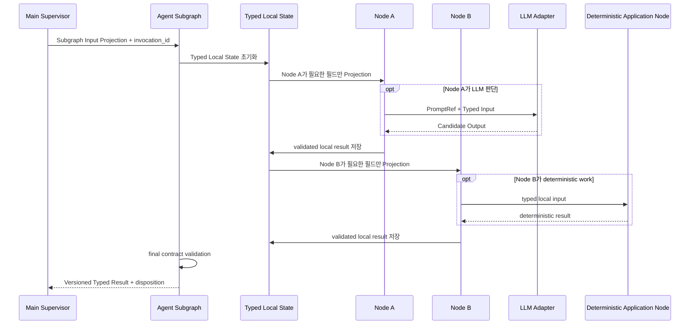

- Subgraph 내부 Node마다 필요한 State가 다르며 전체 Parent State를 일괄 전달하지 않는다.

Local State는 invocation 범위에서만 유지한다. 같은 owner 안의 호출은 이 State로 이어지며 Agent→Agent handoff가 아니다. 중간 Candidate는 Main State의 새 authority가 되지 않는다. Parent에는 공식 Versioned Typed Result·disposition과 필요한 Typed Workflow Signal만 반환한다.

Local SLLM의 atomic Node 목록과 분해 방식은 여기서 반복하지 않는다. 강한 Runtime의 node fusion은 `06/15`가 요구하는 parity gate를 통과한 Profile에서만 허용하며, Product LLM 호출은 hard cap 24를 넘지 않는다. Profile 승격과 resume은 기존 사용량 counter를 reset하지 않는다.

#### 3.2.1 LLM 호출 전 PromptRef 선택

모든 LLM 호출 전에 Supervisor가 선택한 Agent·Application Node가 다음 Key로 PromptRef를 확정한다.

```
agent_role + subgraph_name + node_name + node_state + purpose
```

Repair·Revision은 별도 PromptRef를 사용할 수 있으며 Prompt 선택 결과는 `prompt_id`·`prompt_version`·`content_hash`로 Trace한다.

### 3.3 External-control durable continuation

모든 사용자 개입 API는 아래 공통 경로를 소비한다. 개별 시퀀스의 `APP → SUP` 표기는 이 경계를 생략한 축약이지 직접 Graph 호출 권한이 아니다.

```mermaid
sequenceDiagram
    autonumber
    participant FE as React
    participant API as FastAPI Route
    participant APP as Application controller
    participant DOM as Domain/lifecycle handler
    participant DB as SQLite UoW + workflow_handoffs
    participant WEP as WorkflowExecutionPort
    participant BG as BackgroundRunExecutor
    participant CP as Checkpoint adapter
    participant SUP as LangGraph

    FE->>API: user control + command_id + expected_version
    API->>APP: validated versioned request
    APP->>DOM: owning lifecycle/domain operation
    DOM->>DB: mutation + Receipt/Audit
    APP->>DB: stage WorkflowHandoffV1(PENDING, observed target/checkpoint, typed control?)
    DB-->>APP: one COMMIT
    APP->>APP: current Domain/child/target guard + effective binding + Run authority version
    APP->>DB: claim_execution_admission CAS
    Note over APP,DB: NORMAL PENDING→DISPATCHED before WEP; effective binding + expected Run version durable
    APP->>WEP: submit(WorkflowExecutionSubmissionV2(admission))
    WEP-->>APP: ACCEPTED / ALREADY_RUNNING / NOT_COMMITTED / BINDING_MISMATCH / SHUTTING_DOWN
    alt ACCEPTED
        Note over APP,DB: post-ACCEPTED handoff write = 0
        BG->>DB: reload exact persisted admission
        BG->>CP: commit execution_admission_id + runnable entry/control lineage
        BG->>DB: CAS CONSUMED/complete recovery admission + admission clear
    else non-ACCEPTED
        APP->>DB: release_execution_admission(reason)
    end
    Note over BG,DB: CONSUMED mark 전 owner Node/LLM/Connector I/O = 0
    BG->>SUP: exact registered target; descendant checkpoint는 active_handoff lineage 승계
```

> **원문 확인 사항 — 저장 주체:** 이 도식의 `DOM->>DB`는 §2.1의 “Domain→Persistence 직접 호출 금지” 표기와 충돌한다. 호출 주체는 이번 편집에서 임의로 바꾸지 않았다.

#### 중단·재제출 시점별 처리

| 시점·결과 | 후속 처리 |
| --- | --- |
| Domain/Handoff same-UoW COMMIT 후, admission claim 전 crash | `PENDING` startup redrive. Domain Command 재실행은 0이다. |
| admission claim COMMIT 후, submit 전/후 crash | `DISPATCHED + persisted admission`을 redrive하며 exact same admission을 재사용한다. |
| `ALREADY_RUNNING` | submitted admission과 다른 admission이 same-Run worker slot을 점유한 경우에만 반환한다. 동일 `admission_id`가 이미 accepted/active이면 idempotent `ACCEPTED`다. Process-memory queue는 순서의 authority가 아니다. |
| `ALREADY_RUNNING` 등 non-ACCEPTED release | Repository가 admission `expected_run_version`과 current `Run.version`을 재검사한다. equal epoch이면 NORMAL을 `PENDING`으로 되돌린다. newer Cancel/Reauth/Recovery/terminal로 stale이면 `SUPERSEDED`로 retire하여 old lower-sequence head를 부활시키지 않는다. |
| `SHUTTING_DOWN` | current epoch이면 NORMAL을 `PENDING`으로 돌려 next startup/live redrive 대상으로 둔다. stale epoch이면 `SUPERSEDED`로 retire한다. |
| lower settled handoff 이후 checkpoint generation 증가 | immutable target과 current Domain guard를 재검증한 ordered checkpoint rebind만 허용한다. 임의 latest-target 추측은 금지한다. |
| binding mismatch + current epoch | `BLOCKED_BINDING` durable commit → startup/live reconciler의 `system:handoff-binding-recovery:<handoff_id>` Recovery reconciliation → `SUPERSEDED` settlement. |
| binding mismatch + 이미 stale epoch | newer Reauth/Recovery/Cancel/terminal이 앞서면 old NORMAL을 직접 `SUPERSEDED`로 처리한다. false `CHECKPOINT_MISMATCH` Recovery를 만들지 않는다. |
| CONSUMED 이후 crash | latest descendant checkpoint의 `active_handoff_id` lineage와 current Domain/child-fact fence가 유효할 때 `CONSUMED_CONTINUATION_RECOVERY`를 사용한다. `SAFE_CHECKPOINT_RESUME`가 아니다. `REAUTH_REQUIRED\|RECOVERY_REQUIRED\|terminal` 또는 non-cancel-compatible `CANCEL_REQUESTED`에서는 old continuation이 0이다. |

## 4. 앱 시작·Local Session·상태 복원

### 4.1 Core 시작과 Local Session

```mermaid
sequenceDiagram
    autonumber
    actor U as 사용자
    participant L as Launcher
    participant SVC as FastAPI Local Service Process
    participant API as FastAPI Route Adapter
    participant APP as Application
    participant REP as Domain Repository Ports
    participant DB as Application UoW · Repository Ports → SQLite Adapter
    participant CP as CheckpointPort
    participant MCP as Connector Ports · MCP Runtime
    participant LLM as LLM Ports · Router
    participant FE as React 프런트엔드

    U->>L: 앱 실행
    L->>SVC: 동적 포트로 프로세스 시작
    L->>API: GET /health/live
    API-->>L: LIVE
    SVC->>DB: Migration·quick_check·Open Run 조회
    SVC->>CP: Checkpointer availability·schema 확인
    SVC->>MCP: 자식 프로세스 시작·Tool Version·Schema 검증
    SVC->>LLM: 배포 프로필에 필요한 Adapter 로드 확인
    SVC->>APP: ReconcileInflightExecutionsHandler(startup-only batch Command)
    APP->>REP: list_reconciliation_candidates(limit)
    APP->>APP: POST_BEGIN_ORPHAN → UNKNOWN_RESULT → lookup/recovery
    APP->>APP: EXECUTED_AWAITING_VERIFICATION → BeginVerification/RECHECK + deterministic VERIFICATION handoff
    APP->>APP: FAILED_AWAITING_CONTINUATION → guarded PREFLIGHT/CANCEL_RESOLUTION handoff
    Note over SVC,APP: orphan batch는 MCP/LLM readiness 뒤, worker/handoff redrive 전에 bounded drain; live loop 호출 0
    SVC->>APP: RedriveWorkflowHandoffsHandler(initial handoff reconciliation)
    APP->>CP: Open Run latest checkpoint / active_handoff_id 검사
    APP->>APP: CONSUMED active-continuation + Domain-progress fence 우선
    APP->>APP: BLOCKED_BINDING head → deterministic CHECKPOINT_MISMATCH Recovery reconcile
    APP->>APP: PENDING/DISPATCHED dispatch-head → ScheduleRunExecutionHandler(NORMAL_HANDOFF)
    SVC->>APP: WorkflowHandoffReconciliationLoop start
    Note over SVC,APP: live loop는 RedriveWorkflowHandoffsHandler만 drive; direct WEP/LangGraph 0
    L->>API: GET /health/ready
    alt Core Readiness 성공
        API-->>L: READY
        L->>FE: same-origin URL 열기
    else 진단·복구만 가능
        API-->>L: SAFE_MODE 또는 NOT_READY
        L->>FE: same-origin 진단 UI 열기
    end
    FE->>API: POST /api/v1/session/bootstrap(bootstrap_secret, frontend_api_contract_version)
    API-->>FE: Local Session + api_contract_version + compatibility
    alt compatibility = INCOMPATIBLE
        FE->>FE: mutation/SSE 비활성화 + update-required 안내
    end
```

### 4.2 Runtime 진단과 중단 Run 조회

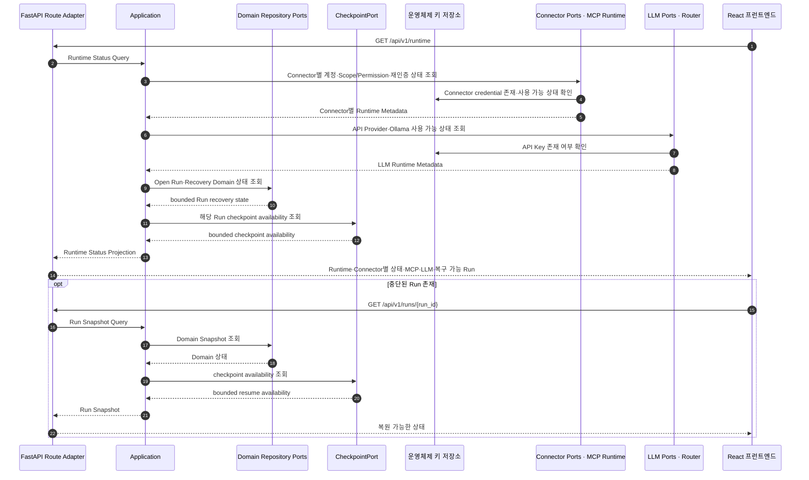

| 구분 | 적용 조건 |
| --- | --- |
| Core Readiness | `/health/ready`는 DB·Migration·정적 Asset·API Contract·Keyring Adapter·MCP Executable·Tool Schema를 판정한다. |
| 기능 사용 가능 여부 | Google/GitHub credential, Gemini API Key, Ollama·Model 상태는 `/api/v1/runtime` 진단 결과다. 누락 자체가 Core Service 시작 실패를 의미하지 않는다. |
| Local Session | Bootstrap Secret은 한 번 교환한 뒤 폐기한다. |
| 상태 충돌 | Checkpoint와 Domain 상태가 충돌하면 자동 추정하지 않고 `RECOVERY_REQUIRED`로 표시한다. |

## 5. Run 시작과 SSE 연결

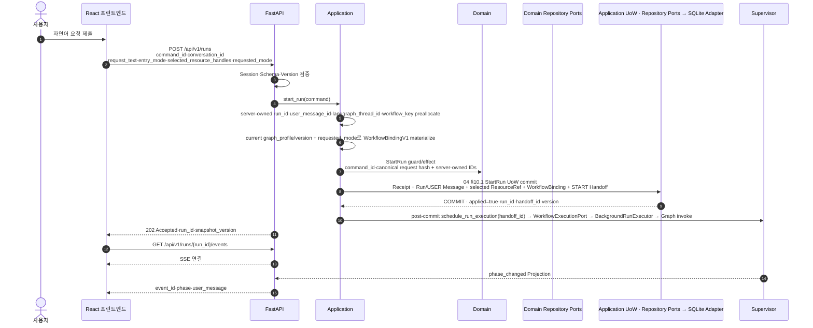

- 동일 `command_id` 재전송은 기존 Run Result를 반환하거나 Version Conflict로 종료한다.
- Graph 실행 시작과 HTTP 응답은 비동기일 수 있지만, Run Row Commit 이후 `run.schedule_run_execution → WorkflowExecutionPort`를 통해서만 시작한다. FastAPI Route는 concrete background primitive나 LangGraph executor를 직접 선택하지 않는다.

### 5.1 새 Run과 동일 Run 재개

| 상황 | 처리 |
| --- | --- |
| Terminal Run 뒤 새 USER 요청 | 같은 `conversation_id`를 유지할 수 있지만 새 Run·새 `langgraph_thread_id`를 만든다. Browser는 새 Run/Message/Workflow identity를 제출하지 않는다. Application이 server-owned `run_id`, `user_message_id`, `workflow_key`, `langgraph_thread_id`를 먼저 preallocate하고 `WorkflowBindingV1`을 materialize한 뒤 `StartRun` guard를 평가한다. |
| 새 Run의 저장과 입력 | StartRun UoW에서 Run·USER Message·선택 ResourceRef·initial WorkflowBinding·START handoff를 commit한 후 `RunInputV1`을 구성한다. 과거 `langgraph_thread_id`·Checkpoint·Main State는 이어받거나 Graph invoke 입력으로 재사용하지 않는다. |
| 비Terminal 동일 Run 재개 | confirmation·reauth·recovery·명시적 `/resume`는 기존 `run_id + langgraph_thread_id + checkpoint`를 사용한다. 이어야 하는 Run의 `/confirm`·`/resume` 계약을 사용한다. |
| 같은 Conversation에 Open Run 존재 | Open Run Guard가 두 번째 `StartRun`의 병렬 생성을 차단한다. |
| Conversation Timeline 복원 | UI Query이며 Graph resume 자체가 아니다. 과거 Message가 화면에 보여도 새 Run Request Understanding/Prompt 입력으로 자동 전달하지 않는다. |

## 6. AGENT_SEARCH 조회·분석 시퀀스

현재 책임별 호출을 시작·Route·Retrieval·분석·계획으로 나눠 설명한다. Supervisor는 Agent Subgraph 단위로 Routing하며 내부 Node를 직접 호출하지 않는다.

### 6.1 요청 이해와 Tool Route 확정

| 순서 | 호출·처리 | 반환·저장 |
| --- | --- | --- |
| 1 | Supervisor → Application `start_analysis` → Domain `StartAnalysis(expected_version)` | Run `CREATED → ANALYZING` + Receipt/Audit UoW COMMIT(`applied=true`) 뒤 Supervisor에 준비 결과 반환. |
| 2 | Supervisor → Request Understanding: Request Projection + invocation_id | goal/ambiguity PromptRef의 RequestIntent candidate를 Schema·Contract 검증하고 bounded repair 후 `RequestIntentV2 + disposition` 반환. `REQUEST_UNDERSTANDING` checkpoint 저장. |
| 3 | Supervisor → Tool Route: `RequestIntentV2` | 의미 판단으로 IN/OUT Resource·Effect candidate 준비. |
| 4 | Tool Route의 결정적 `tool_routing.resolve_policy_preconditions` | TASK CREATE에는 Tasks duplicate READ, CALENDAR CREATE에는 Event/FreeBusy conflict READ 보강. |
| 5 | 필수 READ가 사용자 지정 범위 밖이면 `SCOPE_EXPANSION_REQUIRED` 확인 | 추가 Source·기간·Resource·이유를 제시한다. 실제 사용자 승인/거절을 Confirmation Controller가 검증하고 `PolicyConfirmationReceiptV1 + POLICY_CONFIRMATION_RECORDED`를 저장한 뒤 Tool Route owner checkpoint에서 재개한다. 공통 Confirmation·handoff 경로를 따른다. |
| 6 | 확인된 범위 안에서 결정적 Registry candidate binding | eligible candidate가 여러 개일 때만 `select_tool` PromptRef로 선택한다. heuristic shortlist는 금지한다. |
| 7 | 결정적 final route + validation | `ToolRoutePlanV2`를 반환하고 `TOOL_ROUTING` checkpoint에 저장한다. |

### 6.2 고정 IN Route에서 자료 조회

IN Route가 있을 때 Application `begin_retrieval` → Domain `BeginRetrieval(expected_version)` → Run `ANALYZING | PLANNING → RETRIEVING` UoW Commit 후 Retrieval을 호출한다. 이미 `RETRIEVING`인 local loop에서는 같은 Command를 반복 적용하지 않는다.

입력은 `User Request + Intent + ToolRoutePlanV2.input_plan.input_routes + budget`의 해당 Projection이다.

| 조회 계획 조건 | 처리 |
| --- | --- |
| exact RESOURCE_SELECTED detail이 current typed state에서 하나로 결정됨 | 결정적 `DETAIL_FETCH` materialization + validation. |
| exact TASK CREATE duplicate pre-read가 allowlist 안의 explicit Task List 하나로 결정됨 | 결정적 TASK SEARCH materialization + validation. |
| Query 의미 판단이 필요함 | `plan_query` PromptRef → `RetrievalQueryPlanV2` → 결정적 Query Builder. |

```text
Retrieval의 결정적 Read Node
→ Application retrieval.execute_read(validated query + allowed_read_tool_ids)
→ ConnectorReadPort
→ Connector MCP 내부의 Source-native Provider API
→ Metadata / Detail Result
→ Typed Read Result
→ Retrieval에 normalized read result 반환
```

필요한 Input Route·페이지·상세만 반복한다. Calendar availability가 필요하면 FreeBusy interval을 결정적으로 normalize/subtract하여 `AvailableIntervalV1[]`을 계산한다.

```text
normalize + segment + source security metadata
→ Run-scoped RAG retrieve/rerank
→ Evidence 선택·Sufficiency 판단
→ 검증·finalize
→ RetrievalResultV1 반환
→ RETRIEVAL checkpoint
```

### 6.3 필요한 분석과 사용자 확인

`effective analysis required = semantic REQUIRED or Policy Precondition`일 때만 Work Analysis를 호출한다. 입력은 `User Request + Intent + optional RetrievalResult/Evidence Projection`이다. `semantic NONE`이고 Policy Precondition 분석도 없으면 생략한다.

facts를 추출하고 필요한 entity·temporal/dependency·duplicate/conflict 관계, 정보 부족과 필요한 운영 위험을 분석한 뒤 결정적으로 조립·검증한다. 내부 atomic Node 나열은 이 시퀀스에서 반복하지 않는다.

| 분석 결과 | 다음 처리 |
| --- | --- |
| exact duplicate default stop | 해당 Output Route에 `route_action_necessities[].status=NOT_REQUIRED`를 반환한다. |
| duplicate/conflict override 확인 필요 | `NEEDS_CONFIRMATION`과 `DUPLICATE_OVERRIDE_REQUIRED \| CONFLICT_OVERRIDE_REQUIRED`를 반환한다. 사용자 2차 확인 → Controller의 Receipt/Audit 저장 → 같은 owner checkpoint 재개. |
| override APPROVED | 현재 relation/evidence Context에 confirmed override를 결합하고 해당 Route를 `REQUIRED`로 두며 override receipt ref를 반환한다. |
| override DECLINED | 해당 Route를 `NOT_REQUIRED`로 둔다. |
| blocking relation 없음 | typed local state를 검증하고 Route별 실행 필요성을 포함한 `WorkAnalysisResultV2`를 반환한다. |

### 6.4 계획과 검토

Application `begin_planning` → Domain `BeginPlanning(expected_version)` → Run `ANALYZING | RETRIEVING → PLANNING` UoW Commit 후 Planning을 호출한다. 이미 `PLANNING`인 revision에서는 같은 Command를 반복 적용하지 않는다.

입력은 `User Request + Intent + ToolRoutePlanV2.output_plan + optional Analysis + Evidence refs`다.

| 계획 분기 | 반환까지의 순서 |
| --- | --- |
| `output_mode=ANSWER` | 근거 기반 답변 작성 → `AnswerDraftV2` 반환. |
| `output_mode=ACTION` + 모든 Route가 `NOT_REQUIRED` | Evidence 기반 no-action 답변 작성 → 새 Action 0개의 `AnswerDraftV2` 반환. |
| `output_mode=ACTION` + 하나 이상의 Route가 `REQUIRED` | 필요한 고정 Output Route의 `selected_tool` Schema와 optional Analysis·Evidence를 사용해 Tool Arguments candidate 작성 → 결정적 `build_dependencies + assemble_plan + validate_plan` → `ActionPlanDraftV2` 반환. |
| Action Plan 검토 | Supervisor → Review: Intent + Plan + Evidence/Policy Projection → 해당 dimension 검사 → 결정적 `aggregate_review_findings + validate_review` 및 결과 mapping/validation → `PlanReviewResultV2` 반환. |

### 6.5 Route와 중간 결과 보존

| 대상 | 보존 경계 |
| --- | --- |
| 확정 Tool | Tool Route를 Main State에 저장한 뒤 Retrieval·Planning은 Tool 종류를 재선택하지 않는다. Retrieval Read는 `ToolRoutePlanV2.input_plan.input_routes[].allowed_read_tool_ids`, Planning은 `ToolRoutePlanV2.output_plan.output_routes[].selected_tool_id`와 해당 Schema만 사용한다. |
| 목표가 이미 충족됨 | Output Route는 요청 capability를 고정한다. Retrieval/Analysis가 정확 중복·동일 상태를 확인하면 Route를 바꾸지 않고 새 Action 0개의 Evidence 기반 Answer로 종료할 수 있다. |
| Route revision | `InputRoutePlanV1`과 `OutputPlanV1`은 독립 revision/based_on을 가진다. OUT-only 변경으로 기존 Retrieval을 불필요하게 재실행하지 않는다. |
| 중간 자료 | Query candidate·RAG score·LLM candidate는 Subgraph Local State에 둔다. Provider raw continuation은 Run Retrieval Cache entry에만 두고 Parent에는 공식 Typed Result와 필요한 Typed Workflow Signal만 반환한다. |

## 7. RESOURCE_SELECTED 요청 시퀀스

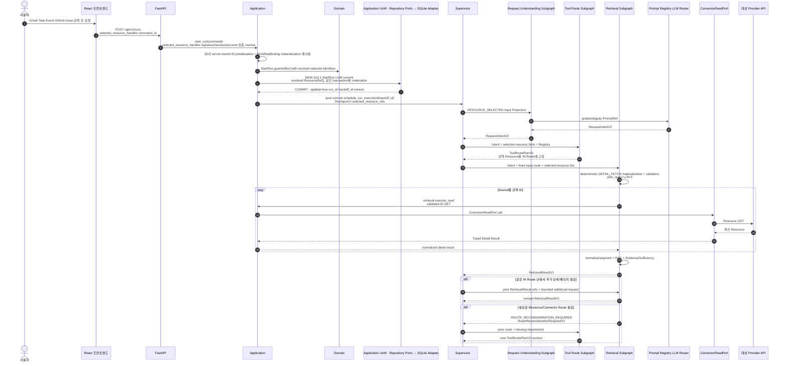

- 선택 Resource를 검색 Query로 다시 추측하지 않고 최신 상세 GET한다.
- 추가 조회가 같은 IN Route 안이면 Retrieval Subgraph 재진입, 새 Resource/Connector가 필요하면 Tool Route Back-edge다.
- 이전 Subgraph Local State를 장기 Memory처럼 재사용하지 않고 Parent의 공식 Result와 Run Cache Handle만 사용한다.

## 8. 추가 Retrieval과 사용자 확인 Interrupt

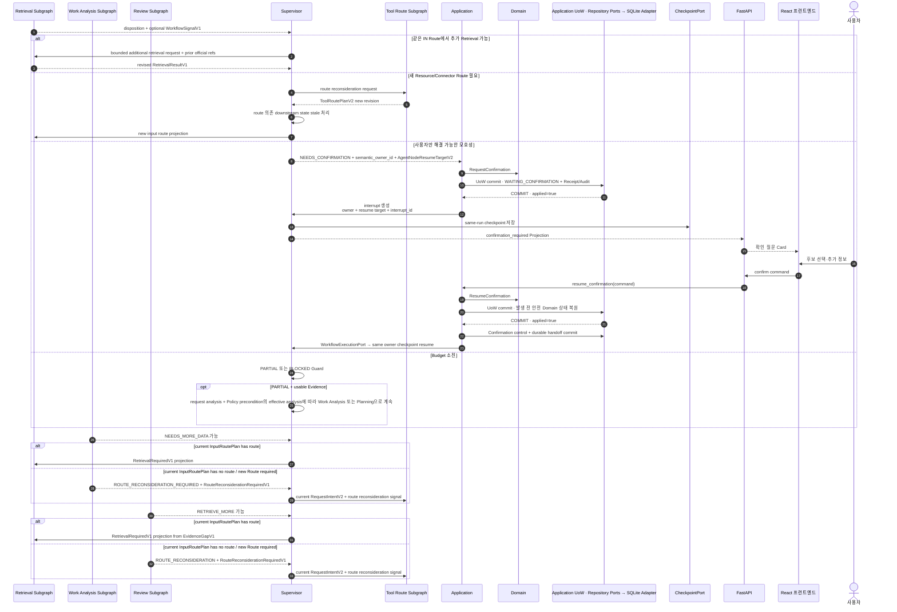

> **원문 확인 사항 — Confirmation Commit:** 위 도식은 `ResumeConfirmation` 결과 Commit과 control/handoff Commit을 나눠 표시한다. §3.3의 same-UoW Commit 설명과 일치하지 않아 이번 편집에서는 어느 쪽도 임의로 고치지 않았다.

- 새 Route가 필요하지 않은 Query/Page/Detail 확장은 Retrieval 책임이다. Retrieval 자신의 `NEEDS_MORE_DATA`는 local loop이며 `RetrievalRequiredV1`을 만들지 않는다.
- Work Analysis `NEEDS_MORE_DATA`와 Review `RETRIEVE_MORE`만 현재 IN Route에서 해결 가능한 요구를 `RetrievalRequiredV1`으로 투영한다. 새 Route가 필요하면 Tool Route로 back-edge한다.
- Tool Route revision이 바뀌면 해당 Route에 의존한 Retrieval·Analysis·Planning·Review 결과를 stale 처리하고 다시 생성한다.
- Agent가 다른 Agent를 직접 호출하지 않는다.


### 8.1 Context Adjustment 재진입

| 단계 | 처리 |
| --- | --- |
| 허용 시점 | `WAITING_APPROVAL`에서 어떤 Action도 아직 승인되지 않았고 in-flight 실행이 0일 때만 허용한다. |
| 요청 검증 | `run.adjust_context`가 expected Run/Retrieval revision과 Preview membership을 검증한다. |
| 계획 대체 | `BeginPlanning(USER_CONTEXT_ADJUSTMENT)`으로 current Plan을 `SUPERSEDED`한 뒤 같은 Run을 Retrieval로 재진입시킨다. |
| Evidence 제외 | `EXCLUDE_EVIDENCE`는 새 selection에서 선택 segment를 제외한다. |
| 추가 조회 | `RETRIEVE_MORE`는 `RetrievalNeedV1(USER_CONTEXT_ADJUSTMENT)`로 추가 조회한다. |
| 기존 결과 | 새 Retrieval revision에 의존하지 않는 기존 Analysis·Plan·Review는 stale이므로 재사용하지 않는다. |

```text
EXCLUDE_EVIDENCE
→ BeginPlanning(USER_CONTEXT_ADJUSTMENT) + Plan SUPERSEDED + WorkflowHandoff(PENDING) same-UoW commit
→ post-commit handoff MAIN_CONTROL:RETRIEVAL_ENTRY / ContextAdjustmentV1
→ fresh retrieval from frozen input routes
→ exclusion applied at select_evidence
→ new RetrievalHeadV1/revision

RETRIEVE_MORE
→ same lifecycle + WorkflowHandoff(PENDING) commit boundary
→ post-commit handoff MAIN_CONTROL:RETRIEVAL_ENTRY / ContextAdjustmentV1.retrieval_need
→ retrieval.plan_query consumes bounded USER_CONTEXT_ADJUSTMENT need
→ new RetrievalHeadV1/revision
```

둘 다 raw HTTP body나 Browser-mutated `excluded_segment_ids`를 checkpoint에 주입하지 않는다.

### 8.2 부족한 정보와 Budget 소진

| 조건 | 다음 처리 |
| --- | --- |
| POLICY/safety-critical required issue | `BLOCKED` |
| USER required issue | `NEEDS_CONFIRMATION` |
| GOOGLE required issue + budget | `RETRIEVE_MORE` |
| budget exhausted + usable Evidence | `PARTIAL`을 유지한 뒤 Work Analysis 또는 Planning |
| budget exhausted + usable Evidence 없음 | `CompleteAnswerOnlyRun → FINALIZE` |
| Write 필수 정보 부족 | CONFIRMATION 또는 BLOCKED |

모든 Graph Profile은 동일 Supervisor Guard를 사용한다.

## 9. Answer-only Run 완료

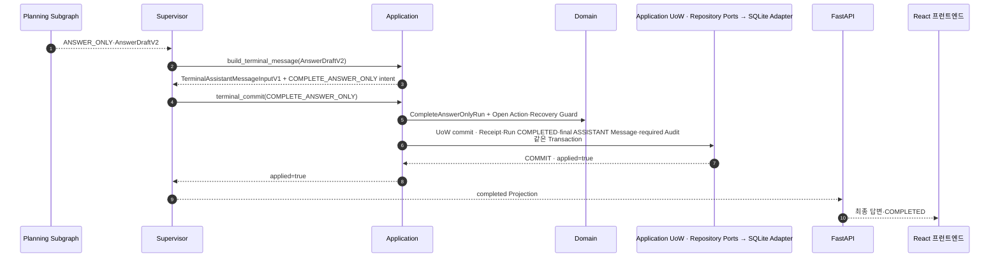

Answer-only Run에는 Plan·Action·Approval·Attempt·Verification Row를 만들지 않는다.

## 10. Connector READ 실행

Connector READ는 §6·§7의 Retrieval subgraph 안에서만 실행한다. 별도 READ Plan/Action lifecycle, READ 전용 Domain transition, Approval·ExecutionAttempt·Verification Row는 만들지 않는다. 인증 만료는 동일 Retrieval owner의 checkpoint/resume 계약으로 재개하며 `ConnectorWritePort` 호출은 0이다.

> **원문 확인 사항 — READ 범위:** 이 절은 별도 READ Plan/Action lifecycle을 두지 않는다고 설명하지만, 공통 원칙·취소·확인 항목에는 Legacy/호환 READ 경로가 남아 있다. 원문은 이를 기존 Domain `READ` Effect와 회귀 테스트를 위한 경계이며 새 SIX Release Planning의 정상 경로가 아니라고도 설명한다. 유지·제거 여부는 이번 편집에서 결정하지 않았다.

## 11. WRITE Plan 저장·승인·실행·검증

### 11.1 Plan 저장

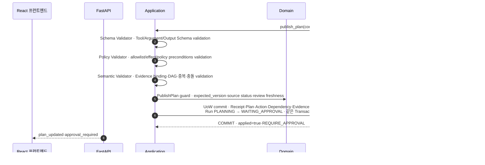

### 11.2 사용자 승인과 실행 재개

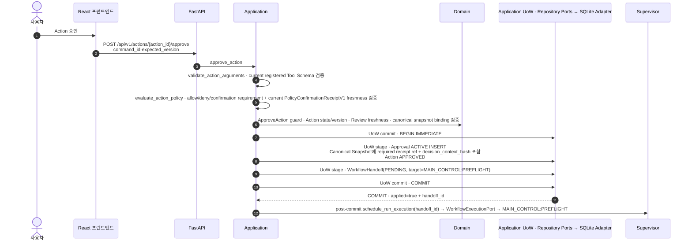

### 11.3 Preflight·실행·검증

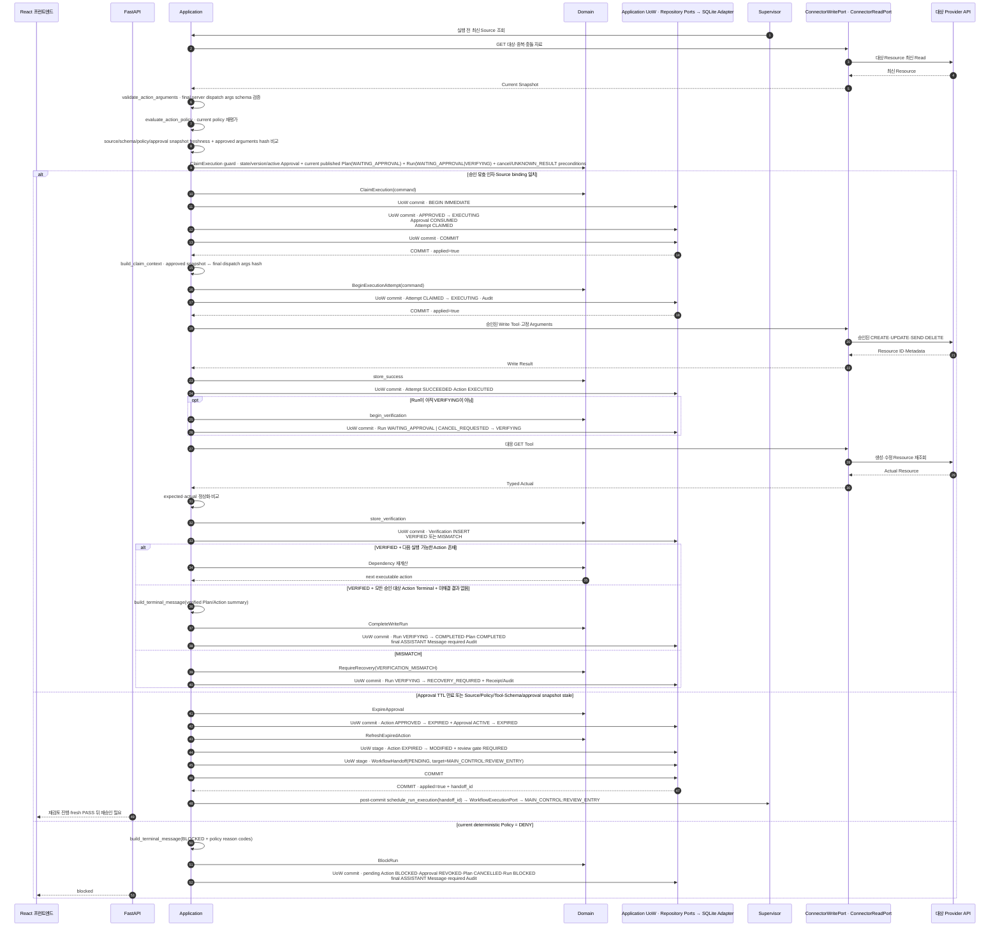

외부 Write와 검증 Read 중에는 DB Transaction을 유지하지 않는다. `StoreVerification`은 Action·Verification만 저장하며, Run lifecycle은 `BeginVerification`, 별도 `RequireRecovery`, terminal Command가 처리한다.

### 11.4 ClaimContext와 MCP dispatch 검증

| 시점 | 처리 |
| --- | --- |
| `ClaimExecution` COMMIT 이후 | Application이 최종 MCP Payload를 구성한다. `build_claim_context`는 DB mutation 없이 `execution_arguments_hash`와 bounded-TTL `ClaimContextV2` / `claim_token`을 만든다. Action은 `EXECUTING`, Attempt는 `CLAIMED`, Approval은 `CONSUMED`다. |
| `BeginExecutionAttempt` COMMIT | Attempt `CLAIMED → EXECUTING` + required Audit를 Commit한 뒤 MCP Write Tool을 호출한다. Claim Commit만으로 dispatch하지 않는다. |
| MCP dispatch 직전 | 실제 인자를 재해시하고 Signature·Binding·Nonce·Claim을 검증한 뒤 Nonce를 소비한다. 검증 실패 시 Provider API를 호출하지 않고 `APPROVAL_INVALID` 또는 Claim Token 오류를 반환한다. |
| dispatch 이후 | `StoreSuccess \| MarkFailed \| MarkUnknownResult`로 결과를 별도 짧은 UoW에 저장한 뒤 해당 Effect Verification을 수행한다. Begin 전 중단과 Begin 후 process loss는 취소·재시작 절에서 구분한다. |

### 11.5 Google Task 날짜·시간 의미

```
Gmail·사용자 요청에서 업무 마감만 확인
→ Request Understanding: business_deadline 후보
→ Task scheduled_date 없음
→ Plan: notes·Evidence·Approval Summary에 업무 마감 보존 제안
→ 사용자 Approval
→ tasks_create_task(due 없음)
→ GET Verification: 제목·notes·예정일 부재 비교

사용자가 수행 예정일도 명시
→ Request Understanding: scheduled_date 후보
→ 승인된 tasks_create_task(due = scheduled_date)
→ GET Verification: 예정일 비교

정확한 시간 구간 요청
→ Tasks 시간 설정 성공 선언 금지
→ 날짜 예정일 또는 별도 승인형 Calendar Event 대안 제시
```

Provider `needsAction`·`completed`는 Local API Projection에서 사용자 상태 `미완료`·`완료`로 정규화한다. 예정일 경과는 상태 전이나 자동 완료 시퀀스를 만들지 않는다.

### 11.6 SEND·DELETE 검증 순서

두 Effect 모두 Plan → Domain Validation → `WAITING_APPROVAL` → `ClaimExecution` COMMIT → ClaimContext → `BeginExecutionAttempt` COMMIT까지 같은 승인·실행 경계를 사용한다.

| Effect | 호출 후 확인 | 결과 |
| --- | --- | --- |
| Gmail SEND | `gmail_send → Sent Lookup` | `VERIFIED \| MISMATCH \| UNKNOWN_RESULT` |
| Calendar DELETE | `calendar_delete_event → target absence 확인` | `VERIFIED \| MISMATCH \| UNKNOWN_RESULT` |

## 12. 일부 승인과 Action DAG

```mermaid
sequenceDiagram
    autonumber
    actor U as 사용자
    participant FE as React 프런트엔드
    participant API as FastAPI Route Adapter
    participant APP as Application
    participant DOM as Domain
    participant DB as Application UoW · Repository Ports → SQLite Adapter

    U->>FE: 일부 Action 승인·일부 거절
    FE->>API: approve·reject Commands
    API->>APP: validated approve_action / reject_action
    APP->>DOM: Action별 조건부 전이
    APP->>DB: 각 applied Approve/Reject UoW에 승인·거절·Audit + WorkflowHandoff(PENDING, target=PREFLIGHT, server-owned run_sequence) 원자 stage/commit
    APP->>APP: 각 committed handoff_id를 post-commit schedule_run_execution; non-head sequence는 PENDING 유지
    APP->>APP: lower sequence settle 후 live reconciler/worker-boundary wake가 durable dispatch head를 다시 Application schedule boundary로 제출
    APP->>DOM: PREFLIGHT에서 현재 aggregate 전체를 다시 읽어 Dependency/terminal reconciliation 재계산
    DOM-->>APP: executable_actions·blocked_actions 또는 all-final terminal result

    loop 독립 또는 선행 VERIFIED Action
        APP->>DOM: 실행 가능 여부·Dependency 확인
        DOM-->>APP: ALLOW + next_allowed_commands
        APP->>APP: canonical ClaimExecution → build ClaimContext → BeginExecutionAttempt COMMIT → Connector Write → Verification orchestration 재사용
    end

    opt RejectAction이 적용된 Action의 미실행 dependent 존재
        Note over APP,DB: RejectAction의 동일 UoW가 transitive dependent를 DEPENDENCY_BLOCKED로 닫고 ACTIVE Approval을 revoke한다. 별도 block_by_dependency Command는 없다.
    end

    opt predecessor가 FAILED
        Note over APP,DOM: FAILED는 retry/cancel decision state다. dependent는 terminalize하지 않고 predecessor VERIFIED 전까지 Claim만 차단한다.
    end

    APP-->>FE: 부분 실행 결과·종속 영향
```

| 남은 Action | 처리 |
| --- | --- |
| dependency 없는 approved/executable Action 존재 | `FAILED + NOT_SENT`가 있어도 다음 독립 Action의 `PREFLIGHT`로 계속 진행한다. |
| FAILED predecessor에 의존 | Claim은 0이다. |
| 독립 Action 처리 후 unresolved `FAILED + NOT_SENT`가 남음 | retry/cancel decision으로 suspend한다. `CompleteWriteRun`하지 않는다. |
- 성공한 Action은 자동 롤백하지 않는다.
- 종속 Action은 선행 Action의 `VERIFIED` 또는 계약된 성공 조건 이후에만 실행한다.

## 13. 승인 수정·거절·만료

### Plan supersession 이후의 명령

모든 Action mutation·Approval·Claim은 State Contract의 **Plan supersession child-authority fence**를 소비한다.

| 시점 | 처리 |
| --- | --- |
| published Plan back-edge의 supersession COMMIT | old ACTIVE Approval을 같은 UoW에서 revoke한다. |
| owning Plan이 `SUPERSEDED` | old Action은 history projection이다. approve/modify/reject/cancel/expire/refresh/retry/claim mutation의 effect는 0이며, 늦은 old HTTP Command로 실행권을 되살릴 수 없다. |

### 13.1 사용자 수정

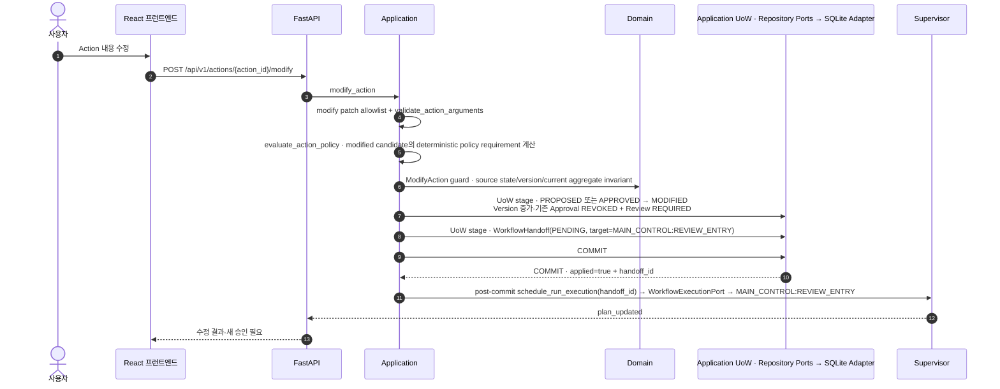

| 시점 | Review·Approval 처리 |
| --- | --- |
| Canonical Arguments가 실제로 바뀜 | 기존 Approval revoke와 Plan Review `REQUIRED` 무효화를 같은 Transaction에 반영한다. |
| Commit 이후 | 기존 Profile의 Plan Review를 다시 실행한다. 결정적 `validate_review` PASS를 Application `plan.record_review_result`가 `RecordReviewResultCommandV1`으로 current Plan/Action revision에 조건부 기록한다. |
| 새 승인 | current revision의 Review PASS가 기록되고 Domain Validation이 성공한 경우만 새 Approval을 허용한다. |
| Review 중 후속 Modify 발생 | `expected_plan_version` 또는 bound Action version mismatch이면 writer가 conflict를 반환한다. 이전 Review 결과는 durable PASS가 되지 않는다. |

### 13.2 승인 만료

```
Approval 유효 시간 경과 또는 Source·Policy·Tool Schema 변경
→ ExpireApproval COMMIT · Action/Approval EXPIRED
→ refresh_expired_action UoW · 최신 Source·Policy/Schema snapshot 재계산
→ Action MODIFIED + review REQUIRED + WorkflowHandoff(PENDING, REVIEW_ENTRY) same COMMIT
→ post-commit durable Review continuation
→ current revision fresh Review PASS
→ 새 Approval snapshot/idempotency authority
→ 사용자 재승인
```

기존 Approval을 다시 `ACTIVE`로 만들지 않는다.

### 13.3 Action 거절과 published Plan 재검토

**거절 순서**

```text
PROPOSED·MODIFIED·APPROVED Action에 RejectAction
→ Action REJECTED
→ 기존 ACTIVE Approval은 삭제하지 않고 REVOKED로 보존
→ ACTION_REJECTED Audit + 미실행 transitive dependent DEPENDENCY_BLOCKED + dependent ACTIVE Approval revoke
→ 같은 UoW COMMIT
```

독립적인 미완료 Action이 있으면 계속 진행한다. 모든 Action이 final fact이고 unresolved가 0이면 `CompleteWriteRun`으로 Plan/Run을 `COMPLETED`로 확정한다. 외부 Write가 시작되지 않은 all-rejected/all-cancelled Plan도 State Contract에 따라 `WAITING_APPROVAL → COMPLETED`로 닫을 수 있으며, 이 종료에서 외부 Connector/MCP Write와 새 ExecutionAttempt는 생성하지 않는다.

**published Plan 재검토 결과**

| 결과·조건 | 후속 순서 |
| --- | --- |
| `REVISE \| RETRIEVE_MORE \| ROUTE_RECONSIDERATION` | `WAITING_APPROVAL \| VERIFYING`에서 guard가 허용할 때 `BeginPlanning` UoW로 old ACTIVE Approval `REVOKED` → current Plan `SUPERSEDED` → Run `PLANNING`을 처리한다. 필요한 Planning/Retrieval/Tool Route 경로를 재사용한다. |
| `CONFIRM` | guarded `RequestConfirmation`만 사용한다. |
| `BLOCK` | guarded `BlockRun`만 사용한다. |
| unresolved in-flight/UNKNOWN_RESULT/MISMATCH 존재 | back-edge/block보다 해당 Recovery·reauth·cancel resolution을 먼저 완료한다. |
| 후속 PASS | old Plan gate를 다시 열지 않는다. 새 revision을 저장하고 새 Action의 Approval을 다시 받는다. |

State Transition Contract의 post-review matrix를 따른다. 이미 성공·검증된 외부 효과와 immutable final Action facts는 보존한다.

### 13.4 Review REVISE → Planning revision → affected-dimension RECHECK

`Review.REVISE`는 전체 Review를 처음부터 다시 실행하라는 의미가 아니다. 순서는 다음으로 고정한다.

```
Review
→ ReviewReviseV2.issues
   - affected_dimensions          # 필수 selector
   - affected_action_ids          # optional bounded context
   - affected_route_ids           # optional bounded context
→ Supervisor: Planning Back-edge
→ Planning revision Input Projection에 ReviewReviseV2.issues 전달
→ Planning이 새 planning_result revision 생성
→ Review 재진입 시 직전 REVISE issue의 affected_dimensions를 RECHECK Projection으로 전달
→ recheck_affected_dimensions
→ deterministic aggregate_review_findings
→ deterministic validate_review
→ PASS | REVISE | RETRIEVE_MORE | ROUTE_RECONSIDERATION | CONFIRM | BLOCK
```

- `affected_dimensions`가 비어 있지 않다면 `affected_action_ids=[]`, `affected_route_ids=[]`인 **dimension-only REVISE**도 유효하다. Action/Route ID를 임의 생성해 selector를 보충하지 않는다.
- Finding 문장이나 전체 Plan을 RECHECK selector로 사용하지 않는다.
- 직전 REVISE 제안의 affected route에 Action이 전후 정확히 하나씩 있으면 변경 인자와 과거 issue를 검토 이력으로 전달할 수 있다. 이전 issue의 해결 여부는 현재 finding과 분리하며, 과거 finding 자체를 현재 결함 또는 사용자 요구로 승격하지 않는다. 일대일 대응이 불명확하면 임의로 Action을 연결하지 않는다.
- 열린 과거 issue 평가(`UNRESOLVED`/`UNCERTAIN`)와 `findings=[]`가 동시에 나오면 출력 계약 오류로 처리한다. Schema repair도 실패하면 현재 수정안을 PASS로 간주하지 않는다. 현재 finding의 분류와 최종 disposition은 기존 aggregate 책임이며 이전 issue 수만큼 finding을 강제하지 않는다.
- Planning Back-edge는 `ReviewReviseV2.issues`를 bounded revision context로 소비한다. 별도 장기 `WorkflowSignal` authority를 만들지 않는다.
- Review 재진입은 새 `planning_result` revision과 직전 REVISE의 affected-dimension context를 함께 사용한다. 이미 PASS한 dimension의 Product LLM inspector를 무조건 재호출하지 않는다.
- Review `REVISE`로 Run이 이미 `PLANNING`인 bounded revision에서는 `BeginPlanning`을 반복 적용하지 않는다.

## 14. Write 실패와 명시적 재시도

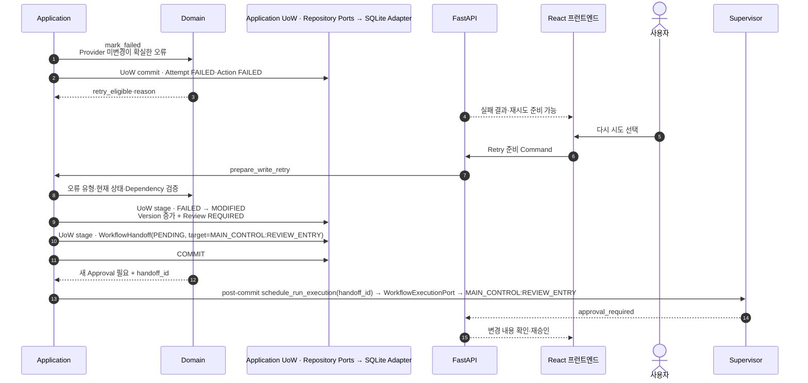

금지 전이:

```
FAILED → EXECUTING
UNKNOWN_RESULT → EXECUTING
```

재시도는 새 Approval, 새 Idempotency Key, 최신 Source Snapshot과 새 ExecutionAttempt ID를 사용하며 새 Approval의 `attempt_no`는 1로 시작한다.

## 15. Write 응답 유실·UNKNOWN_RESULT 복구

### 15.1 전달 여부 분류

```text
Connector MCP Write
→ NOT_SENT | MAY_HAVE_BEEN_SENT | SENT_RESPONSE_LOST
→ NOT_SENT만 FAILED 후보
→ 나머지는 UNKNOWN_RESULT + GET/Search Recovery
```

### 15.2 기존 결과 조회와 검증

```mermaid
sequenceDiagram
    autonumber
    participant APP as Application
    participant MCP as ConnectorWritePort
    participant G as 대상 Provider API
    participant DOM as Domain
    participant DB as Application UoW · Repository Ports → SQLite Adapter
    participant API as FastAPI
    participant FE as React 프런트엔드

    APP->>MCP: 승인된 Write 호출
    MCP->>G: CREATE 또는 UPDATE
    G--xMCP: 응답 유실·Timeout·Transport 종료
    MCP-->>APP: UNKNOWN_RESULT
    APP->>DOM: mark_unknown_result
    APP->>DB: UoW commit · Attempt·Action UNKNOWN_RESULT
    API-->>FE: 실제 결과 확인 중

    Note over APP,DB: 새 Attempt·새 Write 금지

    alt CREATE
        APP->>MCP: RESOURCE_SEARCH · Recovery Fingerprint로 Resource Search
        MCP->>G: 후보 검색·상세 GET
    else UPDATE
        APP->>MCP: GET_TARGET · 대상 Resource GET
        MCP->>G: 현재 대상 조회
    else SEND
        APP->>MCP: MESSAGE_SEARCH · 기존 전송 결과 후보 검색
        MCP->>G: Sent 결과 후보 조회
    else DELETE
        APP->>MCP: GET_TARGET · 삭제 대상 상태 조회
        MCP->>G: 대상 존재/부재 조회
    end
    G-->>MCP: 기존 결과 후보 또는 미발견
    MCP-->>APP: Resolve Result

    alt 실행 결과 확인
        APP->>DOM: recover_existing_result
        APP->>DB: UoW commit · UNKNOWN_RESULT → EXECUTED
        alt Run = WAITING_APPROVAL | CANCEL_REQUESTED
            APP->>DOM: BeginVerification
            APP->>DB: UoW commit · Run → VERIFYING
        else Run = RECOVERY_REQUIRED
            APP->>DOM: ResolveRecovery(RECHECK) with changed external-state fingerprint
            APP->>DB: UoW commit · RECOVERY_REQUIRED → VERIFYING
        end
        APP->>APP: verification.verify_effect · expected·actual 비교
        APP->>DOM: store_verification
        APP->>DB: UoW commit · VERIFIED 또는 MISMATCH
        opt Verification = MISMATCH
            APP->>DOM: RequireRecovery(VERIFICATION_MISMATCH)
            APP->>DB: UoW commit · Run → RECOVERY_REQUIRED + Receipt/Audit
        end
    else 미실행이 확실
        APP->>DOM: ResolveAsFailed
        APP->>DB: UoW commit · UNKNOWN_RESULT → FAILED
        alt Run = RECOVERY_REQUIRED
            APP->>DOM: ResolveRecovery(RECHECK) with changed lookup fingerprint
            APP->>DB: UoW commit · RECOVERY_REQUIRED → saved pre_recovery_status
        else Run = WAITING_APPROVAL | CANCEL_REQUESTED | VERIFYING
            Note over APP,DOM: Run lifecycle command 0; Action FAILED fact만 반영
        end
        APP->>APP: FAILED fact 보존 · Verification 없음<br/>독립 approved/executable Action이 있으면 다음 PREFLIGHT, 없으면 retry/cancel decision suspend
    else 불명확 지속
        APP->>DOM: RequireRecovery(UNKNOWN_RESULT) unless already RECOVERY_REQUIRED
        APP->>DB: UoW commit · Run RECOVERY_REQUIRED + durable recovery context
        API-->>FE: 사용자 복구 선택 Card
    end
```

`NOT_FOUND` 한 번만으로 CREATE 미실행을 확정하지 않는다. 검색 범위·일관성 지연·권한 오류를 함께 판단한다.

### 15.3 기존 결과 회수 후 Run 상태별 진입

`RecoverExistingResult`로 Action을 `EXECUTED`로 복원한 뒤에는 current Run 상태를 사용한다.

| Run 상태 | Verification 전 처리 |
| --- | --- |
| `WAITING_APPROVAL \| CANCEL_REQUESTED` | `BeginVerification` short UoW를 적용한다. |
| `VERIFYING` | Run Command는 0이다. `BeginVerification`을 반복하지 않고 바로 verification reread로 진행한다. |
| `RECOVERY_REQUIRED` | reason-specific `ResolveRecovery(RECHECK)`를 먼저 적용한다. |

Verification Connector reread는 DB Write Transaction 밖에서 수행한다. `StoreVerification`은 Action·Verification만 저장하고, MISMATCH는 별도 `RequireRecovery(VERIFICATION_MISMATCH)` short UoW로 처리한다. Recovery 진입·해소에는 `RequireRecovery`·`ResolveRecovery` Domain Command를 사용한다.

### 15.4 Verification MISMATCH 이후

```text
Verification MISMATCH
→ Action MISMATCH 보존
→ Run RECOVERY_REQUIRED
→ 자동 수정·자동 rollback 금지
```

| 선택 | 후속 순서 |
| --- | --- |
| `ACCEPT_PARTIAL` | 미실행 Action `CANCELLED` + ACTIVE Approval `REVOKED` → current Plan `COMPLETED` → Run `COMPLETED` + result_kind `PARTIAL`. |
| `CREATE_CORRECTIVE_PLAN` | 실제 Provider 상태 재조회 → Run `PLANNING` → 새 Plan Revision → 새 Approval·Claim·Attempt·Verification. |

기존 MISMATCH Action이나 Approval을 교정 Write에 재사용하지 않는다.

## 16. OAuth 만료와 재인증 후 재개

이 계약은 credential이 만료된 현재 Connector별로 적용한다. 아래는 Google OAuth의 concrete 예이며 GitHub도 자신의 credential·Device Flow를 사용하되 같은 Run binding과 no-resend 경계를 바꾸지 않는다.

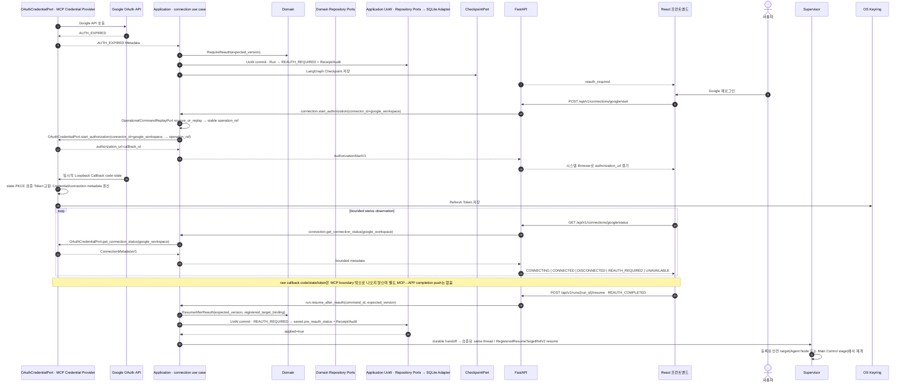

- Authorization Code와 Token 원문은 MCP Credential Provider 경계를 벗어나지 않는다.
- Write 전달 여부가 불명확한 시점의 인증 오류는 `UNKNOWN_RESULT` 규칙을 우선한다.
- Checkpoint가 없으면 자동 재실행하지 않고 `RECOVERY_REQUIRED`로 전환한다.

### 16.1 재개 target 확인

`RegisteredResumeTargetRefV2(kind=MAIN_CONTROL)`의 closed stage는 다음과 같다.

```text
RETRIEVAL_ENTRY | PLANNING_ENTRY | REVIEW_ENTRY | PREFLIGHT
| READ_EXECUTION | VERIFICATION | RECOVERY | CANCEL_RESOLUTION
```

Reauth/Recovery에는 실제 suspend 직전 safe point에 해당하는 등록 target만 저장한다.

| 상황·target | 허용 순서 |
| --- | --- |
| `PREFLIGHT` | `Run=WAITING_APPROVAL`이고 current Write Attempt in-flight fact가 0인 **BeginExecutionAttempt 전 credential failure**에만 Reauth return target으로 허용한다. |
| `WAITING_APPROVAL + Attempt EXECUTING/uncertain` | preflight로 rewind하지 않는다. delivery/existing-result reconciliation 뒤 `VERIFICATION \| RECOVERY`로 간다. |
| `READ_EXECUTION` | `Run=EXECUTING + Legacy READ Action=EXECUTING + ExecutionAttempt 없음`의 AUTH_EXPIRED에만 허용한다. |
| `RETRIEVAL_ENTRY \| PLANNING_ENTRY \| REVIEW_ENTRY \| CANCEL_RESOLUTION` | Workflow의 external-control matrix가 요구하는 경우에만 발급한다. |
| `ACTION_EXECUTION` | resume target이 아니다. 승인형 Write dispatch 시작 뒤 generic execution replay는 0이다. |

## 17. 취소

`RequestCancel` 적용 뒤에는 신규 Claim·Write를 차단하고 이미 진행 중인 결과를 먼저 확정한다. 성공한 외부 Connector 변경은 롤백하지 않는다. 이미 성공한 Write가 있으면 취소 결과의 `result_kind`는 `PARTIAL`일 수 있다.

### 17.1 취소 요청과 Handoff

```mermaid
sequenceDiagram
    autonumber
    actor U as 사용자
    participant FE as React 프런트엔드
    participant API as FastAPI
    participant APP as Application
    participant DOM as Domain
    participant DB as Application UoW · Repository Ports → SQLite Adapter

    U->>FE: 실행 중단
    FE->>API: POST /api/v1/runs/{run_id}/cancel
    API->>APP: request_cancel
    APP->>DOM: request_cancel(expected_version)
    alt first checkpoint 존재
        APP->>DB: UoW stage · RequestCancel Receipt APPLIED + Run CANCEL_REQUESTED<br>earlier PENDING/DISPATCHED/BLOCKED_BINDING **without execution admission** SUPERSEDED + new WorkflowHandoff(PENDING, target=CANCEL_RESOLUTION, next run_sequence); admitted head is not retroactively revoked<br>같은 Transaction · durable cancel intent
        APP->>DB: COMMIT
        DB-->>APP: applied=true + handoff_id
        APP->>APP: post-commit schedule_run_execution(handoff_id, NORMAL_HANDOFF) → MAIN_CONTROL:CANCEL_RESOLUTION
    else Run=CREATED + first checkpoint 없음 + START=PENDING|BLOCKED_BINDING + execution admission 없음
        APP->>DB: UoW stage · RequestCancel Receipt APPLIED + Run CANCEL_REQUESTED + START SUPERSEDED; new RESUME handoff 0
        APP->>DB: COMMIT
        APP->>APP: run.continue_cancel_resolution 직접 조정; Agent/LLM/Connector/LangGraph 호출 0
    else Run=CREATED + first checkpoint 없음 + START=DISPATCHED + durable execution admission
        APP->>DB: UoW stage · RequestCancel Receipt APPLIED + Run CANCEL_REQUESTED; admitted START retroactive SUPERSEDED 0
        APP->>DB: COMMIT
        Note over APP,DB: cancel-induced Run.version advance makes old START admission authority-stale; release/settlement retires it via authority-aware admission semantics
        APP->>APP: current cancel authority continues; initialization/settlement yields Agent/LLM/Connector external effect 0
    end
    Note over APP,DOM: ContinueCancelResolutionHandler가 아래 existing lifecycle command들을 current durable child fact에 따라 조정
```

### 17.2 실행 전 작업과 Legacy READ 정리

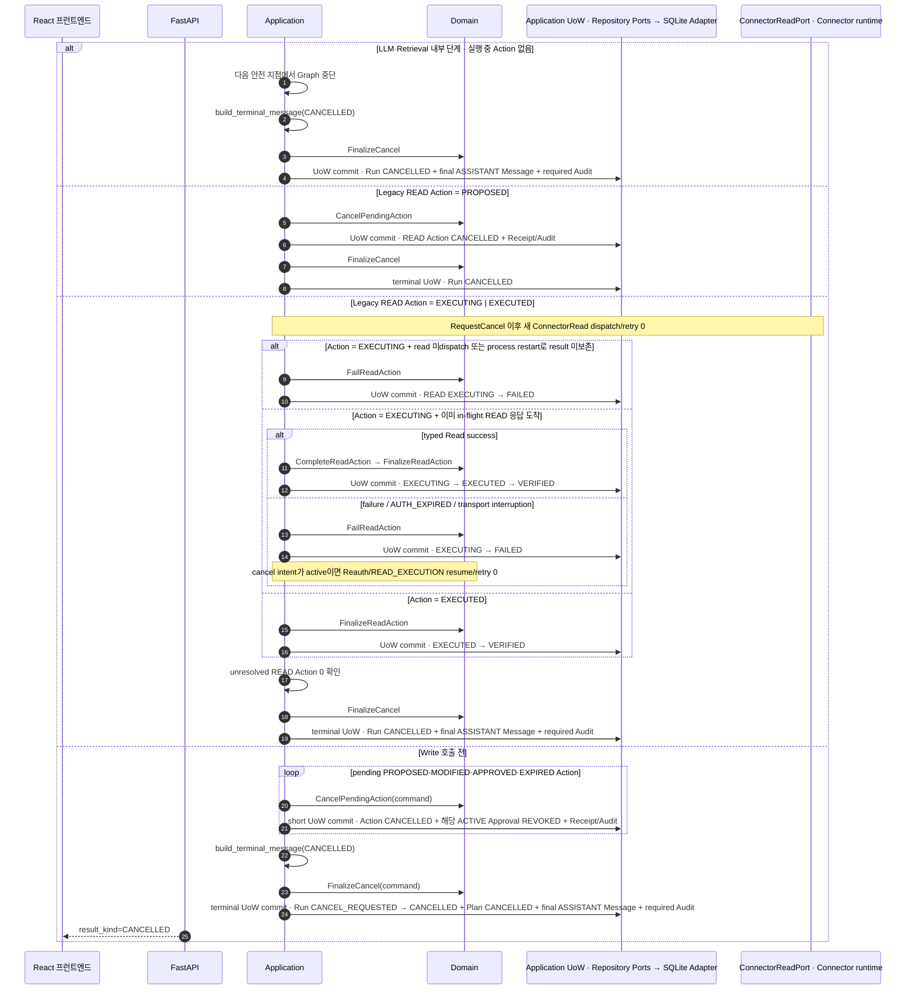

### 17.3 Claim 이후 Begin 이전 중단

```text
ClaimExecution COMMIT
→ Action EXECUTING + Attempt CLAIMED + Approval CONSUMED
→ [cancel / crash-restart / invalid ClaimContext / pre-Begin credential failure]
→ BeginExecutionAttempt = not applied
→ AbortClaimedExecution COMMIT
→ Attempt FAILED
→ Action CANCELLED (cancel intent) | FAILED (other pre-dispatch failure)
→ Provider Write = 0
→ FinalizeCancel 또는 existing retry/failwait path
```

Approval을 ACTIVE로 되돌리거나 새 Attempt를 자동 생성하지 않는다.

### 17.4 Write 전달 후 결과 확정과 취소 완료

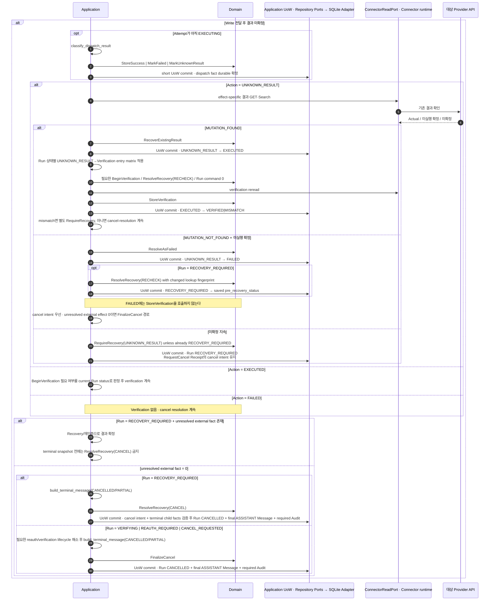

## 18. SSE 단절·브라우저 새로고침

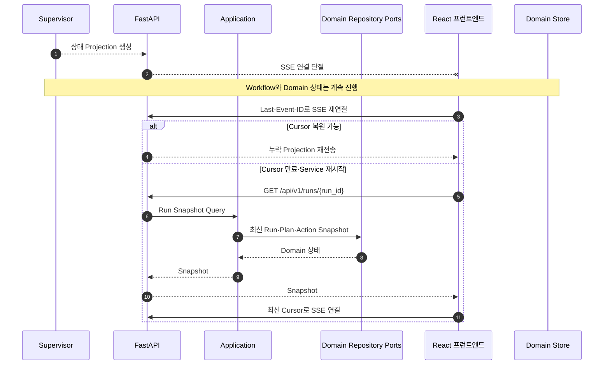

SSE 중복 Event는 `event_id`와 Aggregate Version으로 무시한다.

## 19. 앱 재시작과 Run 복구

이 절의 sequence는 §4 startup dependency gate와 startup-only `ReconcileInflightExecutionsHandler` drain이 완료된 **뒤의 workflow-handoff recovery phase**만 나타낸다. 현재 process의 live `EXECUTING` Attempt를 orphan으로 분류하지 않는다.

```mermaid
sequenceDiagram
    autonumber
    participant L as Launcher
    participant API as FastAPI
    participant APP as RedriveWorkflowHandoffsHandler
    participant REP as Domain/Handoff Repository Ports
    participant CP as CheckpointPort
    participant SCH as ScheduleRunExecutionHandler
    participant WEP as WorkflowExecutionPort
    participant DOM as Domain
    participant FE as React 프런트엔드

    L->>API: Local Service 재시작
    API->>APP: startup reconciliation pass
    APP->>REP: Open Run + Handoff + current Domain/child facts 조회
    APP->>CP: latest typed checkpoint 조회
    alt CONSUMED active lineage + current Domain fence PASS
        APP->>SCH: submission_kind=CONSUMED_CONTINUATION_RECOVERY
        SCH->>REP: claim/reuse recovery WorkflowExecutionAdmissionV1
        Note over SCH,REP: effective binding = latest descendant checkpoint · execution_kind=RESUME · expected Run version captured
        SCH->>WEP: submit(WorkflowExecutionSubmissionV2(admission))
        Note over APP,WEP: dispatch-head membership 0 · payload reinjection 0 · handoff status remains CONSUMED · original START/PREFLIGHT binding is not wire authority
    else Domain progress owner = REAUTH_REQUIRED|RECOVERY_REQUIRED|terminal
        APP->>APP: stale active lineage resume 금지
        APP-->>API: state-specific snapshot/coordinator result
    else Domain progress owner = CANCEL_REQUESTED
        APP->>APP: cancel-compatible continuation 또는 run.continue_cancel_resolution만 허용
        APP-->>API: cancelling snapshot
    else BLOCKED_BINDING dispatch head
        APP->>DOM: deterministic RequireRecovery(CHECKPOINT_MISMATCH)
        APP->>REP: matching RecoveryContext 확인 후 handoff SUPERSEDED
        APP-->>API: recovery_required
    else PENDING|DISPATCHED dispatch head
        APP->>SCH: submission_kind=NORMAL_HANDOFF
        SCH->>REP: claim or reuse persisted NORMAL execution admission
        SCH->>WEP: submit(WorkflowExecutionSubmissionV2(admission))
    else no handoff lane + State Contract SAFE gate PASS
        APP->>APP: run.resume_safe_checkpoint · source-state/binding/target guard
        APP->>SCH: existing durable handoff/schedule boundary
        SCH->>WEP: NORMAL_HANDOFF submit
    else WAITING_CONFIRMATION|WAITING_APPROVAL
        APP-->>API: snapshot/interrupt/approval restore only
    else EXECUTING|VERIFYING
        APP->>APP: generic SAFE resume 0 · live orphan execution reconciliation 0
        APP-->>API: current durable snapshot / already-staged state-specific continuation only
    else Checkpoint 유실 또는 충돌
        APP->>DOM: RequireRecovery(CHECKPOINT_MISMATCH)
        APP-->>API: recovery_required
    end
    API-->>FE: current durable snapshot / required user action
```

이미 `VERIFIED`인 Action과 `UNKNOWN_RESULT` 해결 전 Write는 재실행하지 않는다.

**Startup/live reconciliation 우선순위**

```text
Domain progress pre-admission check
→ stale admitted-head retirement
→ CONSUMED active-continuation admission/reuse
→ BLOCKED_BINDING Recovery reconciliation
→ PENDING/DISPATCHED dispatch-head admission/redrive
→ generic SAFE checkpoint evaluation
```

| 시점·조건 | 처리 |
| --- | --- |
| persisted DISPATCHED admission의 `expected_run_version`과 current `Run.version` 불일치 | WEP에 재제출하지 않는다. `release_execution_admission(..., AUTHORITY_EPOCH_CHANGED)`로 NORMAL을 `SUPERSEDED` 처리한 뒤 current coordinator를 재판정한다. |
| admission claim 이후 Domain authority 변경 | owner I/O 전 settlement CAS에도 같은 Run-version fence를 적용한다. |
| settlement mismatch = `AUTHORITY_STALE_RETIRED` | 같은 Transaction에서 stale NORMAL row는 `SUPERSEDED`, recovery admission은 clear된다. old owner I/O는 0이며 Application reconciliation이 state-specific coordinator를 선택한다. |
| `CONSUMED_CONTINUATION_RECOVERY` | latest checkpoint의 `active_handoff_id/run_sequence` lineage와 current Domain/child-fact/registered-target guard를 모두 통과할 때만 허용하는 내부 lane이다. `SAFE_CHECKPOINT_RESUME`가 아니다. |
| initial applied checkpoint보다 generation이 진행된 descendant | 같은 lineage이면 recover할 수 있다. 단 `REAUTH_REQUIRED \| RECOVERY_REQUIRED \| terminal` 또는 cancel-incompatible `CANCEL_REQUESTED`에서는 state-specific coordinator가 우선한다. |

generic SAFE source-state 금지를 우회하거나 완화하지 않는다.

### 19.1 Retrieval cache-loss restart sequence

```text
checkpoint/resume preparation
→ run.reconcile_retrieval_cache_restart
→ CheckpointPort latest GraphCheckpointEnvelopeV1 load
→ checkpoint.retrieval_cache_requirements 각각을 RunRetrievalCachePort.resolve_read_result(handle, run_id, route_id, query_identity_hash)로 검사
→ FOUND|EXHAUSTED이면 restart 0 / current target 계속 (`EXHAUSTED`는 NEXT_PAGE만 NO_MORE_PAGE)
→ MISSING|CROSS_RUN|BINDING_MISMATCH이면 stale local handles 사용 0
→ trigger = system:retrieval-cache-restart:<run_id>:<checkpoint_generation>
→ WorkflowHandoffRepository.get_by_trigger_command_id(trigger)
→ existing row면 reuse, 없으면 RETRIEVAL_CACHE_RESTART handoff short-UoW stage
→ commit 후 run.schedule_run_execution
→ MAIN_CONTROL:RETRIEVAL_ENTRY
→ frozen RequestIntent/InputRoute + preserved RunBudget/exclusion obligation로 fresh read
```

Normal external-control handoff가 먼저 admission되어 있었다면 그 one-shot control을 checkpoint에 적용·settle한 뒤, semantic owner I/O 전에 같은 prerequisite Handler를 호출한다. 따라서 old PENDING handoff를 건너뛰거나 control payload를 잃지 않고, cache restart row는 settled predecessor 다음 `run_sequence`로 stage된다. Background/LangGraph adapter는 Handler를 drive할 뿐 WorkflowHandoffRepository를 직접 mutate하지 않는다.

### 19.2 Begin Commit 이후 process loss

`BeginExecutionAttempt` Commit 뒤 dispatch result persistence 전에 process가 사라지면, restart에서 Provider 호출 여부를 추측하지 않는다.

| 순서 | 재시작 처리 |
| --- | --- |
| 1. startup-only reconciliation | `execution_attempt.reconcile_inflight_executions` batch Command가 deterministic system identity로 `MarkUnknownResult(MAY_HAVE_BEEN_SENT)`를 apply/replay한다. |
| 2. 기존 결과 확인 | durable `UNKNOWN_RESULT_UNRESOLVED` candidate가 existing-result lookup을 수행한다. |
| 3. 회수된 결과 검증 | recovered `EXECUTED_AWAITING_VERIFICATION` candidate가 Verification handoff를 처리한다. |

각 중간 Commit 뒤 process loss가 발생해도 다음 startup이 이어간다. original Connector Write replay는 0이다.

## 20. MCP 프로세스 장애

```mermaid
sequenceDiagram
    autonumber
    participant APP as Application
    participant MCP as MCPClientPort · Connector Runtime
    participant G as 대상 Provider API
    participant DOM as Domain

    MCP--xAPP: 프로세스 종료 감지
    APP->>APP: 신규 Tool 호출 일시 차단
    APP->>MCP: 자식 프로세스 재시작 최대 1회
    MCP-->>APP: Tool 목록·Schema Version

    alt Read 호출 전 또는 미전달
        APP->>MCP: 정책에 따른 Read 재시도
    else Write 전달 가능성 없음
        APP->>APP: ClassifyDispatchResult → NOT_SENT
        APP->>DOM: MarkFailed(delivery_certainty=NOT_SENT)
    else Write 전달 가능성 있음
        APP->>APP: ClassifyDispatchResult → MAY_HAVE_BEEN_SENT | SENT_RESPONSE_LOST
        APP->>DOM: MarkUnknownResult
        APP->>MCP: GET 또는 Resource Search만 수행
        MCP->>G: 기존 결과 확인
    end
```

Write는 Transport 오류만으로 즉시 재전송하지 않는다.

## 21. LLM Runtime 검사·선택·호출

### 21.1 LOCAL_CAPABLE 검사

```text
Application startup or Settings recheck
→ Ollama loopback probe
→ installed model inventory read
→ supported model filter (qwen3.5:9b | qwen3.5:4b)
→ one available: select it
→ both available: preserve valid preference or request user selection
→ no model / inspection failure: distinct unavailable projection
→ Runtime Detail projection with selected and actual model
```

검사는 설치·pull·download side effect를 만들지 않는다. Browser가 endpoint/path/model tag를 공급하지 않으며 재검사가 진행 중 Run의 binding을 변경하지 않는다.

### 21.2 Product LLM 호출 binding

```text
Agent/Application semantic operation
→ PromptRef + requested_mode + InferenceTierV1
→ StructuredInferencePort
→ StructuredInferenceRuntimeRouter
→ verified LocalModelProductDecisionV2.active_profile lookup + ModelManifestV2 binding validation
→ resolved Ollama model OR allowed API runtime
→ StructuredInferenceResultV2(actual_runtime, provider, model, local_model_profile_id, inference_tier)
```

LLM output은 tier/model을 선택하지 않는다. `WORKER` failure가 자동으로 `REASONING` 재호출을 만드는 규칙은 두지 않으며, 허용된 substitution/fallback은 03/10 Release policy와 13 Gate에서만 정의한다.

### 21.3 선택한 Runtime 호출

```mermaid
sequenceDiagram
    autonumber
    participant SUP as Supervisor
    participant LR as LLM Router
    participant O as Ollama
    participant P as API LLM Provider
    participant DB as Trace·Checkpoint

    SUP->>LR: Agent Structured Output 요청
    alt Gemini 선택
        LR->>P: API 호출
        P-->>LR: Structured Output
    else Local AI 선택
        LR->>O: Local 호출
        O-->>LR: 결과 또는 오류
        Note over LR: Gemini 또는 다른 Local model로 자동 전환 금지
    end
    LR->>DB: actual_runtime·model·fallback reason·usage
    LR-->>SUP: 검증된 Agent Result
```

## 22. 앱 정상 종료

```
Launcher 종료 요청
→ 신규 Run·승인 Command 차단
→ 실행 중 Write의 전달 여부 확인
→ 결과 저장 또는 UNKNOWN_RESULT
→ LangGraph Checkpoint Flush
→ SQLite Connection 종료
→ MCP 자식 프로세스 종료
→ FastAPI 종료
→ Launcher 종료
```

브라우저 탭을 닫는 것만으로 Local Service를 강제 종료하지 않는다.

## 23. Workflow Phase·Run Status·주요 Event 매핑

아래는 현재 시퀀스의 상태·표시 매핑이다. Phase 자체가 Domain 상태를 변경하는 Command는 아니다.

| Workflow Phase | Run Status | SSE Event |
| --- | --- | --- |
| `REQUEST_UNDERSTANDING` | `ANALYZING` | `phase_changed` |
| `TOOL_ROUTING` | `ANALYZING` | `tool_routing` |
| `RETRIEVAL` | `RETRIEVING` | `retrieval_progress` |
| `WAITING_CONFIRMATION` | `WAITING_CONFIRMATION` | `confirmation_required` |
| `WORK_ANALYSIS` | `ANALYZING` | `analysis_progress` |
| `PLANNING` | `PLANNING` | `plan_updated` |
| `REVIEW` | pre-publish=`PLANNING`; published re-review=`WAITING_APPROVAL \| VERIFYING` — Review 자체는 Run status를 변경하지 않음 | `phase_changed`; disposition이 `BeginPlanning/RequestConfirmation/BlockRun`을 적용하면 해당 command/event가 별도 반영 |
| `WAITING_APPROVAL` | `WAITING_APPROVAL` | `approval_required` |
| `PREFLIGHT`, `ACTION_EXECUTION` | 승인형 Write는 `WAITING_APPROVAL` 유지 · Legacy/호환 경로만 `EXECUTING` 가능 | `action_status` |
| `VERIFICATION` | `VERIFYING` | `verification_result` |
| `RECOVERY` | `RECOVERY_REQUIRED` | `recovery_required` |
| `RESPONSE_SYNTHESIS` | terminal command 적용 전 현재 비Terminal/terminal candidate 상태 | 없음 — deterministic terminal message input 생성 |
| `TERMINAL_COMMIT` | terminal lifecycle handler 적용 후 `COMPLETED \| BLOCKED \| FAILED \| CANCELLED` | terminal commit 이후 다음 단계에서 projection |
| `FINALIZE` | Terminal | `completed` 또는 `error` |

## 24. Transaction 경계 요약

주요 저장 대상과 외부 호출 시점을 요약한다. 개별 시퀀스의 전체 UoW 목록을 대체하지 않는다.

| 구간 | DB Transaction | 외부 호출 |
| --- | --- | --- |
| Run 시작 | Run·User Message 원자 저장 | 없음 |
| Agent LLM 호출 | 없음 | API LLM 또는 Ollama |
| Connector Read | 없음 | MCP·Provider API |
| Plan 저장 | Plan·Action·Evidence Batch | 없음 |
| 승인 | Approval·Action·Audit | 없음 |
| 실행 Claim | Action·Approval·Attempt(`CLAIMED`) + Receipt/Audit | 외부 호출 없음; Claim Commit은 dispatch authority가 아님 |
| 실행 Attempt 시작 | Attempt `CLAIMED → EXECUTING` + Receipt/Audit | `BeginExecutionAttempt`가 current ClaimContext + cancel-intent guard를 adjudicate하고 COMMIT(`applied=true`); Transaction 종료 뒤에만 Write. 이후 Cancel은 in-flight result-resolution 규칙 |
| Write 결과 저장 | Attempt·Action·ResourceRef | Write 완료 이후 |
| 검증 저장 | Verification·Action only | GET 완료 이후. Run lifecycle은 `BeginVerification` / 별도 `RequireRecovery` / terminal command가 소유 |
| Answer-only 완료 | Run Terminal·final ASSISTANT Message·required Audit 같은 UoW; Trace/SSE는 post-commit projection | 없음 |

## 25. 오류 처리 우선순위

| 오류 | 후속 처리 |
| --- | --- |
| `APPROVAL_INVALID·POLICY_BLOCKED·VERSION_CONFLICT` | Write 호출 금지. |
| `AUTH_EXPIRED` | `REAUTH_REQUIRED`·Checkpoint 재개. |
| `RATE_LIMITED·UPSTREAM_5XX` | Read는 제한 재시도 또는 부분 결과. Write는 전달 여부 확인 후 처리. |
| `TIMEOUT·MCP_UNAVAILABLE` | Write 전달 가능성에 따라 `FAILED` 또는 `UNKNOWN_RESULT`. |
| `VERIFICATION_MISMATCH` | 자동 수정 금지·사용자 Recovery. |

## 26. Command Receipt 시퀀스

```
Route가 Request 검증
→ Application이 Canonical Request Hash 생성
→ BEGIN IMMEDIATE
→ command_receipts 조회
→ 신규면 RECEIVED Insert
→ Domain 변경·Audit
→ Receipt APPLIED 또는 REJECTED
→ COMMIT
```

- 동일 `command_id`·동일 Hash면 저장된 응답을 반환한다.
- 동일 ID·다른 Hash면 `DUPLICATE_COMMAND`다.
- HTTP 응답 유실 후 재전송도 새 Run·Approval·Attempt를 만들지 않는다.

## 27. 첨부파일 전달

### 27.1 수신 첨부파일

```
사용자 Download 선택
→ FastAPI Local Session 검증
→ MCP gmail_get_attachment
→ Gmail users.messages.attachments.get
→ FastAPI Stream
→ 사용자 파일
```

### 27.2 발신 첨부파일

```
사용자 파일 선택
→ /api/v1/attachments/stage
→ Descriptor + SHA-256
→ Action/Approval
→ Claim V2
→ MCP 실제 bytes size/hash 재검증
→ MIME Draft/Send
→ Google 재조회 Verification
```

첨부파일 bytes는 어느 시퀀스에서도 LLM·Agent Context를 통과하지 않는다.

## 28. 시퀀스 확인 항목

아래 항목은 기대 동작이며 구현·테스트 완료를 뜻하지 않는다.

| 확인 범위 | 기대 동작 |
| --- | --- |
| 요청·조회 | Tool Route Subgraph와 Retrieval Subgraph의 책임이 분리된다.<br>Tool Route가 IN/OUT Tool을 한 번 확정하고 Retrieval·Planning이 재선택하지 않는다.<br>Retrieval LLM이 MCP를 직접 호출하는 경로가 없고 결정적 Read Node만 허용 Tool 범위에서 호출한다.<br>Retrieval은 Run-scoped RAG를 거쳐 Evidence를 반환한다.<br>일반 Retrieval이 Action Row를 생성하지 않는다.<br>`RESOURCE_SELECTED`는 React→FastAPI→Application→Supervisor 경계를 지킨다.<br>07에 정의된 `ConnectorReadPort` read capability만 시퀀스에서 사용한다. |
| Answer-only·Legacy READ | Answer-only Run이 Plan·Action 없이 완료된다.<br>**Legacy/호환 READ-only Plan**은 승인 없이 실행된다. 새 Release Planning의 primary path가 아니다.<br>Legacy READ Action에는 Approval·Attempt·Verification Row가 없다.<br>Legacy READ Output Schema 실패는 `FAILED`로 저장된다. |
| Write·재시도 | Write는 Approval + `ClaimExecution` Commit만으로 호출되지 않는다. `ClaimContextV2`가 current이고 cancel intent가 없는 상태에서 `BeginExecutionAttempt`가 `applied=true`로 Commit되어 Attempt=`EXECUTING`이 된 뒤에만 정확히 한 번 호출된다. 그 Commit 이후 새 Cancel이 APPLIED되면 해당 Attempt는 in-flight로 분류해 결과를 먼저 확정하고 추가 Claim/Write는 금지한다.<br>승인 이후 LLM이 Arguments를 다시 생성하지 않는다.<br>`FAILED → MODIFIED → 새 승인`만 Write Retry로 허용된다.<br>`UNKNOWN_RESULT`에서 새 Attempt·Write가 차단된다.<br>일부 승인·부분 실패 시 성공 Action을 보존한다. |
| 재연결·복구 | SSE 단절과 브라우저 새로고침이 Write 재실행을 만들지 않는다.<br>OAuth 재인증은 같은 `langgraph_thread_id`의 안전한 Checkpoint에서 재개된다.<br>MCP 장애에서 Write 전달 가능성을 확인하기 전 자동 재전송하지 않는다. |
| Transaction·화면 경계 | 외부 호출 중 SQLite Transaction을 유지하지 않는다.<br>확인 응답 저장은 Application·Repository를 경유하며 FastAPI Route가 DB를 직접 수정하지 않는다.<br>`/health/ready`와 `/api/v1/runtime`의 책임이 분리된다. |
| Prompt 호출 | Supervisor는 Node만 Routing하고 선택된 Agent·Application Node가 PromptRef를 확정하는지 검증한다. |
