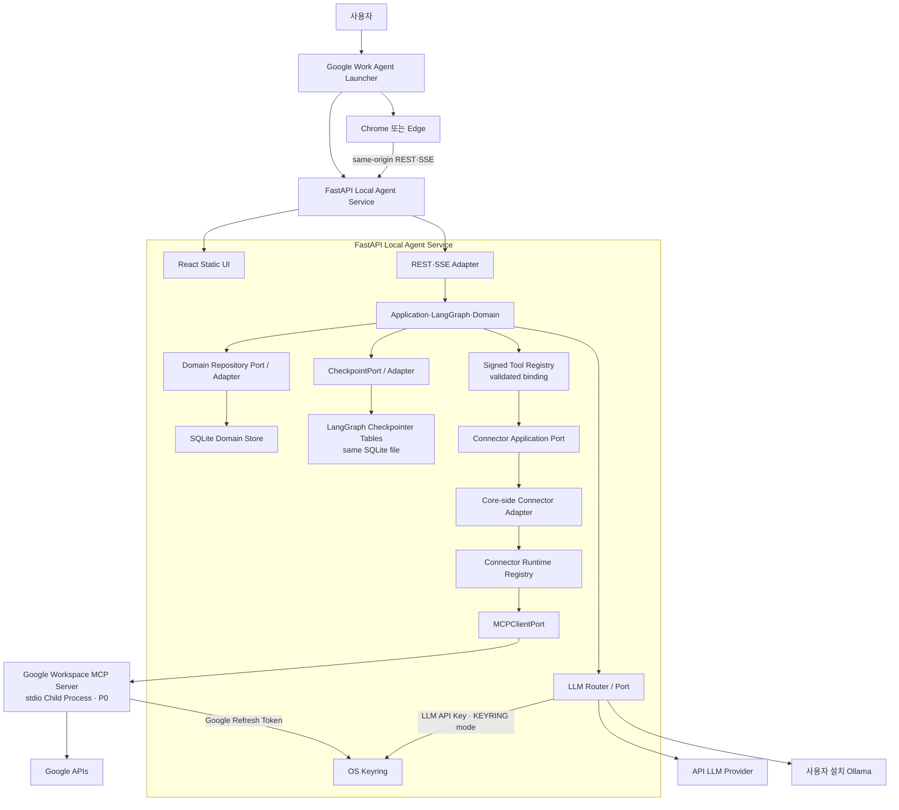
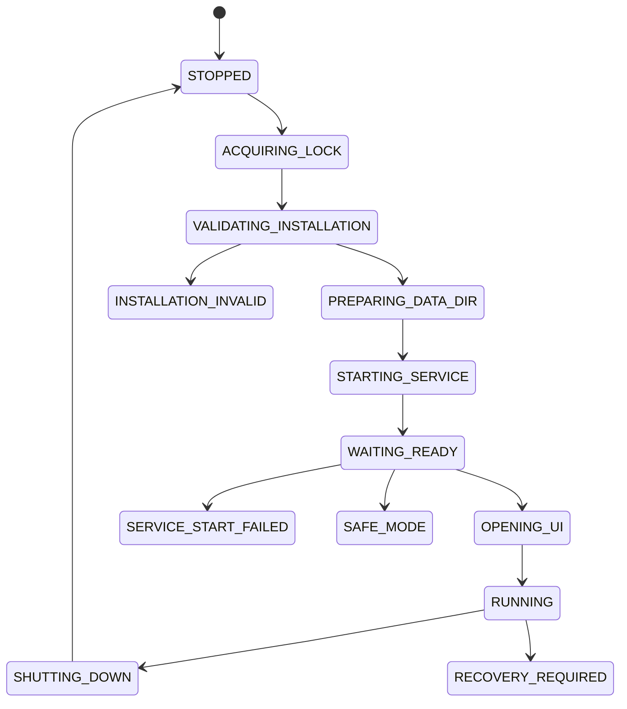
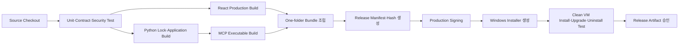

# 10. 인프라 · 환경 설정 설계서

> **Authority:** process lifecycle, packaging, environment, launcher, local runtime/config realization. Workflow/Domain semantics는 해당 owner를 따른다.

## 0. 문서 정보

- **문서명:** 10. Google Work Agent · 인프라 · 환경 설정 설계서
- **상태:** Draft v2.20
- **기준일:** 2026-08-26
- **대상:** P0 MVP
- **공식 운영체제:** Windows 11 x64
- **공식 브라우저:** 최신 Chrome·Microsoft Edge
- **설치 범위:** Windows 사용자별 설치
- **배포:** Production Code Signing이 적용된 Windows Installer
- **업데이트:** P0 수동 In-place Upgrade
- **제품 구조:** 로컬 단일 사용자 애플리케이션·원격 Backend 없음

## 1. 목적과 범위

이 문서는 Google Work Agent를 사용자의 Windows PC에 설치하고 실행하기 위한 Process, Packaging, Directory, Config, Installer, Upgrade, Backup, Health Check와 Release 계약을 정의한다.

이 문서가 소유하는 내용:

- Windows 지원 환경과 배포 프로필
- Launcher·FastAPI·MCP Process 생명주기
- Local API Bootstrap과 Session의 인프라 구현값
- OAuth Loopback Listener와 OS Keyring Namespace
- 설치·사용자 데이터 Directory와 ACL
- MCP Child Process 무결성·환경 격리
- 환경 설정 Schema와 우선순위
- API_ONLY·LOCAL_CAPABLE Packaging
- Ollama 연결·진단 경계
- Installer·Code Signing·Release Manifest
- Upgrade·Migration·Rollback
- Backup·Restore·보존
- 정상 종료·강제 종료·Crash Recovery
- Startup Health Check·Safe Mode
- CI Build·Release Artifact와 인프라 테스트

이 문서가 소유하지 않는 내용:

- OAuth Scope와 위협 모델 → `09`
- Domain Table·Migration SQL → `04`
- Agent State·Node·Budget → `06`
- REST·MCP Pydantic Schema → `07`
- 단계별 호출 순서 → `08`
- 로그·Trace·Audit Field → `11`
- 평가용 GPU·모델 기준 → `13`
- 운영자 대응 절차 → `14`

## 2. 핵심 결정

| ID | 결정 | 상태 |
| --- | --- | --- |
| `INF-001` | 제품 Runtime은 사용자 PC에서만 실행한다. | FIXED |
| `INF-002` | Windows 11 x64 사용자별 설치를 공식 지원한다. | FIXED |
| `INF-003` | Launcher가 FastAPI를 소유하고 FastAPI가 Connector MCP Runtime과 Connector별 `stdio` Child Process를 소유한다. | FIXED |
| `INF-004` | 운영 UI와 `/api/v1`은 같은 Loopback Origin에서 제공한다. | FIXED |
| `INF-005` | Python Runtime과 React Build는 제품 Bundle에 포함한다. | FIXED |
| `INF-006` | Packaging은 One-folder Application Bundle + Windows Installer를 사용한다. | FIXED |
| `INF-007` | P0 Installer는 사용자별 설치이며 관리자 권한을 요구하지 않는다. | FIXED |
| `INF-008` | P0 Update는 서명된 새 Installer를 통한 수동 In-place Upgrade다. | FIXED |
| `INF-009` | Production Installer와 Executable은 Code Signing을 필수로 한다. | FIXED |
| `INF-010` | Ollama는 제품이 설치·소유하지 않고 연결·Version·Model 상태만 진단한다. | FIXED |
| `INF-011` | Backup은 최근 5개와 최대 30일 중 먼저 도달한 기준으로 정리한다. | FIXED |

## 3. 지원 환경과 시스템 요구사항

### 3.1 공식 지원

- Windows 11 x64
- 최신 Chrome 또는 Microsoft Edge
- 사용자별 Windows 계정 1개
- 앱 Instance당 Connector별 활성 Credential Context는 1개를 기본으로 하며, P0 Google Workspace는 활성 Google 계정 1개
- 인터넷 연결: 활성 Connector Provider API와 API LLM 사용 시 필요
- Loopback 통신: `127.0.0.1` only

### 3.2 API_ONLY 최소 기준

- x64 CPU 4 Core 이상
- RAM 8 GB 이상
- 설치와 사용자 데이터용 여유 공간 2 GB 이상
- Ollama·GPU·Local Model 불필요

### 3.3 LOCAL_CAPABLE 기준

- API_ONLY 기준 충족
- 지원되는 Ollama Version
- Release Config에 등록된 제품 Model 존재
- GPU·VRAM 기준은 `13. 평가·실험 설계서`의 Release Gate 결과로 확정
- 기준 미달 환경은 API_LLM으로 고정

## 4. 배포 프로필

### 4.1 `API_ONLY`

포함:

- Launcher
- FastAPI Local Agent Service
- React Production Build
- LangGraph·Application·Domain과 deterministic Policy
- Connector MCP Runtime
- Google Workspace MCP Server (P0)
- SQLite Runtime·Migration
- API LLM Adapter
- 진단·Mock·Fixture Interface

제외:

- Ollama 설치 파일
- Local Model
- GPU 전용 Library
- Experiment Runner
- 후보 Model·Raw Result

### 4.2 `LOCAL_CAPABLE`

`API_ONLY` 구성에 다음을 추가한다.

- Ollama Adapter
- GPU·VRAM 진단
- Local Model Manifest 검사
- Local Runtime 설정 UI
- AUTO·LOCAL_GPU 실행 모드

제품 Installer는 Ollama 본체와 Model을 포함하지 않는다. 사용자가 별도로 설치한 Ollama에만 연결한다.

## 5. Runtime Process Architecture



원격 Backend, Nginx, Kubernetes, Redis, Queue와 Remote MCP는 두지 않는다.

외부 Provider 접근은 Connector별 MCP Server 자식 프로세스에 격리한다. FastAPI Local Agent Service는 Provider SDK/API Client를 생성하거나 직접 호출하지 않는다. Application은 Application-side Signed Tool Registry에서 validated Tool binding을 만든 뒤 abstract Connector Application Port만 사용한다. Service composition으로 주입된 Core-side Connector Adapter는 그 immutable binding과 Connector Runtime Registry·MCPClientPort/Transport만 소유·사용하며 Application의 concrete SignedToolRegistry를 import/call하지 않는다. Credential 적용과 Provider raw response/token 해석도 각 Connector MCP Server 내부 Adapter가 소유한다. Connector MCP가 시작되지 않거나 Tool Schema 검증에 실패하면 제품 Core가 Provider API 직접 호출로 fallback하지 않으며 해당 Connector 기능을 NOT_READY/Recovery로 처리한다. P0 Google Workspace는 이 공통 경계의 첫 구현이다.
### 5.1 Connector Runtime binding

- Process cardinality는 **registered connector_id당 active MCP child process 최대 1개**다. P0는 `google_workspace` 하나이므로 child 1개다.
- Service composition의 Connector Runtime Registry가 `connector_id → executable/manifest identity → process instance/stdio handle → handshake state`를 보존한다. 이 registry는 process-local composition data이며 Tool metadata authority가 아니다.
- `MCPClientPort.list_tools/call_tool/restart_once`와 `ConnectorReadPort/ConnectorWritePort/OAuthCredentialPort`는 connector_id를 전달하고 restart/health는 해당 child만 대상으로 한다.
- 신규 Connector 추가 시 새 generic runtime/service bucket을 만들지 않고 같은 runtime registry에 connector binding 하나와 해당 MCP Server process-side grammar를 등록한다.

### 5.2 Installed Connector Manifest

Connector process registration의 **유일한 설치/runtime source**는 `InstalledConnectorManifestV1`이다. 이 manifest는 Tool semantic Registry가 아니며 process launch/binding metadata만 소유한다.

Installed artifact:

```text
%LOCALAPPDATA%/Programs/GoogleWorkAgent/manifests/installed-connectors-v1.json
```

각 row의 closed fields:

```python
class InstalledConnectorEntryV1:
    schema_version: Literal[1]
    connector_id: str
    provider_namespace: str
    connector_package: str
    executable_path: str
    tool_projection_path: str
    mcp_schema_version: str

class InstalledConnectorManifestV1:
    schema_version: Literal[1]
    connectors: list[InstalledConnectorEntryV1]
```

P0 row는 정확히 다음 binding을 가진다.

```text
connector_id         = google_workspace
provider_namespace   = google
connector_package    = workspace
executable_path      = mcp/google_workspace/GoogleWorkspaceMcpServer.exe
tool_projection_path = manifests/connectors/google_workspace/tool-descriptor-projection-v1.json
```

`installed-connectors-v1.json`, `executable_path`, `tool_projection_path`는 모두 verified `release-manifest.json`의 `file_path + sha256` entry에 존재해야 한다. 독립 서명 규칙을 새로 만들지 않고 `release-manifest.sig → release-manifest.json → referenced file sha256` 공급망을 사용한다. Runtime은 verified Release Manifest에 없는 Connector row/path/hash를 등록하지 않는다.

Service composition은 이 manifest를 읽어 exact executable을 spawn하고 descriptor projection handshake를 검증한 뒤에만 `ConnectorRuntimeRegistry.register(connector_id, runtime_handle)`을 호출한다. `connector_id`를 executable 이름 parsing으로 추론하거나 composition에 provider별 hard-coded switch를 추가하지 않는다. 새 Connector는 이 manifest에 row 하나를 추가하고 16의 connector package/Tool mapping을 추가하는 동일 grammar를 따른다.

## 6. Process 소유권

| 실행 단위 | 소유자 | 종료 책임 |
| --- | --- | --- |
| Launcher | 사용자·Windows | 전체 제품 Process 정상 종료 조정 |
| FastAPI Service | Launcher | Command 차단·Checkpoint·DB Close 후 종료 |
| React UI | Browser | 탭 종료가 제품 Runtime 종료를 의미하지 않음 |
| MCP Server | FastAPI Service | Write 전달 여부 확인 후 종료 |
| Ollama | 사용자 또는 외부 설치 | 제품이 시작·종료·업데이트하지 않음 |

권장 Process Tree:

```
GoogleWorkAgentLauncher.exe
└─ GoogleWorkAgentService.exe
   └─ GoogleWorkspaceMcpServer.exe  # P0 registered Connector MCP Server

외부 Process
└─ ollama.exe
```

## 7. Launcher 상태 머신



여기서 Launcher의 `RECOVERY_REQUIRED`는 **인프라/프로세스 로컬 상태 표기**이며 Domain `Run.status=RECOVERY_REQUIRED`의 lifecycle semantics를 정의하거나 복제하는 권위가 아니다. 실제 Run 상태·허용 Command·Guard는 Domain State Transition Contract를 따르고, Launcher는 해당 Domain 상태와 Checkpoint를 조회해 시작/복구 동작을 조정한다.

### 7.1 시작 순서

1. 단일 Instance Lock 획득
2. Release Manifest와 설치 File 검사
3. 사용자 데이터 Directory·ACL 확인
4. Loopback 동적 Port 확보
5. Bootstrap Secret과 Service Instance ID 생성
6. FastAPI Service 시작
7. SQLite·Migration·Keyring 검사
8. MCP Child Process 시작·Schema 검증
9. configured LLM Adapter/Router load·Runtime 진단
10. §7.3의 startup-only execution reconciliation + initial handoff drain + live loop start
11. Readiness 성공 확인
12. Browser에서 Local URL 열기

### 7.2 두 번째 실행

이미 Launcher가 실행 중이면 새 Service를 만들지 않는다. 기존 Launcher Instance에 UI 열기 요청만 전달한다. P0 Instance 간 통신은 현재 사용자만 접근 가능한 Windows Named Pipe를 사용한다.


### 7.3 Durable workflow handoff startup + live reconciliation

10이 소유하는 것은 **Service lifecycle 상의 실행 순서와 loop lifetime**이다. Handoff status/target/admission semantics는 `04/06/07`을 다시 정의하지 않는다.

Canonical startup order:

```text
SQLite / Migration / Checkpoint readiness
→ Connector MCP child start + Tool/Schema validation
→ configured LLM Adapter/Router load
→ execution_attempt.reconcile_inflight_executions bounded startup drain
→ run.redrive_workflow_handoffs bounded initial drain
→ WorkflowHandoffReconciliationLoop start
→ READY
```

- `ReconcileInflightExecutionsHandler`는 **startup process-loss reconciliation only**다. Live loop가 호출하지 않으며 current-process `EXECUTING` Write를 orphan으로 분류하지 않는다.
- `RedriveWorkflowHandoffsHandler`는 startup initial drain과 service-live reconciliation에서 공통으로 호출되는 Application owner다. `WorkflowHandoffReconciliationLoop`는 wake/timer를 제공하는 driving adapter일 뿐 Repository/Domain/WEP/LangGraph semantics를 소유하지 않는다.
- 두 startup drain은 bounded batch를 반복하되 `has_more=false`, actionable row 없음, 또는 durable progress 없음에서 멈춘다. 한 번의 batch limit 밖 row를 영구적으로 굶기지 않는다.
- READY는 dependency readiness, startup-only execution reconciliation, initial handoff reconciliation, live-loop start가 완료된 뒤에만 publish한다.

Handoff reconciliation precedence, admission/supersession/CAS, registered target legality, retrieval-cache restart의 semantic rule은 `04/05/06/07`을 참조한다. Infrastructure 문서에서 그 알고리즘을 복제하지 않는다.

### 7.4 Non-Domain operational command reservation · crash recovery

`OperationalCommandReplayPort`는 non-Domain side effect를 위한 **crash-safe reservation journal**이다. Infrastructure가 소유하는 것은 reservation store의 durability와 process/restart behavior이며, operation별 callable 이름과 typed result는 `07 Interface`가 소유한다.

- 새 command는 side effect 전에 server-owned `operation_ref`와 `RESERVED` 상태를 atomic write + fsync한다.
- same command/hash가 unresolved이면 blind side-effect replay보다 operation-specific reconciliation을 먼저 수행한다. `COMPLETED | SAFE_TO_RETRY | UNCERTAIN` 의미는 07 typed contract를 따른다.
- same command_id + different hash는 conflict이며 기존 reservation을 덮어쓰지 않는다. Secret, raw OAuth callback/token, raw attachment bytes는 journal에 저장하지 않는다.
- Service restart로 process-local fact가 사라질 수 있는 operation과 filesystem/keyring/provider에서 durable completion evidence를 확인해야 하는 operation을 동일한 private heuristic으로 합치지 않는다. 각 Adapter는 07에 등록된 reconcile surface를 구현한다.

#### Replay store realization

P0 `FilesystemOperationalCommandReplayAdapter`는 non-Domain reservation을 Domain SQLite와 분리된 Local App Data current-user ACL 영역에 저장한다. Atomic replace + fsync 또는 동등한 durability primitive가 필요하며 exact file format은 adapter-local이다.

Filesystem artifact operation은 stable `operation_ref`를 temp/final identity와 연결해 crash 후 같은 artifact를 식별할 수 있어야 한다. Attachment staging replay는 descriptor/ref만 receipt에 남기고 bytes는 staging area에 둔다. Staged object가 만료·삭제되었으면 same command replay는 deterministic expired result를 반환하며 같은 command id로 두 번째 copy를 만들지 않는다.

Settings/OAuth/credential/backup/restore/diagnostics/shutdown/attachment별 exact reconciliation callable과 result identity는 `07 §Non-Domain operational command replay authority`를 참조한다. 10에서 그 목록을 복제하지 않는다.

## 8. 보안·인프라 공동 계약

이 절은 `09. 보안·Auth 설계서`가 참조하는 구현 계약이다. 09는 위협·허용·차단 근거를 소유하고, 10은 Process·Config·실패 동작을 소유한다.

### 8.1 `SEC-INF-001` Local Bind·Port

- Bind: `127.0.0.1` only
- Port: OS가 할당한 동적 Port
- UI와 API: same-origin
- `0.0.0.0`, LAN Interface, Public Bind 금지
- Host Allowlist는 현재 Service의 `127.0.0.1:<port>` 하나다.

### 8.2 `SEC-INF-002` Bootstrap Secret

- CSPRNG 256 bit
- 1회 사용
- TTL 60초
- Launcher·FastAPI Memory에만 존재
- Browser URL Fragment로 전달하고 Query Parameter는 금지
- React는 교환 직후 Fragment를 제거
- SQLite·Settings·Log·Browser History 저장 금지
- 재사용·만료·Service Instance 불일치 시 차단

### 8.3 `SEC-INF-003` Local Session

- HttpOnly Session Cookie
- `SameSite=Strict`
- Session은 Service Instance ID와 결합
- FastAPI 재시작 시 전체 무효화
- 브라우저 영구 저장소에 Session Token 저장 금지
- Session Cookie 이름은 Service Instance별 Random Suffix를 사용
- Local HTTP에서 `Secure` 적용 가능성은 Browser Compatibility Test로 검증하며 적용 불가 시 Host·Origin·Fetch Metadata를 필수 방어로 사용

### 8.4 `SEC-INF-004` Local Request 검증

상태 변경 요청은 다음 공통 검증을 모두 통과한다.

```
Host Allowlist
Origin Allowlist
Fetch Metadata
Local Session
Content-Type
Pydantic Schema
command_id
```

추가 concurrency field는 Command 종류에 따라 닫힌 계약으로 적용한다.

```
Domain Aggregate mutation
→ target aggregate id + expected_version 필수

Non-Domain operational mutation
→ operation-specific Versioned Request Schema
→ 해당 concern이 별도 versioned target/revision을 정의한 경우에만 그 revision 필수
→ Domain expected_version을 임의 생성·재사용 금지
```

`command_id`가 있는 요청의 same-ID replay/hash-conflict 규칙은 07 Interface·09 Security의 Application command envelope을 따른다. 운영 빌드에서 Wildcard CORS와 API 문서 UI를 비활성화한다.

### 8.5 `SEC-INF-005` OAuth Loopback

- Listener Host: `127.0.0.1`
- Port: 인증 시점 동적 할당
- Listener는 인증 진행 중에만 실행
- PKCE Verifier와 `state`는 Process Memory에만 저장
- 동시 인증은 한 계정·한 Environment당 하나
- Callback 성공·실패·만료 후 Listener 즉시 종료
- Local Service Port와 OAuth Callback Port는 분리 가능

### 8.6 `SEC-INF-006` OAuth Environment 분리

`dev`, `staging`, `prod`는 다음을 별도로 가진다.

- Google Cloud Project
- Desktop OAuth Client
- Consent Screen
- Application ID
- Keyring Namespace
- Build Channel
- Release Artifact

운영 Build에 개발·스테이징 OAuth Client를 포함하지 않는다.

### 8.7 `SEC-INF-007` Keyring Namespace

```
Service: GoogleWorkAgent/<environment>/<credential-type>
Account: <google-account-id 또는 provider-id>
```

예:

```
GoogleWorkAgent/prod/google-oauth
GoogleWorkAgent/prod/llm-api-key
```

Google Refresh Token과 LLM API Key는 서로 다른 Entry를 사용한다.

### 8.8 `SEC-INF-008` Credential Lifecycle

- Refresh Token: OS Keyring
- LLM API Key: OS Keyring 또는 현재 Session Memory
- Access Token: Process Memory
- PKCE Verifier: 인증 Memory
- Bootstrap Secret: Launcher·Service Memory
- 연결 해제: 해당 Google Keyring Entry 삭제
- API Key 삭제: Provider Entry 삭제
- Uninstall 기본 동작: Google OAuth Refresh Token과 LLM API Key Keyring Entry 삭제
- SQLite DB·Backup·Settings는 기본 보존
- 완전 삭제 선택: 보존 데이터와 Log·Diagnostic까지 추가 삭제
- Keyring 접근 실패 시 Plain File Fallback 금지

### 8.9 `SEC-INF-009` File ACL

사용자 데이터 Directory는 다음 Principal만 접근한다.

- 현재 Windows 사용자
- `SYSTEM`

다른 일반 사용자에게 상속된 읽기·쓰기 권한을 제거한다.

적용 대상:

- SQLite DB·WAL·SHM
- Backup
- Settings
- Log
- Diagnostic Bundle
- Runtime Lock·Marker

### 8.10 `SEC-INF-010` MCP Executable Integrity

- 절대 경로 실행
- PATH Search 금지
- Shell 실행 금지
- Argument List 방식
- 고정 Working Directory
- Release Manifest Hash 검증
- Executable Signature 검증
- MCP Version·Tool Schema Version Pinning
- Tool Registry에 금지 Tool이 있으면 Startup 차단

### 8.11 `SEC-INF-011` MCP Environment Allowlist

MCP Child Process에는 필요한 환경 변수만 전달한다.

허용 예:

```
APP_ENV
MCP_SCHEMA_VERSION
GOOGLE_OAUTH_ENV
GOOGLE_OAUTH_CLIENT_ID
TZ
TEMP
TMP
```

Production의 `GOOGLE_OAUTH_ENV`와 `GOOGLE_OAUTH_CLIENT_ID`는 ambient user/process environment에서 읽는 configuration source가 아니다. Launcher가 검증한 `SignedBuildConfigV1`에서 Service startup composition으로 전달된 non-secret value를 Connector MCP child environment에 allowlist injection한다. LLM API Key, Bootstrap Secret, Local Session, 전체 Parent Environment를 전달하지 않는다. Google user Credential은 Keyring Adapter를 통해 필요한 시점에만 읽는다. `GOOGLE_OAUTH_CLIENT_SECRET`은 allowlist/signed-config schema에 존재하지 않으며 P0 child process에 주입하는 대체 provisioning path도 없다. `EXPLICIT_DEVELOPMENT`에서만 MCP Credential Provider가 repository-root `.env.local`의 optional compatibility credential을 직접 읽고 process memory에서 token grant input으로 사용할 수 있다.

### 8.12 `SEC-INF-012` Installer Signature

- 개발자 PC 내부 전용 Development Build: 미서명 허용
- 팀 외부 또는 팀원에게 배포되는 Staging·External Test Installer와 Executable: Code Signing 필수
- Production Installer: Code Signing·Timestamp 필수
- Production Launcher·Service·MCP Executable: Code Signing·Timestamp 필수
- 서명 검증 실패 Artifact는 설치·실행하지 않는다.

### 8.13 `SEC-INF-013` Release Manifest

Production Artifact는 다음 파일을 포함한다.

```
release-manifest.json
release-manifest.sig
```

Manifest의 canonical schema는 `release/generate_release_manifest.py`가 소유하는 다음 closed type이다.

```python
class ReleaseManifestFileV1:
    file_path: str
    file_size: int
    sha256: str

class ReleaseManifestV1:
    schema_version: Literal[1]
    app_version: str
    build_channel: str
    deployment_profile: Literal["API_ONLY", "LOCAL_CAPABLE"]
    oauth_env: Literal["DEVELOPMENT", "STAGING", "PRODUCTION"]
    oauth_client_id: str
    api_contract_version: str
    mcp_schema_version: str
    policy_version: str
    database_migration_version: str
    files: list[ReleaseManifestFileV1]
```

`release-manifest.json`은 `ReleaseManifestV1`의 canonical serialization이다. `file_path/file_size/sha256`은 top-level 반복 field가 아니라 `files[]` entry다. Unknown top-level/file-entry field와 duplicate `file_path`는 fail-closed한다. Launcher는 내장된 Release Public Key로 Manifest Signature를 검증하고 주요 Executable·Schema·Frontend Asset Hash를 확인한다. `oauth_client_id`는 non-secret Desktop OAuth client identity다. P0는 `client_secret`을 요구하지 않으므로 Manifest·Installer·Keyring·환경 변수·CLI에 이를 포함하거나 별도 provisioning path를 만들지 않는다.

#### Signed Build Config single authority

Production에서 별도 `build-config.json`, `.env`, unsigned settings file을 두지 않는다. **`release-manifest.json + release-manifest.sig`가 Signed Build Config의 유일한 설치 Artifact authority**다. Signature/hash 검증이 성공한 Manifest에서 Launcher가 다음 typed projection을 materialize한다.

```python
class SignedBuildConfigV1:
    schema_version: Literal[1]
    app_version: str
    build_channel: str
    deployment_profile: Literal["API_ONLY", "LOCAL_CAPABLE"]
    oauth_env: Literal["DEVELOPMENT", "STAGING", "PRODUCTION"]
    oauth_client_id: str
    api_contract_version: str
    mcp_schema_version: str
    policy_version: str
    database_migration_version: str
```

- `release/generate_release_manifest.py → generate_release_manifest()`가 이 field set을 포함한 signed artifact input을 생성한다.
- `launcher/verify_installation.py → verify_installation()`이 signature와 referenced file hash를 검증한다.
- 검증 성공 뒤에만 `launcher/release_build_config.py → load_signed_build_config()`가 `SignedBuildConfigV1`을 만든다. Loader가 signature verifier를 복제하거나 raw unsigned file을 fallback으로 읽지 않는다.
- `launcher/start_service.py → start_service()`는 이 검증된 projection을 Service startup composition에 전달한다. exact process-bootstrap serialization은 launcher-private implementation choice지만, Service가 ambient environment/Settings에서 signed-locked field를 다시 해석하는 두 번째 authority는 금지한다.
- Service는 여기서 받은 `oauth_env/oauth_client_id`만 `GOOGLE_OAUTH_ENV/GOOGLE_OAUTH_CLIENT_ID`로 Connector MCP child에 allowlist injection한다. Production MCP Credential Provider는 이 값과 Keyring user credential을 결합하며 React/FastAPI wire가 OAuth client identity를 공급하지 않는다. `client_secret` field/environment/keyring/installer channel은 P0에 존재하지 않는다.

Production signed-locked fields는 `APP_VERSION | BUILD_CHANNEL | DEPLOYMENT_PROFILE | OAUTH_ENV | OAUTH_CLIENT_ID | API_CONTRACT_VERSION | MCP_SCHEMA_VERSION | POLICY_VERSION | DATABASE_MIGRATION_VERSION`이며 Launcher runtime argument나 User Settings로 override할 수 없다.

### 8.14 `SEC-INF-014` Upgrade·Downgrade

- P0는 자동 Update를 지원하지 않는다.
- 서명된 새 Installer를 통한 수동 In-place Upgrade만 지원한다.
- Upgrade 전 앱 정상 종료와 Active Write 확인이 필요하다.
- Migration 전 Backup을 생성한다.
- 더 낮은 App·Schema Version 설치는 기본 차단한다.
- 개발 환경의 명시적 Override만 Downgrade를 허용한다.

### 8.15 `SEC-INF-015` Backup·Restore

Backup 포함:

```
SQLite DB
Backup Manifest
비민감 Settings 선택본
```

Backup 제외:

```
OAuth Token
LLM API Key
Bootstrap Secret
Local Session
Run Retrieval Cache
Temporary File
Gmail 전체 원문
```

Backup은 최근 5개·최대 30일 중 먼저 도달한 기준으로 정리한다.

### 8.16 `SEC-INF-016` Diagnostic Bundle

포함 가능:

- App·Build·Contract Version
- Sanitized Log
- Health Check 결과
- Process 상태
- Migration·Integrity 결과
- 최근 오류 코드
- Hardware 요약

포함 금지:

- OAuth Token·LLM API Key
- Authorization Header
- Bootstrap Secret·Session
- Gmail 전체 본문
- Approval Snapshot 전체
- 사용자 Home Path
- 장치 고유 ID

외부 공유 전에 사용자 Preview와 명시적 저장 동작을 요구한다.

### 8.17 `SEC-INF-017` Graceful Shutdown

```
신규 Run·승인 Command 차단
→ `WorkflowExecutionPort.begin_shutdown`으로 새 background submit 차단
→ 진행 중 Write 전달 여부 확인
→ 결과 저장 또는 UNKNOWN_RESULT
→ `WorkflowExecutionPort.await_drained`로 bounded worker drain
→ LangGraph Checkpoint Flush
→ SQLite WAL Checkpoint·Connection Close
→ MCP 종료
→ FastAPI 종료
→ Runtime Lock·Secret 제거
→ Launcher 종료
```

Graceful Shutdown 기본 Timeout은 30초다.

### 8.18 `SEC-INF-018` Crash Recovery

다음 시작 시 Launcher와 Service는 다음을 검사한다.

- `shutdown.marker`
- Open Run
- `EXECUTING`, `UNKNOWN_RESULT`, `MISMATCH` Action
- SQLite Integrity
- Domain·Checkpoint 일치
- MCP 전달 가능성

이미 `VERIFIED`인 Write는 재실행하지 않는다. `UNKNOWN_RESULT` 해결 전 새 Attempt·Write를 만들지 않는다.

### 8.19 `SEC-INF-019` Ollama Isolation

- Ollama Endpoint는 Loopback만 허용
- 제품은 Ollama 설치·시작·종료·Update를 소유하지 않음
- Google Credential·Keyring 접근 권한을 제공하지 않음
- MCP Tool 직접 호출 금지
- 지원 Version과 Model ID만 허용
- 명시적 `LOCAL_GPU` 실패 시 API 자동 전환 금지
- AUTO는 기술 오류에서 API Fallback 최대 1회

### 8.20 `SEC-INF-020` Config·Secret Injection

운영 Secret은 `.env`, Settings JSON, Release Manifest, Command Line Argument에 저장하지 않는다.

Config 우선순위는 **runtime-overridable field에만** 적용한다.

```
Launcher Runtime Argument
→ Signed Build Config
→ User Settings
→ Product Default
```

`SEC-INF-013`의 Production signed-locked build identity/version/OAuth fields는 이 precedence의 override 대상이 아니며 verified `SignedBuildConfigV1` 값이 최종 authority다. 개발·CI에서만 Environment Variable을 configuration source로 허용한다.

### 8.20-A Hardware probe value contract

`HardwareProbePort.probe()`의 canonical result는 다음 `HardwareProfileV1`이다. 이 값은 runtime selection/diagnostics 입력이며 secret이나 persistent Domain state가 아니다.

```python
class HardwareProfileV1:
    schema_version: Literal[1]
    cpu_logical_cores: int
    ram_total_bytes: int
    gpu_present: bool
    gpu_name: str | None
    vram_total_bytes: int | None
    ollama_available: bool
    ollama_version: str | None
    local_runtime_eligible: bool
```

- `cpu_logical_cores >= 1`, `ram_total_bytes > 0`.
- GPU가 없으면 `gpu_name/vram_total_bytes=None`.
- `local_runtime_eligible`은 13의 현재 Release hardware/model gate와 Ollama readiness를 deterministic하게 적용한 결과이며 LLM이 결정하지 않는다.
- 이 Profile은 diagnostics에 bounded metadata로 노출할 수 있지만 machine-unique identifier를 추가하지 않는다.

### 8.21 Run Budget · External Component Circuit configuration

01 NFR-022 / 01-B `POL-RES-003`의 runtime guard를 위해 User Settings/Product Default는 다음 **양의 정수** configuration을 제공한다. 정확한 shipped default 숫자는 Release Config가 소유하며 semantic correctness는 값 자체가 아니라 bounded/positive validation과 Run-start snapshot 고정에 있다.

```text
max_run_execution_ms > 0
max_connector_calls_per_run > 0
max_source_page_calls_per_run > 0
max_detail_fetches_per_run > 0
max_context_tokens_per_run > 0
max_retry_attempts_per_run >= 0
circuit_failure_threshold > 0
circuit_open_duration_ms > 0
```

```python
class ComponentCircuitKeyV1:
    schema_version: Literal[1]
    kind: Literal["CONNECTOR", "LLM_RUNTIME"]
    connector_id: str | None
    llm_runtime: Literal["API_LLM", "LOCAL_GPU"] | None

class ComponentCircuitStateV1:
    schema_version: Literal[1]
    key: ComponentCircuitKeyV1
    state: Literal["CLOSED", "OPEN"]
    consecutive_technical_failures: int
    retry_at_ms: int | None
    last_failure_code: str | None
```

- Circuit state는 **Service process-local operational state**다. Domain DB·LangGraph Main State·Checkpoint에 두 번째 truth로 저장하지 않는다. Service restart 시 state는 초기화되고 Readiness가 component availability를 다시 평가한다.
- `ComponentCircuitStatePort`가 Application의 상태 조회/원자적 failure-success 기록 test seam이며 concrete P0 state는 process memory adapter가 소유한다.
- 05 current Retrieval default와 맞추기 위해 P0 Release Default는 `max_source_page_calls_per_run <= 8`, `max_detail_fetches_per_run <= 12`를 만족한다. 더 작은 User/Product limit은 허용하지만 더 큰 Settings로 05 retrieval hard bound를 우회하지 않는다.

- `RunBudgetV2`는 Run 시작 시 이 값을 snapshot하고 중간 Settings 변경으로 현재 Run budget을 확대/초기화하지 않는다.
- Core circuit identity는 connector-neutral `ComponentCircuitKeyV1`이다. `kind=CONNECTOR`는 non-empty `connector_id`를 요구하고 `llm_runtime=None`; `kind=LLM_RUNTIME`은 `llm_runtime=API_LLM|LOCAL_GPU`를 요구하고 `connector_id=None`이다. Google/Microsoft 등 Provider 이름을 Core closed enum에 추가하지 않는다. Connector MCP transport와 그 Connector 내부 Provider technical failure는 Core에서 동일 connector key로 보호하며, 더 세밀한 Provider-local circuit이 필요하면 해당 MCP Server 내부 구현 세부사항으로만 둘 수 있다.
- `retry_at_ms` 이전 새 outbound call은 차단한다. 이후 첫 serialized probe 성공 시 close/reset, technical failure면 새 retry time으로 reopen한다.
- Runtime Detail/Diagnostics에는 state·retry time·bounded counters만 노출하고 secret/token/raw Provider response는 노출하지 않는다.

### 8.22 Graph Profile composition configuration

- `GraphProfileIdV1 = SINGLE_BASELINE | THREE_STAGE | SIX_ROLE_BASELINE` 세 값은 모두 production-buildable composition이다.
- Evaluation runner는 세 profile을 각각 명시적으로 선택해 비교할 수 있다. 제품 Release Config는 `13 Evaluation`의 current Product Decision Record가 선택한 **정확히 하나의 default profile**을 고정한다. 이는 구현 전제값이 아니라 release-selection artifact이며 세 builder 구현을 생략할 근거가 아니다.
- Service가 Run을 시작하면 현재 configured profile과 compiled `graph_version`을 `WorkflowBindingV1`에 snapshot한다. Active Run이 하나라도 존재하는 동안 해당 binding의 profile/version을 hot-swap하지 않는다.
- restart/resume은 binding과 같은 profile/version의 compiled graph만 사용한다. 해당 compiled graph가 없으면 `WORKFLOW_PROFILE_UNAVAILABLE`로 Recovery에 진입하며 다른 profile로 추측 변환하지 않는다.

### 8.23 External LLM consent runtime authority

P0 external-LLM prior consent의 server-authoritative fact는 persisted Settings field `external_llm_consent: bool` 하나다. Default는 `false`다. Onboarding/Settings는 `PUT /api/v1/settings`로 이 값을 쓰고 조회하며 revoke는 `false` update다. Browser localStorage, API Key 존재, runtime mode는 consent authority가 아니다.

`API_LLM` 실행과 `AUTO`의 API fallback은 매 호출 전에 current `external_llm_consent=true`를 요구한다. false이면 Provider call 0이다. 각 inference caller는 exact typed input에서 `ExternalLlmTransferScopeV1(source_kinds, data_classes)`를 계산한다. Router는 그 scope를 CheckpointPort의 run-scoped typed metadata에 먼저 저장하고 SSE-visible publish를 완료한 뒤에만 Provider adapter를 호출한다. P0는 별도 Browser ACK를 요구하지 않으며, scope hash/revision이 바뀌면 새 publish 없이는 다음 external call을 금지한다. raw source text/secret은 scope에 포함하지 않는다.

## 9. 설치와 사용자 데이터 Directory

### 9.1 사용자별 설치 경로

```
%LOCALAPPDATA%/Programs/GoogleWorkAgent/
├─ launcher/
├─ service/
├─ frontend/
├─ mcp/
├─ runtime/
├─ schemas/
├─ migrations/
├─ manifests/
└─ uninstaller/
```

관리자 권한 없이 설치한다.

### 9.2 사용자 데이터

```
%LOCALAPPDATA%/GoogleWorkAgent/
├─ data/
│  ├─ google_work_agent.db
│  ├─ google_work_agent.db-wal
│  └─ google_work_agent.db-shm
├─ backups/
├─ settings/
│  └─ app-settings.json
├─ logs/
├─ diagnostics/
├─ runtime/
│  ├─ service-instance.json
│  ├─ service.lock
│  └─ shutdown.marker
└─ cache/
```

Run Retrieval Cache는 기본적으로 Process Memory를 사용하며 canonical production binding은 `ports/system/run_retrieval_cache_port.py → RunRetrievalCachePort` / `adapters/system/memory/run_retrieval_cache.py → InMemoryRunRetrievalCache`다. `api/composition.py`가 Service instance당 정확히 하나를 주입한다. Google 원문과 검색 중간 후보를 File Cache에 저장하지 않는다. Service restart는 빈 cache로 시작하며 durable raw continuation 복원은 0이다. terminal Run cleanup은 `discard_run(run_id)`를 호출한다.

## 10. 환경 설정 Schema

### 10.1 Build-time Config

Production은 §8.13 signed build config만 사용한다. Development 전용 local config는 non-secret `OAUTH_ENV/OAUTH_CLIENT_ID`만 제공할 수 있으며 `OAUTH_CLIENT_SECRET` key는 current schema에 없다.

```
APP_VERSION
BUILD_CHANNEL
DEPLOYMENT_PROFILE
OAUTH_ENV
OAUTH_CLIENT_ID
API_CONTRACT_VERSION
MCP_SCHEMA_VERSION
POLICY_VERSION
DATABASE_MIGRATION_VERSION
```

### 10.2 Runtime Config

```
APP_ENV
APP_HOST=127.0.0.1
APP_PORT=0
APP_DATA_DIR
SQLITE_PATH
FRONTEND_STATIC_DIR
API_PREFIX=/api/v1
LOG_LEVEL
PRODUCT_LLM_MODE
LOCAL_LLM_RUNTIME=ollama
```

### 10.3 사용자 설정

current non-secret User Settings logical schema는 다음 field set 하나다. 07 `SettingsPatchV1 / SettingsViewV1`은 이 이름과 의미를 exact-copy한다.

```text
timezone                      # IANA timezone
default_calendar_id
default_tasklist_id
preferred_llm_mode            # AUTO | LOCAL_GPU | API_LLM; 새 Run/UI 기본값
external_llm_consent          # bool, default false; API_LLM/AUTO→API prior-consent authority
retention_days
theme                         # LIGHT | DARK
panel_preferences             # PanelPreferencesV1

working_day_start_local       # local HH:MM
working_day_end_local         # local HH:MM
include_weekends
calendar_buffer_minutes

max_run_execution_ms
max_connector_calls_per_run
max_source_page_calls_per_run
max_detail_fetches_per_run
max_context_tokens_per_run
max_retry_attempts_per_run
circuit_failure_threshold
circuit_open_duration_ms
```

`PanelPreferencesV1`의 P0 field는 `right_panel_default_open: bool`과 `right_panel_default_tab: CONVERSATIONS | RESOURCES`다. pixel width·animation·temporary Drawer state 같은 UI-local tuning은 Settings schema가 아니다.

`working_day_start_local < working_day_end_local`, `calendar_buffer_minutes >= 0`, P0 `retention_days`는 **1..30**을 검증한다. default는 30이고 31 이상 연장은 P1 policy change 전에는 거부한다. 이 setting은 01-B/04의 Conversation·Message·terminal Run 소유 데이터와 owning Checkpoint에만 적용하며 Audit 90일·Secret·Session Cache에는 적용하지 않는다. Calendar availability/conflict policy는 persisted `timezone + working_day_* + include_weekends + calendar_buffer_minutes`를 소비한다. `POL-CAL-004`의 초기 평일 09:00~18:00/주말 제외는 shipped default이지 별도 schema가 아니다.

`preferred_llm_mode`는 **persisted default preference**다. `POST /api/v1/runtime/mode`는 Active Run이 없을 때 current Service requested runtime mode를 바꾸는 operational command이며 이 preference를 암묵적으로 persist하지 않는다. 이 process-local mutable value의 단일 authority는 `07 RuntimeModePort`이고 P0 binding은 `adapters/system/process_runtime_mode.py → ProcessRuntimeModeAdapter`다. Service restart 시 process-local mode는 startup에서 읽은 persisted `SettingsViewV1.preferred_llm_mode`로 초기화하며(Settings schema default는 `AUTO`), unresolved same-command replay는 `RuntimeModePort.reconcile_update(operation_ref, requested_mode)`가 current instance state를 비교해 `COMPLETED | SAFE_TO_RETRY`를 결정한다. UI가 기본 모드를 저장하려면 `PUT /api/v1/settings`를 사용한다.

사용자 설정은 Versioned JSON Schema로 검증한다. 알 수 없는 Key는 무시하지 않고 Migration 또는 오류로 처리한다.

### 10.3-1 API LLM Provider / Model selection authority

P0 Repository Architecture는 concrete external API LLM Provider 이름이나 Model ID를 제품 semantic identifier로 고정하지 않는다. Canonical code requirement는 `StructuredInferenceRuntimeRouter`와 `adapters/llm/<provider>/...` provider-family leaf grammar까지다. `<provider>`의 실제 package instance와 그 provider가 사용할 model은 **13 Evaluation의 current Product Decision Record를 거친 Release/configuration selection**이 승인한 값만 production composition에 등록할 수 있다.

따라서 current Release source가 concrete provider/model을 명시하지 않은 snapshot에서 구현자나 Application/Agent code가 Gemini/OpenAI/기타 Provider 또는 Model을 임의 default로 선택하면 안 된다. Provider/model selection 변경은 Release/configuration change이며 Domain/Application owner, Port, Agent operation, LangGraph Node를 새로 만들지 않는다. `API_ONLY`/`LOCAL_CAPABLE` profile 구현 의무와 이 selection은 분리한다.

Ollama는 예외적으로 01-B/03에서 P0 Local Runtime identity가 이미 고정되어 있으므로 Repository Architecture가 `adapters/llm/ollama/...` exact local leaf를 소유한다. Local Model ID/Hash는 아래 §12의 verified Model Manifest와 13 Release-selected decision이 소유한다.

### 10.4 Secret

다음 값은 Config File에 존재하지 않는다.

```
Google Refresh Token
LLM API Key
Bootstrap Secret
Local Session
Claim Token·ClaimContextV2 원문
```

## 11. Packaging과 Installer

### 11.1 Packaging

P0는 One-folder Application Bundle을 사용한다.

이유:

- React Asset·Schema·MCP Executable 검증이 쉽다.
- 시작 시간이 단일 압축 Executable보다 예측 가능하다.
- Upgrade 시 File 단위 교체가 가능하다.
- 장애 File과 Version을 식별하기 쉽다.

Python Runtime은 앱 전용으로 Bundle에 포함하며 System Python과 분리한다. Node.js·npm·Vite는 운영 Artifact에 포함하지 않는다.

### 11.2 Installer 요구사항

- Windows x64 사용자별 단일 Installer
- 관리자 권한 불필요
- 시작 메뉴 Shortcut
- 설치 Version·Publisher 표시
- Production Code Signing
- 설치 실패 시 Program File Rollback
- Upgrade 시 사용자 DB·Backup·Settings 보존
- Uninstaller 제공
- `API_ONLY`, `LOCAL_CAPABLE` Artifact 분리

### 11.3 제거

기본 제거:

- Program File
- Shortcut
- Launcher 등록
- Uninstaller 정보

기본 보존:

- SQLite DB
- Backup
- Settings

기본 삭제:

- Google OAuth Refresh Token Keyring Entry
- LLM API Key Keyring Entry
- Local Session·Bootstrap Runtime 값

완전 삭제는 별도 선택과 경고 후 사용자 데이터·Backup·Settings·Log·Diagnostic까지 삭제한다.

## 12. Ollama와 Local Model

제품은 다음만 수행한다.

- Ollama Endpoint 연결 확인
- Version 확인
- 지원 Model 존재 확인
- Structured Output Smoke Test
- GPU·VRAM 진단
- Local Mode 사용 가능 여부 표시

제품이 수행하지 않는 작업:

- Ollama 자동 설치
- Ollama Process 시작·종료
- Ollama 자동 Update
- 임의 Model 검색·설치
- Release Config에 포함되지 않은 candidate Model 노출

지원 Local runtime/model allowlist의 단일 artifact authority는 `%INSTALL_ROOT%/manifests/model-manifest-v1.json`이다. 이 file은 별도 독립 signature authority를 만들지 않고 verified `release-manifest.json`의 `files[].file_path + sha256` entry로 인증된다. Packageable Canonical schema/parser authority는 `src/google_work_agent/ports/llm/approved_model_manifest.py`가 소유하고, `release/generate_model_manifest.py`와 Product runtime consumer가 이 동일 owner를 사용한다. 이전 `release/generate_model_manifest.py` 내부 schema owner는 installed Product가 top-level release package를 import하지 않으면서 generator/consumer parser를 하나로 만들기 위해 이 exact path로 이동했다. Field와 validation behavior는 변경하지 않는다.

```python
class ApprovedModelEntryV1:
    model_id: str
    model_hash: str

class ModelManifestV1:
    schema_version: Literal[1]
    minimum_ollama_version: str
    approved_models: list[ApprovedModelEntryV1]
```

`release/generate_model_manifest.py → generate_model_manifest()`가 13의 Release-selected model allowlist를 `ModelManifestV1`로 materialize한다. `APPROVED_FOR_LOCAL_PROFILE`인 정확히 하나의 model 선택과 CPU/RAM/VRAM/OS/architecture release gate는 `%INSTALL_ROOT%/manifests/local-model-product-decision-v1.json`에 materialize하며, 그 `model_manifest_hash`는 canonical Model Manifest bytes와 일치해야 한다. 두 file 모두 동일 verified Release Manifest hash chain으로 인증한다. `LOCAL_CAPABLE` profile은 두 artifact를 필수 포함하고 `API_ONLY`는 둘 모두 금지한다. 실제 current Product Decision이 없으면 runtime selection은 `DEFERRED_UNTIL_PRODUCT_DECISION`으로 fail closed한다. `SignedBuildConfigV1`과 User Settings는 Ollama version/Model ID/Model Hash/threshold를 중복 소유하지 않는다.

## 13. Upgrade·Migration·Rollback

### 13.1 Upgrade 순서

```
기존 앱 실행 확인
→ 신규 Command 차단
→ Active Write 안전 상태 확인
→ 정상 종료
→ Installer·Signature·Version 확인
→ Pre-migration Backup
→ Program File 교체
→ 다음 시작 시 Migration 적용
→ quick_check·Contract Compatibility 검사
→ 정상 시작
```

### 13.2 Migration 실패

```
Migration 실패
→ DB 추가 변경 중단
→ Safe Mode
→ Pre-migration Backup 보존
→ 자동 반복 Migration 금지
→ 진단·Backup·Restore·재설치 안내
```

Program File Rollback과 DB Restore를 분리한다. 새 Schema로 Migration된 DB를 오래된 App이 자동으로 열지 못하게 한다.

## 14. Backup·Restore

### 14.1 자동 Backup 시점

- DB Migration 전
- Restore 전
- DB 복구 작업 전
- 사용자 수동 Backup 요청

### 14.2 보존

- 최근 5개
- 최대 30일
- 둘 중 먼저 도달한 기준으로 오래된 Backup 삭제
- Migration 직전 마지막 정상 Backup은 새 Version 첫 정상 시작 전까지 삭제하지 않음

### 14.3 Restore

```
실행 중 Restore 금지
→ 현재 DB Backup
→ 대상 Backup Manifest 검증
→ File Hash 확인
→ SQLite quick_check
→ Schema Version 확인
→ DB 교체
→ 필요한 Migration 적용
→ Service 재시작
```


## 15. Health Check와 Safe Mode

### 15.1 Liveness

```
GET /health/live
```

Process가 Event Loop와 HTTP 요청에 응답할 수 있는지만 확인한다.

### 15.2 Readiness

```
GET /health/ready
```

필수 검사:

- Release Manifest
- Frontend Asset
- API Contract Version
- SQLite 접근·Migration
- Domain Schema
- Keyring Adapter
- MCP Process
- MCP Tool Schema Version

선택 검사:

- Google Credential
- API LLM Key
- Ollama
- Local Model

선택 검사 실패는 사용 가능한 다른 Runtime이 있으면 Main UI 진입을 허용한다.

### 15.3 Safe Mode 진입 조건

- DB Migration 실패
- SQLite Integrity 실패
- Frontend·Backend Contract 불일치
- Release Manifest·Executable 변조
- MCP Schema 불일치
- Domain·Checkpoint 복구 불일치

Safe Mode 허용:

- 진단 조회
- Backup
- Restore
- Sanitized Log Export
- Settings 확인
- 앱 종료

Safe Mode 금지:

- 새 Run
- 승인
- Google Write
- 자동 Migration 재시도

## 16. 정상 종료·강제 종료

브라우저 탭 종료는 제품 종료가 아니다. 사용자는 Launcher 또는 앱 UI의 종료 Command로 제품을 종료한다.

Graceful Shutdown Timeout 30초를 초과하면 다음을 수행한다.

- Write가 전달되지 않았음이 확실: Process 종료 가능
- Write 전달 가능성이 있음: `UNKNOWN_RESULT` 저장 시도 후 Recovery Marker 생성
- DB Transaction 진행 중: Commit·Rollback 완료까지 제한 대기
- 저장을 확정할 수 없음: 다음 시작 시 `RECOVERY_REQUIRED`

강제 종료는 Google 변경을 롤백하지 않는다.

## 17. Runtime 제한

| 항목 | P0 기본값 |
| --- | --- |
| Service Startup Timeout | 30초 |
| Graceful Shutdown Timeout | 30초 |
| MCP Startup Timeout | 10초 |
| MCP 자동 재시작 | 최대 1회 |
| Google Read Timeout | 30초 |
| Google Write Timeout | 30초 후 결과 확인 |
| API LLM Timeout | 120초 |
| Ollama Timeout | 180초 |
| SQLite busy_timeout | 5초 |
| LLM 동시 호출 | 1 |
| MCP Read 동시성 | 최대 3 |
| Write 동시 실행 | 1 |
| Conversation당 Active Run | 1 |

## 18. 개발·스테이징·운영 환경

### 18.1 개발

```
launcher/development_entrypoint.py
→ ProductionRuntimeConfig.development(EXPLICIT_DEVELOPMENT)
→ create_app / DeferredApiContainer / build_production_runtime
→ loopback dynamic-port FastAPI + built React same-origin
→ MCP Development Process
```

Development entrypoint는 설치 Launcher와 별도 executable orchestration이지만 두 번째 Service composition root가 아니다. `api/composition.py::build_production_runtime()`을 그대로 사용하며 loopback bind, Host/Origin validation, one-time Bootstrap grant, Service Instance-bound Local Session, dependency readiness, shutdown callback 순서를 우회하지 않는다.

지원 option은 `--runtime-root`, `--host 127.0.0.1`, `--port`(0이면 OS-assigned dynamic port), `--no-browser`, `--launch-descriptor`다. Development launch descriptor는 `schema_version/base_url/bootstrap_url/service_instance_id/process_id/readiness_state`만 포함하고 current-user + SYSTEM 외 ACL 상속을 제거하며, bootstrap URL을 일반 로그에 출력하지 않고 shutdown 시 삭제한다. `DEVELOPMENT_SMOKE` Prompt baseline은 readiness check를 `READY / UNVALIDATED_BASELINE`으로 노출하며 signed Release activation을 뜻하지 않는다.

### 18.2 스테이징

- Production과 같은 One-folder Packaging
- 별도 OAuth Project·Keyring Namespace
- Staging Code Signing 권장
- Test User Allowlist
- Production 사용자 데이터와 완전 분리

### 18.3 운영

- React Static Build same-origin
- Reload·Debug·API Docs 비활성화
- Production OAuth Client만 포함
- Production Code Signing 필수
- Signed Release Manifest 검증
- Secret 환경 변수 주입 금지

## 19. Build·CI·Release Pipeline



Release Gate:

- Unit·Integration·E2E 통과
- 금지 Tool 미등록
- Secret·Source Map·`.env` Artifact 검사
- API·MCP·Policy·DB Version 호환
- Signed Release가 선택한 `RUNTIME_ACTIVE` Prompt bundle을 `manifests/prompt/`에 materialize하고, manifest·input contract·21개 source·activation evidence 전부를 같은 Release Manifest hash chain으로 검증한다. Installed runtime은 이 verified bundle만 로드하며 service package 기본 Prompt로 fallback하지 않는다.
- Clean Install·Upgrade·Uninstall 통과
- Production Signature 확인
- Manifest Signature·Hash 확인

## 20. 로그·진단 인프라

- Log는 `%LOCALAPPDATA%/GoogleWorkAgent/logs/`에 저장
- Size·기간 기반 Rotation
- Secret·개인정보 Sanitizer를 Writer 앞단에 적용
- Crash Dump는 기본 비활성화하거나 Sanitized Mini Dump만 허용
- Diagnostic Bundle은 사용자가 명시적으로 생성
- Log·Trace·Audit 세부 Field와 보존은 `11`에서 정의

## 21. 인프라 오류 코드

```
INSTALLATION_INVALID
MANIFEST_INVALID
SIGNATURE_INVALID
UNSUPPORTED_OS
UNSUPPORTED_ARCH
SINGLE_INSTANCE_CONFLICT
DATA_DIR_UNAVAILABLE
FILE_PERMISSION_DENIED
SERVICE_START_FAILED
SERVICE_NOT_READY
FRONTEND_ASSET_MISSING
API_CONTRACT_MISMATCH
DB_INTEGRITY_FAILED
MIGRATION_FAILED
KEYRING_UNAVAILABLE
MCP_START_FAILED
MCP_SCHEMA_MISMATCH
MCP_EXECUTABLE_INVALID
OLLAMA_UNAVAILABLE
LOCAL_MODEL_MISSING
BACKUP_FAILED
RESTORE_FAILED
SHUTDOWN_TIMEOUT
RECOVERY_REQUIRED
```

위 `RECOVERY_REQUIRED` Error Code는 인프라가 **자동 복구를 계속할 수 없음을 보고하는 Process/Health 분류**다. Domain `RECOVERY_REQUIRED` 상태 전이의 의미·source state·guard·허용 resolution을 새로 정의하지 않으며, Domain 복구가 필요한 경우 해당 State Contract 결과를 그대로 전달한다.

## 22. 테스트 계약

### 22.1 Installer

- Windows 사용자별 설치·제거
- 관리자 권한 없이 설치
- Chrome·Edge UI 시작
- API_ONLY가 Ollama 없이 실행
- LOCAL_CAPABLE이 Ollama 미설치 상태를 정상 진단
- Production Signature 검증
- 사용자 DB·Settings 보존 Upgrade

### 22.2 Launcher·Process

- 단일 Instance 경쟁
- 동적 Port 충돌
- Service Startup Timeout
- Browser 종료 후 Run 유지
- 두 번째 실행 시 기존 UI 열기
- MCP 비정상 종료·최대 1회 재시작
- Write 전달 가능성에 따른 `FAILED`·`UNKNOWN_RESULT` 분기

### 22.3 Security Infrastructure

- Bootstrap 1회 사용·60초 만료
- Host·Origin·Fetch Metadata 차단
- Service 재시작 Session 무효화
- Keyring Plain File Fallback 금지
- MCP 절대 경로·Signature·Hash·Schema 검증
- Manifest 변조 Safe Mode
- 다른 Windows 사용자의 데이터 Directory 접근 차단
- Diagnostic Bundle Secret 유출 0건

### 22.4 Upgrade·Backup

- Pre-migration Backup
- Migration 실패 Safe Mode
- Downgrade 차단
- Backup 5개·30일 보존
- Restore 전 현재 DB Backup
- Backup에 Keyring Secret 미포함

### 22.5 Shutdown·Recovery

- 정상 종료 순서
- Shutdown Timeout
- Open Run Checkpoint 복구
- `EXECUTING`·`UNKNOWN_RESULT` 탐지
- `VERIFIED` Write 재실행 방지
- Domain·Checkpoint 충돌 시 자동 추정 금지


## 23. Attachment Staging Runtime

- 발신 Gmail 첨부파일 임시 저장 위치는 `%LOCALAPPDATA%/GoogleWorkAgent/cache/attachments/` 아래 현재 사용자 전용 Directory다.
- Staging File 이름은 사용자 제공 파일명을 OS Path로 사용하지 않고 서버 생성 ID를 사용한다. 원래 파일명은 Metadata로만 보존한다.
- Staged Attachment는 `staged_attachment_id`, filename, MIME Type, size, SHA-256, expires_at_ms를 가진다.
- 기본 TTL은 30분이며 Approval TTL보다 길게 자동 연장하지 않는다. 사용자가 제거하거나 Draft/Send 실행이 종료되거나 앱이 정상 종료되면 가능한 즉시 삭제한다.
- Crash 후 시작 시 만료된 Staging File을 정리한다. Active Approval이 참조하더라도 파일 Hash/존재를 재검증하지 않고 실행하지 않는다.
- Attachment Cache는 Backup·Restore·Diagnostic·Installer Migration 대상에서 제외한다.
- Staging Directory 최대 사용량과 개별 파일 크기 상한은 중앙 Config로 관리하고 초과 시 새 Staging을 거부한다. Gmail Provider가 허용하지 않는 크기는 Google Write 전에 차단한다.
- MCP에는 Browser Local Path를 전달하지 않는다. `07`의 `StagedAttachmentDescriptorV1`과 검증된 bytes만 전달한다.


## 24. SSE Replay Buffer Runtime Contract
이 절의 capacity/TTL/query-limit/history/diagnostic 숫자는 **Infrastructure configuration defaults**이며 architecture invariant가 아니다. Architecture가 요구하는 것은 bounded history/replay/export, terminal cleanup, cursor expiry, restart-loss tolerance, Snapshot fallback과 secret exclusion이다. 다른 canonical 문서는 이 숫자를 복제하지 않고 아래 symbolic configuration key를 소비/검증한다. 값 변경은 Owner/Layer/Port/Type/Repository grammar를 바꾸지 않는 implementation/configuration change다.

P0 SSE replay는 durable event store를 추가하지 않고 process-local bounded buffer를 사용한다.

```text
SSE_REPLAY_EVENTS_PER_RUN = 256
SSE_TERMINAL_BUFFER_TTL_MS = 300000
SSE_REPLAY_PAGE_MAX = 200
HISTORY_MESSAGE_LIMIT = 200
HISTORY_RUN_LIMIT = 200
DIAGNOSTIC_BUNDLE_MAX_BYTES = 20 MiB
DIAGNOSTIC_BUNDLE_DEFAULT_WINDOW_MS = 86400000
```

- `InMemorySseEventBuffer`는 Run별 ring buffer이며 256개 초과 시 oldest event부터 제거한다.
- terminal Run buffer는 terminal event publish 시점부터 5분 뒤 제거한다.
- process restart/eviction으로 `Last-Event-ID`를 찾지 못하면 `CURSOR_EXPIRED`; React는 Run Snapshot을 조회한다.
- buffer는 Domain/Trace/Audit/Checkpoint authority가 아니며 backup/restore 대상도 아니다.


## 25. 완료 조건

- 사용자별 Windows Installer 하나로 설치할 수 있다.
- 별도 Python·Node.js 설치 없이 API_ONLY가 실행된다.
- Chrome과 Edge에서 Local UI를 사용할 수 있다.
- Launcher가 FastAPI를 자동 시작·감시·종료한다.
- FastAPI가 MCP `stdio` Child Process를 관리한다.
- Local API는 `127.0.0.1` 동적 Port에만 노출된다.
- Production Installer·Executable·Manifest 무결성이 검증된다.
- Upgrade 후 사용자 DB·Backup·Settings가 보존된다.
- Migration 실패 시 Write가 차단된 Safe Mode로 진입한다.
- Backup은 최근 5개·최대 30일 기준으로 관리된다.
- Ollama가 없어도 API_ONLY가 정상 실행된다.
- 제품이 Ollama 설치·Update·Process 소유권을 갖지 않는다.
- `UNKNOWN_RESULT` 해결 전 Write가 재실행되지 않는다.
- `SEC-INF-001~020`이 09와 10의 공동 구현 기준으로 사용된다.
