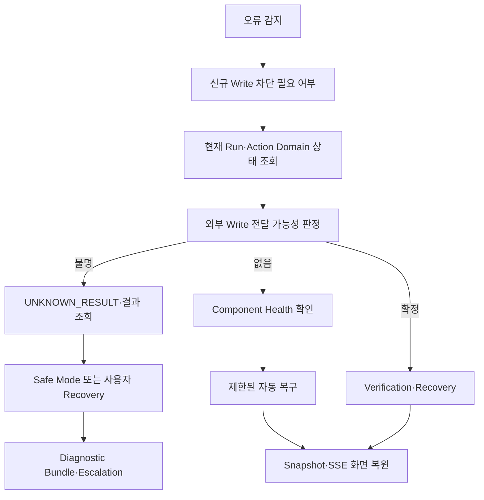

# 14. 예외 처리 · 운영 · 트러블슈팅 가이드

> **Authority:** owning contract를 사용자 조치·자동 복구·개발자 진단 절차로 투영한다. lifecycle/security/workflow behavior를 새로 정의하지 않는다.

## 0. 문서 정보

- **문서명:** 14. mcp-work-agent · 예외 처리 · 운영 · 트러블슈팅 가이드
- **상태:** Draft v2.29
- **기준일:** 2026-09-07
- **대상:** P0 MVP
- **운영 형태:** Windows 11 x64 로컬 단일 사용자 애플리케이션
- **공식 Browser:** 최신 Chrome·Microsoft Edge
- **운영 주체:** 사용자·로컬 애플리케이션·개발자 지원
- **원격 운영 서버:** 없음
- **핵심 금지:** 무한 Retry·검증 없는 Write 재실행·손상 DB 자동 삭제·Secret 포함 진단 공유

## 1. 목적과 범위

제품 오류가 발생했을 때 사용자 조치·자동 복구·개발자 지원 순서를 제공한다. 각 소유 문서가 정한 안전 경계를 운영 절차로 적용하며, 데이터와 외부 Connector Write의 무결성을 보존한다.

공통 MCP·인증·Write·Verification·Recovery 절차는 Google Workspace와 GitHub에 각각 적용한다. Google OAuth·Workspace API 등 Provider 고유 절차는 해당 절에서 다루며, GitHub Device Flow·Repository 접근의 상세 인터페이스·보안 계약은 `07`·`09`를 따른다.

| 이 문서의 책임 | 범위 |
| --- | --- |
| 오류 분류·초기 대응 | Severity, 사용자 영향 표시, 공통 Triage 순서 |
| 구성요소별 대응 | Launcher·Browser·Session·OAuth·LLM·MCP, Installer·Upgrade·Uninstall |
| 실행 결과 복구 | `FAILED`·`UNKNOWN_RESULT`·`MISMATCH`·`RECOVERY_REQUIRED`의 사용자·개발자 대응 |
| 저장소·시작·종료 복구 | SQLite·Checkpoint·Migration·Backup·Restore, Safe Mode 운영 조치 |
| 진단·지원·종료 | Diagnostic Bundle, Escalation Evidence, Security Incident·Credential 폐기, 해결 완료·재발 방지 기준 |

Retry·Fallback·재시작의 **허용성 자체는 새로 정하지 않는다.** 아래 상세 계약을 운영에 적용한다.

| 이 문서가 재정의하지 않는 내용 | 소유 문서 |
| --- | --- |
| Domain lifecycle command·허용 source state·guard·transition | Domain State Transition Contract |
| Domain 영속 사실·DB Transaction·persistence와 required DB invariant | 04 Domain·DB |
| Workflow Node·Interrupt 상세 | 06 Agent·Workflow |
| API·MCP Error Schema | 07 Interface |
| 정상·실패 호출 순서 | 08 Sequence |
| 위협 모델·Credential 정책 | 09 Security·Auth |
| 설치·Process·Directory 구현 | 10 Infrastructure |
| Log·Trace·Audit Event Schema | 11 Observability |
| 재현 Test·Release Gate | 12 Test |
| 모델·Prompt 품질 평가 | 13 Evaluation |

상태·취소·재시도 표기는 운영 대응을 위한 Runbook mapping이며, 새 상태·Command·Guard를 정의하지 않는다.

## 2. 운영 역할

| 역할 | 허용 작업 | 금지 작업 |
| --- | --- | --- |
| 사용자 | OAuth 동의·Secret 입력·Write 승인·필요 시 진단 Bundle 공유 | Backup 대상 선택·Process 종료·SQLite 직접 수정·MCP 수동 Write·Token 공유 |
| 애플리케이션 | 인증 갱신·Runtime 선택·제한된 Retry·GET 검증·Checkpoint 복구·검증된 Backup 자동 Restore·실패 Rollback·Safe Mode | 무한 Retry·UNKNOWN_RESULT Write 재전송·자동 데이터 삭제 |
| 개발자 지원 | Sanitized Evidence 분석·서명 Build Repair·호환 Backup Restore 안내 | 사용자 Secret 요청·직접 SQL 수정 안내·검증 없는 상태 강제 변경 |

P0에는 원격 관리자 Console과 자동 Log Upload가 없다. 사용자가 명시적으로 생성한 Diagnostic Bundle만 외부 공유 대상이 된다.

## 3. 공통 운영 원칙

| ID | 원칙 |
| --- | --- |
| `OPS-001` | 오류 대응보다 Connector Write의 중복 방지와 결과 확정을 우선한다. |
| `OPS-002` | UI·SSE·LLM·MCP 응답이 아니라 Domain Store를 상태 기준점으로 사용한다. |
| `OPS-003` | 외부 Write 전달 여부가 불명확하면 `UNKNOWN_RESULT`로 처리한다. |
| `OPS-004` | `FAILED` Write는 직접 재실행하지 않고 수정·재검증·새 승인을 거친다. |
| `OPS-005` | 성공·VERIFIED Action은 오류 복구 과정에서 다시 실행하지 않는다. |
| `OPS-006` | DB 손상·Migration 실패 시 자동 초기화·새 DB 교체를 금지한다. |
| `OPS-007` | Secret·Connector 원문·Approval Snapshot을 Log·화면·지원 Bundle에 노출하지 않는다. P0 Google Workspace 원문도 동일하다. |
| `OPS-008` | 복구 기준이 불명확하면 신규 Write를 차단하고 Safe Mode 또는 Escalation으로 전환한다. |

## 4. Severity 분류

| 등급 | 기준 | 기본 조치 |
| --- | --- | --- |
| `SEV-0` | 보안·무결성 위반, 미승인 Write 가능성, Claim V2 Signature/Binding/Execution Hash 우회, DB 손상, Artifact 변조 | 즉시 Write 차단·Safe Mode·Credential 또는 Build 검증 |
| `SEV-1` | 진행 중 Write 결과 불명, `UNKNOWN_RESULT`, `MISMATCH`, Recovery 필요 | 새 Write 금지·대상 Connector 결과 조회·사용자 Recovery |
| `SEV-2` | Connector Provider·MCP·LLM·Keyring 등 핵심 기능 일부 사용 불가 | 제한된 재시도·재인증·대체 Runtime·부분 기능 유지 |
| `SEV-3` | Browser·SSE·표시·진단 등 실행 사실과 무관한 장애 | 재연결·화면 복원·진단 안내 |

## 5. 공통 Triage 절차



오류 발생 시 순서:

1. 신규 Run·승인·Write Command를 차단해야 하는지 판단한다.
2. `run_id`, `action_id`, Domain Status, Version을 조회한다.
3. Write가 대상 Connector Provider에 전달됐을 가능성을 `NOT_SENT | MAY_HAVE_BEEN_SENT | SENT_RESPONSE_LOST`로 판단한다. Timeout·5xx·연결 단절이라는 오류 이름만으로 `NOT_SENT`를 선택하지 않는다.
4. `NOT_SENT`만 `FAILED` 후보가 될 수 있다. 나머지는 `UNKNOWN_RESULT`로 두고 새 Write 없이 기존 결과를 찾는다.
5. DB·Connector MCP·Provider·LLM·Browser 중 실제 장애 Component를 구분한다.
6. 계약된 Retry·Fallback·Restart만 수행한다.
7. Domain Snapshot으로 UI를 복원한다.
8. 해결되지 않으면 Sanitized Diagnostic Bundle을 생성한다.

## 6. 자동 복구 허용 Matrix

| 상황 | 자동 조치 | 상한 | 금지 |
| --- | --- | --- | --- |
| SSE 단절 | 재연결·Snapshot 조회 | Backoff 적용 | Action 재실행 |
| MCP Read 전 Process 종료 | Process 재시작·Schema 재검증 | 1회 | Write 자동 전송 |
| Connector Provider Read 429·5xx | Connector 정책 범위의 제한된 Backoff Retry | Policy·Budget 범위 | 무한 Retry |
| LLM API 429·일시적 5xx | 동일 Gemini 경로의 bounded Retry | Retry 1회 | Local 자동 전환 |
| Structured Output 실패 | 동일 단계 Repair | 1회 | 무한 Prompt 반복 |
| Write `NOT_SENT` 확정 실패 | `FAILED` 저장 | 자동 재실행 없음 | `FAILED → EXECUTING` |
| `MAY_HAVE_BEEN_SENT \| SENT_RESPONSE_LOST` | `UNKNOWN_RESULT`·GET/Search | 조회 Budget 범위 | 새 Attempt·Write |
| SQLite Busy | 짧은 Busy Timeout 후 실패 | 5초 | DB Lock 상태 외부 Write |
| Migration·DB Integrity 실패 | 검증된 최신 호환 Backup 1개 자동 Restore·실패 시 원본 Rollback·Safe Mode 유지 | 자동 Restore 1회 | DB 삭제·Downgrade Open·사용자 임의 선택 |

### 6.1 Workflow handoff 복구 확인

Pending·blocked·consumed handoff는 제품의 startup/live reconciliation으로 복구한다. **수동 DB 수정이나 직접 LangGraph 호출로 우회하지 않는다.**

| 순서 | 확인할 내용 |
| --- | --- |
| 1 | Startup Log에서 Connector MCP·Tool Schema와 LLM Runtime이 Core-ready인지 확인 |
| 2 | startup-only `ReconcileInflightExecutionsHandler` drain 결과 확인. `EXECUTING/UNKNOWN_RESULT/EXECUTED/FAILED` process-loss fact가 먼저 정리되는지 확인 |
| 3 | initial `RedriveWorkflowHandoffsHandler` drain과 live `WorkflowHandoffReconciliationLoop` 시작 여부 확인 |
| 4 | `BLOCKED_BINDING`, stale admission, CONSUMED continuation, later PENDING head를 Handler의 Typed Result·Trace로 판정 |
| 5 | Retrieval cache prerequisite가 사라졌다면 raw `next_page_token`을 복원하지 않고 retrieval-cache restart 경로가 stage됐는지 확인 |

Startup과 live runtime의 handoff 의미 판정은 동일한 `RedriveWorkflowHandoffsHandler`를 사용한다. 운영 절차에서 별도 ordering rule이나 fallback executor를 만들지 않는다.

| 관찰·금지 항목 | 적용 |
| --- | --- |
| 관찰 | backlog·blocked reason·no-progress를 Trace·Diagnostic으로 확인 |
| 수동 조작 금지 | DB row/status, checkpoint generation, `run_sequence`, admission |
| Startup/live lifetime·순서 | `10 Infrastructure`의 durable workflow handoff startup/live reconciliation 계약 적용 |
| 의미 판정 | reconciliation precedence·admission CAS/conflict/staleness·supersession·registered target·CONSUMED lineage·Cancel/terminal preemption은 `04/05/06/07`의 해당 계약 적용 |

여기서는 확인 위치와 금지되는 우회만 설명하며, 복구 알고리즘을 복제하지 않는다.

### 6.2 재인증·복구의 재개 대상

Reauth/Recovery는 `RegisteredResumeTargetRefV2`로 등록된 대상만 재개한다.

| 대상 | 허용 형식 |
| --- | --- |
| Agent semantic checkpoint | `AgentNodeResumeTargetV2` |
| Main control checkpoint | `MainControlResumeTargetV2`의 아래 등록 값 |

Main control의 허용 값:

```text
RETRIEVAL_ENTRY | PLANNING_ENTRY | REVIEW_ENTRY | PREFLIGHT |
READ_EXECUTION | VERIFICATION | RECOVERY | CANCEL_RESOLUTION
```

`ACTION_EXECUTION` 또는 free-string checkpoint를 직접 resume하지 않는다. 실행 중 credential·transport 문제가 있으면 외부 결과 reconciliation을 먼저 수행하고 Recovery target으로 복귀한다.

## 7. 사용자에게 절대 안내하지 않는 조치

- SQLite DB·WAL·SHM을 직접 편집하거나 일부만 삭제
- `actions.status`와 Approval 상태를 SQL로 강제 변경
- MCP Executable을 Shell에서 직접 실행해 Connector Write 수행
- CORS를 `*`로 변경하거나 `0.0.0.0`에 Bind
- OAuth Token·API Key·Cookie·Bootstrap Secret을 지원 담당자에게 전달
- Python·Node.js를 임시 설치해 제품 Bundle 문제를 우회
- 서명되지 않은 Executable로 Program File 교체
- 낮은 Version Installer로 DB를 강제로 열기
- `UNKNOWN_RESULT` 상태에서 같은 요청을 다시 승인·실행
- Backup 없이 사용자 데이터 Directory 삭제

## 8. 오류 코드 Quick Reference

| Error Code | Severity | 1차 조치 |
| --- | --- | --- |
| `INSTALLATION_INVALID`·`MANIFEST_INVALID`·`SIGNATURE_INVALID` | SEV-0 | 실행 중단·공식 서명 Installer Repair |
| `SERVICE_START_FAILED`·`SERVICE_NOT_READY` | SEV-2 | Launcher Log·DB·MCP·Runtime 검사 |
| `API_CONTRACT_MISMATCH`·`FRONTEND_ASSET_MISSING` | SEV-2 | Write 차단·Repair 또는 정상 Upgrade |
| `DB_INTEGRITY_FAILED`·`MIGRATION_FAILED` | SEV-0 | Safe Mode·Backup·Restore 판정 |
| `KEYRING_UNAVAILABLE` | SEV-2 | Credential 기능 차단·Windows Keyring 상태 확인 |
| `MCP_START_FAILED`·`MCP_SCHEMA_MISMATCH`·`MCP_EXECUTABLE_INVALID` | SEV-0 또는 SEV-2 | Tool 호출 차단·Manifest·Version 검사 |
| `OLLAMA_UNAVAILABLE`·`LOCAL_MODEL_MISSING` | SEV-2 | API 사용 가능 여부 확인·Local 진단 안내 |
| `BACKUP_FAILED`·`RESTORE_FAILED` | SEV-1 | 원본 보존·Disk·ACL·Manifest 검사 |
| `SHUTDOWN_TIMEOUT`·`RECOVERY_REQUIRED` | SEV-1 | 다음 시작에서 Open Run·Attempt 복구 |

## 9. Launcher·Startup Runbook

### 9.1 단일 Instance 충돌

1. 기존 Launcher·Service Process 존재 여부를 확인한다.
2. 기존 Service가 Ready면 새 Process를 만들지 않고 기존 UI를 연다.
3. Process가 없고 Lock만 남았으면 현재 사용자 소유 Lock인지 확인한 뒤 Stale Lock을 정리한다.
4. 판단할 수 없으면 강제 Lock 삭제 대신 앱 재시작 또는 Windows 재로그인을 안내한다.

### 9.2 Port 확보 실패

- `127.0.0.1`의 다른 동적 Port를 재선택한다.
- `0.0.0.0`, LAN 주소, 고정 Public Port로 우회하지 않는다.
- 반복 실패 시 Socket Error Code·보안 제품·Loopback 차단 여부를 진단한다.

### 9.3 Service Readiness 실패

확인 순서:

```
Release Manifest
→ 사용자 데이터 Directory·ACL
→ SQLite·Migration
→ Keyring Adapter
→ MCP Executable·Schema
→ Frontend Asset·API Contract
```

Readiness 전에는 UI를 정상 실행 상태로 표시하지 않는다. 안전한 진단 기능만 가능한 경우 Safe Mode로 연다.

## 10. Browser·React·Local Session Runbook

### 10.1 Browser 열기 실패

- Local Service가 Ready라면 Chrome 또는 Edge에서 다시 열기를 제공한다.
- Bootstrap Secret이 포함되지 않은 일반 URL을 장기 Clipboard에 남기지 않는다.
- 지원되지 않는 Browser는 공식 지원 대상 Browser로 다시 열도록 안내한다.

### 10.2 빈 화면·Asset 오류

- Frontend·Backend Build ID와 API Contract Version을 확인한다.
- `FRONTEND_ASSET_MISSING` 또는 `API_CONTRACT_MISMATCH`면 Command를 차단한다.
- Browser Cache 삭제보다 먼저 앱 재시작과 Installer Repair를 안내한다.
- 운영 사용자에게 Vite Development URL을 안내하지 않는다.

### 10.3 Session·Origin 오류

- Bootstrap Secret은 1회·60초만 유효하다.
- Service 재시작 후 오래된 Browser Tab의 Session은 무효다.
- `ORIGIN_NOT_ALLOWED`: 공식 Launcher에서 UI를 다시 연다.
- `SESSION_EXPIRED`: 새 Bootstrap으로 Local Session을 다시 수립한다.
- 외부 웹페이지·Browser Extension 요청은 허용하지 않는다.
- 문제 해결을 위해 Wildcard CORS를 설정하지 않는다.

### 10.4 SSE 단절

```
SSE 재연결
→ Last-Event-ID 전달
→ Cursor 만료 시 Run Snapshot 조회
→ Domain 상태로 UI 복원
```

SSE 단절은 Agent·Write 실패가 아니다. 화면에 Event가 보이지 않았다는 이유로 Action을 다시 실행하지 않는다.

## 11. Connector 인증·Keyring Runbook

### 11.1 Google 로그인 실패

- OAuth Client JSON을 사용자에게 요청하지 않는다.
- 앱의 `Google로 로그인` 흐름을 새로 시작한다.
- `state` 불일치·Callback 만료는 기존 흐름을 폐기하고 새 인증을 생성한다.
- `redirect_uri_mismatch`는 Desktop OAuth Client와 Loopback 설정을 개발 환경에서 확인한다.

### 11.2 Google Scope 일부 거절

- P0 필수 Gmail·Tasks·Calendar Scope 중 하나라도 거절되면 Google 연결 완료로 처리하지 않는다.
- 필요한 이유와 Scope를 다시 표시하고 사용자 재동의 또는 연결 취소를 기다린다.
- 연결 미완료 상태에서는 Agent Run과 Google Tool 호출을 차단한다.
- 허용되지 않은 Scope를 다른 Credential이나 수동 Token으로 우회하지 않는다.

### 11.3 Token 갱신 실패

```
현재 Domain·Checkpoint + `pre_reauth_status` + RegisteredResumeTargetRef 저장
→ `RequireReauth` APPLIED · Run `REAUTH_REQUIRED`
→ Google 재로그인 완료
→ `ResumeAfterReauth(expected_version, registered_target_binding)`
→ Receipt/Audit + Domain transition `applied=true`
→ 검증된 같은 `langgraph_thread_id`의 registered checkpoint만 재개
→ 복귀한 safe phase에서 Source·Action/Approval freshness 재검증
→ stale이면 Expire/Refresh/Review/새 승인 또는 Recovery
```

연결 완료와 Run 재개는 구분한다.

| 상황 | 처리 |
| --- | --- |
| OAuth 성공 | Credential 연결만 완료. Run 자동 resume 없음 |
| 중단 Run 재개 | UI가 해당 `REAUTH_REQUIRED` Run에 `/resume(REAUTH_COMPLETED)` 전송. `ResumeAfterReauth(applied=true)`와 durable handoff가 성공한 뒤 Workflow 계속 |
| OAuth 성공 뒤 crash | Run은 `REAUTH_REQUIRED` 유지. 동일 Run Command 재시도 가능 |
| Checkpoint·registered target·active graph version가 stale 또는 missing | 같은 Thread를 추측 resume하지 않고 `RequireRecovery(CHECKPOINT_MISMATCH)`로 전환 |
| `REAUTH_REQUIRED` 유지 중 | `SAFE_CHECKPOINT_RESUME` 우회 금지 |

### 11.4 Keyring 장애

- Plain File·환경 변수 Fallback을 사용하지 않는다.
- Google·API LLM Credential 기능을 차단한다.
- Windows Credential 저장소 접근과 사용자 Profile 상태를 확인한다.
- 연결 해제는 해당 Keyring Entry 삭제까지 완료돼야 한다.


### 11.5 GitHub Device Flow·Repository 접근

- Device Flow 완료와 GitHub account 연결, 실제 Repository 접근 가능 상태를 구분한다.
- GitHub App permission과 Settings Repository allowlist의 교집합 밖 Repository를 다른 계정·첫 allowlist 항목·Google credential로 대체하지 않는다.
- 초기 미연결 요청은 안내 후 종료하며 Device Flow 완료로 종료된 요청을 자동 resume하지 않는다. 실행 중 credential 만료만 §11.3의 same-Run reauth 경계를 사용한다.
- 연결 해제·접근 철회는 GitHub credential과 해당 Connector cache만 무효화하고 Google 연결이나 이미 dispatch된 effect를 변경하지 않는다.

## 12. API_ONLY·LOCAL_CAPABLE·Ollama Runbook

### 12.1 API_ONLY

- `LOCAL_GPU`가 표시되지 않는 것은 정상이다.
- Ollama 설치를 해결책으로 안내하지 않는다.
- API Key·Provider·Network를 확인한다.
- API Key가 없으면 설정·진단만 허용하고 Agent 실행을 차단한다.

### 12.2 LOCAL_CAPABLE

Ollama는 Product Core에 내장되지 않은 별도 Runtime이다. 제품은 상태와 설치된 지원 모델만 검사한다.

확인 항목:

- Ollama Loopback Endpoint
- 지원 Version
- 지원 Model ID: `qwen3.5:9b`, `qwen3.5:4b`
- CPU·RAM Profile
- GPU·VRAM Profile
- Structured Output Smoke Test
- OOM·Timeout

운영 제한:

- 앱은 install·pull·download·update·종료·제거·삭제·shell command를 수행하지 않는다.
- Unsupported model을 선택하거나 arbitrary model tag·endpoint 입력을 받지 않는다.
- Local 실패를 Gemini fallback 조건으로 사용하지 않는다.

### 12.3 Local Runtime 검사

```text
Runtime Detail 확인
→ Ollama probe 성공/실패 확인
→ 설치된 지원 모델 목록 확인
→ 하나면 자동 선택, 둘이면 persisted 선택 검증
→ CPU profile 또는 GPU profile 중 하나의 readiness 확인
→ 테스트 추론 결과와 실제 선택 모델 확인
```

재검사에서도 지원 모델이 하나면 그 모델을 선택한다. **검사 실패와 모델 미설치를 구분한다.**

| 결과 | 표시·조치 |
| --- | --- |
| `OLLAMA_NOT_READY` | Process·Loopback readiness 실패로 표시하고 재검사 제공 |
| `NO_SUPPORTED_MODEL` | 모델 준비 안내. Core 진입과 이력 조회 유지 |
| `INSPECTION_FAILED` | 모델 없음으로 표현하지 않고 진단 정보와 재검사 제공 |

## 13. LLM·Structured Output·Retrieval Runbook

### 13.1 LLM 오류

- 429·일시적 5xx만 제한된 Retry 대상으로 분류한다.
- Retry·Fallback Budget을 초과하면 Partial 또는 Blocked 결과를 표시한다.
- Provider 오류와 사용자의 Google Write 결과를 혼동하지 않는다.

### 13.2 Structured Output 실패

```
Schema 검증 실패
→ 동일 단계 Repair 최대 1회
→ 재검증
→ 실패 시 단계 오류·Write 차단
```

LLM Output을 직접 MCP Arguments로 전달하지 않는다.

### 13.3 Context 부족·모호성

- 추가 수집은 최대 2회다.
- 필수 Source가 실패하면 Write Context 충족으로 판정하지 않는다.
- 후보가 다수면 사용자 확인을 요청한다.
- 사용자가 지정한 기간·Source 상한을 임의로 확장하지 않는다.
- Partial 결과와 제한 사유를 구분해 표시한다.

### 13.4 Prompt Injection 의심

- Google Source의 지시문을 사용자 명령으로 취급하지 않는다.
- Source·Evidence는 비신뢰 데이터로 유지한다.
- Tool·Policy·승인 우회 시도를 차단하고 `POLICY_BLOCKED` 또는 안전 오류로 기록한다.


### 13.5 재시작 후 Retrieval cache 유실

| 상황 | 처리 |
| --- | --- |
| Checkpoint는 유효하지만 memory-only `read_result_handle`이 사라짐 | Frozen current RequestIntent/InputRoute 검증 후 `RETRIEVAL_CACHE_RESTART → MAIN_CONTROL:RETRIEVAL_ENTRY`에서 fresh Retrieval·새 revision 발급 |
| Checkpoint·binding 자체가 invalid | Cache restart를 사용하지 않고 Recovery로 전환 |

Raw Provider token을 복원·추측하지 않으며, fresh Retrieval에서도 기존 RunBudget 사용량을 유지한다.

## 14. MCP·Provider API Runbook

### 14.1 MCP 시작 실패

```
Executable 절대 경로
→ Signature·Manifest Hash
→ MCP Version
→ Tool Schema Version
→ Tool Registry
→ stdio Handshake
```

검증 실패 시 전체 Tool 호출을 차단한다. PATH 검색이나 Shell 수동 실행으로 우회하지 않는다.

### 14.2 MCP Process 종료

```
Process Exit 감지
→ 신규 Tool 호출 차단
→ Sanitized stderr 저장
→ Write 전달 가능성 판정
→ Read 전 장애면 최대 1회 재시작
→ Schema 재검증
```

Write 도중 종료했으면 자동 재시작 후 같은 Write를 보내지 않는다.

### 14.3 Provider Read 오류

| Provider 응답 | 오류 구분 | 운영 조치 |
| --- | --- | --- |
| 401 | `AUTH_EXPIRED` | Domain/Workflow `REAUTH_REQUIRED`로 전환 |
| 403 | `POLICY_BLOCKED` 또는 Scope·Resource 접근 실패 | 원인을 구분하고 정책·권한 상태 확인 |
| 404 | `NOT_FOUND` | Resource 삭제·ID 만료·Account 불일치 구분 |
| 429 | `RATE_LIMITED` | Retry-After·Budget 범위에서 Backoff |
| 5xx | `UPSTREAM_5XX` | 제한된 Retry 후 Partial/Recovery 경계 적용 |
| Timeout | `TIMEOUT` | Read retry budget만 적용. 전달 여부가 불명확한 Write와 혼동하지 않음 |

위 Connector Error 이름은 `07 Interface`가 소유하며, 이 Runbook은 현재 Google Workspace·GitHub 응답을 해당 공통 Enum과 운영 조치로 매핑할 뿐 새 오류 taxonomy를 만들지 않는다.

### 14.4 Provider Write 오류

오류를 다음 두 종류로 먼저 분류한다.

```
전달되지 않았음이 확실
→ FAILED

전달됐을 가능성이 있음
→ UNKNOWN_RESULT
```

HTTP Status만으로 Write 미전달을 단정하지 않는다.

## 15. Approval·Policy Runbook

### 15.1 `APPROVAL_INVALID`

확인:

- Action Version
- Canonical Arguments Hash
- Source Snapshot
- Approval Status
- 만료 시각

불일치 시 기존 Approval을 사용하지 않고 재검증·새 승인을 요구한다.

### 15.2 `APPROVAL_EXPIRED`

```
APPROVED → EXPIRED
→ 최신 Source 조회
→ Action MODIFIED
→ 새 Approval 생성
```

기존 Approval을 다시 `ACTIVE`로 만들지 않는다.

### 15.3 Policy Block

- 미승인 Write·금지 Tool·삭제·전송을 설정 변경으로 우회하지 않는다.
- Policy Block은 기술 오류가 아니므로 자동 Retry하지 않는다.
- 사용자가 허용된 대안 Action을 선택하도록 안내한다.

### 15.4 취소 처리·재시작 복구

| 항목 | 처리 |
| --- | --- |
| 진입 | `RequestCancel(applied=true)` 뒤 `MAIN_CONTROL:CANCEL_RESOLUTION` 사용 |
| 담당 | `ContinueCancelResolutionHandler` 하나. `application/use_cases/run/continue_cancel_resolution.py` |
| 조정 대상 | Current durable child facts에 따라 기존 `CancelPendingAction`, Legacy READ settlement, dispatch result classification, Verification, Recovery, `FinalizeCancel`만 순서대로 조정 |
| 재시작 | Pending cancel handoff 자동 redrive |
| 금지 | Generic `SAFE_CHECKPOINT_RESUME`로 `CANCEL_REQUESTED`를 깨우지 않음 |

#### 승인형 Write 취소

APPLIED `RequestCancel` Receipt로 `cancel_intent_active=true`가 복원된 Run은 `ACCEPT_PARTIAL`·`CREATE_CORRECTIVE_PLAN`으로 새 `COMPLETED`·Planning 경로를 만들지 않는다. 필요한 결과 확인·Verification만 수행하며, **새 Claim·Write는 금지한다.**

| 취소 처리 위치 | 종료 처리 |
| --- | --- |
| Run이 `RECOVERY_REQUIRED` | `ResolveRecovery(CANCEL)`로 `CANCELLED` 처리 |
| Verification으로 복귀한 뒤 | `FinalizeCancel`로 `CANCELLED` 처리 |

#### Legacy READ-only 취소

Cancel intent가 active이면 새 ConnectorRead retry나 `MAIN_CONTROL:READ_EXECUTION` Reauth를 시작하지 않는다.

| Current READ 상태·상황 | 처리 |
| --- | --- |
| `PROPOSED` | `CancelPendingAction` |
| `EXECUTING`이고 성공 결과가 이미 도착함 | `CompleteReadAction → FinalizeReadAction`으로 성공 결과 보존 |
| `EXECUTING`이고 미dispatch·실패·`AUTH_EXPIRED`·restart-uncertain | `FailReadAction`으로 종료 |
| `EXECUTED` | `FinalizeReadAction` 적용 뒤 `FinalizeCancel` |

Hidden `CancelReadAction`이나 read replay를 만들지 않는다.

### 15.5 Claim V2 차단

다음은 Security/Integrity 오류다.

| 검증 항목 | 오류 조건 |
| --- | --- |
| 필수 값 | `version`·`issued_at_ms` 누락 |
| 서명·유효성·결합 | Signature·TTL·Instance·Action·Approval·Attempt·Tool Binding 불일치 |
| 실행 인자 | 실제 Execution Arguments 재해시 불일치 |
| 재사용 | Nonce 재사용 |

Claim 검증 실패 시 Google Write가 0회였는지 Trace/Audit의 결과 코드와 Provider call count로 확인한다.

- 원인 해결을 위해 Claim Token을 수정·재서명하거나 MCP Write를 수동 호출하지 않는다.
- Token·Hash·Nonce 원문을 Log에서 찾거나 사용자에게 요청하지 않는다.

## 16. `FAILED` Write Runbook

`FAILED`는 Write가 전달되지 않았음이 확실하거나, 결정적 실패가 확인된 상태다.

```
FAILED
→ 실패 원인·최신 Source 확인
→ prepare_write_retry
→ Action MODIFIED
→ Policy·중복·충돌 재검증
→ 새 Approval
→ 새 Attempt
```

금지:

- `FAILED → EXECUTING` 직접 전이
- 기존 Approval 재사용
- 기존 Idempotency Key 재사용
- 동일 Arguments를 사용자 확인 없이 자동 재전송

실패 원인이 사용자 수정으로 해결되지 않으면 Action을 Blocked 또는 종료 상태로 유지한다.

## 17. `UNKNOWN_RESULT` Runbook

`UNKNOWN_RESULT`는 P0에서 가장 우선적으로 보호해야 하는 복구 상태다. **신규 Attempt와 Write Command를 차단한 뒤 기존 결과부터 조회한다.**

### 17.1 Effect별 기존 결과 조회

| Action Effect | 결과 조회 | 확인된 결과의 Verification |
| --- | --- | --- |
| CREATE | `RESOURCE_SEARCH`: Recovery Fingerprint 기반 후보 Resource 검색 | `GET_COMPARE` |
| UPDATE | `GET_TARGET`: 기존 Target 상태 조회 | `GET_COMPARE` |
| SEND | `MESSAGE_SEARCH`: 기존 전송 결과 후보 검색 | 식별된 후보를 `SENT_LOOKUP`으로 검증 |
| DELETE | `GET_TARGET`: 삭제 대상 상태 조회 | 대상 부재·삭제 상태를 `GET_ABSENT`로 검증 |

조회 결과의 Source·Time Window·Canonical Field와 Effect별 식별자를 비교한다.

### 17.2 조회 결과별 처리

| 조회 결과 | 처리 |
| --- | --- |
| 기존 결과 확인 | 기존 Attempt 결과를 복구하고 Effect별 Verification으로 연결 |
| 찾지 못했거나 후보가 여러 개 | `RECOVERY_REQUIRED`로 유지 |
| 사용자가 새 Write를 원함 | 기존 결과 불확실성을 해결한 뒤 새 Action·새 Approval 생성 |

찾지 못했다는 이유만으로 같은 Write를 즉시 다시 실행하지 않는다.

## 18. Verification·`MISMATCH` Runbook

### 18.1 정상화 가능한 차이

- 공백·줄바꿈
- Timezone 표현
- Google이 자동 부여한 기본값
- 초 단위·정렬 차이

Comparator 정책으로 같다고 판단 가능한 항목만 `VERIFIED`로 처리한다.

### 18.2 실제 Mismatch

```
Expected·Actual·Diff 저장
→ Action MISMATCH 유지
→ Run RECOVERY_REQUIRED
→ 자동 수정·자동 Rollback 금지
→ 사용자 Recovery 선택
```

`cancel_intent_active=false`일 때 P0 사용자 Recovery 선택은 다음 두 가지다.

| 선택 | 처리·결과 |
| --- | --- |
| `ACCEPT_PARTIAL` | 현재 Google 실제 상태를 수용하고 추가 Write 없이 종료. 미실행 Action은 취소, Run은 `COMPLETED`, 결과는 `PARTIAL` |
| `CREATE_CORRECTIVE_PLAN` | 실제 Google 상태를 다시 조회해 같은 Run의 새 Plan Revision 생성. 새 Domain Validation·Approval·Claim 필요 |

`cancel_intent_active=true`이면 위 두 선택을 사용하지 않고 §15.4의 취소 절차를 따른다.

기존 `MISMATCH` Action·Approval·Attempt·Verification을 재사용하지 않는다. 사용자가 전체 Run을 중단하려면 일반 Cancel Command를 사용한다.

## 19. SQLite·Checkpoint Runbook

### 19.1 확인 순서

```
Disk Space
→ Directory ACL
→ DB File 존재
→ WAL·SHM 상태
→ SQLite quick_check
→ Migration Version·Checksum
→ Open Run·Action
→ LangGraph Checkpoint
```

### 19.2 Busy·Disk Full

DB availability/precondition과 필요한 durable pre-I/O fact를 먼저 검증·commit한 뒤 Google·LLM·MCP 호출을 수행한다. **외부 호출을 기다리는 동안 SQLite write transaction을 보유하지 않는다.**

- Busy Timeout 후 Command를 실패시킨다.
- Disk Space 확보 전 신규 Run·Write를 차단한다.
- Log와 Trace 정리는 계약된 Purge만 사용한다.

### 19.3 Domain·Checkpoint 충돌

- 승인·실행·검증 사실은 Domain Store를 우선한다.
- Checkpoint를 근거로 완료 Action을 다시 실행하지 않는다.
- 자동 추정이 불가능하면 `RECOVERY_REQUIRED`로 전환한다.

### 19.4 Integrity 실패

- Safe Mode로 진입한다.
- 손상 DB를 삭제하거나 새 DB로 대체하지 않는다.
- Restore 전 현재 DB·WAL·SHM을 별도 보존한다.
- 정상 Backup이 없으면 Diagnostic Bundle과 개발자 Escalation을 진행한다.

## 20. Migration·Upgrade Runbook

```
앱 정상 종료
→ Installer Signature·Version 확인
→ Pre-migration Backup
→ Program File 교체
→ Migration
→ quick_check·Compatibility
→ 정상 시작
```

Migration 실패 시:

1. 추가 DB 변경을 중단한다.
2. Safe Mode로 진입한다.
3. Pre-migration Backup을 보존한다.
4. 동일 Migration 자동 반복을 금지한다.
5. Program File Rollback 가능 여부와 DB Schema 호환성을 별도로 판단한다.
6. 새 Schema DB를 오래된 App으로 강제 Open하지 않는다.

## 21. Safe Mode

Safe Mode 진입 조건:

- DB Integrity 실패
- Migration 실패
- Release Manifest·Executable 변조
- Frontend·Backend Contract 불일치
- MCP Schema 불일치
- Domain·Checkpoint 복구 불일치

| 구분 | 기능·조치 |
| --- | --- |
| 허용 | Health·Version 조회, Diagnostic Bundle 생성, Backup·Restore, Sanitized Log·설정 확인 |
| 금지 | 새 Run, 승인·수정 Command, Google Write, 자동 Migration 재시도, MCP Write Tool, 손상 DB 자동 초기화 |

Safe Mode 해제 조건은 원인별 검증이 성공하고 Readiness가 다시 통과하는 것이다.

## 22. Backup·Restore Runbook

### 22.1 Backup 실패

확인:

- Disk Space
- 사용자 데이터 Directory ACL
- SQLite Connection 종료 가능 여부
- Backup Manifest 생성
- DB Hash·quick_check

Backup 실패 상태에서는 Migration·Restore·완전 삭제를 진행하지 않는다.

### 22.2 Restore 절차

```
앱 종료·Lock 확인
→ 현재 DB Backup
→ 대상 Manifest·Hash 확인
→ SQLite quick_check
→ Schema Version 확인
→ DB 교체
→ 필요한 Migration
→ Domain·Checkpoint 검사
→ Service 재시작
```

Restore 중 실패하면 원본과 Restore 대상 모두 보존한다. 마지막 정상 DB를 자동 삭제하지 않는다.

### 22.3 보존 정책

- 최근 5개
- 최대 30일
- 둘 중 먼저 도달한 기준으로 정리
- Migration 직전 마지막 정상 Backup은 새 Version 첫 정상 시작 전까지 유지

### 22.4 Safe Mode의 자동 Restore 대상 선택

| 항목 | 처리 |
| --- | --- |
| 대상 정보 | System recovery coordinator가 `BackupPort.list_backups()`의 integrity·schema-compatible metadata만 소비 |
| 선택 순서 | `created_at_ms DESC, backup_ref ASC`의 첫 항목 하나 |
| 실행 횟수 | 동일 candidate는 operational replay로 1회만 Restore |
| 금지 | UI target selector, raw path input, directory probing |
| Restore 중간 오류·복원 후 Readiness 실패 | Restore 전 DB를 보존·복원하고 Safe Mode 유지 |

## 23. Shutdown·Crash Recovery Runbook

### 23.1 정상 종료

```
신규 Command 차단
→ 진행 중 Write 확인
→ 결과 저장 또는 UNKNOWN_RESULT
→ Checkpoint Flush
→ SQLite WAL Checkpoint·Close
→ MCP 종료
→ FastAPI 종료
→ Runtime Lock 제거
```

### 23.2 종료 Timeout

- Write 미전달이 확실하면 Child Process 종료가 가능하다.
- Write 전달 가능성이 있으면 `UNKNOWN_RESULT`와 Recovery Marker 저장을 시도한다.
- 저장도 확정할 수 없으면 다음 시작에서 `RECOVERY_REQUIRED`로 검사한다.

### 23.3 다음 시작 복구

확인:

- `shutdown.marker`
- Open Run
- `EXECUTING`·`UNKNOWN_RESULT`·`MISMATCH`
- SQLite Integrity
- Domain·Checkpoint 일치
- 이미 `VERIFIED`인 Action

`VERIFIED` Action은 재실행하지 않는다.

### 23.4 Workflow handoff 복구 확인

Startup/live handoff 복구는 §6.1의 확인 순서를 따른다.

## 24. Installer·Repair·Uninstall Runbook

### 24.1 설치 실패

- Windows 11 x64 여부
- Production Signature·Publisher
- Manifest Hash
- 사용자별 설치 Directory 권한
- Disk Space
- 보안 제품 격리
- 기존 Process 실행 여부

관리자 권한 설치나 Python·Node.js 설치로 우회하지 않는다.

### 24.2 Repair

Repair는 Program File과 Manifest를 복구하고 사용자 DB·Backup·Settings·Keyring을 보존한다.

### 24.3 기본 Uninstall

| 처리 | 대상 |
| --- | --- |
| 제거 | Program File, Shortcut, Launcher 등록, Uninstaller 정보 |
| 보존 | SQLite DB, Backup, Settings |
| 삭제 | Google OAuth Refresh Token Keyring Entry, LLM API Key Keyring Entry, Local Session·Bootstrap Runtime 값 |

### 24.4 완전 삭제

- 별도 명시 선택
- 삭제 대상 목록과 복구 불가능 경고
- 실행 중 앱 정상 종료
- DB·Backup·Settings·Log·Diagnostic·Credential 삭제
- 실패한 항목을 사용자에게 표시

단순 재설치를 위해 사용자 데이터를 먼저 삭제하도록 안내하지 않는다.

## 25. Observability·Diagnostic Bundle

### 25.1 진단 화면 표시

P0 진단 화면은 protected `GET /api/v1/runtime`의 bounded `RuntimeDetailResponseV1`만 사용한다. Browser가 Launcher-only `/health/ready`를 직접 호출하지 않는다.

| 표시 항목 | 내용 |
| --- | --- |
| 버전 | Release·Frontend·Backend·API Version |
| 실행 환경 | Deployment Profile·Runtime Mode |
| 구성요소 상태 | Local Service·Connector·MCP·Credential·LLM·DB·Migration·SSE |
| 장애·복구 | 최근 Sanitized Error Code, Safe Mode·Recovery 상태 |
| 저장소 작업 | 마지막 Backup·Migration 결과 |

표시하지 않는 정보:

- OAuth Token·API Key·Cookie 등 Secret
- Gmail·Draft 전체 본문 및 Source body
- Approval Snapshot 전체
- 사용자 Home Path 등 raw path
- DB content

### 25.2 Diagnostic Bundle 생성

포함:

```
diagnostic-manifest.json
system-summary.json
health-snapshot.json
sanitized-launcher-log.jsonl
sanitized-service-log.jsonl
sanitized-mcp-log.jsonl
trace-summary.json
audit-summary.json
migration-summary.json
```

제외:

```
SQLite 원본 DB
Backup 원본
Keyring 내용
Connector 원문
LLM Prompt·Completion
Approval Snapshot
전체 MCP Request·Response
```

Bundle은 자동 업로드하지 않으며 사용자가 파일을 저장하고 내용을 확인한 뒤 공유한다.

## 26. Security Incident Runbook

다음은 Security Incident로 취급한다.

- 미승인 Write 의심
- Approval Hash·Arguments 불일치
- Secret이 Log·Bundle·화면에 노출
- Executable·Manifest Signature 실패
- Local API가 Loopback 외 주소에 Bind
- 금지 Tool 등록 또는 실행
- Credential 무단 사용 의심

대응:

```
신규 Write 즉시 차단
→ 관련 Run·Action·Audit 보존
→ Google·LLM Credential 폐기·재발급 판단
→ 서명된 Build·Manifest 검증
→ Sanitized Diagnostic Bundle 생성
→ 재현 Test 추가
→ Release Gate 재검증
```

Secret 노출이 확인되면 해당 Secret은 마스킹만으로 복구된 것으로 보지 않고 폐기·교체한다.

## 27. Escalation 기준

개발자 지원으로 Escalation하는 조건:

- `UNKNOWN_RESULT`가 결과 조회 후에도 해결되지 않음
- DB Integrity 실패와 정상 Backup 부재
- Migration 실패가 동일 Version에서 재현
- Manifest·Signature 검증 실패
- 금지 Tool·미승인 Write·Secret Leak 의심
- 동일 오류가 Repair 후 반복
- Safe Mode를 해제할 수 없음
- Chrome·Edge 모두에서 동일 Contract 오류

Escalation Evidence:

```
app_version
build_channel
deployment_profile
error_code
severity
run_id?
action_id?
current_domain_status
last_safe_transition
component_health
automatic_recovery_attempts
diagnostic_bundle_id
reproduction_steps
```

Credential·Google 원문·Prompt는 Evidence에 포함하지 않는다.

## 28. 해결 완료 기준

오류는 다음 조건을 모두 충족해야 종료 처리한다.

- Domain 상태가 허용된 Terminal 또는 명시적 Recovery 상태다.
- 외부 Write 결과가 확인됐거나 미실행이 확정됐다.
- 신규 Write 차단이 필요한 상태가 남아 있지 않다.
- Readiness 또는 제한된 Safe Mode 목적이 충족됐다.
- Audit·Trace에 해결 결과가 기록됐다.
- 사용자에게 실제 결과와 남은 제한을 표시했다.

문제 유형에 따라 다음 반영까지 완료해야 한다.

| 문제 유형 | 반영 위치 |
| --- | --- |
| 재현 가능한 결함 | `12 Test` Regression Test 추가 |
| 모델·Prompt 품질 문제 | `15 Prompt·Failure`의 taxonomy로 실패 분류. 후보 비교·채택 근거는 `13 Evaluation`의 evidence/decision record에 반영 |

## 29. 첨부파일 운영 Runbook

| 상황 | 운영 조치·제한 |
| --- | --- |
| Gmail 수신 첨부파일 다운로드 실패 | Message/Attachment ID, Google 연결 상태, 파일 크기 제한 확인 후 Read 경로만 재시도. LLM Retry로 해결하지 않음 |
| 발신 Staging 파일 만료·삭제·Hash mismatch | 기존 Approval로 실행 금지. 파일 재선택 → Descriptor 갱신 → Action 수정 → 새 Approval |
| Staging Cache 복구 | Backup에서 복원하거나 수동으로 파일을 바꿔 넣지 않음 |
| 앱 비정상 종료 후 만료 Attachment Cache 잔존 | Startup에서 정리. Domain DB 복구와 별개 |
| Diagnostic Bundle | Attachment bytes·Local Path 포함 금지 |

## 30. 운영 가이드 완료 조건

- 오류를 `SEV-0~3`으로 분류할 수 있다.
- 모든 Runbook이 사용자 조치·자동 조치·금지 조치를 구분한다.
- `FAILED`와 `UNKNOWN_RESULT` 복구가 분리돼 있다.
- `UNKNOWN_RESULT`에서 새 Attempt·Write를 만들지 않는다.
- `MISMATCH` Recovery Write는 새 승인을 요구한다.
- DB 손상·Migration 실패 시 Safe Mode로 진입한다.
- Backup·Restore가 원본 보존을 우선한다.
- Chrome·Edge, API_ONLY·LOCAL_CAPABLE 운영 절차가 일치한다.
- Ollama는 외부 설치 Runtime으로 취급한다.
- Diagnostic Bundle에 Secret·원문이 포함되지 않는다.
- Security Incident에서 Credential 폐기와 Release Gate 재검증이 가능하다.
- 해결된 결함이 12번 테스트와 13번 평가 Baseline에 반영된다.
